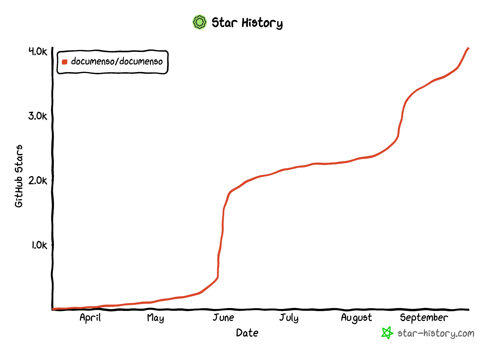
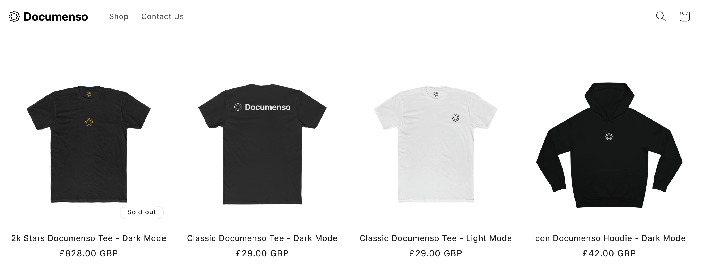

> Each month, we speak to a team enrolled in [PostHog for Startups](/startups) about the way they work. This time, we spoke to Documenso about how they’ve grown their GitHub community. 

Documenso, the open-source alternative to Docusign, launched in November 2022 but has grown rapidly. The project already has over 4,000 GitHub stars at the time of writing and the team track their Star progress closely, viewing it as a vital community metric.

“We track Star, Forks and Contributors on a weekly basis,” says Florent Merian from Documenso. “Stars are mainly useful to us as a social proof. They show that users trust us, and encourage others to do the same — but they also inspire us in the work we do!”

Over the past year Documenso has put a lot of effort into growing its presence on GitHub, and learned several lessons about what does (and doesn’t) work...

<Caption>Documenso has adopted various tactics to create a vibrant GitHub following</Caption>

### 1. Start small, stay transparent

Every journey starts with a single step, and for Documenso that was encouraging the team and their friends to star the repo. This alone helped them reach their first 50 GitHub stars. 

“Those first 50 stars were mostly from friends and team members,” says Florent. “After that, we turned to the open-source community.”

The open-source community was an obvious place for the team to focus initially, but what really provoked interest and engagement wasn’t the open-source software — it was the open-source _culture_.

“We try to be as transparent as possible and share everything publicly, even revenue details,” says Florent. “This helped us engage with users on Twitter and, whenever we saw threads about open-source software or the like we were able to get involved and link back to GitHub.”

> **Putting it into practice:** Ask friends and family to star your repo, then widen the request to relevant communities you can reach out to. Closed source teams can find communities unique to their industry, and provoke conversations there. 

### 2. Centralize the community 

A hard-learned lesson for Documenso was that the team started off trying to build a following in Slack, which they came to realize wasn’t the best platform for their users. Eventually, they decided to migrate to Discord as a community hub.

“Switching to Discord was a key moment for us,” says Florent. “We like Slack, but wanted to double down on our community building and make the whole project community driven — which meant we needed to move to a more developer-friendly environment.”

As the community settled in, the team created topics for conversation and tried to encourage GitHub contributions and bug reports. This focus on GitHub was essential because, while Discord was a great place to engage users, GitHub was the _real_ heart of the project. 

“We focus on Discord and Twitter now, but we want everything to link back to GitHub and compound the effects there. GitHub really is our main channel and our key focus. That’s where Documenso really lives. It doesn’t live on Documenso.com. It lives on GitHub.”

> **Putting it into practice:** Do everything you can to direct users to GitHub, using CTAs and banners on other platforms. You can use issue templates, discussions, wiki pages, and a comprehensive README to help users communicate with you and lower the barrier to entry. 

### 3. Find reasons to celebrate

Twitter and Discord certainly helped the team grow its GitHub presence, but it’s been the major announcements which have driven the biggest surges in activity. The biggest came when the team announced their pre-seed funding.

“Announcing our raise brought a lot of attention and we funneled all of that to GitHub,” says Florent. “We suddenly had open roles coming up, validation of our idea, and a bounty program too — so a lot of people were encouraged to star the repo and follow what we do.”

Inspired by these surges, Documenso now announces similar milestones whenever it can — posting about product updates and new contributions in order to continuously drive users back to the repo. Anything which helps excite and engage users, helps. 

“We use Discord and Twitter to celebrate milestones and contributions whenever we can,” says Florent. “We’re really thankful for every external contribution, no matter how big they are. Even if you just fix a typo in the README file, that's fantastic. We really hope people will contribute to our mission and help us take on a billion-dollar empire by building an open source document signing experience.”

> **Putting it into practice:** Documenso encourages contributions with a bounty program that posts new issues into their Discord community. Swag is a powerful tool for incentivizing users too! 

<Caption>Documenso uses merch as an incentive for encouraging contributors</Caption>

### 4. Create incentives

While GitHub stars are useful as a metric, contributors are the single most important part of Documenso’s community — so the team both makes it easy for users to get involved, and also gives them powerful incentives to do so. 

“The main way we activate the community is with a bounty program,” says Florent. “Every bug or feature idea our CTO, Lucas, has receives an issue. We share all of these in Discord and contributors will basically jump on them in a matter of minutes. We had one user who created an entire dark mode for us!”

The team uses cash incentives and branded merchandise to incentivize and reward users who get involved in this way, or to celebrate major milestones. Users who moved from Slack to Discord, for example, got a limited edition t-shirt that can only otherwise be bought via the online store…for more than £820!

“Maybe these rewards aren’t a rule for growing GitHub stars, but it’s definitely the approach we have,” says Florent. “We want to build in the open, with the community. We want to invite people to get involved, to follow the project…that’s basically how we grow.”

> **Putting it into practice:** Identify what sort of incentives will inspire your users, such as money, merch, or charitable donations. Create a system whereby you can issue these rewards quickly, and constantly remind users how to earn them and spread the word!

**More success stories from PostHog for Startups**
- [How Golioth designs new software and drives product development](//startup-golioth)
- [How Bugprove uses influencer marketing to grow word of mouth](/spotlight/startup-bugprove)
- [How BeforeSunset AI achieved 'Product of the Month' on Product Hunt](spotlight/startup-before-sunset-ai)
