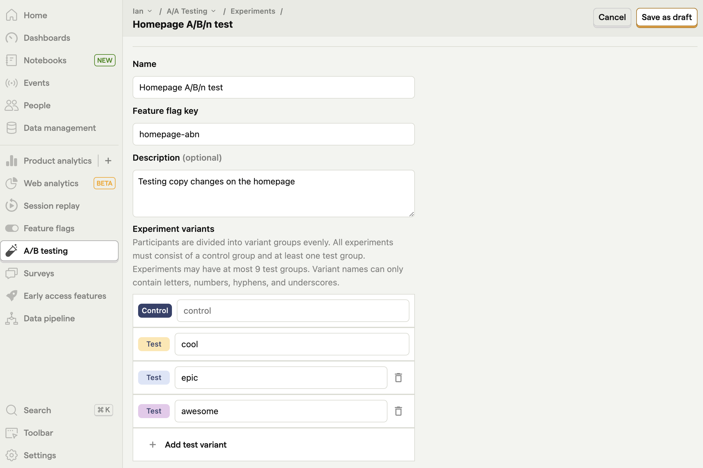
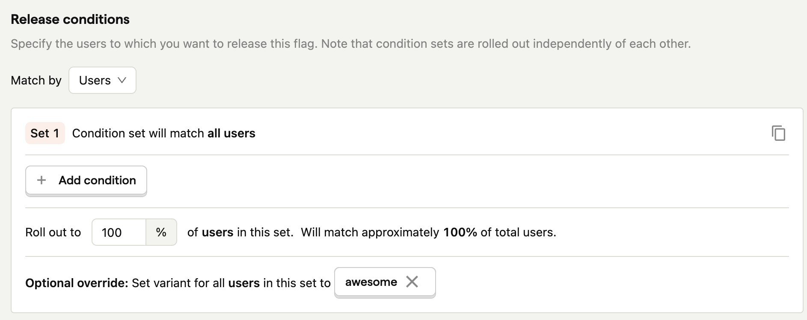
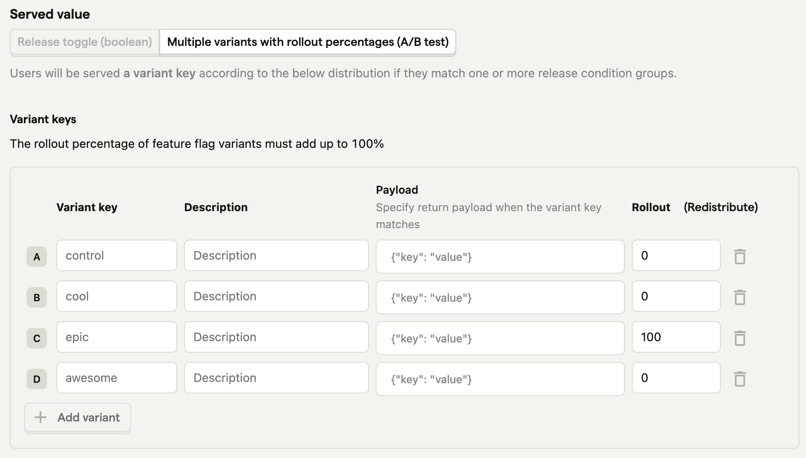

A/B/n testing is like an A/B test where you compare multiple (n) variants instead of just two. It can be especially useful for small but impactful changes where many options are available like copy, styles, or pages.

This tutorial will show you how to create and implement an A/B/n test in PostHog.

## Creating an A/B/n test

To create an A/B/n, go [experiments tab in PostHog](https://app.posthog.com/experiments) and click "New experiment." Add a name, feature flag key (I choose `homepage-abn`), and description if you want. Under "Experiment variants," click "Add test variant" twice to add two new variants. Rename the three variants if you want. 



Fill out the rest of your details like participants, goal type, secondary metrics, and minimum acceptable improvement. Once done, click "Save as draft" and we will go implement the A/B/n test in our app.

## Implementing our A/B/n test

Implementing the A/B/n requires checking the feature flag variant and handling each of our cases. We will use a [Next.js](/docs/libraries/next-js) app where we already set up the `[PostHogProvider](/docs/libraries/next-js#app-router)` for this.

> Need a full guide for creating a Next.js app? Read our [How to set up Next.js A/B tests](/tutorials/nextjs-ab-tests) tutorial.

In our a `page.js` file, we: 

1. Import `useFeatureFlagVariantKey` from `posthog-js/react`, and `useState` and `useEffect` from `react`
2. Set up a state for `mainCopy` using `useState`. 
3. Set the`mainCopy` state in a `useEffect` using the variant key value we get from PostHog.
4. Show the `mainCopy` state to users in our component.

Together, this looks like this:

```js
// app/page.js
'use client'
import { useFeatureFlagVariantKey } from 'posthog-js/react'
import { useState, useEffect } from 'react'

export default function Home() {

  const [mainCopy, setMainCopy] = useState('Welcome to our app')
  const copyVariant = useFeatureFlagVariantKey('homepage-abn')
  
  useEffect(() => {
    if (copyVariant && copyVariant !== 'control') {
      setMainCopy(`Welcome to our ${copyVariant} app`);
    }
  }, [copyVariant])

  return (
    <div>
      <h1>{mainCopy}</h1>
      <p>This is a page being A/B/n tested</p>
    </div>
  )
}
```

When we reload our page, we get a title based on the flag key variant. 


### Checking the other variants

We can check the other variants by going to the [feature flag page](https://app.posthog.com/feature_flags), searching for the key related to our experiment, and clicking on it to edit it. Scroll down to release conditions and set the **optional override** to any of the flag values. If you want the optional override to apply to only you, you can create another condition set. Finally, press save and when you go back to your app, you see the overridden flag value.



> **Note:** Make sure to remove the optional override before rolling out your A/B/n test to real users.

### Rolling out the winning variant

Once your experiment reaches significance, you can stop it and roll out the winning variant. 

To do this, click the "stop" button on your experiment details page, go to your [feature flag page](https://app.posthog.com/feature_flags), search for the key related to your experiment, and click to edit it. Under variant keys, edit the rollout value to 100 for the winning variant and 0 for the losing ones, and press save. When you’re ready, you can remove the experiment-related code from your app too.



## Further reading

- [How to do holdout testing](/tutorials/holdout-testing)
- [How to do A/A testing](/tutorials/aa-testing)
- [How to use Next.js middleware to bootstrap feature flags](/tutorials/nextjs-bootstrap-flags)