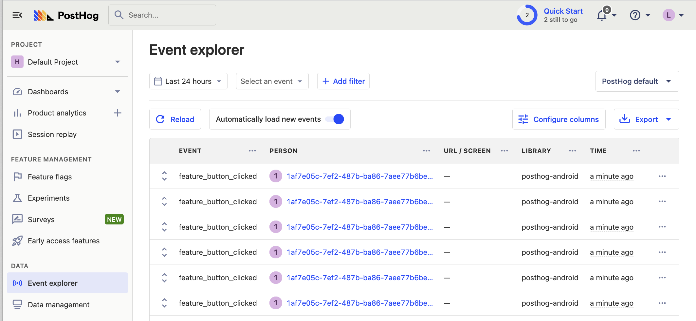
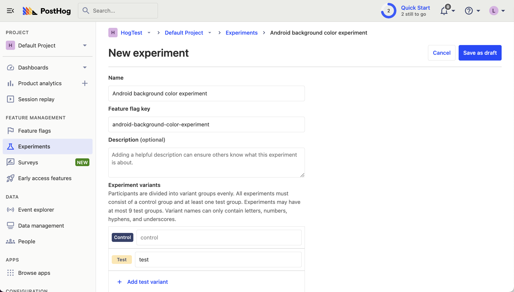

[A/B tests](/ab-testing) enables you to compare the impact of your changes on key metrics. 

PostHog makes [A/B testing on Android](/docs/experiments/installation?tab=android) simple. To show you how, this tutorial will guide you on how to run an A/B test with PostHog on an app built with Kotlin and Jetpack Compose. We will create a simple A/B test to see how the background color of a screen affects the click-through rate of a button.

## Creating a new Android app

Our app will have two screens: 

- The first screen will have a button which will take you to a second screen. 
- The second screen will either have a `red` or `green` background color depending on if the user is in the `control` or `test` group of the A/B test. It will also have a button which captures an event when pressed. We'll use this event as our goal metric for our test.

The first step is to create a new app. Open [Android Studio](https://developer.android.com/studio) and create a new project. Select `Empty Activity`, name your project `My-AB-Test`, and use the defaults for everything else.

Then, replace your code in `MainActivity.kt` to set up a basic UI with a button to navigate to a new screen.

```kotlin
package com.example.my_ab_test

import android.os.Bundle
import androidx.activity.ComponentActivity
import androidx.activity.compose.setContent
import androidx.compose.foundation.layout.Arrangement
import androidx.compose.foundation.layout.Column
import androidx.compose.foundation.layout.fillMaxSize
import androidx.compose.material3.Button
import androidx.compose.material3.MaterialTheme
import androidx.compose.material3.Surface
import androidx.compose.material3.Text
import androidx.compose.runtime.Composable
import androidx.compose.runtime.remember
import androidx.compose.runtime.mutableStateOf
import androidx.compose.ui.Alignment
import androidx.compose.ui.Modifier
import androidx.compose.ui.graphics.Color
import androidx.compose.ui.tooling.preview.Preview
import androidx.navigation.NavController
import androidx.navigation.compose.NavHost
import androidx.navigation.compose.composable
import androidx.navigation.compose.rememberNavController
import com.example.my_ab_test.ui.theme.MyABTestTheme

class MainActivity : ComponentActivity() {
    override fun onCreate(savedInstanceState: Bundle?) {
        super.onCreate(savedInstanceState)
        setContent {
            MyABTestTheme {
                Surface(modifier = Modifier.fillMaxSize(), color = MaterialTheme.colorScheme.background) {
                    MyApp()
                }
            }
        }
    }
}

@Composable
fun MyApp() {
    val navController = rememberNavController()
    NavHost(navController = navController, startDestination = "main_screen") {
        composable("main_screen") {
            Greeting("Android", navController)
        }
        composable("second_screen") {
            SecondScreen()
        }
    }
}

@Composable
fun Greeting(name: String, navController: NavController, modifier: Modifier = Modifier) {
    Column(modifier = modifier.fillMaxSize()) {
        Text(text = "Hello $name!")
        Button(onClick = { navController.navigate("second_screen") }) {
            Text("Go to next screen")
        }
    }
}

@Composable
fun SecondScreen() {
    val isTestVariant = remember { mutableStateOf(false) } // We'll set this value later in the tutorial
    val backgroundColor = if (isTestVariant.value) Color.Green else Color.Red

    Surface(modifier = Modifier.fillMaxSize(), color = backgroundColor) {
        Column(modifier = Modifier.fillMaxSize(), horizontalAlignment = Alignment.CenterHorizontally, verticalArrangement = Arrangement.Center) {
            Button(onClick = { /* Do nothing for now */ }) {
                Text("Click Me!")
            }
        }
    }
}

@Preview(showBackground = true)
@Composable
fun DefaultPreview() {
    MyABTestTheme {
        MyApp()
    }
}
```

Make sure to add `implementation("androidx.navigation:navigation-compose:2.4.0")` to your `dependencies` in to `app/build.gradle.kts` and sync your project with the Gradle files.

Our basic set up is now complete. Build and run your app to test that it's working.


## Adding PostHog to your Android app

First, add the [PostHog Android SDK](/docs/libraries/android) as a dependency in your `Gradle Scripts/build.gradle.kts (Module: app)` file. You can find the latest version on our [GitHub](https://github.com/PostHog/posthog-android/blob/main/CHANGELOG.md). For this tutorial, we use version `3.1.7`.


```gradle_kotlin
dependencies {
    implementation("com.posthog:posthog-android:3.+")
    //... other dependencies
}
```

Sync your project with your Gradle file changes.

Next, we create a Kotlin class where we can configure our PostHog instance. In the `src/main/java/com.example.my_ab_test` folder, add a new file `MyABTestApplication.kt`, add the following code:

```kotlin
// in MyABTestApplication.kt
package com.example.my_ab_test

import android.app.Application
import com.posthog.android.PostHogAndroid
import com.posthog.android.PostHogAndroidConfig

class MyABTestApplication : Application() {
    companion object {
        private const val POSTHOG_API_KEY = "<ph_project_api_key>"
        private const val POSTHOG_HOST = "<ph_instance_address>" // usually 'https://us.i.posthog.com' or 'https://eu.i.posthog.com'
    }

    override fun onCreate() {
        super.onCreate()
        val config = PostHogAndroidConfig(
            apiKey = POSTHOG_API_KEY,
            host = POSTHOG_HOST
        )
        PostHogAndroid.setup(this, config)
    }
}
```

To get your PostHog API key and host, [sign up to PostHog](https://app.posthog.com/signup). Then, you can find your API key and host in your [project settings](https://app.posthog.com/settings/project).

We now need to register our custom application class. Go to `AndroidManifest.xml` and add `android:name=".MyABTestApplication"` within the `<application` tag:

```XML
<?xml version="1.0" encoding="utf-8"?>
<manifest xmlns:android="http://schemas.android.com/apk/res/android"
    xmlns:tools="http://schemas.android.com/tools">
    <application
        android:name=".MyABTestApplication"
        <!-- rest of config -->
    </application>
</manifest>
```

Finally, we [capture a custom event](/docs/libraries/android#capturing-events) when the button on `SecondScreen` is clicked. We'll use this event as our goal metric in our A/B test.

Update the `SecondScreen` function in `MainActivity.kt` to the following:

```kotlin
// in MainActivity.kt

import com.posthog.PostHog
// ... [Rest of your imports and MainActivity code]

@Composable
fun SecondScreen() {
    val isTestVariant = remember { mutableStateOf(false) } // We'll set this value later in the tutorial
    val backgroundColor = if (isTestVariant.value) Color.Green else Color.Red

    Surface(modifier = Modifier.fillMaxSize(), color = backgroundColor) {
        Column(modifier = Modifier.fillMaxSize(), horizontalAlignment = Alignment.CenterHorizontally, verticalArrangement = Arrangement.Center) {
            Button(onClick = {
                PostHog.capture("feature_button_clicked");
            }) {
                Text("Click Me!")
            }
        }
    }
}
```

To check your setup, build and run your app. Click your button a few times and you should start seeing events in the [activity tab](https://app.posthog.com/events).



## Create an A/B test in PostHog

The next step is to set up an A/B test (we call them experiments in PostHog).

Go to the [Experiments tab](https://app.posthog.com/experiments) in PostHog and click "New experiment". Add the following details to your experiment:

1. Name it "Android background color experiment".
2. Set "Feature flag key" to `android-background-color-experiment`.
3. Under the experiment goal, select the `feature_button_clicked` we created in the previous step.
4. Use the default values for all other fields.

Click "Save as draft" and then click "Launch".



## Implement the A/B test code

The final step is to add the experiment code that does the following:

1. Retrieve the value of the `android-background-color-experiment` flag when `SecondScreen` is initialized.
2. Change the background color of `SecondScreen` based on the value of the flag (`control` or `test`).

To do this, update the code in `MainActivity.kt` with the following:

```kotlin
// in MainActivity.kt

import androidx.compose.runtime.LaunchedEffect
// ... [Rest of your imports and MainActivity code]


@Composable
fun SecondScreen() {
    val isTestVariant = remember { mutableStateOf(false) }

    LaunchedEffect(key1 = Unit) {
        isTestVariant.value = PostHog.getFeatureFlag("android-background-color-experiment") == "test"
    }

    val backgroundColor = if (isTestVariant.value) Color.Green else Color.Red

    Surface(modifier = Modifier.fillMaxSize(), color = backgroundColor) {
        // ... [rest of SecondScreen code remains unchanged]
    }
}

// ... [rest of the file remains unchanged]
```

That's it! Your A/B test is now ready. When you run your app, you see either green or red as the background color of `SecondScreen` and PostHog will capture button clicks for each variant to calculate if changing the color has a statistically significant impact.

If you want to test both variants of your experiment to make sure they are working correctly, you can add an [optional override](/docs/feature-flags/testing#method-1-assign-a-user-a-specific-flag-value) to your feature flag.

Lastly, you can [view your test results](/docs/experiments/testing-and-launching#viewing-experiment-results) on the experiment page.

## Further reading

- [A software engineer's guide to A/B testing](/product-engineers/ab-testing-guide-for-engineers)
- [How to set up feature flags in Android](/tutorials/android-feature-flags)
- [How to set up analytics in Android](/tutorials/android-analytics)
