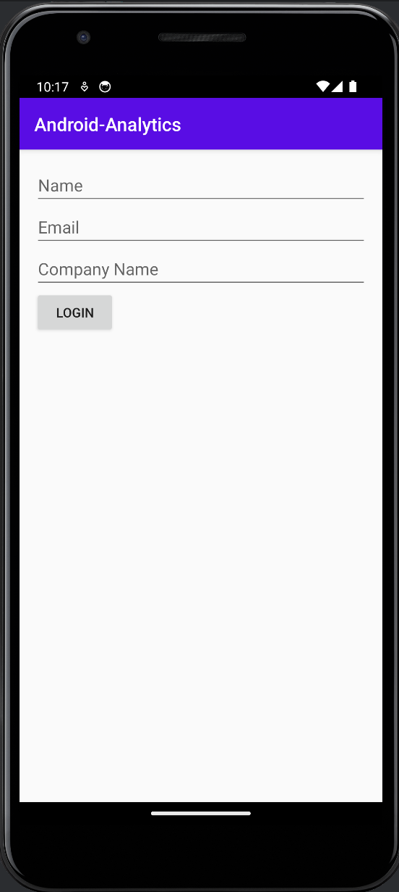

import { ProductScreenshot } from 'components/ProductScreenshot'
export const EventsInPostHogLight = "https://res.cloudinary.com/dmukukwp6/image/upload/v1710055416/posthog.com/contents/images/tutorials/android-analytics/events-light.png"
export const EventsInPostHogDark = "https://res.cloudinary.com/dmukukwp6/image/upload/v1710055416/posthog.com/contents/images/tutorials/android-analytics/events-dark.png"
export const IdentifyLight = "https://res.cloudinary.com/dmukukwp6/image/upload/v1710055416/posthog.com/contents/images/tutorials/android-analytics/identify-light.png"
export const IdentifyDark = "https://res.cloudinary.com/dmukukwp6/image/upload/v1710055416/posthog.com/contents/images/tutorials/android-analytics/identify-dark.png"
export const InsightLight = "https://res.cloudinary.com/dmukukwp6/image/upload/v1710055416/posthog.com/contents/images/tutorials/android-analytics/create-insights-light.png"
export const InsightsDark = "https://res.cloudinary.com/dmukukwp6/image/upload/v1710055416/posthog.com/contents/images/tutorials/android-analytics/create-insights-dark.png"

[Product analytics](/product-analytics) enable you to gather and analyze data about how users interact with your Android app. To show you how to set up analytics, in this tutorial we create a basic Android app with Kotlin, add PostHog, and use it to [capture events](/docs/product-analytics/capture-events) and [create insights](/docs/product-analytics/insights).

## 1. Create a new Android app

Our app will have two screens:

- a `login` screen with a form to enter in your name, email, and company name.
- a `home` screen with submit button, toggle, and logout button.

The first step is to create a new app. Open [Android Studio](https://developer.android.com/studio) and create a new project. Select `Empty Activity`, name your project `Android-Analytics`, and use the defaults for everything else.

Then, create a new activity `HomeActivity` by clicking `File > New > Activity > Empty Views Activity`. Replace the code in the new activity with the following:

```kotlin file=HomeActivity.kt
package com.example.android_analytics

import android.content.Context
import android.content.Intent
import android.os.Bundle
import androidx.appcompat.app.AppCompatActivity
import android.widget.Button
import android.widget.Toast
import android.widget.ToggleButton

class HomeActivity : AppCompatActivity() {

    override fun onCreate(savedInstanceState: Bundle?) {
        super.onCreate(savedInstanceState)
        setContentView(R.layout.activity_home)

        val submitButton = findViewById<Button>(R.id.submitButton)
        val toggleButton = findViewById<ToggleButton>(R.id.toggleButton)
        val logoutButton = findViewById<Button>(R.id.logoutButton)

        submitButton.setOnClickListener {
            Toast.makeText(this, "Submitted", Toast.LENGTH_SHORT).show()
        }

        logoutButton.setOnClickListener {
            val sharedPreferences = getSharedPreferences("AppPrefs", Context.MODE_PRIVATE)
            sharedPreferences.edit().clear().apply()

            // Navigate back to MainActivity
            val intent = Intent(this, MainActivity::class.java)
            startActivity(intent)
            finish()
        }
    }
}
```

Then we define the UI for our HomeActivity. Update the code in `activity_home.xml` in the `app/res/layout` directory with the following:

```xml file=app/res/layout/activity_home.xml
<LinearLayout
    xmlns:android="http://schemas.android.com/apk/res/android"
    android:layout_width="match_parent"
    android:layout_height="match_parent"
    android:orientation="vertical"
    android:padding="16dp">

    <Button
        android:id="@+id/submitButton"
        android:layout_width="wrap_content"
        android:layout_height="wrap_content"
        android:text="Submit"/>

    <ToggleButton
        android:id="@+id/toggleButton"
        android:layout_width="wrap_content"
        android:layout_height="wrap_content"
        android:textOff="Off"
        android:textOn="On"/>

    <Button
        android:id="@+id/logoutButton"
        android:layout_width="wrap_content"
        android:layout_height="wrap_content"
        android:text="Logout"/>
</LinearLayout>
```

Next, we set up our login page in `MainActivity`. Replace the code in `MainActivity.kt` with the following:

```kotlin file=MainActivity.kt
package com.example.android_analytics

import android.content.Context
import android.os.Bundle
import androidx.appcompat.app.AppCompatActivity
import android.widget.Button
import android.widget.EditText
import android.content.Intent

class MainActivity : AppCompatActivity() {

    override fun onCreate(savedInstanceState: Bundle?) {
        super.onCreate(savedInstanceState)
        setContentView(R.layout.activity_main)

        val sharedPreferences = getSharedPreferences("AppPrefs", Context.MODE_PRIVATE)
        if (sharedPreferences.contains("Name")) {
            // User is already logged in, navigate to HomeActivity
            val homeIntent = Intent(this, HomeActivity::class.java)
            startActivity(homeIntent)
            finish()
        }

        val nameEditText = findViewById<EditText>(R.id.nameEditText)
        val emailEditText = findViewById<EditText>(R.id.emailEditText)
        val companyEditText = findViewById<EditText>(R.id.companyEditText)
        val loginButton = findViewById<Button>(R.id.loginButton)

        loginButton.setOnClickListener {
            val sharedPreferences = getSharedPreferences("AppPrefs", Context.MODE_PRIVATE)
            val editor = sharedPreferences.edit()

            editor.putString("Name", nameEditText.text.toString())
            editor.putString("Email", emailEditText.text.toString())
            editor.putString("Company", companyEditText.text.toString())
            editor.apply()

            val intent = Intent(this@MainActivity, HomeActivity::class.java)
            startActivity(intent)
            finish()
        }
    }
}
```

Similarly to the `HomeActivity`, we define the layout for our `MainActivity`. Create a new file `activity_main.xml` in the `app/res/layout` directory. Then add the following code to it:

```xml file=app/res/layout/activity_main.xml
<LinearLayout
    xmlns:android="http://schemas.android.com/apk/res/android"
    android:layout_width="match_parent"
    android:layout_height="match_parent"
    android:orientation="vertical"
    android:padding="16dp">

    <EditText
        android:id="@+id/nameEditText"
        android:layout_width="match_parent"
        android:layout_height="wrap_content"
        android:hint="Name"/>

    <EditText
        android:id="@+id/emailEditText"
        android:layout_width="match_parent"
        android:layout_height="wrap_content"
        android:hint="Email"
        android:inputType="textEmailAddress"/>

    <EditText
        android:id="@+id/companyEditText"
        android:layout_width="match_parent"
        android:layout_height="wrap_content"
        android:hint="Company Name"/>

    <Button
        android:id="@+id/loginButton"
        android:layout_width="wrap_content"
        android:layout_height="wrap_content"
        android:text="Login"/>
</LinearLayout>
```

Add the following dependencies to your `app/build.gradle (Module: app)` and then sync your project with the changes:

```js file=app/build.gradle
Lastly, update the `themes.xml` file located in the `res/values` folder to ensure our theme extends `Theme.AppCompat`. We also define the app colors here:

```xml themes.xml
<?xml version="1.0" encoding="utf-8"?>
<resources>
    <style name="Theme.AndroidAnalytics" parent="Theme.AppCompat.Light.DarkActionBar">
        <item name="colorPrimary">@color/purple_500</item>
        <item name="colorPrimaryVariant">@color/purple_700</item>
        <item name="colorOnPrimary">@color/white</item>
    </style>
</resources>
```

Our basic set up is now complete. Build and run your app to see it in action.



## 2. Add PostHog to your app

First, add the [PostHog Android SDK](/docs/libraries/android) as a dependency in your `Gradle Scripts/build.gradle.kts (Module: app)` file. You can find the latest version on our [GitHub](https://github.com/PostHog/posthog-android/). For this tutorial, we use version `3.1.7`.


```gradle_kotlin
dependencies {
    implementation("com.posthog:posthog-android:3.+")
    //... other dependencies
}
```

Sync your project with the Gradle file changes.

Next, we create a Kotlin class where we can configure our PostHog instance. In the `src/main/java/com.example.android_analytics` folder, add a new file `MyAndroidAnalyticsApplication.kt` and then add the following code:

```kotlin file=MyAndroidAnalyticsApplication.kt
package com.example.android_analytics

import android.app.Application
import com.posthog.android.PostHogAndroid
import com.posthog.android.PostHogAndroidConfig

class MyAndroidAnalyticsApplication : Application() {
    companion object {
        private const val POSTHOG_API_KEY = "<ph_project_api_key>"
        // usually 'https://app.posthog.com' or 'https://eu.posthog.com'
        private const val POSTHOG_HOST = "<ph_instance_address>"
    }

    override fun onCreate() {
        super.onCreate()
        val config = PostHogAndroidConfig(
            apiKey = POSTHOG_API_KEY,
            host = POSTHOG_HOST
        )
        PostHogAndroid.setup(this, config)
    }
}
```

To get your PostHog API key and host, [sign up to PostHog](https://us.posthog.com/signup). Then, you can find your API key and host in your [project settings](https://us.posthog.com/settings/project).

We now need to register our custom application class. Go to `app/manifests/AndroidManifest.xml` and add `android:name=".MyAndroidAnalyticsApplication"` within the `<application` tag:

```XML file=app/manifests/AndroidManifest.xml
<?xml version="1.0" encoding="utf-8"?>
<manifest xmlns:android="http://schemas.android.com/apk/res/android"
    xmlns:tools="http://schemas.android.com/tools">
    <!-- ... rest of the config -->
    <application
        android:name=".MyAndroidAnalyticsApplication"
        <!-- ... rest of the config -->
    </application>
</manifest>
```

To check your setup, build and run your app. Click your button a few times. You should start seeing events in the [activity tab](https://us.posthog.com/events).

<ProductScreenshot
  imageLight={EventsInPostHogLight} 
  imageDark={EventsInPostHogDark} 
  alt="Events captured in PostHog" 
  classes="rounded"
/>

## 3. Implement the event capture code

To show how to capture events with PostHog, we capture an event when the submit button on the home page is clicked. To do this, we call [PostHog.capture()](/docs/libraries/android#capturing-events):

```kotlin file=HomeActivity.kt
// rest of your imports
import com.posthog.PostHog

class HomeActivity : AppCompatActivity() {

    override fun onCreate(savedInstanceState: Bundle?) {
        
        // ...

        submitButton.setOnClickListener {
            PostHog.capture(event = "home_button_clicked")
            Toast.makeText(this, "Submitted", Toast.LENGTH_SHORT).show()
        }

        // ...
```

Reload your app and click the button on the home page a few times. You should now see the captured event in your [PostHog activity tab](https://us.posthog.com/events).

### Setting event properties

When capturing events, you can optionally include additional information by setting the `properties` argument. This is helpful for breaking down or filtering events when creating [insights](/docs/product-analytics/insights).

As an example, we add the value of the toggle as an event property:

```kotlin file=HomeActivity.kt
// rest of your imports
import com.posthog.PostHog

class HomeActivity : AppCompatActivity() {

    override fun onCreate(savedInstanceState: Bundle?) {
        
        // ...

        submitButton.setOnClickListener {
            val isToggleOn = toggleButton.isChecked
            PostHog.capture(
                event = "home_button_clicked",
                properties= mapOf("is_toggled_enabled" to isToggleOn)
            )
        }

        // ...
```

### Identifying users

Linking events to specific users enables you to build a full picture of how they're using your product across different sessions, devices, and platforms. To link events from anonymous to specific users, we call [`PostHog.identify()`](/docs/libraries/android#identify) with a `distinctId` argument. The `distinctId` must be a unique identifier for the user – usually their email or database ID.

To show you an example, update the code for the login button to the following:

```kotlin file=MainActivity.kt
// rest of your imports
import com.posthog.PostHog
class MainActivity : AppCompatActivity() {

    override fun onCreate(savedInstanceState: Bundle?) {
        // ...

        loginButton.setOnClickListener {
            val email = emailEditText.text.toString().trim()
            PostHog.identify(email)
            
            // rest of your code
        }

```

Any past or future events captured after calling `identify` will now be associated with the email you provided. 

To test this, press logout, fill the form in and press login. Then, in the home page, press the submit button to capture the `home_button_clicked` event. You should now see the email in the **Person** column in your [activity tab]((https://us.posthog.com/events)).

<ProductScreenshot
  imageLight={IdentifyLight} 
  imageDark={IdentifyDark} 
  alt="Identified events captured in PostHog" 
  classes="rounded"
/>

Lastly, when the user logs out, you should call [`PostHog.reset()`](https://posthog.com/docs/libraries/android#reset). This resets the PostHog ID and ensures that events are associated to the correct user.

```kotlin file=HomeActivity.kt
        logoutButton.setOnClickListener {
            val sharedPreferences = getSharedPreferences("AppPrefs", Context.MODE_PRIVATE)
            sharedPreferences.edit().clear().apply()
            
            PostHog.reset()

            // Navigate back to MainActivity
            val intent = Intent(this, MainActivity::class.java)
            startActivity(intent)
            finish()
        }
```

### Capturing group analytics

[Groups](/docs/product-analytics/group-analytics) are a powerful feature in PostHog that aggregate events based on entities, such as organizations or companies. This is especially helpful for B2B SaaS apps, where often you want to view insights such as `number of active companies` or `company churn rate`.

To enable group analytics, you'll need to [upgrade](https://us.posthog.com/organization/billing) your PostHog account to include them. This requires entering your credit card, but don't worry, we have a [generous free tier](/pricing) of 1 million events per month – so you won't be charged anything yet.

To create groups in PostHog, simply include them in your code by calling [`PostHog.group()`](/docs/libraries/android#groups):

```kotlin file=MainActivity.kt
class MainActivity : AppCompatActivity() {

    override fun onCreate(savedInstanceState: Bundle?) {
        // ...

        loginButton.setOnClickListener {
            val email = emailEditText.text.toString().trim()
            PostHog.identify(email)

          PostHog.group(
              type = "company", 
              key = companyEditText.text.toString()
          )

            // rest of your code
        }

```

In the above example, we create a group type `company`, and then set the value as the unique identifier for that specific company. Any future events that are captured will now be associated with this company.

## 4. Create an insight in PostHog

Restart your app and capture events using different inputs in the `login` screen. This will capture events for different users and companies and enable us to show the power of PostHog insights.

Next, go to the [Product analytics](https://us.posthog.com/insights) tab in PostHog and click the **+ New insight** button. PostHog supports many different types of insights, such as [trends](/docs/user-guides/trends), [funnels](/docs/user-guides/funnels), [paths](/docs/user-guides/paths) and more.

In this tutorial, we create a simple trend insight:

1. Select the **Trends** tab.
2. Under the **Series** header select the `home_button_clicked` event. 
3. Click the **Total count** dropdown to change how events are aggregated. You can choose options such as `Count per user`, `Unique users`, `Unique company(s)`, and more. You can also add filters or breakdown based on properties. 

For example, in the image below we set our insight to show number of unique users that captured the `home_button_clicked` event where the toggled is enabed:

<ProductScreenshot
  imageLight={InsightLight} 
  imageDark={InsightDark} 
  alt="Insight created in PostHog" 
  classes="rounded"
/>

That's it! Feel free to play around in your dashboard and explore the different kinds of insights you can create in PostHog.

## Further reading

- [How to run A/B tests in Android](/tutorials/android-ab-tests)
- [How to set up feature flags in Android](/tutorials/android-feaure-flags)
- [How to run A/B tests in iOS](/tutorials/ios-ab-tests)
