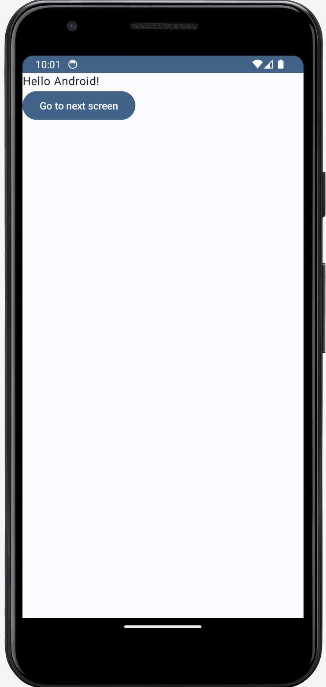

import { ProductScreenshot } from 'components/ProductScreenshot'
import EventsInPostHogLight from '../images/tutorials/android-feature-flags/events-light.png'
import EventsInPostHogDark from '../images/tutorials/android-feature-flags/events-dark.png'
import CreateFlagLight from '../images/tutorials/android-feature-flags/create-flag-light.png'
import CreateFlagDark from '../images/tutorials/android-feature-flags/create-flag-dark.png'

[Feature flags](/feature-flags) help you conditionally roll out and release features safely. This tutorial shows you how integrate them in Android using PostHog. 

We'll create a basic Android app, add PostHog, create a feature flag, and then implement the flag to control content in our app.

## 1. Create a new Android app

Our app will have two screens: 

- The first screen has a button which takes you to a second screen. 
- The second screen either has a `red` or `green` background color depending on whether our feature flag is enabled or not.

The first step is to create a new app. Open [Android Studio](https://developer.android.com/studio) and create a new project. Select `Empty Activity`, name your project `Android-Feature-Flags`, and use the defaults for everything else.

Then, replace your code in `MainActivity.kt` to set up a basic UI with a button to navigate to a new screen.

```kotlin file=MainActivity.kt
package com.example.android_feature_flags

import android.os.Bundle
import androidx.activity.ComponentActivity
import androidx.activity.compose.setContent
import androidx.compose.foundation.layout.Arrangement
import androidx.compose.foundation.layout.Column
import androidx.compose.foundation.layout.fillMaxSize
import androidx.compose.material3.Button
import androidx.compose.material3.MaterialTheme
import androidx.compose.material3.Surface
import androidx.compose.material3.Text
import androidx.compose.runtime.Composable
import androidx.compose.runtime.remember
import androidx.compose.runtime.mutableStateOf
import androidx.compose.ui.Alignment
import androidx.compose.ui.Modifier
import androidx.compose.ui.graphics.Color
import androidx.compose.ui.tooling.preview.Preview
import androidx.navigation.NavController
import androidx.navigation.compose.NavHost
import androidx.navigation.compose.composable
import androidx.navigation.compose.rememberNavController
import com.example.android_feature_flags.ui.theme.AndroidFeatureFlagsTheme

class MainActivity : ComponentActivity() {
    override fun onCreate(savedInstanceState: Bundle?) {
        super.onCreate(savedInstanceState)
        setContent {
            AndroidFeatureFlagsTheme {
                Surface(modifier = Modifier.fillMaxSize(), color = MaterialTheme.colorScheme.background) {
                    MyApp()
                }
            }
        }
    }
}

@Composable
fun MyApp() {
    val navController = rememberNavController()
    NavHost(navController = navController, startDestination = "main_screen") {
        composable("main_screen") {
            Greeting("Android", navController)
        }
        composable("second_screen") {
            SecondScreen()
        }
    }
}

@Composable
fun Greeting(name: String, navController: NavController, modifier: Modifier = Modifier) {
    Column(modifier = modifier.fillMaxSize()) {
        Text(text = "Hello $name!")
        Button(onClick = { navController.navigate("second_screen") }) {
            Text("Go to next screen")
        }
    }
}

@Composable
fun SecondScreen() {
    val isFlagEnabled = remember { mutableStateOf(false) } // We'll set this value later in the tutorial
    val backgroundColor = if (isFlagEnabled.value) Color.Green else Color.Red

    Surface(modifier = Modifier.fillMaxSize(), color = backgroundColor) {
        Column(modifier = Modifier.fillMaxSize(), horizontalAlignment = Alignment.CenterHorizontally, verticalArrangement = Arrangement.Center) {
        }
    }
}

@Preview(showBackground = true)
@Composable
fun DefaultPreview() {
    AndroidFeatureFlagsTheme {
        MyApp()
    }
}
```

Make sure to add `implementation("androidx.navigation:navigation-compose:2.4.0")` to your `dependencies` in to `Gradle Scripts/build.gradle.kts (Module:app)` and sync your project with the Gradle files.

Our basic set up is now complete. Build and run your app to see it in action.



## 2. Add PostHog to your app

First, add the [PostHog Android SDK](/docs/libraries/android) as a dependency in your `Gradle Scripts/build.gradle.kts (Module: app)` file. You can find the latest version on our [GitHub](https://github.com/PostHog/posthog-android/blob/main/CHANGELOG.md). For this tutorial, we use version `3.1.7`.


```gradle_kotlin
dependencies {
    implementation("com.posthog:posthog-android:3.+")
    //... other dependencies
}
```

Sync your project with your Gradle file changes.

Next, we create a Kotlin class where we can configure our PostHog instance. In the `src/main/java/com.example.android_feature_flags` folder, add a new file `MyFeatureFlagsApplication.kt` and then add the following code:

```kotlin file=MyFeatureFlagsApplication.kt
package com.example.android_feature_flags

import android.app.Application
import com.posthog.android.PostHogAndroid
import com.posthog.android.PostHogAndroidConfig

class MyFeatureFlagsApplication : Application() {
    companion object {
        private const val POSTHOG_API_KEY = "<ph_project_api_key>"
        private const val POSTHOG_HOST = "<ph_instance_address>"
    }

    override fun onCreate() {
        super.onCreate()
        val config = PostHogAndroidConfig(
            apiKey = POSTHOG_API_KEY,
            host = POSTHOG_HOST
        )
        PostHogAndroid.setup(this, config)
    }
}
```

To get your PostHog API key and host, [sign up to PostHog](https://us.posthog.com/signup). Then, you can find your API key and host in your [project settings](https://us.posthog.com/settings/project).

We now need to register our custom application class. Go to `app/manifests/AndroidManifest.xml` and add `android:name=".MyFeatureFlagsApplication"` within the `<application` tag:

```XML file=app/manifests/AndroidManifest.xml
<?xml version="1.0" encoding="utf-8"?>
<manifest xmlns:android="http://schemas.android.com/apk/res/android"
    xmlns:tools="http://schemas.android.com/tools">
    <!-- ... rest of the config -->
    <application
        android:name=".MyFeatureFlagsApplication"
        <!-- ... rest of the config -->
    </application>
</manifest>
```

To check your setup, build and run your app. Click your button a few times. You should start seeing events in the [activity tab](https://us.posthog.com/events).

<ProductScreenshot
  imageLight={EventsInPostHogLight} 
  imageDark={EventsInPostHogDark} 
  alt="Events captured in PostHog" 
  classes="rounded"
/>

## 3. Create a feature flag in PostHog

With PostHog set up, your app is ready for feature flags. To create one, go to the [feature flags tab](https://us.posthog.com/feature_flags) in PostHog and click **New feature flag**. Enter a flag key (like `my-cool-flag`), set the release condition to roll out to 100% of users, and press "Save."

<ProductScreenshot
  imageLight={CreateFlagLight} 
  imageDark={CreateFlagDark} 
  alt="Feature flag created in PostHog" 
  classes="rounded"
/>

You can customize your [release conditions](/docs/feature-flags/creating-feature-flags#release-conditions) with rollout percentages, and [user](/docs/product-analytics/user-properties) or [group properties](/docs/product-analytics/group-analytics) to fit your needs.

## 4. Implement the flag code

To implement the feature flag, we: 

1. Fetch the `my-cool-flag` flag using [`PostHog.isFeatureEnabled()`](/docs/libraries/android#feature-flags).
2. Change the background color of `SecondScreen` based on the value of the flag.

To do this, update the code in `MainActivity.kt` with the following:

```kt file=MainActivity.kt
import androidx.compose.runtime.LaunchedEffect
import com.posthog.PostHog
// ... [Rest of your imports and MainActivity code]


@Composable
fun SecondScreen() {
    val isFlagEnabled = remember { mutableStateOf(false) }

    // LaunchedEffect to call PostHog.isFeatureEnabled() once when the composable is initialized
    LaunchedEffect(key1 = Unit) {
        isFlagEnabled.value = PostHog.isFeatureEnabled("my-cool-flag")
    }

    val backgroundColor = if (isFlagEnabled.value) Color.Green else Color.Red

    Surface(modifier = Modifier.fillMaxSize(), color = backgroundColor) {
        // ... [rest of SecondScreen code remains unchanged]
    }
}

// ... [rest of the file remains unchanged]
```

That's it! When you restart your app and click the button, you should see the green background color on the second screen. 

## Further reading

- [How to set up one-time feature flags](/tutorials/one-time-feature-flags)
- [How to run A/B tests in Android](/tutorials/android-ab-tests)
- [How to run A/B tests in iOS](/tutorials/ios-ab-tests)
