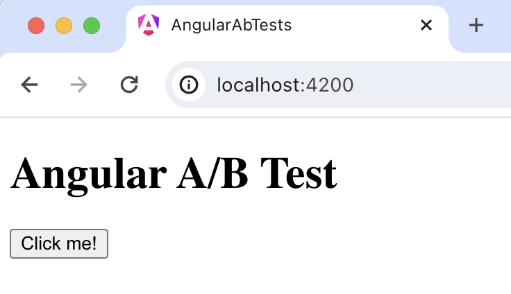

import { ProductScreenshot } from 'components/ProductScreenshot'
export const EventsInPostHogLight = "https://res.cloudinary.com/dmukukwp6/image/upload/posthog.com/contents/images/tutorials/angular-ab-tests/events-light.png"
export const EventsInPostHogDark = "https://res.cloudinary.com/dmukukwp6/image/upload/posthog.com/contents/images/tutorials/angular-ab-tests/events-dark.png"
export const TestSetupLight = "https://res.cloudinary.com/dmukukwp6/image/upload/posthog.com/contents/images/tutorials/angular-ab-tests/experiment-setup-light.png"
export const TestSetupDark = "https://res.cloudinary.com/dmukukwp6/image/upload/posthog.com/contents/images/tutorials/angular-ab-tests/experiment-setup-dark.png"

A/B tests help you make your Angular app better by enabling you to compare the impact of changes on key metrics. To show you how to set one up, we create a basic Angular app, add PostHog, create an A/B test, and implement the code for it.

## 1. Create an Angular app

First, ensure [Node.js is installed](https://nodejs.dev/en/learn/how-to-install-nodejs/) (version 14.20.0 or newer). Then, install the Angular CLI and create a new Angular app:

```bash
npm install -g @angular/cli
ng new angular-ab-tests
```

Select `CSS` as your stylesheet and `No` for server side rendering and static site generation.

Next, Replace the code in `src/app/app.component.html` with a simple heading and button:

```html file=app.component.html
<div id="app">
  <h1>Angular A/B Test</h1>
  <button (click)="handleClick()">Click me!</button>
</div>
```

Then, edit the `app.component.ts` file to include the click handler:

```typescript file=app.component.ts
import { Component } from '@angular/core';

@Component({
  selector: 'app-root',
  templateUrl: './app.component.html',
  styleUrls: ['./app.component.css'],
  standalone: true 
})
export class AppComponent {
  handleClick() {
    // Event handling logic will go here
  }
}
```

Run `ng serve` and navigate to http://localhost:4200 to see your app in action.



## 2. Add PostHog to your Angular app

With our app set up, it’s time to install and set up PostHog. To start, install the [JavaScript web SDK](/docs/libraries/js):

```bash
npm i posthog-js
```

In `src/main.ts`, initialize PostHog using your project API key and instance address. You can get both in your [project settings](https://us.posthog.com/project/settings).  

```ts file=main.ts
import { bootstrapApplication } from '@angular/platform-browser';
import { appConfig } from './app/app.config';
import { AppComponent } from './app/app.component';
import posthog from 'posthog-js'

posthog.init(
  '<ph_project_api_key>',
  {
    api_host:'<ph_instance_address>'
  }
)

bootstrapApplication(AppComponent, appConfig)
  .catch((err) => console.error(err));
```

Once you’ve done this, reload your app and click the button a few times. You should see events appearing in the [PostHog events explorer](https://us.posthog.com/events).

## 3. Capture a custom event

The first part of setting up our A/B test in PostHog is setting up the goal metric. We'll use the number of clicks on the button as our goal.

To measure this, we [capture a custom event](/docs/product-analytics/capture-events) `home_button_clicked` when the button is clicked. To do this, import `posthog-js` into `app.component.ts` and capture an event in `handleClick()`:

```typescript file=app.component.ts
import { Component } from '@angular/core';
import posthog from 'posthog-js'

@Component({
 // existing component code
})
export class AppComponent {
  handleClick() {
    posthog.capture(
      'home_button_clicked', 
    )
  }
}

```

With this set up, refresh your app and click the button a few times to see the event captured in PostHog.

<ProductScreenshot
  imageLight={EventsInPostHogLight} 
  imageDark={EventsInPostHogDark} 
  alt="Events captured in PostHog" 
  classes="rounded"
/>

## 3. Create an A/B test in PostHog

If you haven't done so already, you'll need to [upgrade](https://us.posthog.com/organization/billing) your PostHog account to include A/B testing. This requires entering your credit card, but don't worry, we have a [generous free tier](/pricing) of 1 million requests per month – so you won't be charged anything yet.

Next, go to the [A/B testing tab](https://us.posthog.com/experiments) and create an A/B test by clicking the **New experiment** button. Add the following details to your experiment:

1. Name it "My cool experiment".
2. Set "Feature flag key" to `my-cool-experiment`.
3. Under the experiment goal, select the `home_button_clicked` event we created in the previous step.
4. Use the default values for all other fields.

Click "Save as draft" and then click "Launch".

<ProductScreenshot
  imageLight={TestSetupLight} 
  imageDark={TestSetupDark} 
  alt="Experiment setup in PostHog" 
  classes="rounded"
/>

## 4. Implement the A/B test code

To implement the A/B test, we fetch the `my-cool-experiment` feature flag and update the button text based on whether the user is in the `control` or `test` variant of the experiment.

To do this, update your code in `app.component.ts` to use the [`ngOnInit`](https://angular.io/api/core/OnInit) lifecycle hook to implement the [`posthog.onFeatureFlags`](/docs/libraries/js#ensuring-flags-are-loaded-before-usage) callback. Then, we'll update the button text using [`ChangeDetectorRef`](https://angular.io/api/core/ChangeDetectorRef):

```typescript file=app.component.ts
import { Component, ChangeDetectorRef } from '@angular/core';
import posthog from 'posthog-js'

@Component({
  selector: 'app-root',
  templateUrl: './app.component.html',
  styleUrls: ['./app.component.css'],
  standalone: true
})
export class AppComponent {
  constructor(private changeDetector: ChangeDetectorRef) {}

  buttonText = 'No variant';

  ngOnInit() {
    posthog.onFeatureFlags(() => {
      console.log(posthog.getFeatureFlag('my-cool-experiment'))
      if (posthog.getFeatureFlag('my-cool-experiment') === 'control') {
        this.buttonText = 'Control variant';
      } else if (posthog.getFeatureFlag('my-cool-experiment') === 'test') {
        this.buttonText = 'Test variant';
      }  
      this.changeDetector.detectChanges();
    });
  }

  handleClick() {
    // rest of your code
  }
}
```

Lastly, update `app.component.html` to use the `buttonText` state variable.

```html file=app.component.html
<div id="app">
  <h1>Angular A/B Test</h1>
  <button (click)="handleClick()">{{ buttonText }}</button>
</div>
```

Now if you refresh your app, you should see the button text updated to either `Control variant` or `Test variant`. 

With this, you’re ready to launch your A/B test! PostHog will randomly split your users into the each variant and track whether it has an impact on the button click-through rate. You can [view your test results](/docs/experiments/testing-and-launching#viewing-experiment-results) on the experiment page in PostHog.

> **💡 PostHog Tip:** You may notice the button text "flicker" while the page loads and PostHog fetches the feature flag. To fix this, you can [bootstrap the flag value](/docs/feature-flags/bootstrapping).

## Further reading

- [How to set up Angular analytics, feature flags, and more](/tutorials/angular-analytics)
- [How to set up surveys in Angular](/tutorials/angular-surveys)
- [A software engineer's guide to A/B testing](/product-engineers/ab-testing-guide-for-engineers)
