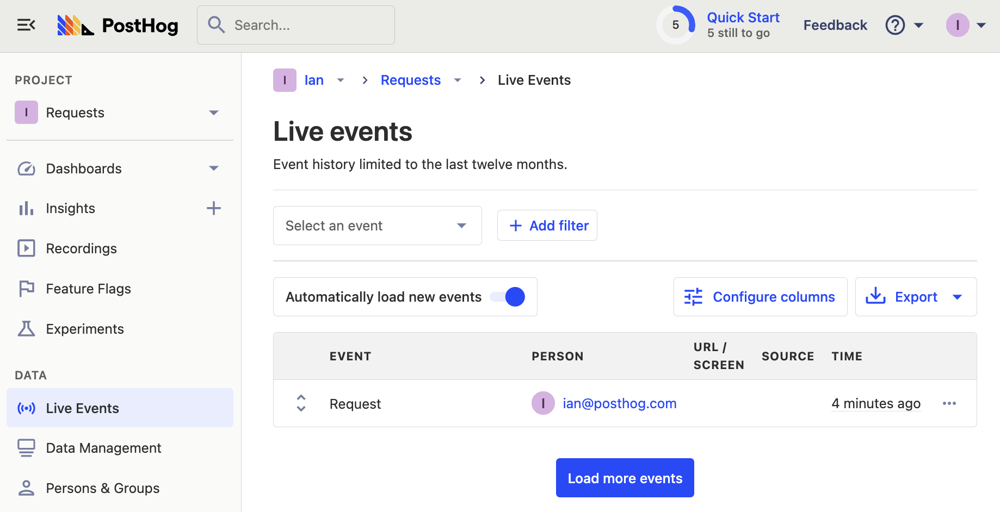

PostHog provides [libraries](/docs/integrate?tab=sdks) that make it easy to capture events in popular languages. These libraries are basically wrappers around the API. They handle and automate common tasks like capturing pageviews.

Using the API directly allows for any language that can send requests to capture events, or completely customize your implementation. Using the API to capture events directly also gives you a better understanding of PostHog’s event-based data structures which is abstracted if you use a library. 

## Authenticating with the project API key

The first thing needed, like the [basic GET request tutorial](/tutorials/api-get-insights-persons), is to authenticate ourselves in the API. Unlike in the GET request tutorial, we can use the project API key (the same key you use to initialize a PostHog library). This can be found in your project settings. 

The project API key is a write-only key, which works perfectly for the POST-only endpoints we want to access.

## Basic event capture request

To capture events, all we need is a project API key, the data we want to send, and a way to send a request. To capture a new event, you need to send a `POST` request to [`<ph_instance_address>/capture/`](<ph_instance_address>/capture/)  (or the `/capture` endpoint for your instance) with the project API key, event name, and distinct ID.

<MultiLanguage>

```bash
# curl
curl -v -L --header "Content-Type: application/json" -d '{
    "api_key": "<ph_project_api_key>",
    "event": "request",
    "distinct_id": "ian@posthog.com"
}' <ph_instance_address>/capture/
```

```python
import requests
headers = {
    "Content-Type": "application/json",
}

body = {
    "api_key": '<ph_project_api_key>',
    "event": "request",
    "properties": {
        "distinct_id": "ian@posthog.com"
    }
}

url = "<ph_instance_address>/capture/"

response = requests.post(url, headers=headers, json=body)

print(response.json())
```

</MultiLanguage>

Once you’ve done that, you should see the event in your PostHog instance.



### Adding properties and batching

You can also add properties and a timestamp in [ISO 8601 format](https://en.wikipedia.org/wiki/ISO_8601) to this request. If you don’t add a timestamp, we automatically set it to the current time. 

<MultiLanguage>

```bash
curl -v -L --header "Content-Type: application/json" -d '{
    "api_key": "<ph_project_api_key>",
    "properties": {
			"request_size": "big",
			"api_request": true
		},
    "timestamp": "2022-09-21 09:03:11.913767",
    "distinct_id": "ian@posthog.com",
    "event": "big_request"
}' <ph_instance_address>/capture/
```
    
```python
import requests
headers = {
    "Content-Type": "application/json",
}

body = {
    "api_key": '<ph_project_api_key>',
    "event": "big_request",
		"timestamp": "2022-10-21 09:03:11.913767",
    "properties": {
        "distinct_id": "ian@posthog.com",
				"request_size": "big",
				"api_request": True
    }
}

url = "<ph_instance_address>/capture/"

response = requests.post(url, headers=headers, json=body)

print(response.json())
```

</MultiLanguage>

You can also batch these requests together by sending a list of events to the `/batch/` endpoint. This is useful for limiting the number of requests you make. Events can be held, then sent as a batch. Our [Node.js library](/docs/integrate/server/node) does this automatically, and we use batching to process events.

<MultiLanguage>

```bash
curl -v -L --header "Content-Type: application/json" -d '{
    "api_key": "<ph_project_api_key>",
    "batch": [
        {
            "event": "batched_event",
            "properties" : {
								"distinct_id": "ian@posthog.com",
                "number_in_batch": 1
            }
        },
        {
            "event": "batched_event",
            "properties" : {
								"distinct_id": "ian@posthog.com",
                "number_in_batch": 2
            }
        }
    ]
}' <ph_instance_address>/batch/
```

```python
import requests
url = "<ph_instance_address>/batch/"

headers = {
    "Content-Type": "application/json",
}

body = {
    "api_key": "<ph_project_api_key>",
    "batch": [
        {
            "event": "batched_event",
            "properties" : {
                "distinct_id": "ian@posthog.com",
                "number_in_batch": 1
            }
        },
        {
            "event": "batched_event",
            "properties" : {
                "distinct_id": "ian@posthog.com",
                "number_in_batch": 2
            }
        }
    ]
}

response = requests.post(url, headers=headers, json=body)

print(response.json())
```

</MultiLanguage>

## Identifying and aliasing users

You can also `POST` `$identify` events to add more details about those users. The API has no concept of state so the user information is not added as properties unless you send it in a request. It is not automatically created or included in the request like it is in the [JavaScript](/docs/integrate/client/js) library.

You still send identify events to the `/capture/` endpoint. Use `$set` to set the user properties you want.

<MultiLanguage>

```bash
curl -v -L --header "Content-Type: application/json" -d '{
    "api_key": "<ph_project_api_key>",
    "distinct_id": "ian@posthog.com",
    "$set": {
			"email": "ian@posthog.com",
			"is_cool": true
		},
    "event": "$identify"
}' <ph_instance_address>/capture/
```
```python
import requests
url = '<ph_instance_address>/capture/'

headers = {
    "Content-Type": "application/json",
}

body = {
    "api_key": "<ph_project_api_key>",
    "distinct_id": "ian@posthog.com",
    "$set": {
			"email": "ian@posthog.com",
			"is_cool": False
		},
    "event": "$identify"
}

response = requests.post(url, headers=headers, json=body)

print(response.json())
```

</MultiLanguage>

### Aliasing users

If you have two users you’d like to combine together, you can use a `$create_alias` event. See more about this in our [identifying users documentation](/docs/integrate/identifying-users).

<MultiLanguage>

```bash
curl -v -L --header "Content-Type: application/json" -d '{
    "api_key": "<ph_project_api_key>",
    "properties": {
        "distinct_id": "ian@posthog.com",
        "alias": "ian2@posthog.com"
    },
    "event": "$create_alias"
}' <ph_instance_address>/capture/
```

```python
import requests
url = '<ph_instance_address>/capture/'

headers = {
    "Content-Type": "application/json",
}

body = {
    "api_key": "<ph_project_api_key>",
    "properties": {
        "distinct_id": "ian@posthog.com",
        "alias": "ian2@posthog.com"
    },
    "event": "$create_alias"
}

response = requests.post(url, headers=headers, json=body)

print(response.json())
```

</MultiLanguage>

## Further reading

- [How to use the PostHog API to get insights and persons](/tutorials/api-get-insights-persons)
- [Documentation on POST-only public endpoints](/docs/api/post-only-endpoints)
- [How to evaluate and update feature flags with the PostHog API](/tutorials/api-feature-flags)