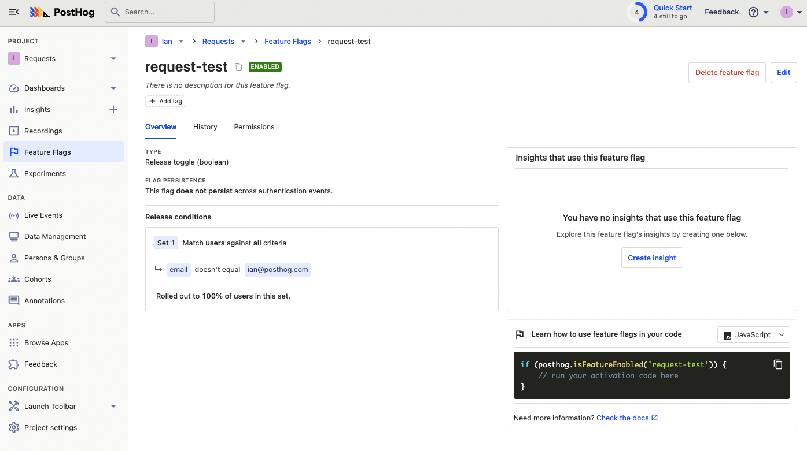

> <p align="center">Open this tutorial in PostHog and follow along step-by-step!</p> <CallToAction href="https://app.posthog.com/#panel=docs:/tutorials/api-feature-flags" size="sm" className="mt-auto self-start sm:w-auto !w-full">Launch tutorial</CallToAction>

Like [capturing events](/tutorials/api-capture-events), feature flags get a special POST-only public endpoint in the PostHog API, `/decide/`.  There are also endpoints to get data from, update this data, and more. This tutorial shows you how to use these endpoints to evaluate your feature flags (both boolean and multivariate), get data about them, update them, and finally, shows how you can combine these requests together.

## Setting up authentication and feature flags

The `decide` endpoint requires your project API key for authentication. To get this value, go to your project settings, and copy the value under "Project Variables." This is the same value you use to initialize a library.

Obviously you also need to create a flag before you can evaluate it. To create a feature flag, in your PostHog instance, go to the "Feature Flags" tab, click "New feature flag," enter a key, set release conditions to 100% of users, and click save.

## Request to evaluate a basic feature flag

Once your feature flag is set up, the request to evaluate the flag is straightforward. All you need is the project API key, the distinct ID of the user you want to check, and the version (`v`) as a param. 

Formatting all this correctly looks like this:

<MultiLanguage>

```bash
curl -v -L --header "Content-Type: application/json" -d '{
  "api_key": "<PH_PROJECT_API_KEY>",
  "distinct_id": "ian@posthog.com"
}' "https://app.posthog.com/decide/?v=3"
```

```python
import requests
url = "https://app.posthog.com/decide/?v=3"

headers = {
  "Content-Type": "application/json",
}

body = {
  "api_key": "<PH_PROJECT_API_KEY>",
  "distinct_id": "ian@posthog.com"
}

response = requests.post(url, headers=headers, json=body).json()
```

</MultiLanguage>

The only potentially tricky part of this is the version param. Use `v=3`, as it is the most recent. Unlike the other versions, it returns the the feature flag values, any errors that occurred when computing, and any payloads for the flags.

Also, if doing a `curl` request, make sure to wrap your URL in quotes to ensure your terminal doesn’t think the `?` is a wildcard character.

The response from this request looks like this:

```json
{
  "config": {
      "enable_collect_everything": true
  },
  "toolbarParams": {},
  "isAuthenticated": false,
  "supportedCompression": [
      "gzip",
      "gzip-js",
      "lz64"
  ],
  "featureFlags": {
    "request-test": true
  },
  "sessionRecording": false,
  "errorsWhileComputingFlags": false,
  "featureFlagPayloads": {},
  "capturePerformance": false,
  "siteApps": []
}
```

You can use this response with whatever language to control access or usage of features. It can be fully customized for your use case compared to the libraries. As an extremely basic example, if I only wanted to run a function if the `request-test` flag is `true`, I could do this:

```python
import requests
url = "https://app.posthog.com/decide/?v=3"

headers = {
  "Content-Type": "application/json",
}

body = {
  "api_key": "<PH_PROJECT_API_KEY>",
  "distinct_id": "ian@posthog.com"
}

response = requests.post(url, headers=headers, json=body)

def runTestFunction():
  print('Test function ran')

if response.json().get('featureFlags').get('request-test'):
  runTestFunction()
```

Our libraries abstract this functionality away and provides utilities such as caching for local evaluation. If you want complete control, the API gives full access.

## Evaluating multi-variate flags

The `v=3` endpoint also supports multivariate flags. To test this, create a multi-variate feature flag in PostHog by selecting the "Multiple variants with rollout percentages (A/B test)" as the "Served value." 

Once you do this, make the same request as above and the response includes the variant data like this:

```json
...
"featureFlags": {
  "multivariate-test": "variant-a",
  "request-test": true
},
...
```

You can then use this like the boolean flag to control access or run specific code.

## Getting evaluation reasons

If you want to know why a flag is evaluated a certain way for a specific user, you can use the `/api/projects/:project_id/feature_flags/evaluation_reasons/` endpoint. This endpoint requires the distinct ID of the user as a param and a personal API key for authorization.

> Unlike the `POST` endpoints detailed earlier, the rest of these endpoints are private and require a personal key. You can create this key in your profile settings (top right corner) in your PostHog instance. See the [get insights and person API tutorial](/tutorials/api-get-insights-persons#getting-your-personal-api-key) for detailed instructions.

<MultiLanguage>

```bash
export POSTHOG_PERSONAL_API_KEY=<POSTHOG_PERSONAL_API_KEY>
export POSTHOG_PROJECT_ID=<POSTHOG_PROJECT_ID>
curl \
  -H "Authorization: Bearer $POSTHOG_PERSONAL_API_KEY" \
  https://app.posthog.com/api/projects/$POSTHOG_PROJECT_ID/feature_flags/evaluation_reasons/?distinct_id=ian@posthog.com
```

```python
import requests

POSTHOG_PERSONAL_API_KEY = <POSTHOG_PERSONAL_API_KEY>
DISTINCT_ID = ian@posthog.com

headers = {"Authorization": f"Bearer {POSTHOG_PERSONAL_API_KEY}" }

response = requests.get(
    f"https://app.posthog.com/api/projects/<POSTHOG_PROJECT_ID>/feature_flags/evaluation_reasons/?distinct_id={DISTINCT_ID}",
    headers=headers
).json()
```

</MultiLanguage>

## Getting feature flag data

You can also use the API to get and update feature flags. To update the flags, you need their ID, and a way to get this by making an API request to get all flags, then filtering for the one matching the name or key you want.

With your personal API and your project ID, you can make a request to `api/projects/:project_id/feature_flags/` to get all your flags like this:

<MultiLanguage>

```bash
export POSTHOG_PERSONAL_API_KEY=<POSTHOG_PERSONAL_API_KEY>
export POSTHOG_PROJECT_ID=<POSTHOG_PROJECT_ID>
curl \
  -H "Authorization: Bearer $POSTHOG_PERSONAL_API_KEY" \
  https://app.posthog.com/api/projects/$POSTHOG_PROJECT_ID/feature_flags/
```

```python
import requests

POSTHOG_PERSONAL_API_KEY = <POSTHOG_PERSONAL_API_KEY>

headers = {"Authorization": f"Bearer {POSTHOG_PERSONAL_API_KEY}" }

response = requests.get(
    f"https://app.posthog.com/api/projects/<POSTHOG_PROJECT_ID>/feature_flags",
    headers=headers
).json()
```

</MultiLanguage>

To get details about a specific flag, you can then use the ID (which you can also find in the URL of the flag in your PostHog instance) to make a request to `/api/projects/:project_id/feature_flags/:id/` like this:

<MultiLanguage>

```bash
export POSTHOG_PERSONAL_API_KEY=<POSTHOG_PERSONAL_API_KEY>
export POSTHOG_PROJECT_ID=<POSTHOG_PROJECT_ID>
curl \
  -H "Authorization: Bearer $POSTHOG_PERSONAL_API_KEY" \
  https://app.posthog.com/api/projects/$POSTHOG_PROJECT_ID/feature_flags/<FLAG_ID>
```

```python
import requests

POSTHOG_PERSONAL_API_KEY = <POSTHOG_PERSONAL_API_KEY>

headers = {"Authorization": f"Bearer {POSTHOG_PERSONAL_API_KEY}" }

response = requests.get(
  f"https://app.posthog.com/api/projects/<POSTHOG_PROJECT_ID>/feature_flags/<FLAG_ID>",
  headers=headers
).json()
```

</MultiLanguage>

## Updating feature flag data

We can use the same `/api/projects/:project_id/feature_flags/:id/` route with the `PATCH` method to update the data about the flag such as name, key, rollout percentage, or release conditions. For example, if we wanted to change the rollout percentage of our flag, we could make a request like this:

<MultiLanguage>

```bash
export POSTHOG_PERSONAL_API_KEY=<POSTHOG_PERSONAL_API_KEY>
export POSTHOG_PROJECT_ID=<POSTHOG_PROJECT_ID>
curl \
  -H "Authorization: Bearer $POSTHOG_PERSONAL_API_KEY" \
  -H "Content-Type: application/json" \
  -d '{"filters":{"groups":[{"properties":[],"rollout_percentage":0}]}}' \
  -X PATCH https://app.posthog.com/api/projects/$POSTHOG_PROJECT_ID/feature_flags/<FLAG_ID>
```

```python
POSTHOG_PERSONAL_API_KEY = "<POSTHOG_PERSONAL_API_KEY>"
ROLLOUT_PERCENTAGE = 0

headers = {"Authorization": f"Bearer {POSTHOG_PERSONAL_API_KEY}" }

filters = {
  "filters": {
    "groups": [
      {
        "properties": [],
        "rollout_percentage": ROLLOUT_PERCENTAGE
      }
    ]
  }
}

response = requests.patch(
  f"https://app.posthog.com/api/projects/<POSTHOG_PROJECT_ID>/feature_flags/<FLAG_ID>",
  headers=headers,
  json=filters
).json()
```

</MultiLanguage>

This filter object can include available user properties, cohorts, or group properties. You also can use the `PATCH` endpoint to change the name, key, filters, deleted status, active status, and more. 

> Be careful when using the `PATCH` endpoint, as it overwrites any current feature flag details. Find out more in [our API docs](/docs/api/feature-flags#patch-api-projects-project_id-feature_flags-id).

## Combining our requests to update flags when evaluated

To combine these, we will write a Python script that:

1. evaluates our feature flag
2. figures out the feature flag ID by finding the key in the "get all feature flags" request
3. updates the feature flag to filter out the email of the user who saw the feature flag

You can also do this by setting the release conditions to not include a property you set on a person that has seen the flag, if you prefer. 

First, we get our evaluation request and variables sorted.

```python
USER_EMAIL = "ian@posthog.com"
POSTHOG_PERSONAL_API_KEY = "<POSTHOG_PERSONAL_API_KEY>"
PROJECT_API_KEY = '<PH_PROJECT_API_KEY>'
FLAG_KEY = 'request-test'
POSTHOG_PROJECT_ID = <POSTHOG_PROJECT_ID>

json_headers = {
  "Content-Type": "application/json",
}

auth_header = {
  "Authorization": f"Bearer {POSTHOG_PERSONAL_API_KEY}"
}

body = {
  "api_key": PROJECT_API_KEY,
  "distinct_id": USER_EMAIL
}

evaluate = requests.post(
  'https://app.posthog.com/decide/?v=3',
  headers=json_headers, 
  json=body
)

if evaluate.json().get('featureFlags').get(FLAG_KEY):
  filterUserFromFlag()
```

Next, we write a `getFlagId` function to figure out the feature flag ID by checking the key in the get feature flags request:

```python
def getFlagId():
  get_all = requests.get(
    f"https://app.posthog.com/api/projects/{POSTHOG_PROJECT_ID}/feature_flags",
    headers=auth_header
  ).json()

  for flag in get_all['results']:
    if flag['key'] == FLAG_KEY:
      return flag['id']
```

After we have the flag ID, we can write the `filterUserFromFlag` function to send a request to filter the user from the release:

```python
def filterUserFromFlag():
  FLAG_ID = getFlagId()

  filters = {
    "filters": {
      "groups": [
        {
          "properties": [
            {
              "key": "email",
              "value": [
                USER_EMAIL
              ],
              "operator": "is_not",
              "type": "person"
            }
          ]
        }
      ]
    }
  }

  response = requests.patch(
    f"https://app.posthog.com/api/projects/{POSTHOG_PROJECT_ID}/feature_flags/{FLAG_ID}",
    headers=auth_header,
    json=filters
  ).json()
```

Once done, run this request and check the feature flag in your PostHog instance to see it changed.



Once confirmed, you're done. Congratulations, you’ve built a solid grasp of using the PostHog API to evaluate and update feature flags! You can use this skill to customize your implementation to your needs.

## Further reading

- [How to use the PostHog API to get insights and persons](/tutorials/api-get-insights-persons)
- [Documentation on POST-only public endpoints](/docs/api/post-only-endpoints)
- [Using the PostHog API to capture events](/tutorials/api-capture-events)
