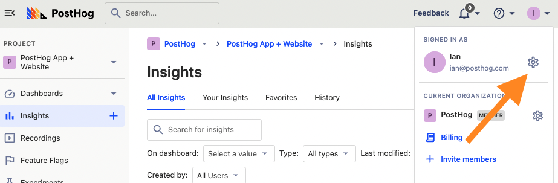
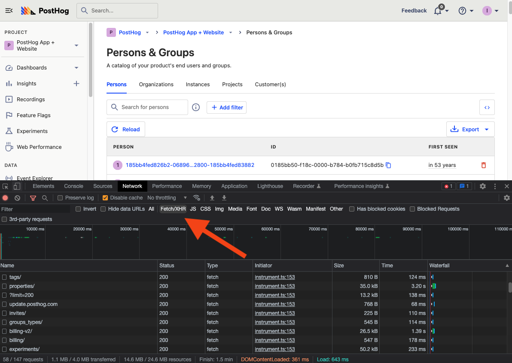

An API or application programming interface is how computers talk to each other. They are powerful access points to applications, data, and processing.

This tutorial shows you the basics of the PostHog API. We focus on `GET` requests to retrieve information on insights and persons from your project

## Getting your personal API key

Like most APIs, we must authenticate ourselves before we can access our data in PostHog. To do this, you need a personal API key. 

To create a personal API key in PostHog, click your avatar icon in the bottom left corner of your PostHog instance, then click the gear icon to go to "My settings." 



In "My settings," go to the ["Personal API Keys" tab](https://us.posthog.com/settings/user-api-keys) click "Create personal API key," add a name, and click "Create key." This creates a key and value in the table below. Make sure to save the value as it is only shown once, and you must create a new key if you lose it. The value looks like this:

```
phx_IFdqdH62fKoax8x17bwu8gujE0tsTBZRvNmlMJ7eZxz
```

This key is then used either as a bearer token, in the request body, or in the query string to authenticate your request.

```python
headers = {
    "Authorization": f"Bearer {POSTHOG_PERSONAL_API_KEY}"
}
body = {
    "personal_api_key": POSTHOG_PERSONAL_API_KEY
}
url = f"https://app.posthog.com/api/event/?personal_api_key={POSTHOG_PERSONAL_API_KEY}"
```

## Making our first request to get our own information

With our personal API key, we can begin making requests. To test that everything is working, our first request is to get the details on ourselves. To do this, we make a `GET` request with our personal API key as a bearer token to the `/api/users/@me/` route like this:

<MultiLanguage>

```python
import requests

POSTHOG_PERSONAL_API_KEY = '<POSTHOG_PERSONAL_API_KEY>'

headers = {"Authorization": f"Bearer {POSTHOG_PERSONAL_API_KEY}" }

response = requests.get(
    "https://app.posthog.com/api/users/@me", headers=headers
).json()
```

```bash
export POSTHOG_PERSONAL_API_KEY=<POSTHOG_PERSONAL_API_KEY>
curl \
    -H "Authorization: Bearer $POSTHOG_PERSONAL_API_KEY" \
    https://app.posthog.com/api/users/@me/
```

</MultiLanguage>

For the next `GET` requests, you also need your project ID. Scroll down in the response, to the list of `teams`, look for the name you want, and copy the `id` of the project you want. You can also find this value in your project settings, but this is more fun.

## Getting an insight

Your project likely contains multiple insights. They are core to analysis in PostHog and you can access them through the API. We can get a list of all our insights by calling `/api/projects/:project_id/insights/`:

<MultiLanguage>

```python
import requests

POSTHOG_PERSONAL_API_KEY = '<POSTHOG_PERSONAL_API_KEY>'
POSTHOG_PROJECT_ID = "<POSTHOG_PROJECT_ID>"

headers = {"Authorization": f"Bearer {POSTHOG_PERSONAL_API_KEY}" }

response = requests.get(
    f"https://app.posthog.com/api/projects/{POSTHOG_PROJECT_ID}/insights/",
    headers=headers
).json()
```

```bash
export POSTHOG_PERSONAL_API_KEY=<POSTHOG_PERSONAL_API_KEY>
export POSTHOG_PROJECT_ID=<POSTHOG_PROJECT_ID>
curl \
    -H "Authorization: Bearer $POSTHOG_PERSONAL_API_KEY" \
    https://app.posthog.com/api/projects/$POSTHOG_PROJECT_ID/insights/
```

</MultiLanguage>

This returns a list of all of our insights. 

### Filtering insights

You can filter for a specific insights by using the `short_id` param with the ID that comes after `/insights/` in the URL of the insight. This creates a request like this:

<MultiLanguage>

```python
import requests

POSTHOG_PERSONAL_API_KEY = <POSTHOG_PERSONAL_API_KEY>
POSTHOG_PROJECT_ID = "<POSTHOG_PROJECT_ID>"

headers = {"Authorization": f"Bearer {POSTHOG_PERSONAL_API_KEY}" }

SHORT_ID = "<YOUR_INSIGHT_SHORT_ID>"

response = requests.get(
	f"https://app.posthog.com/api/projects/{POSTHOG_PROJECT_ID}/insights/?short_id={SHORT_ID}",
	headers=headers
).json()
```

```bash
export POSTHOG_PERSONAL_API_KEY=<POSTHOG_PERSONAL_API_KEY>
export POSTHOG_PROJECT_ID=<POSTHOG_PROJECT_ID>
curl \
    -H "Authorization: Bearer $POSTHOG_PERSONAL_API_KEY" \
    https://app.posthog.com/api/projects/$POSTHOG_PROJECT_ID/insights/?short_id=<YOUR_INSIGHT_SHORT_ID>
```

</MultiLanguage>

To get a cleaner response, you can use the insight ID (a number) to get only the details from that insight:

<MultiLanguage>

```python
import requests

POSTHOG_PERSONAL_API_KEY = <POSTHOG_PERSONAL_API_KEY>
POSTHOG_PROJECT_ID = "<POSTHOG_PROJECT_ID>"

headers = {"Authorization": f"Bearer {POSTHOG_PERSONAL_API_KEY}" }

INSIGHT_ID = <YOUR_INSIGHT_ID>

response = requests.get(
	f"https://app.posthog.com/api/projects/{POSTHOG_PROJECT_ID}/insights/{INSIGHT_ID}/",
	headers=headers
).json()
```

```bash
export POSTHOG_PERSONAL_API_KEY=<POSTHOG_PERSONAL_API_KEY>
export POSTHOG_PROJECT_ID=<POSTHOG_PROJECT_ID>
curl \
    -H "Authorization: Bearer $POSTHOG_PERSONAL_API_KEY" \
    https://app.posthog.com/api/projects/$POSTHOG_PROJECT_ID/insights/<INSIGHT_ID>/
```

</MultiLanguage>

With some comparison between the values in the visualization and the API response, you can get the data you want. For example, if you wanted the total number of events in a trend insight, you could get the aggregated value with a script like this:

```python
import requests

POSTHOG_PERSONAL_API_KEY = '<POSTHOG_PERSONAL_API_KEY>'

headers = {"Authorization": f"Bearer {POSTHOG_PERSONAL_API_KEY}" }

response = requests.get(
	"https://app.posthog.com/api/projects/<POSTHOG_PROJECT_ID>/insights/921029",
	headers=headers
).json()
print(response.get('result')[0]['aggregated_value'])
```

With some work, you can take pieces of insights to get the data you want into your application or script how you want it. It might require multiple pieces of data or multiple requests though.

## Getting a specific person

We started this tutorial by getting a specific person (you), but now it is time to get info about the people you actually care about (your users). To get a list of them, call the `/api/projects/:project_id/persons/` route:

<MultiLanguage>

```python
import requests

POSTHOG_PERSONAL_API_KEY = <POSTHOG_PERSONAL_API_KEY>
POSTHOG_PROJECT_ID = "<POSTHOG_PROJECT_ID>"

headers = {"Authorization": f"Bearer {POSTHOG_PERSONAL_API_KEY}" }

response = requests.get(
	f"https://app.posthog.com/api/projects/{POSTHOG_PROJECT_ID}/persons/",
	headers=headers
).json()
```

```bash
export POSTHOG_PERSONAL_API_KEY=<POSTHOG_PERSONAL_API_KEY>
export POSTHOG_PROJECT_ID=<POSTHOG_PROJECT_ID>
curl \
    -H "Authorization: Bearer $POSTHOG_PERSONAL_API_KEY" \
    https://app.posthog.com/api/projects/$POSTHOG_PROJECT_ID/persons/
```

</MultiLanguage>

### Filtering people

Another way to get a specific person is by filtering for them. You can add a `name`, `distinct_id`, or `properties` param to query for users matching those filters. For example, I want only users who have an `$initial_os` property of `Linux`. To do this, you need to create the filter which is a list of dictionaries that include `key`, `value`, `operator`, and `type`. Our filter looks like this unencoded:

```
[{"key":"$initial_os","value":["Linux"],"operator":"exact","type":"person"}]
```

You can chain together multiple of these filters to get more specific. Once encoded (Python’s `urllib` library is a simple way to do this) and added to the request, it looks like this:

<MultiLanguage>

```python
import requests
import urllib

POSTHOG_PERSONAL_API_KEY = <POSTHOG_PERSONAL_API_KEY>

headers = {"Authorization": f"Bearer {POSTHOG_PERSONAL_API_KEY}" }

properties = urllib.parse.quote(
    '[{"key":"$initial_os","value":["Linux"],"operator":"exact","type":"person"}]'
)

response = requests.get(
    f"https://app.posthog.com/api/projects/<POSTHOG_PROJECT_ID>/persons/?properties={properties}",
    headers=headers
).json()
```

```bash
export POSTHOG_PERSONAL_API_KEY=<POSTHOG_PERSONAL_API_KEY>
export POSTHOG_PROJECT_ID=<POSTHOG_PROJECT_ID>
curl \
    -H "Authorization: Bearer $POSTHOG_PERSONAL_API_KEY" \
    https://app.posthog.com/api/projects/$POSTHOG_PROJECT_ID/persons/?properties=%5B%7B%22key%22%3A%22%24initial_os%22%2C%22value%22%3A%5B%22Linux%22%5D%2C%22operator%22%3A%22exact%22%2C%22type%22%3A%22person%22%7D%5D
```

</MultiLanguage>

If you have a specific person you want the details of, you can also just use their ID in the request to get details specifically about them:

<MultiLanguage>

```python
import requests

POSTHOG_PERSONAL_API_KEY = <POSTHOG_PERSONAL_API_KEY>
POSTHOG_PROJECT_ID = "<POSTHOG_PROJECT_ID>"

headers = { "Authorization": f"Bearer {POSTHOG_PERSONAL_API_KEY}" }

PERSON_ID = "<YOUR_PERSON_ID>"

response = requests.get(
	f"https://app.posthog.com/api/projects/{POSTHOG_PROJECT_ID}/persons/{PERSON_ID}",
	headers=headers
).json()
```
    
```bash
export POSTHOG_PERSONAL_API_KEY=<POSTHOG_PERSONAL_API_KEY>
export POSTHOG_PROJECT_ID=<POSTHOG_PROJECT_ID>
curl \
    -H "Authorization: Bearer $POSTHOG_PERSONAL_API_KEY" \
    https://app.posthog.com/api/projects/$POSTHOG_PROJECT_ID/persons/<PERSON_ID>/
```

</MultiLanguage>

## Exploring the API more

This is just scratching the surface. API routes exist for all types of data in your project, from actions to cohorts to trends. The endpoints provide a combination of metadata, types, descriptions, lists of occurrences, details on specific occurrences, and filter options.

One of the best ways to explore the API is to use PostHog normally, but with the browser network tab open to the `Fetch/XHR` tab. This gives you an idea of what requests PostHog is sending to generate the data you are seeing. It can be useful if you are trying to recreate a request to see how we do it in PostHog.



Also, check out our [our API documentation](/docs/api) for all the information about the API and its possibilities.

## Further reading

- [Using the PostHog API to capture events](/tutorials/api-capture-events)
- [A non-technical guide to understanding data in PostHog](/tutorials/non-technical-guide-to-data)
- [How to evaluate and update feature flags with the PostHog API](/tutorials/api-feature-flags)
