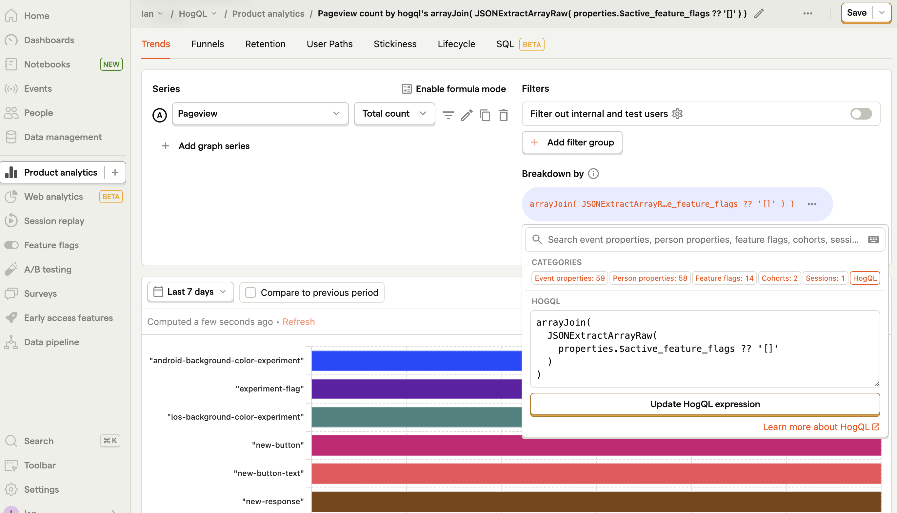
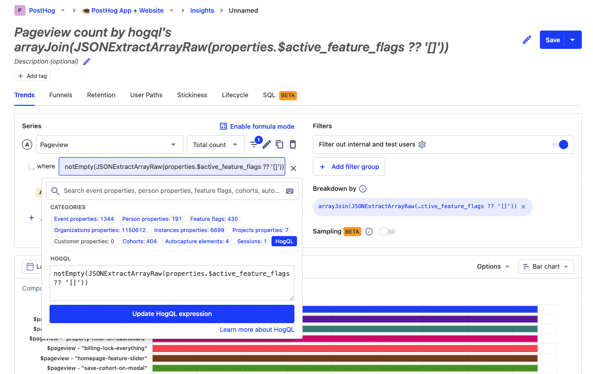

Arrays (AKA lists) are a useful way to store multiple values related to each other under the same key. Although arrays can be a bit tricky to utilize with standard PostHog filters, [HogQL expressions](/docs/hogql/expressions) unlock the ability to make full use of them. 

This tutorial shows you how to access arrays in your data, use them in breakdowns, and set up filters with and for them.

> **Fun fact:** A group of hedgehogs is known as an array. This is an inspiration for our name and [mascot](/community/profiles/720).

## Getting or creating arrays

Before you do anything, you need access to the arrays in your data. There are a few ways to do this in [insights](https://app.posthog.com/home):

- Select a property that is already an array like `properties.$active_feature_flags`.

- Split a string with `splitByChar`.  For example, splitting the [autocapture element chain](/tutorials/hogql-autocapture) with`splitByChar('.', elements_chain)`.

- Extract an array from JSON with `JSONExtractArrayRaw` or `JSONExtractKeys`.

Once you can access the array, you can breakdown or filter using it.

## Breaking down arrays

Once we have our array, we can break it down further. To do this, [create an insight](https://app.posthog.com/insights/new), click "Add breakdown" under "Breakdown by," and select HogQL. Here we can write our HogQL expressions to break down arrays. 

The most useful breakdown with arrays is `arrayJoin`. This is a [special expression](https://clickhouse.com/docs/en/sql-reference/functions/array-join) that "unfolds" an array into multiple rows. and helps us access each value from within an array. For example, to get a count of the usage of different `$active_feature_flags`, you can use this HogQL expression breakdown:

```sql
arrayJoin(
  JSONExtractArrayRaw(
    properties.$active_feature_flags ?? '[]'
  )
)
```

> Adding `?? '[]'`  is a "nullish coalescing operator" that provides a default value to your properties. In this case, it provides an empty array if `properties.$active_feature_flags` is null or undefined.



More useful array breakdowns include:

- `arrayUniq` for counting the number of unique values in the array.
- `arrayDistinct` which returns an array containing only the distinct elements. You can combine this with `arrayJoin` to get counts for distinct values within arrays.
- `arrayElement(arr, 1)` for breaking down the first elements in the array.
- `arrayElement(arr, -1)` for breaking down the last elements in the array.

Once you get individual number or string values from the breakdown, you can modify these values further too. Read our [HogQL expression docs](/docs/hogql/expressions) for more useful functions for doing this.

## Filtering arrays

Once you break down your array, you might find it contains values you don't care about. You can use filters to remove them. Filtering arrays is relatively similar to breaking down, except you must provide values you want to filter out.

To add a filter, click the filter dropdown next to your data series, click "Add filter," select HogQL, and add your expression. You can also use filters in the [events explorer tab](https://app.posthog.com/events).

To start, you can remove empty arrays with a `notEmpty()` check. For example, to remove empty arrays from the `$active_feature_flags` by filtering for the HogQL expression:

```sql
notEmpty(
  JSONExtractArrayRaw(
    properties.$active_feature_flags ?? '[]'
  )
)
```



If you want to filter arrays for specific values you can use `has`, `hasAll`, and `hasAny`:

- `has()` filters for arrays containing an element. `has(arr, 'test')` matches arrays containing `'test'`.

- `hasAll()` filters for arrays containing all of another array of elements. `hasAll(arr, ['test', 'cool'])` matches arrays containing both `'test'` and `'cool'`.

- `hasAny()` filters for arrays containing any of another array of elements. `hasAny(arr, ['test', 'cool'])` matches arrays containing either `'test'` or `'cool'`.

> **Notes:**
>
> - If you get the error "Nested type Array(String) cannot be inside Nullable type" (or similar), you can wrap your property value in a `assumeNotNull` expression like `has(assumeNotNull(arr), 'test')`.
> 
> - When selecting a number, you need to wrap it in [single quotes](/docs/hogql/guide#strings-and-quotes). For example, `has(arr, '1')` matches arrays containing the number `1`.

If you want to filter arrays by the first, last, or specific index value, you can use `arrayElement(arr, n)` again too.

## Further reading

- [Using HogQL for advanced time and date filters](/tutorials/hogql-date-time-filters)
- [Using HogQL for advanced breakdowns](/tutorials/hogql-breakdowns)
- [How to do time-based breakdowns (hour, minute, real time)](/tutorials/time-breakdowns)