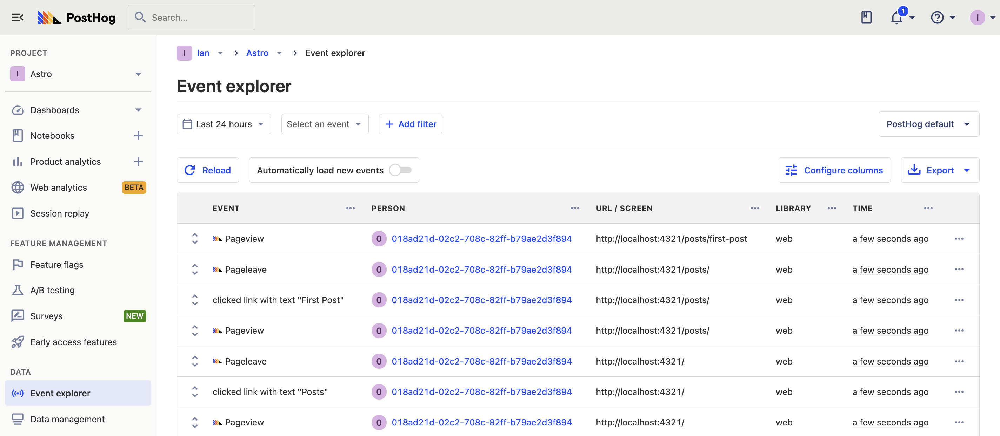
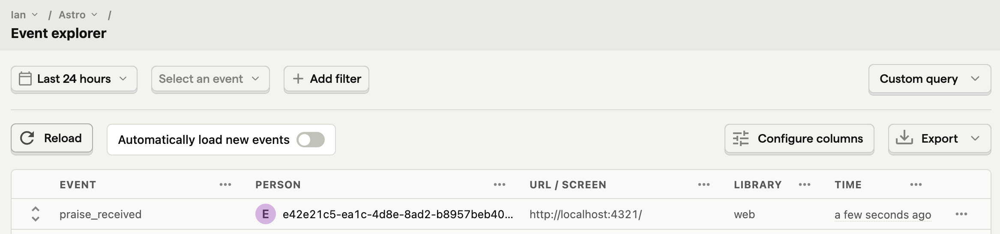
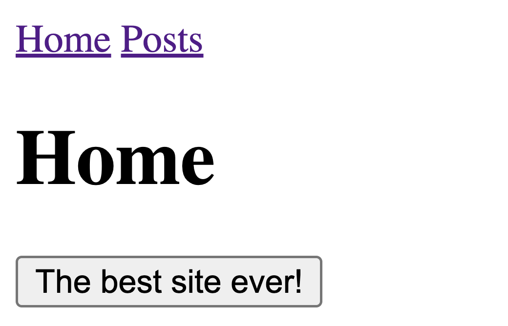

[Astro](https://astro.build/) is a frontend JavaScript framework focused on performance and simplifying the creation of content-based sites. It has seen a rapid increase in interest and usage since its release in 2022.

PostHog provides the tools you need to create the best possible Astro app. In this tutorial, we show you how to set them up. We create a basic Astro blog app, add PostHog on both the client and server, [capture custom events](/docs/product-analytics/capture-events), and set up [feature flags](/docs/feature-flags).

## Creating your Astro app

First make sure you install a [Node version](https://nodejs.org/en/download) greater than 18. After that, you can run the command below to create your app. Name your app (we choose `astro-tutorial`), start your new project `Empty`, install dependencies, choose `No` for TypeScript, and `No` for git repository.

```bash
npm create astro@latest
```

Once created, go to the `src` folder and create a `layouts` folder. In this folder, create a `Layout.astro` file with some basic HTML code and links to the home and `posts` pages.

```js
---
// src/layouts/Layout.astro
---
<html lang="en">
	<head>
		<meta charset="utf-8" />
		<link rel="icon" type="image/svg+xml" href="/favicon.svg" />
		<meta name="viewport" content="width=device-width" />
		<meta name="generator" content={Astro.generator} />
		<title>Astro</title>
	</head>
	<body>
		<a href="/">Home</a>
		<a href="/posts/">Posts</a>
		<slot /> 
	</body>
</html>
```

Next, in the `src/pages` folder, we create a `posts` folder and a basic `index.astro` file with a link to a post we will create.

```js
---
// src/pages/posts/index.astro
import Layout from '../../layouts/Layout.astro';
---
<Layout>
	<h1>Here are all the posts</h1>
	<a href="/posts/first-post">First Post</a>
</Layout>
```

In the `posts` folder, we also create a `first-post.md` file where we write a bit of Markdown as an example. You can customize this or add more posts and links here if you’d like.

```md
---
layout: ../../layouts/Layout.astro
---
<!-- src/pages/posts/first-post.md -->
# First post

PostHog is awesome
```

We also clean up the base `index.astro` file in the pages folder to use the layout we created.

```js
---
// src/pages/index.astro
import Layout from '../layouts/Layout.astro';
---
<Layout>
	<h1>Home</h1>
</Layout>
```

Finally, we can run our app with `npm run dev` to see our full Astro app running locally.


## Adding PostHog on the client side

With our app set up, the next step is to add PostHog to it. To start, create a new `components` folder in the `src` folder. In this folder, create a `posthog.astro` file. In this file, add your Javascript Web snippet which you can find in [your project settings](https://app.posthog.com/settings/project#snippet). 

```js
---
// src/components/posthog.astro
---
<script async>
  !function(t,e){var o,n,p,r;e.__SV||(window.posthog=e,e._i=[],e.init=function(i,s,a){function g(t,e){var o=e.split(".");2==o.length&&(t=t[o[0]],e=o[1]),t[e]=function(){t.push([e].concat(Array.prototype.slice.call(arguments,0)))}}(p=t.createElement("script")).type="text/javascript",p.async=!0,p.src=s.api_host+"/static/array.js",(r=t.getElementsByTagName("script")[0]).parentNode.insertBefore(p,r);var u=e;for(void 0!==a?u=e[a]=[]:a="posthog",u.people=u.people||[],u.toString=function(t){var e="posthog";return"posthog"!==a&&(e+="."+a),t||(e+=" (stub)"),e},u.people.toString=function(){return u.toString(1)+".people (stub)"},o="capture identify alias people.set people.set_once set_config register register_once unregister opt_out_capturing has_opted_out_capturing opt_in_capturing reset isFeatureEnabled onFeatureFlags getFeatureFlag getFeatureFlagPayload reloadFeatureFlags group updateEarlyAccessFeatureEnrollment getEarlyAccessFeatures getActiveMatchingSurveys getSurveys onSessionId".split(" "),n=0;n<o.length;n++)g(u,o[n]);e._i.push([i,s,a])},e.__SV=1)}(document,window.posthog||[]);
  posthog.init(
    '<ph_project_api_key>',
    {
      api_host:'<ph_instance_address>'
    }
  )
</script>
```

After doing this, go back to your `Layout.astro` file, import PostHog, and then add it to the header section.

```js
---
// src/layouts/Layout.astro
import PostHog from '../components/posthog.astro'
---
<html lang="en">
	<head>
		<meta charset="utf-8" />
		<link rel="icon" type="image/svg+xml" href="/favicon.svg" />
		<meta name="viewport" content="width=device-width" />
		<meta name="generator" content={Astro.generator} />
		<title>Astro</title>
    <PostHog />
	</head>
	<body>
		<a href="/">Home</a>
		<a href="/posts/">Posts</a>
		<slot /> 
	</body>
</html>
```

When you go back to your app and reload, PostHog now autocaptures pageviews, button clicks, session replays (if you [enable them](https://app.posthog.com/settings/project-replay)), and more.



## Capturing custom events

Beyond autocapture, you can use PostHog to capture any events you want. To showcase this, we start by adding a button to our homepage component.

```js
---
// src/pages/index.astro
import Layout from '../layouts/Layout.astro';
---
<Layout>
	<h1>Home</h1>
	<button class="main">Great site!</button>
</Layout>
```

We then add a script to select this button, add a click event listener, and then capture a custom event.

```js
---
// src/pages/index.astro
import Layout from '../layouts/Layout.astro';
---
<Layout>
	<h1>Home</h1>
	<button class="main">Great site!</button>
	<script>
		const button = document.querySelector('.main');
		button.addEventListener('click', () => {
			window.posthog.capture('praise_received')
		});
	</script>
</Layout>
```

When you go back to your app and click the button, you then see a `praise_received` event in PostHog.



## Setting up a feature flag

To use a feature flag in your app, first, you must create it in PostHog. Go to the [feature flags tab](https://app.posthog.com/feature_flags), click "New feature flag," add a key (we chose `new-button`), set the release condition to 100% of users, and click "Save."

With the feature flag, go back to your home page at `pages/index.astro`. Add to your script the `onFeatureFlags()` function with an `isFeatureEnabled()` for your `new-button` flag. If enabled, change the `innerHTML` of your button.

```js
---
// src/pages/index.astro
import Layout from '../layouts/Layout.astro';
---
<Layout>
	<h1>Home</h1>
	<button class="main">Great site!</button>
	<script>
		const button = document.querySelector('.main');
		button.addEventListener('click', () => {
			window.posthog.capture('praise_received')
		});

		window.posthog.onFeatureFlags(() => {
			if (window.posthog.isFeatureEnabled('new-button')) {
				button.innerText = 'The best site ever!';
			}
		});
	</script>
</Layout>
```

When you reload your page, it shows different button text controlled by the PostHog feature flag.



## Adding PostHog on the server side

So far, we have only used PostHog on the client side. We can also set up PostHog on the server side to capture events on page load, evaluate feature flags before page loads, and more. To do this, start by installing the [Node SDK](/docs/libraries/node) by running:

```bash
npm i posthog-node
```

In the `src` folder, create a `posthog.js` file. This is where we set up the code to create the PostHog Node client using our project API key and instance address.

```js
// src/posthog.js
import { PostHog } from 'posthog-node';

let posthogClient = null;

export default function PostHogClient() {
  if (!posthogClient) {
    posthogClient = new PostHog('<ph_project_api_key>', {
      host: '<ph_instance_address>',
    });
  }
  return posthogClient;
}
```

To show how we can use this, we import it into our home `pages/index.astro` file and then capture an event with it.

```js
---
// src/pages/index.astro
import Layout from '../layouts/Layout.astro';
import PostHogClient from '../posthog.js';

const phClient = PostHogClient();
phClient.capture(
	{
		event: 'server_side_event', 
		distinctId: 'ian@posthog.com'
	}
);
---
<!-- The rest of the component -->
```

Now when we reload the page, PostHog captures a `server_side_event`.

## Identifying users to connect server and client

One issue with our implementation is the hard-coded user distinct ID we are using to capture events. For it to use a real user’s ID, we can either:

1. Use the distinct ID set by the client side PostHog in the request cookie.
2. Create a new distinct ID on the server and use [`identify()`](/docs/product-analytics/identify) to connect it in the client.

We can start by changing the output mode in `astro.config.mjs` to `hybrid` so we can access the cookies.

```js
// astro.config.mjs
import { defineConfig } from 'astro/config';

// https://astro.build/config
export default defineConfig({
  output: 'hybrid'
});
```

Next, we use the `Astro.cookies` utility to get the cookie using our project API key.

```js
---
// src/pages/index.astro
// ... imports
const projectAPIKey = '<ph_project_api_key>'
const cookie = Astro.cookies.get(`ph_${projectAPIKey}_posthog`)
let distinctId = cookie?.json().distinct_id
// ... rest of code
```

If we can’t get the `distinct_id` this way, we can create our own by importing the Node `crypto` library and using `crypto.randomUUID()`. This makes our final server code look like this:

```js
---
// src/pages/index.astro
import Layout from '../layouts/Layout.astro';
import PostHogClient from '../posthog.js';
import crypto from 'node:crypto';

const projectAPIKey = 'phc_zr8PzJVYWUgq47uTjJ8Cp7uCXfkGRppRbIUYlHe5w09'
const cookie = Astro.cookies.get(`ph_${projectAPIKey}_posthog`)
let distinctId = cookie?.json().distinct_id
if (!distinctId) {
	distinctId = crypto.randomUUID()
}

const phClient = PostHogClient();
phClient.capture(
	{
		event: 'server_side_event', 
		distinctId: distinctId
	}
);
---
<!-- The rest of the component -->
```

This solves our problem partially, but the server and client distinct IDs end up disconnected. Your analysis will show events from two different users when they came from one. 

To prevent this, we add the distinct ID in a hidden component so we can access it when PostHog loads.

```js
---
// src/pages/index.astro
//... server logic
---
<Layout>
	<h1>Home</h1>
	<button class="main">Great site!</button>
	<p style="display:none" class="did">{distinctId}</p>
	<!-- ... rest of code -->
```

Finally, in `posthog.astro`, we add logic to get the distinct ID, check if it’s different, and call `posthog.identify()` to connect the IDs if so.

```js
---
// src/components/posthog.astro
---
<script async>
  !function(t,e){var o,n,p,r;e.__SV||(window.posthog=e,e._i=[],e.init=function(i,s,a){function g(t,e){var o=e.split(".");2==o.length&&(t=t[o[0]],e=o[1]),t[e]=function(){t.push([e].concat(Array.prototype.slice.call(arguments,0)))}}(p=t.createElement("script")).type="text/javascript",p.async=!0,p.src=s.api_host+"/static/array.js",(r=t.getElementsByTagName("script")[0]).parentNode.insertBefore(p,r);var u=e;for(void 0!==a?u=e[a]=[]:a="posthog",u.people=u.people||[],u.toString=function(t){var e="posthog";return"posthog"!==a&&(e+="."+a),t||(e+=" (stub)"),e},u.people.toString=function(){return u.toString(1)+".people (stub)"},o="capture identify alias people.set people.set_once set_config register register_once unregister opt_out_capturing has_opted_out_capturing opt_in_capturing reset isFeatureEnabled onFeatureFlags getFeatureFlag getFeatureFlagPayload reloadFeatureFlags group updateEarlyAccessFeatureEnrollment getEarlyAccessFeatures getActiveMatchingSurveys getSurveys onSessionId".split(" "),n=0;n<o.length;n++)g(u,o[n]);e._i.push([i,s,a])},e.__SV=1)}(document,window.posthog||[]);
  posthog.init(
    '<ph_project_api_key>',
    {
      api_host:'<ph_instance_address>',
      loaded: function(posthog) {
        const distinctId = document.querySelector('.did').innerHTML;
        if (posthog.get_distinct_id() && posthog.get_distinct_id() !== distinctId) {
          posthog.identify(distinctId);
        }
      }
    }
  )
</script>
```

Now, we will have accurate, combined user IDs on both the client and server.

## Setting up server side feature flags

When setting up feature flags, you might have noticed that they flicker on the initial load. The delay between the page and PostHog loading causes this. To prevent it, we can evaluate flags on the server side. 

To do this, call `isFeatureEnabled` for the `new-button` key and `distinctID` with the Node `phClient`. Replace the button text with a server variable that depends on the flag and remove the client side flag logic.

```js
---
// src/pages/index.astro
import Layout from '../layouts/Layout.astro';
import PostHogClient from '../posthog.js';
import crypto from 'node:crypto';

const projectAPIKey = '<ph_project_api_key>'
const cookie = Astro.cookies.get(`ph_${projectAPIKey}_posthog`)
let distinctId = cookie?.json().distinct_id
if (!distinctId) {
	distinctId = crypto.randomUUID()
}

const phClient = PostHogClient();
let buttonText = 'Great site!'
if(await phClient.isFeatureEnabled('new-button', distinctId)) {
	buttonText = 'The best site ever!'
}
---
<Layout>
	<h1>Home</h1>
	<button class="main">{buttonText}</button>
	<p style="display:none" class="did">{distinctId}</p>
</Layout>
```

Now when you refresh your page, your flag won’t flicker because the content is sent from the server. This is especially useful for ensuring good user experiences in A/B tests.

## Further reading

- [What to do after installing PostHog in 5 steps](/tutorials/next-steps-after-installing)
- [How to set up A/B tests in Astro](/tutorials/astro-ab-tests)
- [How to set up React A/B testing](/tutorials/react-ab-testing)
