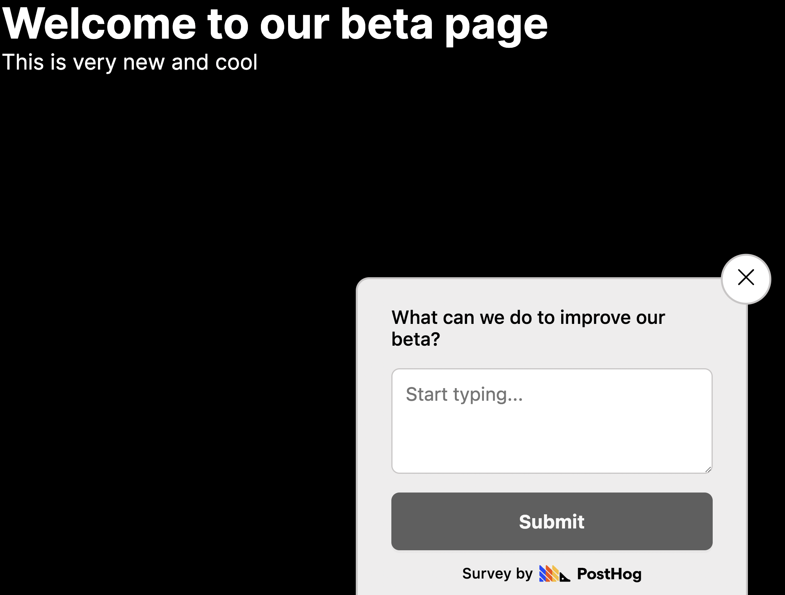

The goal of a beta is to get a feature ready for release. This means improving what works well and fixing what doesn't. Using surveys to collect feedback from your users is an easy and scalable way to do this.

This tutorial shows you how to combine PostHog’s [early access management](/docs/feature-flags/early-access-feature-management) and [survey](/docs/surveys) features to set up a beta and get feedback on it.

## Creating an early access feature

To create a beta feature in PostHog, go to the [early access management tab](https://app.posthog.com/early_access_features) and click "Create feature". Add a name like "new page beta," click "Save as draft," and then "Release beta." This also automatically creates a [feature flag](/docs/feature-flags) we use to control the display of the feature.

On the draft page, click "Implement public opt-in" and go to the [opt-in app page](https://app.posthog.com/project/apps/574). Enable the app and set "Show features button on the page" to "Yes." This adds a modal to control early access features with no extra setup.


## Creating our app

We use [Next.js](/docs/libraries/next-js) for our app, but any app with our [JavaScript Web library](/docs/libraries/js) or snippet installed works. 

To create a Next.js app, make sure [Node is installed](https://nodejs.dev/en/learn/how-to-install-nodejs/) and then run `npx create-next-app@latest beta-page`. Select **No** for TypeScript, **Yes** for `use app router`, and the defaults for every other option.

```bash
npx create-next-app@latest beta-page
```

Afterward, go into your app and install PostHog.

```bash
cd beta-page
npm i posthog-js
```

Once installed, go into the `app` folder and create a `providers.js` file. In this file, initialize PostHog with your project API key and instance address which you can get in [your project settings](https://app.posthog.com/project/settings). Make sure to set the `opt_in_site_apps` property to `true` so we can use the early access opt-in app. Finally, return a `PostHogProvider` initialized with the PostHog client.

```js
// app/providers.js
'use client'
import posthog from 'posthog-js'
import { PostHogProvider } from 'posthog-js/react'

if (typeof window !== 'undefined') {
  posthog.init('<ph_project_api_key>', {
    api_host: '<ph_client_api_host>',
    opt_in_site_apps: true
  })
}

export function PHProvider({ children }) {
  return <PostHogProvider client={posthog}>{children}</PostHogProvider>
}
```

In `layout.js`, we import the provider and wrap your app in it. 

```js
// app/layout.js
import './globals.css'
import { PHProvider } from './providers'

export default function RootLayout({ children }) {
  return (
    <html lang="en">
      <PHProvider>
        <body>{children}</body>
      </PHProvider>
    </html>
  )
}
```

When we run `npm run dev`, PostHog starts capturing events. Our beta is ready to implement and we can also set up surveys with no additional code. 

## Setting up our beta feature

Next, we add a button that goes to a `/beta` page. It conditionally shows based on the `new-page-beta` feature flag for our beta. We can evaluate this flag with the `useFeatureFlagEnabled` React hook. Altogether, a basic component looks like this:

```js
// app/page.js
'use client'
import { useFeatureFlagEnabled } from 'posthog-js/react'
import Link from 'next/link'

export default function Page() {

  const beta = useFeatureFlagEnabled('new-page-beta')

  return (
    <div>
      <h1>Welcome to our homepage</h1>
      {beta && <Link href="/beta">Go to Beta</Link>}
    </div>
  )
}
```

We also need a beta page. To add one, create a `beta` folder and a `page.js` file, and create a basic component inside. 

```js
// app/beta/page.js
export default function Beta() {
  
  return (
    <div>
      <h1>Welcome to our beta page</h1>
      <p>This is very new and cool</p>
    </div>
  )
}
```

Now, when users opt into the "new beta page" feature, a button shows on the homepage linking to the beta page.


## Adding a survey to the beta feature page

Lastly, we want to get feedback on our new beta page from the users in our beta. We can add this without adding code using [surveys](/docs/surveys).

To create a survey, go to the [surveys tab](https://app.posthog.com/surveys) in PostHog and click "New survey." Choose the [open feedback template](/templates/in-app-feedback-survey), fill out any details, and open the targeting section. In this section, we target the `new-beta-page` feature flag and the `/beta` URL. This prevents non-beta users from getting the survey. Once done, click save and launch.


Now when users opt-in to the beta and go to `/beta`, they see a survey asking for their feedback. 



This is an easy, targeted, and scalable way to learn users' thoughts and problems with your beta feature.

## Further reading

- [How to create custom surveys](/tutorials/survey)
- [Get feedback and book user interviews with surveys](/tutorials/feedback-interviews-site-apps)
- [How to set up a public beta program using early access management](/tutorials/public-beta-program)
