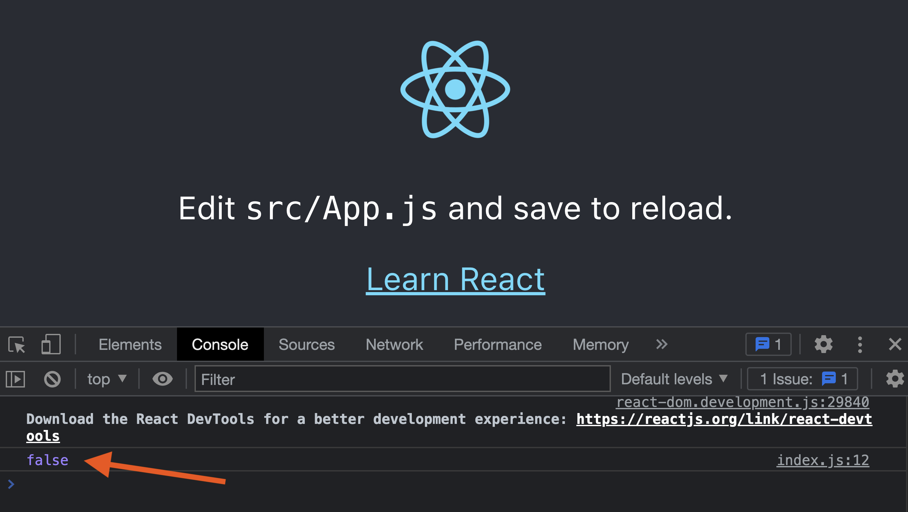
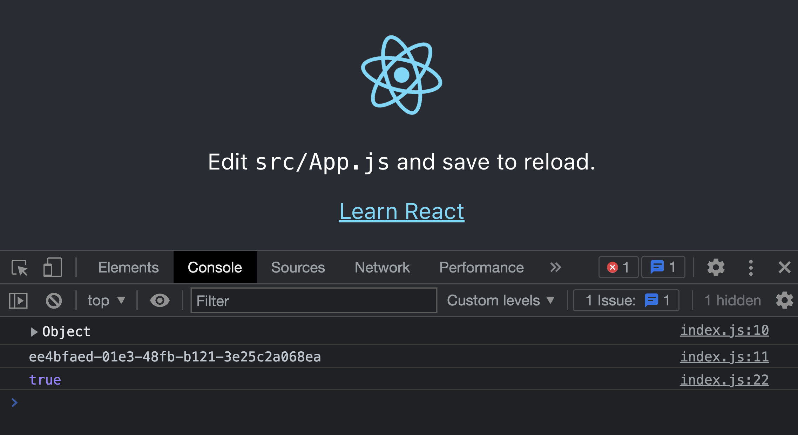

Bootstrapping feature flags make them available as soon as React and PostHog load on the client side. This enables use cases like routing to different pages on load, all feature flagged content being available on first load, and visual consistency. 

To show you how you can set up bootstrap feature flags, we are going to build a React app, add PostHog, set up an Express server to render our React app on the server-side, and finally bootstrap our flags from the server to the client.

> Already have an app set up? [Skip straight to the feature flag bootstrapping implementation](#handle-feature-flags-on-the-backend).

## Create a React app and add PostHog

Make sure you have [Node installed](https://nodejs.dev/en/learn/how-to-install-nodejs/), then create a new React app named `client`.

```bash
npx create-react-app client
```

Once created, go into the new `client` folder and install `posthog-js`.

```bash
cd client
npm i posthog-js
```

Next, get your PostHog project API key and instance address from the getting started flow or [your project settings](https://app.posthog.com/project/settings). Use them to set up a PostHog initialization in your `index.js` file.

```js
// src/index.js
import React from 'react';
import ReactDOM from 'react-dom/client';
import './index.css';
import App from './App';
import posthog from 'posthog-js'

posthog.init(
  '<ph_project_api_key>', 
  { 
    api_host: '<ph_instance_address>', 
  }
);

const root = ReactDOM.createRoot(document.getElementById('root'));
root.render(
  <React.StrictMode>
    <App />
  </React.StrictMode>
);
```

### Create and setup a feature flag

While we focus on PostHog, we can set up a feature flag to bootstrap later.

In the feature flag tab, create a new flag, set a key (I chose `test-flag`), set the rollout to 100% of users, and save it. Once done, you can check for your flag in the `loaded()` method on initialization like this:

```js
posthog.init(
  '<ph_project_api_key>', 
  { 
    api_host: '<ph_instance_address>',
    loaded(ph) {
      console.log(ph.isFeatureEnabled('test-flag'))
    }
  }
);
```

This also gives us a chance to show why bootstrapping is valuable. On the first load of the site (before the flag is set in cookies), you see `false` in the console even though the flag should return `true`. This is because the flag isn’t loaded yet when you check it. This means the flag might not show the right code on the initial load for that user. Bootstrapping flags solves this.



## Set up the React app for server-side rendering

To bootstrap our flags, we fetch the feature flag data on the backend and pass it to the frontend before it loads. This requires server-side rendering our React app. To do this, we set up:

1. The bundler and build the React app.
2. An Express server to get feature flag data from PostHog and serve the React app.

To start, install the package to compile, transform assets, and hot reload the server on file change.

```bash
npm install --save-dev @babel/register babel-plugin-transform-assets
npm install -g nodemon
```

After this, we make one more change to `index.js` to change `ReactDOM.createRoot` to `ReactDOM.hydrateRoot`.

```js
// src/index.js
//...
const root = ReactDOM.hydrateRoot(document.getElementById('root'));
root.render(
  <React.StrictMode>
    <App />
  </React.StrictMode>
);
```

Finally, build the client so we can serve it from the Express server.

```bash
npm run build
```

## Set up our server-rendering Express app

To start, create another folder named `server` in the client folder. Inside this folder, create an `index.js` file. In this file, we:

1. Set up Babel.
2. Import the packages for React, Express, and the file system.
3. Set up an Express get handler for all routes that:
    1. Creates a React app from our built client code
    2. Reads the index file from the built client code
    3. Replaces the div root with our server-created React app

```js
require('@babel/register')({
  presets: [
    '@babel/preset-env',
    ['@babel/preset-react', { runtime: 'automatic' }],
  ],
  plugins: [
    [
      'transform-assets',
      {
        extensions: ['css', 'svg'],
        name: 'static/media/[name].6ce24c58023cc2f8fd88fe9d219db6c6.[ext]',
      },
    ],
  ],
});

const React = require('react');
const ReactDOMServer = require('react-dom/server');
const App = require('../src/App').default;
const express = require('express');
const path = require('path');
const fs = require('fs');

const app = express();

app.get('/*', (req, res, next) => {
  if (req.url !== '/') {
    return next();
  }
  const reactApp = ReactDOMServer.renderToString(React.createElement(App));

  const indexFile = path.resolve('build/index.html');
  fs.readFile(indexFile, 'utf8', (err, data) => {
    if (err) {
      return res.status(500).send(err);
    }

    return res.send(
      data.replace('<div id="root">', `<div id="root">${reactApp}`)
    );
  });
});

app.use(express.static(path.resolve(__dirname, '../build')));

app.listen(8080, () =>
  console.log('Express server is running')
);
```

Once done, you can run the server with `nodemon server` and see your site in action (it looks the same).

```bash
nodemon server
```

## Handle feature flags on the backend

To bootstrap the flags, first, we need the flag data from PostHog. To do this, we install `posthog-node`.

```bash
npm i posthog-node
```

Next, set up a PostHog client in your `server.js` file with your project API key, instance address, and a personal API key you can create in your [account settings](https://app.posthog.com/me/settings). We need the personal API key to locally evaluate flags on the backend to make them as fast as possible.

```js
// server/index.js
//...
const { PostHog } = require('posthog-node')
const client = new PostHog(
    '<ph_project_api_key>',
    { 
      host: '<ph_instance_address>',
      personalApiKey: '<ph_personal_api_key>'
    }
)
//...
```

### Get or create a user ID

To get the feature flags, we need a distinct user ID. `posthog-js` automatically creates one once users visit, but that isn’t helpful for first-time users where `posthog-js` hasn’t loaded. What we can do is check for a user ID in the cookies of the request. If it doesn’t exist, we can create a UUID for use as one.

First, install the `cookie-parser` library.

```bash
npm i cookie-parser
```

Next, set it up for use in `server.js`. Make sure you call `app.use()` after initializing the app. We also add a way to create UUIDs for our distinct user ID.

```js
// server/index.js
//...
const cookieParser = require('cookie-parser')
const { v4: uuidv4 } = require('uuid');

const app = express();
app.use(cookieParser());
//...
```

In the get request below, check for the cookies (using our PostHog project API key). If a PostHog cookie exists, use the distinct ID from it. If it doesn’t, create a new UUID to use as their ID.

```js
// server/index.js
//...
app.get('/*', async (req, res, next) => {
  let distinctId = null
  const phCookie = req.cookies[`ph_<ph_project_api_key>_posthog`]
  if (phCookie) {
    distinctId = JSON.parse(phCookie)['distinct_id']
  }
  if (!distinctId) {
    distinctId = uuidv4()
  }
  //...
})
//...
```

### Add the flag data to the React component

With the user ID sorted, we can get the feature flags for the user by calling `await client.getAllFlags()` with their ID. We can then set up the flags and the user ID as window data and include them in our server-rendered HTML.

```js
// server/index.js
//...
app.get('/*', async (req, res, next) => {
	//... distinctId get or create
	const flags = await client.getAllFlags(distinctId)
	const indexFile = path.resolve('build/index.html');
  fs.readFile(indexFile, 'utf8', (err, data) => {
    if (err) {
      return res.status(500).send(err);
    }
		
    const html = data.replace('<div id="root"></div>', `<div id="root">${reactApp}</div>`);
    const serializedFlags = JSON.stringify(flags);
    const serializedDistinctId = JSON.stringify(distinctId);
    const scriptTag = `<script>window.__FLAG_DATA__ = ${serializedFlags}; window.__PH_DISTINCT_ID__ = ${serializedDistinctId};</script>`;
    const finalHtml = html.replace('</head>', `${scriptTag}</head>`);

    return res.send(finalHtml);
  });
});
```

> If your feature flag relies on person or group properties, you need to include them in the `getAllFlags()` call so it can [evaluate locally](/docs/libraries/node#local-evaluation). To do this, add `personProperties` or `groupProperties` to the option argument. Your call looks like this `client.getAllFlags(distinctId, { personProperties: { active: true } })`

## Bootstrap flags on the frontend

On the frontend, we can check for the user ID and flag data in our `index.js` file. We can then add this data to the bootstrap property of our PostHog initialization.

```js
// src/index.js
import React from 'react';
import ReactDOM from 'react-dom/client';
import './index.css';
import App from './App';
import posthog from 'posthog-js';

const flagData = window.__FLAG_DATA__;
const distinctId = window.__PH_DISTINCT_ID__;

posthog.init(
  '<ph_project_api_key>', 
  { 
    api_host: '<ph_instance_address>',
    bootstrap: {
      distinctID: distinctId,
      featureFlags: flagData,
    },
    loaded(ph) {
      console.log(ph.isFeatureEnabled('test-flag'))
    }
  }
);
const root = ReactDOM.hydrateRoot(document.getElementById('root'));
root.render(
  <React.StrictMode>
    <App />
  </React.StrictMode>
);
```

Once we’ve done this, rebuild your site again with `npm run build` and run `nodemon server`. Open up the site on an incognito or guest window, and we see that the flag returns `true` on the first load. 



This is feature flag bootstrapping working successfully. From here, you can make the flag redirect to specific pages, [control session recordings](/tutorials/limit-session-recordings), or run an A/B test on your home page call to action.

## Further reading

- [How to add popups to your React app with feature flags](/tutorials/react-popups)
- [Testing frontend feature flags with React, Jest, and PostHog](/tutorials/test-frontend-feature-flags)
- [How to evaluate and update feature flags with the PostHog API](/tutorials/api-feature-flags)
