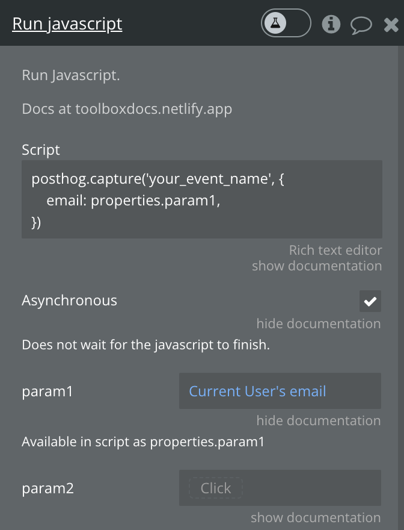
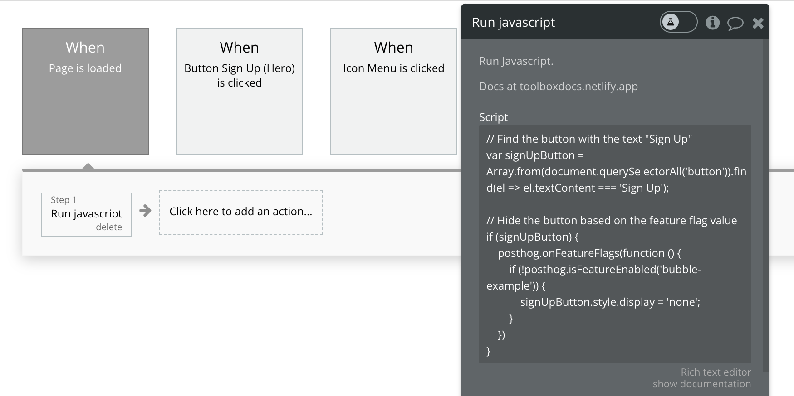

import { ProductScreenshot } from 'components/ProductScreenshot'
import ImgAutocaptureLight from '../images/tutorials/bubble-analytics/autocapture-light.png'
import ImgAutocaptureDark from '../images/tutorials/bubble-analytics/autocapture-dark.png'

[Bubble](https://bubble.io/) is a popular no-code site builder that makes it easy to design a high-quality websites and apps. Combined with tools like [analytics](/product-analytics), [session replays](/session-replay), and [feature flags](/feature-flags), you can build the best site possible.

This tutorial shows you how to set up PostHog on your Bubble site for capturing events, session replays, and implementing feature flags.

## How to add PostHog to your Bubble site

First, [sign up to PostHog](https://us.posthog.com/signup). Then, go to your [project settings](https://us.posthog.com/settings/project) and copy your [web snippet](https://us.posthog.com/settings/project-details#snippet). It looks like this:

```js
<script>
    !function(t,e){var o,n,p,r;e.__SV||(window.posthog=e,e._i=[],e.init=function(i,s,a){function g(t,e){var o=e.split(".");2==o.length&&(t=t[o[0]],e=o[1]),t[e]=function(){t.push([e].concat(Array.prototype.slice.call(arguments,0)))}}(p=t.createElement("script")).type="text/javascript",p.async=!0,p.src=s.api_host+"/static/array.js",(r=t.getElementsByTagName("script")[0]).parentNode.insertBefore(p,r);var u=e;for(void 0!==a?u=e[a]=[]:a="posthog",u.people=u.people||[],u.toString=function(t){var e="posthog";return"posthog"!==a&&(e+="."+a),t||(e+=" (stub)"),e},u.people.toString=function(){return u.toString(1)+".people (stub)"},o="capture identify alias people.set people.set_once set_config register register_once unregister opt_out_capturing has_opted_out_capturing opt_in_capturing reset isFeatureEnabled onFeatureFlags getFeatureFlag getFeatureFlagPayload reloadFeatureFlags group updateEarlyAccessFeatureEnrollment getEarlyAccessFeatures getActiveMatchingSurveys getSurveys onSessionId".split(" "),n=0;n<o.length;n++)g(u,o[n]);e._i.push([i,s,a])},e.__SV=1)}(document,window.posthog||[]);
    posthog.init('<ph_project_api_key>',{api_host:'<ph_instance_address>'})
</script>
```

With the snippet copied, go to your Bubble site settings by clicking on the icon in the left-hand menu. If you haven’t already, sign up for at least the **Starter** site plan. This enables you to add custom code.

Go to the **SEO / metatags** tab in site settings. Paste your PostHog snippet in the **Script/meta tags in header** section. Then, deploy your site to live.


PostHog will now begin [automatically capturing](/docs/product-analytics/autocapture) events like pageviews, button clicks, and form inputs on your site.

<ProductScreenshot
  imageLight={ImgAutocaptureLight} 
  imageDark={ImgAutocaptureDark} 
  alt="Autocapture events captured by PostHog in PostHog" 
  classes="rounded"
/>

## How to capture custom events

To capture custom events, we create a [Bubble action](https://manual.bubble.io/help-guides/logic/workflows/actions) to run JavaScript code. 

To do so, you first need to install the [Toolbox plugin](https://bubble.io/plugin/toolbox-1488796042609x768734193128308700). Once installed, create a new action by going to the [Workflow tab](https://manual.bubble.io/help-guides/getting-started/navigating-the-bubble-editor/tabs-and-sections/workflow-tab) in Bubble and selecting an event. Then click on **add an action**.

In the menu that appears, click on **Plugins** and then **Run javascript**. This will open a new menu where you can add custom JavaScript code.


To capture PostHog events, add the following code under the **Script** heading:

```js
window.posthog.capture("your_event_name")
```

Optionally, you can also include additional information in the event by including parameters as properties:

```js
posthog.capture('your_event_name', {
    email: properties.param1,
})
```

where `param1` is set in the "Run javascript" menu:



Finally, deploy your changes to live to begin capturing your custom event.

## How to enable session replays

[Session replays](/docs/session-replay) enable you to record and playback user interactions on your site. 

To enable it, go the [Session replay tab](https://us.posthog.com/replay) in PostHog. Then, click on the **Configure** button in the top right and toggle on **Record user sessions** in the menu that opens up. 

Once enabled, user sessions will begin to appear in the [Recent recordings tab](https://us.posthog.com/replay/recent).


## Customizing components with feature flags

[Feature flags](/docs/feature-flags) are useful for conditionally showing (or hiding) components based on a rollout percentage and properties. For example, you can use a flag to show or hide a button.

To do this, go to the [feature flags tab](https://us.posthog.com/feature_flags) in PostHog. Click **New feature flag**, enter a key name (for example, `show-signup-button`), fill out the details, set release conditions to roll out to 100% of users, and click **Save**.

Then go back to Bubble. Create a new **Page is loaded** event with an action to run custom JavaScript code (like we did for [capturing custom events](#how-to-capture-custom-events)). Use the following code to hide the button based on the value of the feature flag:

```js
// Find the button with the text "Sign Up"
var signUpButton = Array.from(document.querySelectorAll('button')).find(el => el.textContent === 'Sign Up');

// Hide the button based on the feature flag value
if (signUpButton) {
    posthog.onFeatureFlags(function () {
        if (posthog.isFeatureEnabled('show-signup-button')) {
            signUpButton.style.display = 'none';
        }
    })
}
```

When we save this and publish the site again, the button is still there. When we go back to PostHog and disable the `show-signup-button` flag, the button disappears.



## Further reading

- [How to create surveys in Bubble with PostHog](/tutorials/bubble-surveys)
- [How to analyze first and last touch attribution](/tutorials/first-last-touch-attribution)
