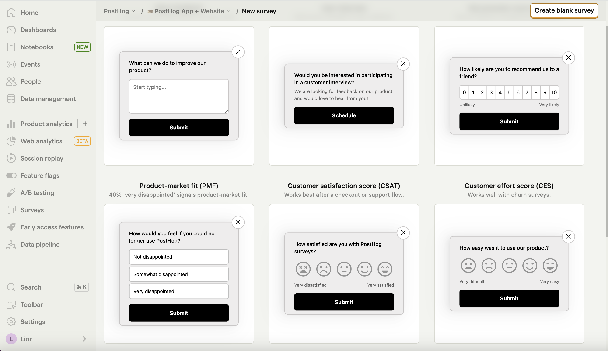
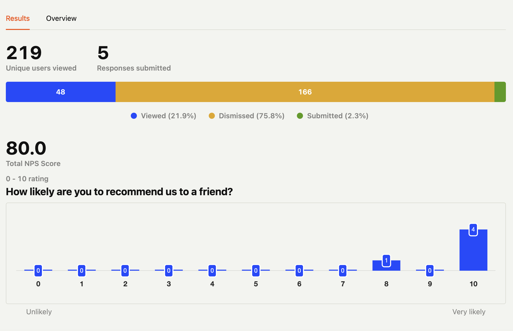

Surveys are a great way to collect feedback from your users. This tutorial shows you how to create surveys for your [Bubble](https://bubble.io/) marketing site using PostHog.

## 1. Add PostHog to your Bubble site

First, [sign up to PostHog](https://app.posthog.com/signup). Then, go to your [project settings](https://app.posthog.com/settings/project) and copy your [web snippet](https://app.posthog.com/settings/project-details#snippet). It looks like this:

```js
<script>
    !function(t,e){var o,n,p,r;e.__SV||(window.posthog=e,e._i=[],e.init=function(i,s,a){function g(t,e){var o=e.split(".");2==o.length&&(t=t[o[0]],e=o[1]),t[e]=function(){t.push([e].concat(Array.prototype.slice.call(arguments,0)))}}(p=t.createElement("script")).type="text/javascript",p.async=!0,p.src=s.api_host+"/static/array.js",(r=t.getElementsByTagName("script")[0]).parentNode.insertBefore(p,r);var u=e;for(void 0!==a?u=e[a]=[]:a="posthog",u.people=u.people||[],u.toString=function(t){var e="posthog";return"posthog"!==a&&(e+="."+a),t||(e+=" (stub)"),e},u.people.toString=function(){return u.toString(1)+".people (stub)"},o="capture identify alias people.set people.set_once set_config register register_once unregister opt_out_capturing has_opted_out_capturing opt_in_capturing reset isFeatureEnabled onFeatureFlags getFeatureFlag getFeatureFlagPayload reloadFeatureFlags group updateEarlyAccessFeatureEnrollment getEarlyAccessFeatures getActiveMatchingSurveys getSurveys onSessionId".split(" "),n=0;n<o.length;n++)g(u,o[n]);e._i.push([i,s,a])},e.__SV=1)}(document,window.posthog||[]);
    posthog.init('<ph_api_key>',{api_host:'<ph_instance_address>'})
</script>
```

With the snippet copied, go to your Bubble site settings by clicking on the icon in the left-hand menu. If you haven’t already, sign up for at least the "Starter" site plan. This enables you to add custom code.

Go to the **SEO / metatags** tab in site settings. Paste your PostHog snippet in the **Script/meta tags in header** section. Then, deploy your site to live.


## 2. Create and launch your survey

Create a survey in PostHog by going to the [surveys tab](https://app.posthog.com/surveys) and clicking "New survey." There are a variety of [survey types](/docs/surveys/creating-surveys#question-type) to choose from, or you can create your own by clicking "Create blank survey".



Next, customize your survey as needed. You can customize the questions, branding, and targeting. See our [survey docs](/docs/surveys/creating-surveys) for more details on how to do so.

Then, click "Save as draft" and then "Launch". Your survey is now live and you should see it on your website! 

## 3. View results

After interacting with your survey, you can view results by selecting the survey from the [surveys tab](https://app.posthog.com/surveys). You'll see data on:

- How many users have seen the survey.
- How many users have dismissed the survey.
- Responses.

You can also filter these results based on [user properties](/docs/product-analytics/user-properties), [cohorts](/docs/data/cohorts), [feature flags](/docs/feature-flags/creating-feature-flags) and more.



## Further reading

- [How to analyze surveys with ChatGPT](/tutorials/analyze-surveys-with-chatgpt)