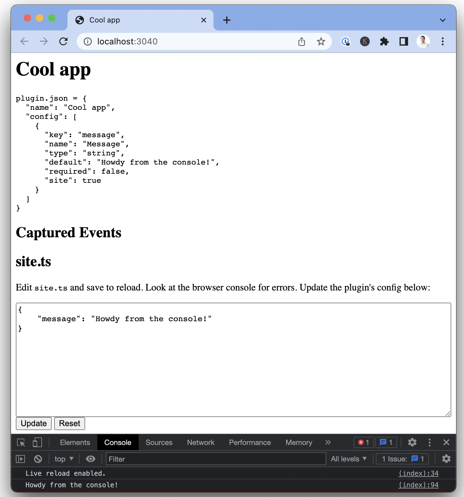
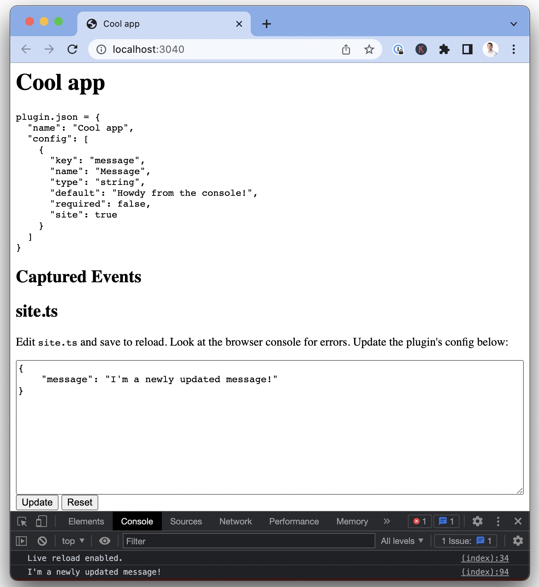
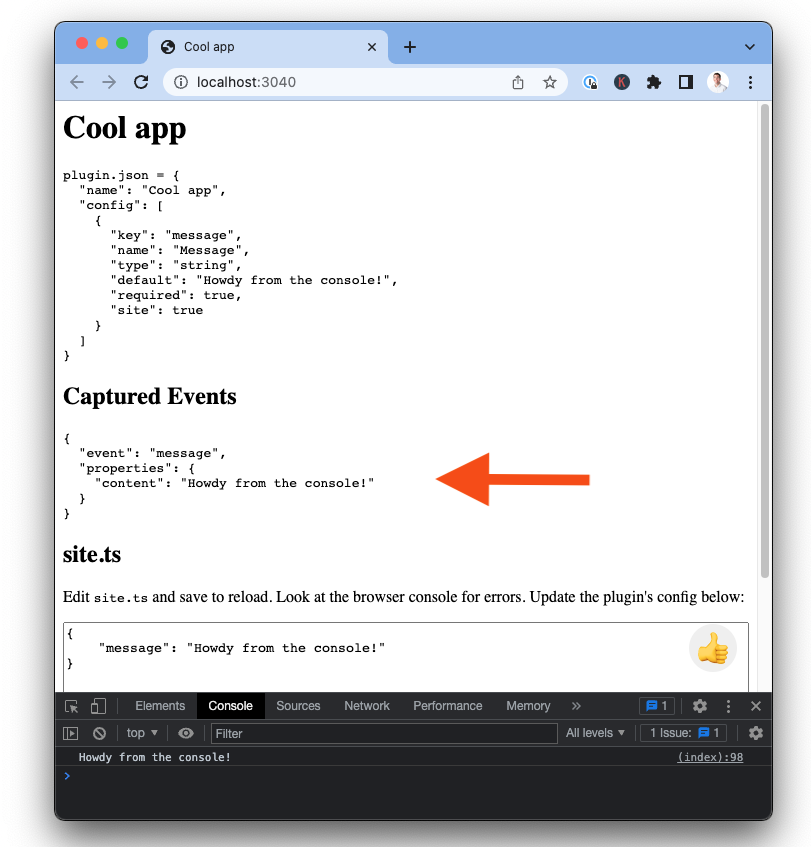
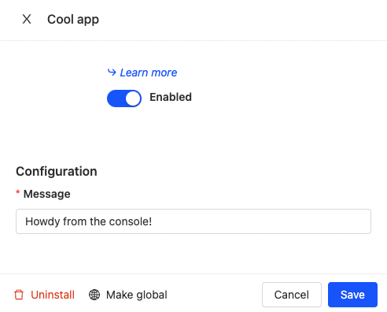
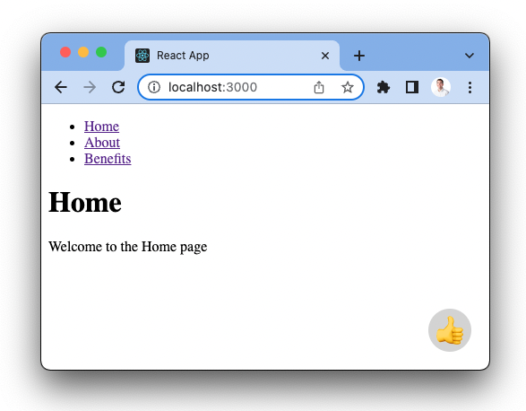

Site apps make it quick and easy to add features such as forms and banners to your site through our JavaScript library. This enables you to do things like capture feedback, add notifications, provide support, and more. These apps can then capture data for analysis in PostHog. You can learn 

In this tutorial, we’ll teach you how to build a site app. If you're looking for a broader overview of apps, you can find it [in our docs](/docs/apps). Our app will show up on our product site as button users can click to send us a customizable message captured as a PostHog event. To complete this tutorial, you only need [Node installed](https://nodejs.org/en/download/) to build and run the app.

> PostHog Cloud users cannot currently add custom or third-party apps for security reasons. Have an app you want to add to PostHog? [Let us know](/questions)!

## Basic setup

First, create a folder and add two files that make up our app: `site.ts` and `plugin.json`.

```bash
mkdir cool_app
cd cool_app
touch site.ts
touch plugin.json
```

In `site.ts`, add some basic code that logs a variable from our config file (`plugin.json`).

```js
// site.ts
export function inject({ config, posthog }) {
  console.log(config.message)
}
```

In `plugin.json`, add details about the app and that message variable.

```js
{
  "name": "Cool app",
  "config": [
    {
      "key": "message",
      "name": "Message",
      "type": "string",
      "default": "Howdy from the console!",
      "required": true,
      "site": true
    }
  ]
}
```

Once you've done that, in the same folder, run this command to start the app locally:

```bash
npx @posthog/app-dev-server
```

After running this, open `localhost:3040` to see the app in debug mode. When we open up our console, we’ll see our configured message.



We can update the config file on the page to get a new message. In our case, we changed `“Howdy from the console!”` to `“I’m a newly updated message!”`.



This is the basics of what we need to set up and we can start adding more functionality, starting with showing a button on the page for users to click.

## Showing an HTML button component

Right now, our app doesn’t do much. We want it to be useful and help us get feedback from our users. To do this, we’ll add a button users click to tell us we are doing a good job. We’ll also set up PostHog to capture an event when they do this. To start making this a reality, we’ll need to create the component with HTML, CSS, and TypeScript.

In the `site.ts` file, add a `style` constant that stores the CSS styling for our app such as classes, position, alignment, and color.

Next, write a function `createShadow` to inject a shadow DOM (document object model). Using the shadow DOM enables the app to add new content, style, and functionality to the page without affecting the existing code. It does this by creating a separate, hidden DOM tree and attaching it to the existing DOM. Check out the docs on [using a shadow DOM](https://developer.mozilla.org/en-US/docs/Web/Web_Components/Using_shadow_DOM) for more information.

Finally, write the logic for our `inject` function to create the button, add it to the shadow DOM, and have it trigger our `console.log` message set in the config. Putting these three together gives us something like this:

```js
// site.ts

const style = `
  .button {
    position: fixed;
    bottom: 20px;
    right: 20px;
    color: black;
    font-weight: normal;
    font-family: -apple-system, BlinkMacSystemFont, "Inter", "Segoe UI", "Roboto", Helvetica, Arial, sans-serif, "Apple Color Emoji", "Segoe UI Emoji", "Segoe UI Symbol";
    text-align: left;
    width: 48px;
    height: 48px;
    border-radius: 100%;
    text-align: center;
    line-height: 40px;
    font-size: 32px;
    border: none;
    cursor: pointer;
    z-index: 999999;
  }
`

export function inject({ config, posthog }) {

  const shadow = createShadow(style)
  let buttonElement: HTMLButtonElement

  function sendMessage(): void {
    console.log(config.message)
  }

  buttonElement = Object.assign(document.createElement('button'), {
    className: 'button',
    innerText: '👍',
    onclick: sendMessage,
  })
  shadow.appendChild(buttonElement)
}

function createShadow(style?: string): ShadowRoot {
  const div = document.createElement('div')
  const shadow = div.attachShadow({ mode: 'open' })
  if (style) {
    const styleElement = Object.assign(document.createElement('style'), {
      innerText: style,
    })
    shadow.appendChild(styleElement)
  }
  document.body.appendChild(div)
  return shadow
}
```

If you set it up correctly, you’ll see a button with a thumbs-up emoji in the bottom right. Clicking on it logs the message you configured to the console again.


## Connecting to PostHog

Next, we’ll want to make sure to connect to PostHog so we record when we’re doing a good job. The `posthog` object is already an argument in our inject function, we just need to call capture. Add a `posthog.capture()` call to our `inject` function in `site.ts`.

```js
export function inject({ config, posthog }) {

  const shadow = createShadow(style)
  let buttonElement: HTMLButtonElement

  function sendMessage(): void {
    console.log(config.message)
    posthog.capture('message', { content: config.message }) // new
  }

  buttonElement = Object.assign(document.createElement('button'), {
    className: 'button',
    innerText: '👍',
    onclick: sendMessage,
  })
  shadow.appendChild(buttonElement)
}
```

Once added, we can test if it's working by clicking the button on our `localhost` page. We’ll see the event show up under “Captured Events.”



You now have a basic app to get feedback from users. From here, you can take the component where you like. You can provide more information, encourage different actions, or add more complex components. We built a few apps that can serve as inspiration:

- [Feedback app](https://github.com/PostHog/feedback-app), a form for gathering feedback from your users
- [Notification bar](https://github.com/PostHog/notification-bar-app), a customizable notification bar for your site
- [Pineapple mode](https://github.com/PostHog/pineapple-mode-app), a button that fills your page with pineapples when clicked

## Adding site apps to your site

Once you’ve created an app, the final step is deploying it to your site. The first step is adding the site app to your PostHog instance. You'll do this from the "Browse Apps" section of PostHog.

If you have a self-hosted instance, you can add your app by pasting its GitHub, GitLab, or npm URL in the advanced tab in “Browse Apps.” If it is private, make sure to include `?private_token=TOKEN` at the end of the URL. 

> **Note:** Adding custom or third-party apps isn’t available for Cloud instances.

If you have a cloud instance, you can search for available apps in “Browse Apps” (feedback, notification bar, and pineapple mode are all available). You can also submit your app by [emailing your GitHub URL to hey@posthog.com](mailto:hey@posthog.com?subject=Submit%20Plugin%20to%20Repository&body=Plugin%20GitHub%20link%3A). Once you’ve done that, we’ll review and potentially add your site app to the app store for everyone to use.

Once added, you can configure your app by searching for it and then clicking on the "Configure" button (blue gear). The configuration menu has all the details from the `plugin.json` file such as instructions or customization. Once configured, click "Save" and enable the app (by clicking the toggle). Our example site app has a simple configuration, but this is customizable and can provide many options.



Once you've done that, the final step is getting the app set up on your site. Go to where you initialize `posthog-js` in your code, and add `opt_in_site_apps: true`. This enable your site apps to inject into your site through the `posthog-js` library. It should look like this:

```js
posthog.init("<ph_project_api_key>", { 
    "api_host": "<ph_instance_address>",
    "opt_in_site_apps": true 
})
```
Now that opt-in is added and the app activated, the thumbs-up button should appear on your site. This is what it looks like on a very basic site:



You now have a basic site app added to your site you can continue to customize and improve for your needs.

## Further reading

- [All the cool things we built at our Rome hackathon](/blog/rome-hackathon): Site apps, pineapple mode, and the feedback app were only some of the cool things we built at our Rome Hackathon. Discover this rest.

- [How to build your own app in PostHog](/tutorials/build-your-own-posthog-app): More interested in modifying, exporting, or adding events on the backend. This tutorial teaches you how to build a backend app that does just that.
