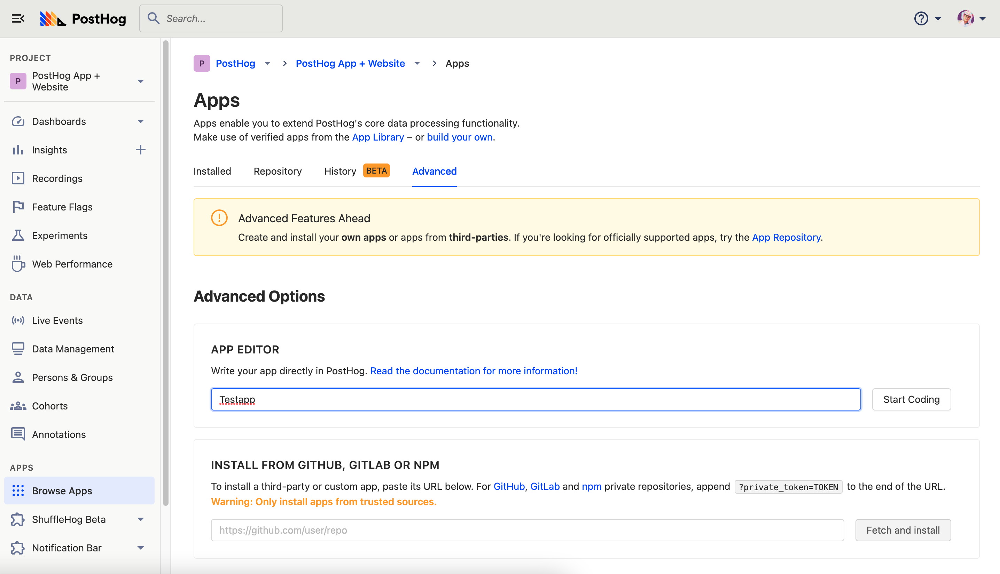
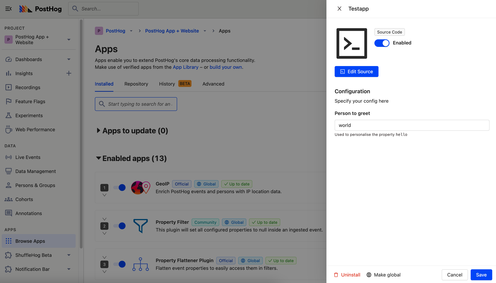
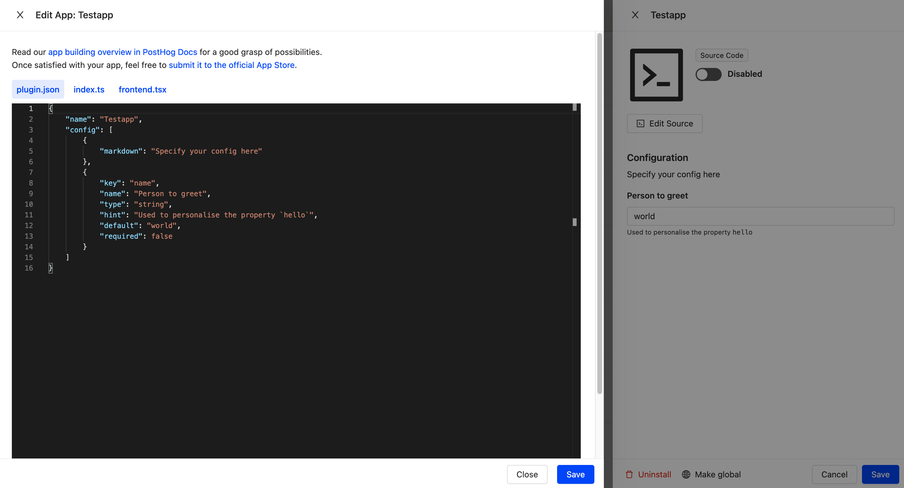
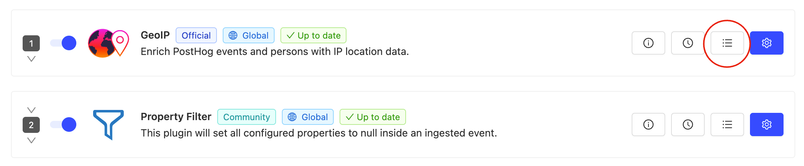
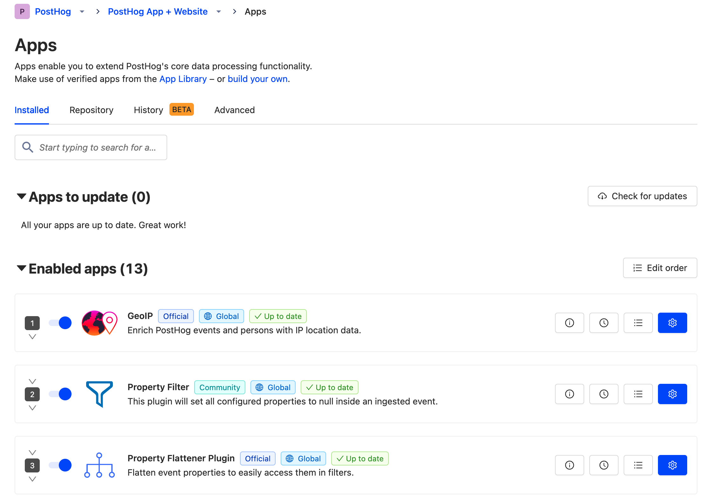

**Estimated reading time:** 10 minutes ☕☕☕

Apps are an incredibly powerful part of the PostHog platform, capable of doing almost anything. Apps can alter events as they are ingested, sync data with other platforms, perform scheduled chores and a lot more besides. Almost anything you may want to do with PostHog, you can do with an app.

Right now, PostHog has a library of more than 50 apps available to all users. These include apps which integrate PostHog with platforms such as [Salesforce](/apps/salesforce-connector), [BigQuery](/apps/bigquery-export), [Hubspot](/apps/hubspot-connector), [Twilio](/apps/twilio), [Zapier](/apps/zapier-connector) and [more](/apps).

Even better, if there isn’t an app available that does what you need then you can build your own! There are several ways to create an app, including [creating a dedicated GitHub repo](/docs/apps/build/tutorial#using-a-github-repository) — but in this tutorial we’ll explore how you can create your own app without ever leaving the PostHog platform. 

To follow along with this tutorial, you’ll need...

- A PostHog instance (self-hosted if you want to upload and test on your own instance)
- Some knowledge of Javascript or Typescript

## Introducing PostHog’s app source editor


PostHog’s source editor is a built-in tool for writing your own apps directly into PostHog. Apps which you create using the source editor are not publicly available — they exist only for your instance and cannot be seen by other organizations. You can submit your apps for others to use (and we strongly encourage it!), but more on that later. 

To access the source editor, log in to your self-hosted PostHog instance and select ‘_Browse apps_’ from the main menu on the left hand side. If you're self-hosted, select the ‘_Advanced_’ tab, name your app in the ‘_App editor_’ field and hit ‘_Start coding_’.

> **Note:** You'll only be able to upload and test your own apps on a self-hosted PostHog instance. If you want to build an app and have a PostHog Cloud instance, click '[_Build your own_](/docs/apps/build)' in the description on the Apps page. You can still publish and use apps with a cloud instance, but apps need to be reviewed by us first before publishing. Read more about the [review process here](/docs/apps/build/tutorial#submitting-your-app).



Once you’ve named the app, it will be created in your available apps and automatically enabled — don’t worry, it can’t do anything yet. You can change that by selecting ‘_Edit source_’. 

## Using the app source editor


By default, new apps contain example code to help you get started. You can overwrite this with your own code, but before you do here’s a quick introduction to [how apps work](/docs/apps/).

There are two files which make up any app in PostHog — `plugin.json` and `index.ts`. 

### Setting your app configuration

```
{
  "name": "<app_display_name>",
  "url": "<repo_url>",
  "description": "<description>",
  "main": "<entry_point>",
  "config": [
    {
      "markdown": "A Markdown block.\n[Use links](http://example.com) and other goodies!"
    },
    {
      "key": "param1",
      "name": "<param1_name>",
      "type": "<param1_type>",
      "default": "<param1_default_value>",
      "hint": "<param1_hint_value>",
      "required": true,
      "secret": true
    },
    {
      "key": "param2",
      "name": "<param2_name>",
      "type": "<param2_type>",
      "default": "<param2_default_value>",
      "required": false,
    }
  ]
}
```

`plugin.json` is used to control the configuration of your app, as well as other elements you can see when setting up your app from the PostHog app library. All apps are structured using the format above, but by default all apps created in the source editor will use dummy code from a basic ‘Hello World’ app. 

Here’s a quick introduction to the available fields in `plugin.json`:

|   Key    |                    Type                    |                                                                           Description                                                                           |
| :------ | :---------------------------------------- | :------------------------------------------------------------------------------------------------------------------------------------------------------------- |
|   type   | `"string"` or `"attachment"` or `"choice"` | Determines the type of the field - "attachment" asks the user for an upload, and "choice" requires the config object to have a `choices` array, explained below |
|   key    |                  `string`                  |                                     The key of the app config field, used to reference the value from inside the app                                      |
|   name   |                  `string`                  |                                          Displayable name of the field - appears on the app setup in the PostHog UI                                          |
| default  |                  `string`                  |                                                                   Default value of the field                                                                    |
|   hint   |                  `string`                  |                                             More information about the field, displayed under the in the PostHog UI                                             |
| markdown |                  `string`                  |                                                             Markdown to be displayed with the field                                                             |
|  order   |                  `number`                  |                                                                           Deprecated                                                                            |
| required |                 `boolean`                  |                                               Specifies if the user needs to provide a value for the field or not                                               |
|  secret  |                 `boolean`                  |                     Secret values are write-only and never shown to the user again - useful for apps that ask for API Keys, for example                      |
| choices  |                  `string[]`                   |                           Only accepted on configs with `type` equal to `"choice"` - an array of choices (of type `string`) to be presented to the user                            |

> Want further detail on how to setup `plugin.json`? Check [the Apps developer reference docs](/docs/apps/build/reference).

### Creating your app

Beyond the configuration, all the hard work your app will do is controlled by the second file — `index.ts`. This file also handles any special functions, which are detailed in [the developer reference documentation](/docs/apps/build/reference).

However, one crucial function to be aware of is `processEvent`, which enables you to take an event and either modify, redirect or discard it based on a returned result. 

Here’s an example of `processEvent` being used to complete the Hello World app which the default `plugin.json` configuration mentions: 

```
async function processEvent(event, { config, cache }) {
    const counter = await cache.get('counter', 0)
    cache.set('counter', counter + 1)

    if (event.properties) {
        event.properties['hello'] = 'world'
        event.properties['bar'] = config.bar
        event.properties['$counter'] = counter
    }

    return event
}
```
In this example, the `processEvent` function receives the event before it is ingested by PostHog, adds some properties and then proceeds with standard ingestion. 

## Testing your app

Testing your new app on your self-hosted PostHog instance is as simple as hitting ‘_Save_’, ensuring your app is enabled, then checking for the desired result.

To get detailed information on how your app is working, it’s useful to look at the logs in the Javascript console — you can access this for each app individually by pressing the logs button in the app UI. You can see it highlighted in the image below. 



If you aren’t seeing the expected result it may be because you need to edit the order in which apps are run. This is because apps on PostHog run in a specific order, with the output of one going into the next — forming [an app chain](/docs/apps/build#example-of-an-app-chain). 



App chains can be used for specific purposes, such as [filtering unwanted information from an event before it is stored](/tutorials/property-filter), and by default any new apps created with the source editor are added to the _end_ of a chain. If you need to reorder your app chain to get the desired result then simply select ‘_Edit order_’ from the ‘_Installed_’ apps tab and drag enabled apps into the order you need and hit ‘_Save_’.

## Submitting new apps to PostHog

While it’s totally optional, we greatly appreciate everyone who contributes to PostHog by submitting their apps for inclusion in [our public app library](/apps) so that other users can benefit from them. 

To submit apps made with the source editor, you’ll need to move them onto a public GitHub repo. We’ve made an app starter kit to simplify this process:

- Create a new GitHub repo using [this template](https://github.com/PostHog/posthog-plugin-starter-kit/generate)
- Copy the contents of `index.js` in the source editor into the new `index.js` file within the repo
- Copy the contents of `plugin.json` in the source editor into the new `plugin.json` file within the repo

Finally, however you create your app, [let us know that it's ready for review](https://app.posthog.com/home#supportModal=support%3Aapps), what it does, and how you would like to be credited. Once we receive your message we’ll review the app for security and performance reasons, then make it available to all PostHog users.

### Further reading

Want to know more about building your own apps? Join [the PostHog community](/questions), where thousands of developers share ideas and app-building advice. 

Alternatively, check out the following tutorials for more information in the mean time…

[How to connect Patterns and PostHog](/tutorials/how-to-connect-patterns-and-posthog)
[How to protect user privacy with the Property Filter app](/tutorials/property-filter)
[How to correlate errors with product performance using Sentry](/tutorials/sentry-plugin-tutorial)
