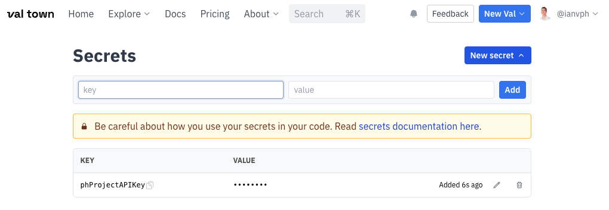
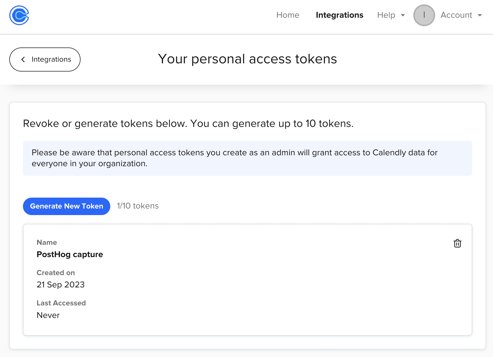
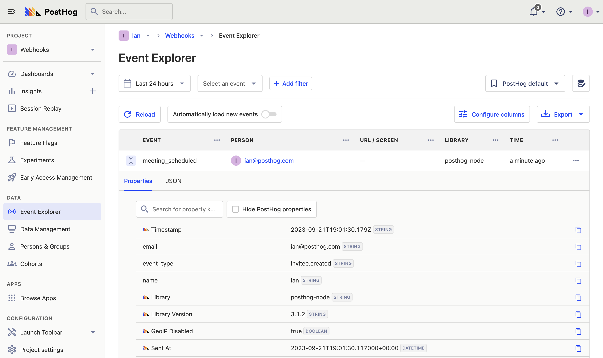

Webhooks enable you to send data from one platform to another when an event happens. This enables you to run workflows and code to handle those events.

To showcase the power of webhooks, we are going to capture [Calendly](https://calendly.com/) meeting data into PostHog using [Val Town](https://www.val.town/), a platform for writing and running JavaScript functions in your browser. 

> **Note:** Calendly webhooks requires subscribing their professional plan.

## Set up your Val Town webhook handler

Before we set anything up in Calendly, we set up our webhook handler function in Val Town. This function receives a request from Calendly, parses the JSON, gets the data we want, and then captures an event into PostHog.

To get started, we'll create a secret in Val Town with your PostHog API key. 

You can get your project API key from your [project settings](https://app.posthog.com/project/settings). Next, go to the [secrets page in Val Town](https://www.val.town/settings/secrets), set the key as phProjectAPIKey, the value as your API key from PostHog, and click "Add." This saves the value for us to  reference as `@me.secrets.phProjectAPIKey` later.



Next, we create our function to capture a Calendly webhook. In it, we parse the JSON and modify the data then call the `capturePostHogEvent` function which looks like this:

<iframe src="https://www.val.town/embed/ianvph.capturePostHogEvent" height="573" frameBorder="0" allowFullScreen></iframe>

Altogether, the webhook handler function looks like this:

<iframe src="https://www.val.town/embed/ianvph.captureCalendlyWebhook" height="635" frameBorder="0" allowFullScreen></iframe>

> **Note:** You can use this function by forking it and customizing it to your needs. 

Once, done click "Save," set as unlisted, click the three dots, hover the "endpoints" options, and click "copy web endpoint." This is the URL we use for our Calendly webhook trigger. It is in the format `https://{username}-{valname}.web.val.run`.

## Setting up your Calendly webhook

Once you upgrade your Calendly account to "Professional," you can create a webhook using their API. 

To start, you need a personal access token which you can create on the [API webhooks integration page](https://calendly.com/integrations/api_webhooks). 



Next, use your access token to get your organization (`current_organization` key) and user (`uri` key) values. They are URLs starting with `https://api.calendly.com/`. You can do this on [their API page](https://developer.calendly.com/api-docs/005832c83aeae-get-current-user) or in a cURL request like this:

```bash
curl --request GET \
  --url https://api.calendly.com/users/me \
  --header 'Authorization: Bearer {your access token here}' \
  --header 'Content-Type: application/json'
```

With these values, we can make another API request with our Val Town web URL, organization, and user values to create a webhook subscription. Again, you can do this on [their API page](https://developer.calendly.com/api-docs/c1ddc06ce1f1b-create-webhook-subscription) or in a cURL request like this:

```bash
curl --request POST \
  --url https://api.calendly.com/webhook_subscriptions \
  --header 'Authorization: Bearer {your access token here}' \
  --header 'Content-Type: application/json' \
  --data '{
  "url": "https://{username}-{valname}.web.val.run",
  "events": [
    "invitee.created",
    "invitee.canceled"
  ],
  "organization": "https://api.calendly.com/organizations/{current_organization}",
  "user": "https://api.calendly.com/users/{uri}",
  "scope": "user"
}'
```

Once done, create a test event using your booking URL. You should see it trigger your webhook handler in Val Town and then create an event in your PostHog account.



Now, every time someone creates (or cancels) a meeting using Calendly, you capture an event with details for your PostHog instance. You can use this event in your insights like signup funnels. You can also use a similar setup for other webhooks you want to capture into PostHog.

## Further reading

- [How to capture new RSS items in PostHog (releases, blogs, status)](/tutorials/rss-item-capture)
- [How to use session replays to improve your support experience](/tutorials/session-recordings-for-support)
- [How to build, analyze and optimize conversion funnels in PostHog](/tutorials/guide-to-funnels)