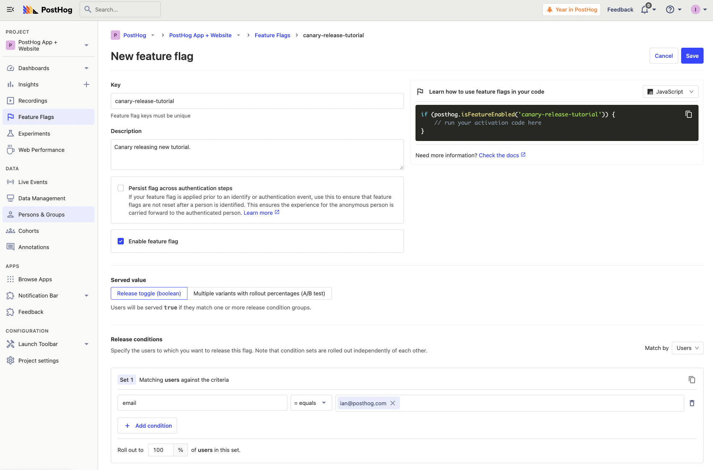
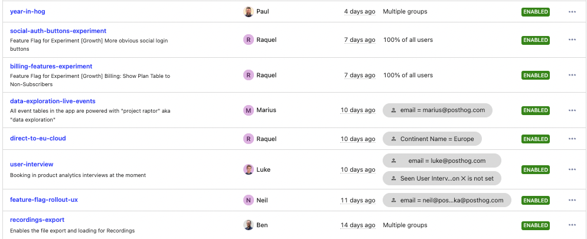
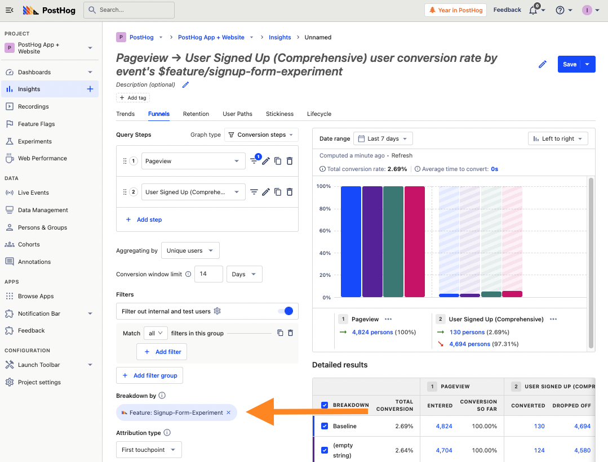

Few things are worse for a developer than shipping a new feature, having it unexpectedly break, and then scrambling to fix it. This can negatively impact your product, user experience, and engineering productivity. To mitigate problems with new features, teams often roll out features gradually to test for issues.

This gradual release is also known as a canary release or deployment. This tutorial covers what it is, and how to set it up and monitor it in PostHog.

## What is a canary release?

A canary release or canary deployment is the process of rolling out a new feature to a subset of users before releasing it to a larger group. Developers check the new feature is working without issues on the limited group. They watch for issues and analyze usage metrics to make sure. Once satisfied with tests and analysis, the feature rolls out to a larger group (or everyone).

The name comes from the phrase “canary in a coal mine” which alludes to miners bringing a canary into mines with them. If there were toxic gases, the canary would die and stop chirping, giving an early warning to the miners to get out before they do the same. Testing on a small group of users acts as a canary for issues with the feature, preventing those issues from affecting a larger group.

## Prerequisites for canary releases

To setup a canary release in PostHog, we use feature flags. Before we do this, we need user identification setup.

Feature flags check the distinct ID of the user to decide if they should return `true` or `false`. This means users need a distinct ID unless the feature flag rolls out to everyone. Our snippet and JavaScript library automatically create anonymous ones, but [identifying users](/docs/integrate/identifying-users) with a distinct ID you set (like email) is a better and more accurate option.

Beyond a distinct ID, users also need groups and properties if you want to use them to trigger a feature flag. For example, to roll out a release to users in a specific organization, you need that user to belong to that organization by connecting them with [`group()` or a group property in an event](https://posthog.com/manual/group-analytics). To release a feature for new users, you must have a user property that helps [filter for new users](/tutorials/new-user-experiments).

## Setting up feature flags

Once you setup PostHog and user identification, you can setup the feature flags for the canary release. Go to “Feature Flags” in your PostHog instance, add a relevant key related to the feature, a description of what you are using the flag for, and a minimal release condition (like only yourself).

Add this flag to your code around the feature you want to canary release. Test that it works for you, and that turning it off works as well. Once this goes well, you can begin the process of your canary release.

## The steps to a canary release

If set up correctly, your initial release condition is only yourself. This lets you test a basic implementation before expanding. Beyond releasing to yourself, here is a recommended step-by-step release with conditions for each:

1. **Just yourself:** set email to equal to your own, like `email equals ian@posthog.com`. Test it yourself to make sure the feature flag works and the feature works as expected.
2. **Internal team:** set email to contain your domain, like `email contains posthog.com` or `email equals <insert multiple team member emails>`. Make sure to communicate with your team about what is being released, so they know to test and look out for issues.
3. **Beta users, organizations:** set email to contain their domain or set organization to equal theirs, like `email contains twitter.com` or `organization_name equals twitter`. Setting expectations and having a communication channel with them (like a shared Slack channel) is critical for hearing about issues.
4. **Expanded beta:** set release to a percentage of users or set it to match a popular property. Monitor insights and sessions related to the feature compared to those without. The overall metrics will be more important here.
5. **Full release:** set release to 100% of users, check metrics again, delete the flag, and announce the feature. 

At PostHog, we do all of these. Our feature flag page contains features at different stages of roll out. For example, when users have specific issues, we might canary release a fix to them before releasing it to others.

## Monitoring a canary release

The key to a canary release is hearing from the “canary.” Getting feedback and hearing issues is critical to the process whether it is from your team, a limited group of external users, or everyone. Setting clear expectations and having channels for communication enables the canary release to work. Without them, issues go unreported and cause problems for more users than needed.

On top of hearing about issues from users, you can see issues in PostHog. This may look like key metrics or events decreasing, or the number of errors increasing. The benefit of having all your product data in one place is that all your data about your canary release is in one place too.

You can filter your insights by a feature flag to see how the release is progressing. For example, if you are running an experiment on a signup page, it is useful to know if it is improving signup conversion. You can set up a funnel for the conversion, then breakdown by the feature flag name.

You can also get session recordings related to feature flags. On the session recording list, filter for sessions including your feature flag. Once you choose a recording, you can filter it for specific events or actions. This enables you to get a better idea of the details of how users are interacting with your new feature.

> **Tip:** You can go from funnels to session recordings by clicking the completed or dropped off value in the visualization. This will give you a list of users with session recordings related to that funnel and release.

Canary releases ensures higher quality features get shipped leading to a better overall user experience. Structure and monitoring are critical for them to work properly. PostHog’s feature flags, analytics, and session recordings provide all the tools to help this happen.

## Further reading

- [How to run Experiments without feature flags](/tutorials/experiments)
- [How to safely roll out new features](/tutorials/feature-flags)
- [Setting up Django analytics, feature flags, and more with PostHog](/tutorials/django-analytics)