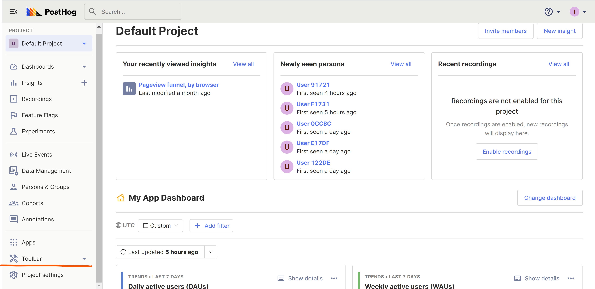
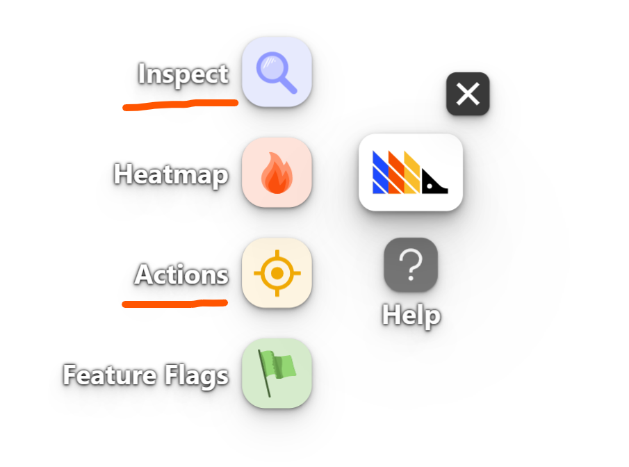
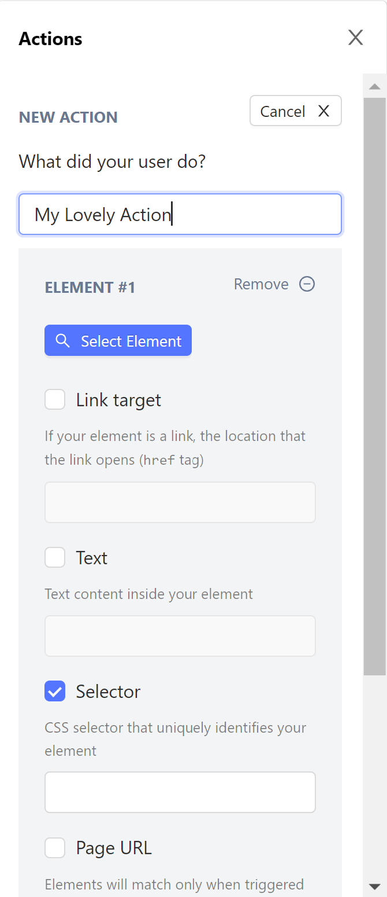
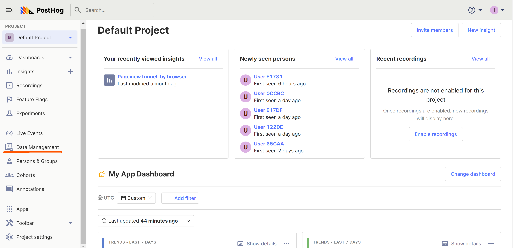
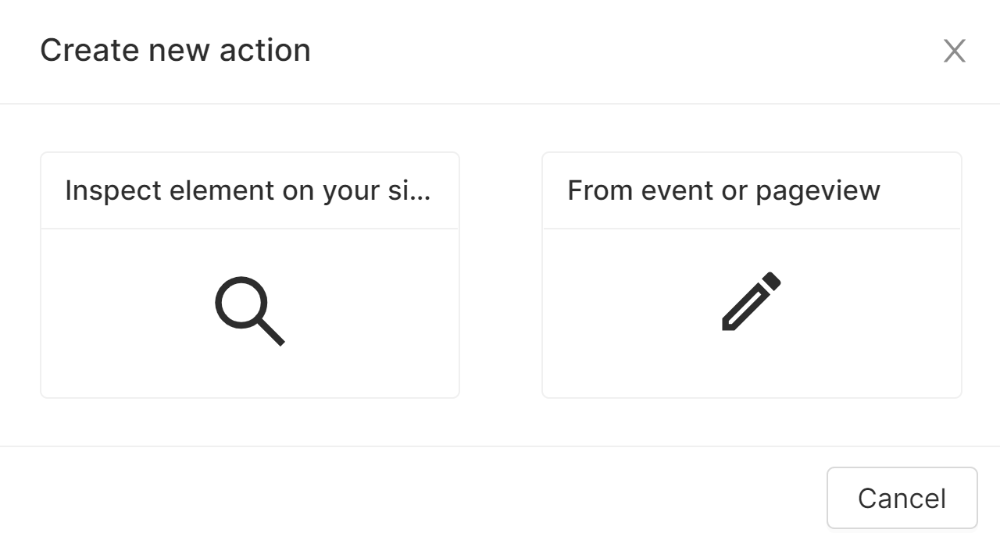
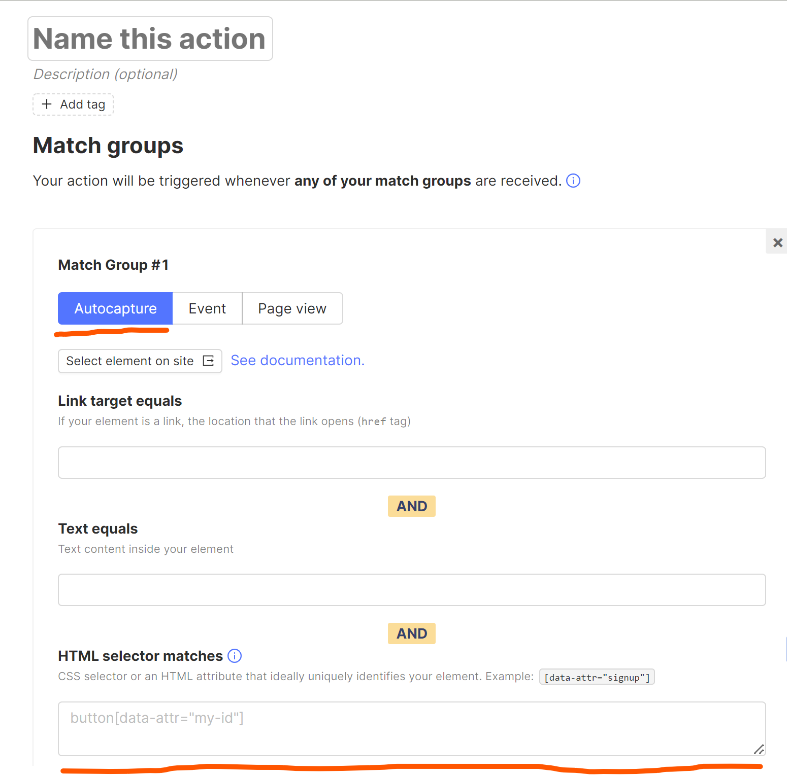

_Estimated reading time: 7 minutes_ ☕

PostHog supports different methods for creating [actions](/docs/user-guides/actions): autocapturing, using the [toolbar](/docs/user-guides/toolbar) and via CSS selectors. 

As the name suggests, [autocapturing is the easiest option](/blog/is-autocapture-still-bad), because users don't have to do anything - actions are identified and captured automatically. While this is really nice, the amount of events generated this way can sometimes be overwhelming for a targeted analysis.

The toolbar, on the other hand, enables you to visually select a specific UI element right on your website which will later be attributed as an action. Under the hood the toolbar generates a CSS selector matching the UI element. The toolbar is quite clever, but sometimes automatically generated selectors can be too broad or, on the contrary, too narrow. In these instances, you can create a selector manually.

But first of all, what exactly is a CSS selector?

## Understanding CSS selectors

[CSS Selectors](https://developer.mozilla.org/en-US/docs/Web/CSS/CSS_Selectors) is a set of user-defined rules which enable you to select specific elements on a web page. For instance, the next snippet will match all `span` elements with a class `yellow` right inside a `div` element:

```css
    div > span.yellow
```

The syntax of CSS selectors is quite powerful, but (for now) PostHog supports a basic selector functionality. Let's go through it in detail.

### Type selectors

Type selectors match all elements with a given HTML tag name.

*Example:* a `button` selector will match any `<button>` element.

### Class selectors

Class selectors match all elements with a given class name. A selector will also match if an element has other classes besides a given one.

*Example:* `.comment` selector will match all elements with `class="comment"`.

### ID selectors

ID selectors match an element with a given ID. Element ID should be unique across a page.

*Example:* `#header` selector will match an element with `id="header"`.

### Attribute selectors

Attribute selectors match all elements with a given attribute. Attributes are basically parameters of HTML elements. For instance, `type` and `name` are attributes in the following snippet:

```html
    <input
        type='text'
        name='text-input'
    />
```

Attribute selectors in PostHog can match both the presence of an attribute on the element and its value. As of now PostHog does not support other attribute operators, such as not equal `~=` or partial match `^=`.

> It's also worth noting that attribute selectors match all HTML tags with a given attribute, regardless of the type of the tag. 

*Example*: `[type]` selector will match all elements with the `type` attribute, both empty and with a value. `[type='text']` selector will match only elements with `type='text'`, like a code snippet above.

### Combinators

Combinators enable you to chain different selectors together.

|Combinator Name|Syntax|Example|
|---------------|------|-----|
|Descendant combinator|`A B`|`div span` combinator will match `<span>` inside `<div>`|
|Child combinator|`A > B`|`div > span` combinator will match `<span>` which is a direct child of `<div>`|
|Sibling combinator|`A ~ B`|`div ~ span` combinator will match `<span>` following `<div>`, immediately or not|
|Adjacent sibling combinator|`A + B`|`div + span` combinator will match `<span>` immediately following `<div>`|

**Selectors for pseudo-classes and pseudo-elements**
These selectors are especially useful for matching different UI states. The `:` selector allows you to match pseudo-classes like `:hover`, `:visited` and others. The `::` selector matches pseudo-elements like `::before`, `::first-line` and others.

*Example*: The `button:hover` selector will match all buttons in a hovered state.

## Data attributes

[Data attributes](https://developer.mozilla.org/en-US/docs/Learn/HTML/Howto/Use_data_attributes) are a type of HTML tag attribute which are especially useful for defining actions in PostHog. Using them you can easily 'put' different events into one bucket. Data attributes are any attributes following the name convention `data-*`, where `*` can be anything. 

> A good thing about data attributes is that they can be set on any HTML tag.

Let's take a look at an example:

```html
   <button
    type="submit"
    data-action="newsletter__subscribe"
    >
       Subscribe
   </button>
```
Here we defined the data attribute `data-action` with a value `newsletter__subscribe`. As you see, we are in a full control of these attributes, meaning we can manage how narrow or wide our selectors will be. 

Then in PostHog we can accurately group all events around newsletter subscription with a simple CSS selector:

```css
   [data-action='newsletter__subscribe']
```

If you want to select only buttons, then you can do the following:

```css
   button[data-action='newsletter__subscribe']
```

Data attributes are very flexible, enabling you to group together different events which otherwise would be really difficult to group. But, as with any powerful tool, you need to spend some time to understanding the best way to use it.

## When to use CSS selectors
The quickest way to create new actions in PostHog is by using the toolbar, as the toolbar will automatically create a CSS selector for you. If you realize the generated selector is too wide/narrow for your use case, then it's time to apply your CSS selectors knowledge.

In general, CSS selectors are well-suited for situations such as...

- Buttons with similar meaning but different style / location (e.g you can select them with `button[type="submit"]`)
- Products from different categories (you can represent categories via data attributes)
- Different HTML tags which you want to combine into one action (again using data attributes)
- UI states represented with pseudo-classes like `:hover`, `:visited` and others
- Targeting one specific element by id (e.g anchors)

> As a rule of thumb, it is probably a **bad idea** to use complex CSS selectors with class names and combinators. Layouts tend to change and class names can be unreliable (especially if you use Tailwind CSS). So,if you are considering using CSS selectors, **data attributes** are probably the best option to control specificity.

## Configuring CSS selectors
There are two ways to do it - through the Toolbar and Data Management section.

### The toolbar
Go to your PostHog instance and select `Toolbar` in the bottom of the sidebar.



Then, press the `Open with Toolbar` button, which will take you to your website. You can read more about working with the toolbar [here](/manual/toolbar).

After your website is open, you should see a PostHog logo 🦔 floating around. Press it. You will see a toolbar like the picture below.

.

The best option to start creating actions with CSS selectors is to use the `Inspect` option in the toolbar and then click on some element on the page. You should see the menu with a `Create a new action` button in the bottom. Press it and you will see the `Actions` menu with automatically generated CSS selector in the `Selector` section. Feel free to start from there and change it!

Alternatively, you can go to the `Actions` option in the toolbar, select `New action` and then press `Select Element`. You should get the `Actions` menu:

.

Tick the `Selector` checkbox and you are ready to create CSS selectors!

### Data management
Another way to create CSS selectors is to go to the [Data Managemen](/docs/user-guides/data-management) section, which is located in the sidebar of your PostHog instance.

.

On the `Data Management` page, select the `Actions` tab. Then press the `New Action` button. You should see the menu like this:

.

Now you can select the `Inspect element` option, but it will eventually bring you back to the `Toolbar` which we covered earlier. So, instead we will select `From event or pageview` option.

Finaly you should see a new page with a `Match Group` menu open. Choose the `Autocapture` option.

.

Scroll down a bit and you will find the `HTML selector matches` section. Here you can define your CSS selectors.

It's worth noting that using `Match groups` it is possible to use CSS selectors alongside other filters, like `Text equals` and `Link target equals`. Moreover, you can even define several `Match groups` for a one action.
