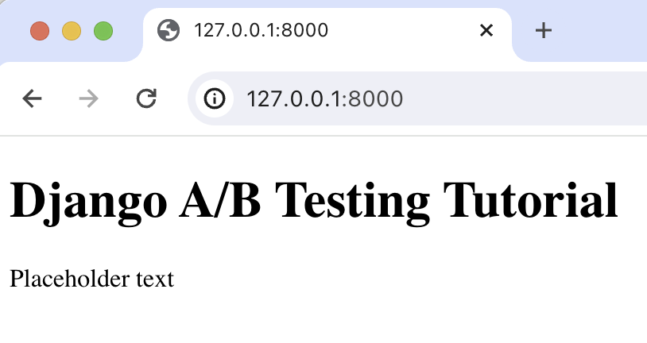

import { ProductScreenshot } from 'components/ProductScreenshot'
export const EventsInPostHogLight = "https://res.cloudinary.com/dmukukwp6/image/upload/posthog.com/contents/images/tutorials/django-ab-tests/events-light.png"
export const EventsInPostHogDark = "https://res.cloudinary.com/dmukukwp6/image/upload/posthog.com/contents/images/tutorials/django-ab-tests/events-dark.png"
export const TestSetupLight = "https://res.cloudinary.com/dmukukwp6/image/upload/posthog.com/contents/images/tutorials/django-ab-tests/experiment-setup-light.png"
export const TestSetupDark = "https://res.cloudinary.com/dmukukwp6/image/upload/posthog.com/contents/images/tutorials/django-ab-tests/experiment-setup-dark.png"
export const ResultsLight = "https://res.cloudinary.com/dmukukwp6/image/upload/posthog.com/contents/images/tutorials/django-ab-tests/results-light.png"
export const ResultsDark = "https://res.cloudinary.com/dmukukwp6/image/upload/posthog.com/contents/images/tutorials/django-ab-tests/results-dark.png"

A/B tests help you improve your Django app by enabling you to compare the impact of changes on key metrics. To show you how to set one up, we create a basic Django app, add PostHog, create an A/B test, and implement the code for it.

## 1. Create a basic Django app

First, ensure [Python 3](https://www.python.org/) and [Django](https://docs.djangoproject.com/en/5.0/topics/install/) are installed. Then, create a new Django project called `django_ab_tests` with a basic app:

```bash
django-admin startproject django_ab_tests
cd django_ab_tests
python3 manage.py startapp basic_app
```

Next, we create a simple view with a heading and paragraph. Replace the code in `basic_app/views.py` with the following:

```python file=basic_app/views.py
from django.http import HttpResponse

def home(request):
    paragraphText = 'Placeholder text'
    
    return HttpResponse(f"""
    <!DOCTYPE html>
   <html>
      <body>
        <h1>Django A/B Testing Tutorial</h1>
        <p>{paragraphText}</p>
      </body>
    </html>
    """)
```

Then, map a URL to your view by adding a path to `urlpatterns` in `django_ab_tests/urls.py`. Replace the code in that file with the following:

```python file=django_ab_tests/urls.py
from django.contrib import admin
from django.urls import path
from basic_app.views import home

urlpatterns = [
    path('admin/', admin.site.urls),
    path('', home),
]
```

Run `python3 manage.py migrate` to migrate the database (you only need to run this once) and then `python3 manage.py runserver` to see our app in action at `http://127.0.0.1:8000`.



## 2. Add PostHog to your app

With our app set up, it’s time to install and set up PostHog. If you don't have a PostHog instance, you can [sign up for free](https://us.posthog.com/signup).

To start, run `pip install posthog` to install [PostHog’s Python SDK](/docs/libraries/python).

Then, initialize PostHog in `views.py` using your project API key and instance address (you can find these in [your project settings](https://us.posthog.com/project/settings)):

```python file=basic_app/views.py
from django.http import HttpResponse
from posthog import Posthog

def home(request):
    posthog = Posthog('<ph_project_api_key>', host='<ph_instance_address>')

    # rest of your code
```

Lastly, we [capture](/docs/product-analytics/capture-events) a `$pageview` event using `posthog.capture()`:

```python file=views.py
from django.http import HttpResponse
from posthog import Posthog

def home(request):
    posthog = Posthog('<ph_project_api_key>', host='<ph_instance_address>')
    distinct_id = 'placeholder-user-id' 

    paragraphText = 'Placeholder text'
    
    posthog.capture(distinct_id, '$pageview')

    return HttpResponse(f"""
    <!DOCTYPE html>
    <html>
      <body>
        <h1>Django A/B Testing Tutorial</h1>
        <p>{paragraphText}</p>
      </body>
    </html>
    """)
```

With this set up, restart your app and then refresh your browser a few times. You should now see captured events in your [PostHog activity tab](https://us.posthog.com/events).

<ProductScreenshot
  imageLight={EventsInPostHogLight} 
  imageDark={EventsInPostHogDark} 
  alt="Events captured in PostHog" 
  classes="rounded"
/>

## 3. Create an A/B test in PostHog

If you haven't done so already, you'll need to [upgrade](https://us.posthog.com/organization/billing) your PostHog account to include A/B testing. This requires entering your credit card, but don't worry, we have a [generous free tier](/pricing) of 1 million requests per month – so you won't be charged anything yet.

Next, go to the [A/B testing tab](https://us.posthog.com/experiments) and create an A/B test by clicking the **New experiment** button. Add the following details to your experiment:

1. Name it "My cool experiment".
2. Set "Feature flag key" to `my-cool-experiment`.
3. Under the experiment goal, select the `pageview` event we captured in the previous step.
4. Use the default values for all other fields.

Click "Save as draft" and then click "Launch".

<ProductScreenshot
  imageLight={TestSetupLight} 
  imageDark={TestSetupDark} 
  alt="Experiment setup in PostHog" 
  classes="rounded"
/>

## 4. Implement the A/B test code

To implement the A/B test, we: 

1. Fetch the `my-cool-experiment` flag using [`posthog.get_feature_flag()`](/docs/libraries/python#feature-flags). 
2. Update the paragraph text based on whether the user is in the `control` or `test` variant of the experiment.

```python file=views.py
from django.http import HttpResponse
from posthog import Posthog

def home(request):
    posthog = Posthog('<ph_project_api_key>', host='<ph_instance_address>')
    distinct_id = 'placeholder-user-id' 
    enabled_variant = posthog.get_feature_flag('my-cool-experiment', distinct_id)
    
    paragraphText = 'Placeholder text'
    if enabled_variant == "control":
        paragraphText = "Control variant!"
    elif enabled_variant == "test":
        paragraphText = "Test variant!"

    # rest of your code
```

When you restart your app and refresh the page, you should see the text updated to either `Control variant!` or `Test variant!`. 

> **💡 Setting the correct `distinctId`:**
> 
> You may notice that we set `distinctId = 'placeholder-user-id'` in our flag call above. In production apps, to ensure you fetch the correct flag value for your user, `distinctId` should be set to their unique ID. 
> 
> For logged-in users, you typically use their email or user ID as their `distinctId`. For logged-out users, assuming they made their request from a browser, you can use values from their request cookies. See an example of this in our [Nuxt feature flags tutorial](/tutorials/nuxt-feature-flags#setting-the-correct-distinctid).

## 5. Include the feature flag when capturing your event

To ensure our goal metric is correctly calculated for each experiment variant, we need to include our feature flag information when capturing our `$pageview` event.

To do this, we add the [`$feature/my-cool-experiment`](/docs/libraries/python#step-2-include-feature-flag-information-when-capturing-events) key to our event properties:

```python file=views.py

# rest of your code

posthog.capture(
  distinct_id, 
  '$pageview',
  {
    '$feature/my-cool-experiment': enabled_variant
  }
)

# rest of your code
```

Now PostHog is able to calculate our goal metric for our experiment results:

<ProductScreenshot
  imageLight={ResultsLight} 
  imageDark={ResultsDark} 
  alt="Experiment results in PostHog" 
  classes="rounded"
/>

## Further reading

- [Setting up Django analytics, feature flags, and more](/tutorials/django-analytics)
- [A software engineer's guide to A/B testing](/product-engineers/ab-testing-guide-for-engineers)
- [8 annoying A/B testing mistakes every engineer should know](/blog/ab-testing-mistakes)
