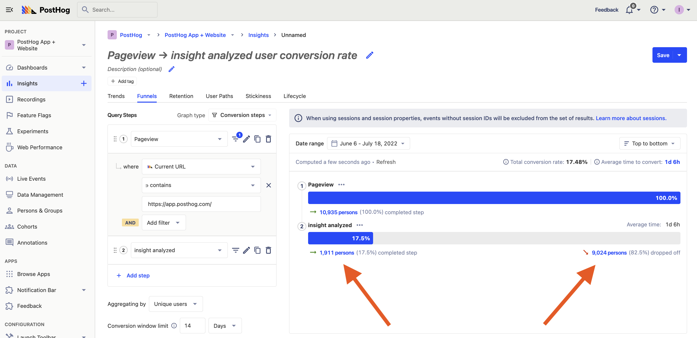
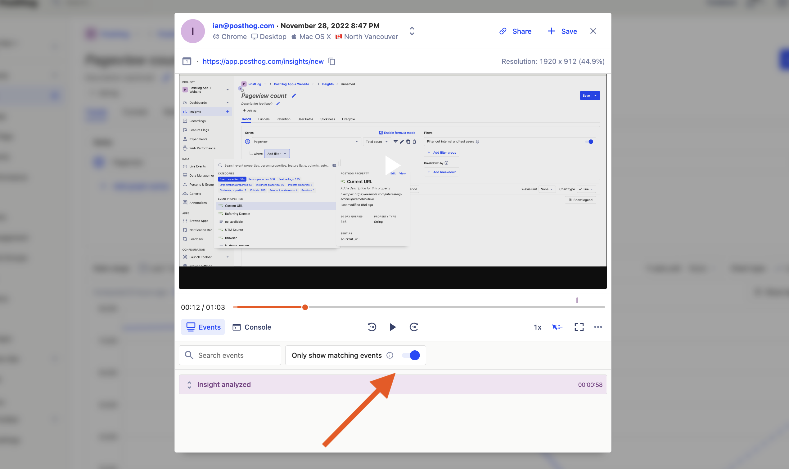
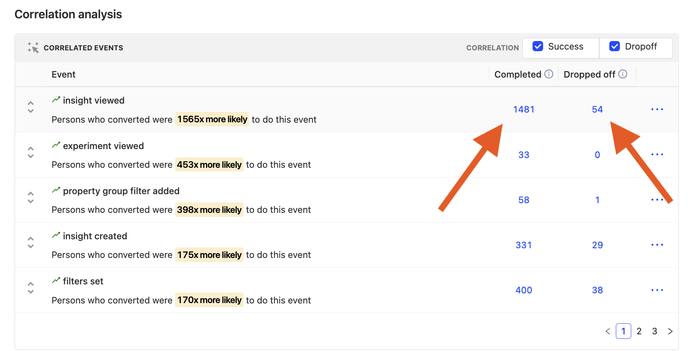
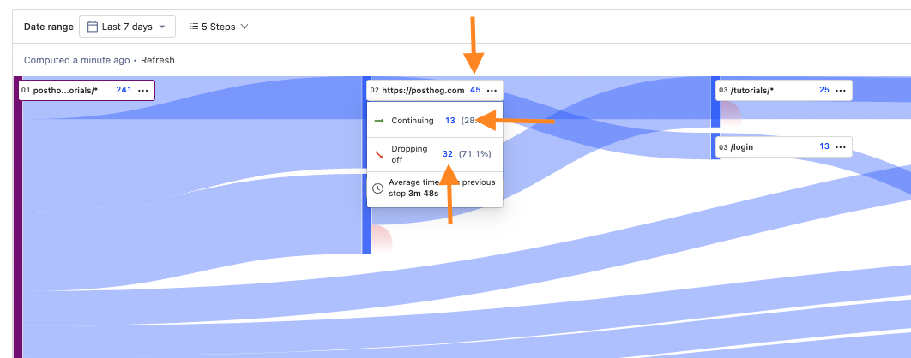
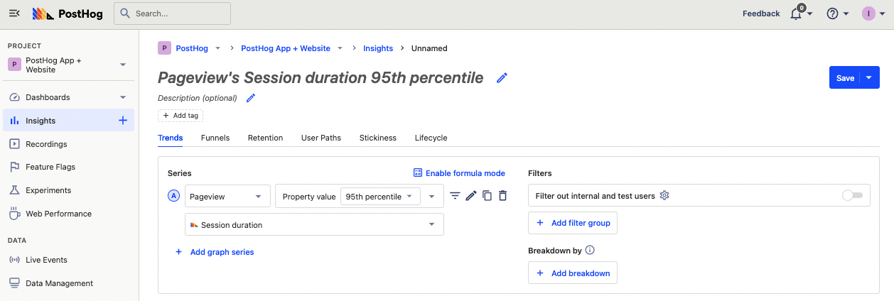
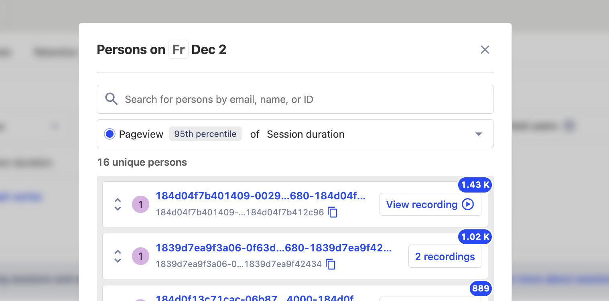

One of the biggest benefits of PostHog is the connections from all your product data and tools being in one place. You don’t need to link together multiple products, find ways to connect the right data, and hop between them to create insights. In PostHog, these links are built-in. For example, going from product data to visualizations to session recordings is literally three clicks.

In this tutorial, we focus on the connections session recordings have with insights and visualizations. These connections enable deeper exploration of user behavior and better, more detailed insights.

> Session recordings require installing the [JavaScript library](https://posthog.com/docs/integrate/client/js) or [snippet](https://posthog.com/docs/integrate#snippet) and enabling "Record user sessions" in project settings under recordings.

## Watching users through funnels

When viewing a funnel, it is easy to lose a sense of what is happening in reality. You can combine funnels and session recordings to understand what caused users to succeed or drop off. Watching session recordings reconnect you to the reality of what is happening in your funnel.

Once you’ve created a funnel in insights, click on any of the “persons” numbers in the visualization. These are either beside “completed step” or “dropped off.” Clicking on them gives you a list of users and their related sessions.

When viewing the sessions, you can click the “Only show matching events” button to filter the session’s events by the ones connected to your funnel’s events. It makes it quick to view when they completed the relevant funnel event.

For example, if you had a signup funnel, you can use a funnel insight to both track the ongoing conversion from pageview to signup, as well as analyze details of where users get stuck via the recording. This should allow you to get an idea of the problem areas in the funnel, as well as specific ways to improve it.

## Watch funnel sessions of correlated events and properties

Correlated events and properties show what event or property leads to someone completing or dropping off from your funnel. Encouraging or discouraging these events or properties can help improve your funnel, but focusing on them too much attention can mislead you from real funnel behavior. Luckily, there is a list of users and recordings connected to each of them.

Once you’ve created a funnel, below the funnel you’ll get a set of correlated events and another for properties. You can click the “Completed” or “Dropped off” numbers on any of them to view a list of users and the related session recording.

> **Tip:** To specifically see success or drop off correlated events or properties, click the selectors in the top right of the component.

Viewing the session recording for a correlated event or property gives a fuller picture of what it means for that correlation to be important. It isn’t just an event or property, but an overall behavior that leads to that different results. 

## Watching journeys from user paths

The user path visualization gives you a collective insight into the paths users are taking throughout your product. They are an aggregate view of how users are moving through your product, but each journey is different. Session recordings enable you to explore individual journeys, and they are connected to every step of the user path visualization.

At every step of the path, you can click the number next to the step, “continuing,” or “dropping off” to view users who viewed that page (or didn’t). From the list, you can go see related recordings. 

In a recording, you can see the specifics of their journey, including the parts relevant to the path. Use the “Only show matching events” button to filter for events related to the stage of the path you clicked.

## Find and analyze outliers in trend graphs

There are multiple ways to visualize outliers and extreme usage of your product in PostHog. Some of these include trends for:

- 90th, 95th, 99th percentile, max, or min count per user
- 90th, 95th, 99th percentile, max, or min property value
- extreme filters on events or user properties

After creating one of these in insights, you can click the graph to view a list of users and their related session recordings. Viewing the related recordings can help you understand their extreme usage. 

For example, you can create a trend for 95th percentile session duration by creating a series with pageview events, and property value (95th percentile), then make sure to choose “Session duration” under “Sessions” as your property.

Once created, click on any of the days in the graph, and you’ll get a list of people with a 95th percentile session duration that day. For any of them, click the recording to launch that session and see what they were doing that whole time.

> **Tip:** If you are watching long session recordings, make sure to enable “Skip inactivity” (the mouse icon on the bottom right of the player). You can also increase the speed of playback using the “1x” button.

## Further reading

- [How to build, analyze and optimize conversion funnels](https://posthog.com/tutorials/funnels)
- [How to find relevant session recordings quickly](https://posthog.com/tutorials/filter-session-recordings)
