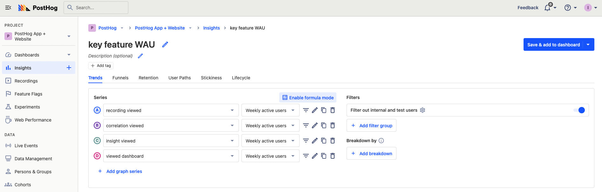
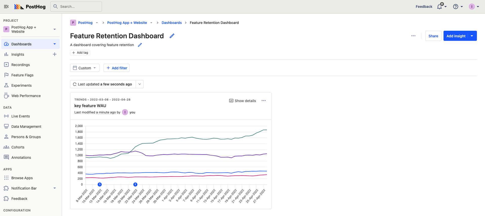
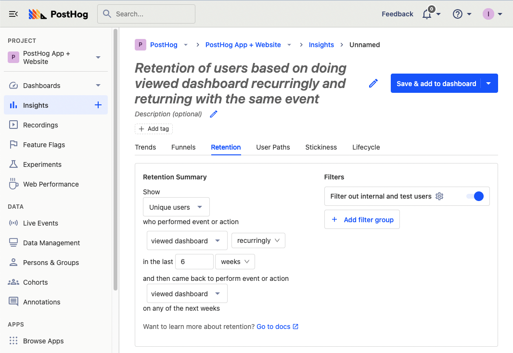
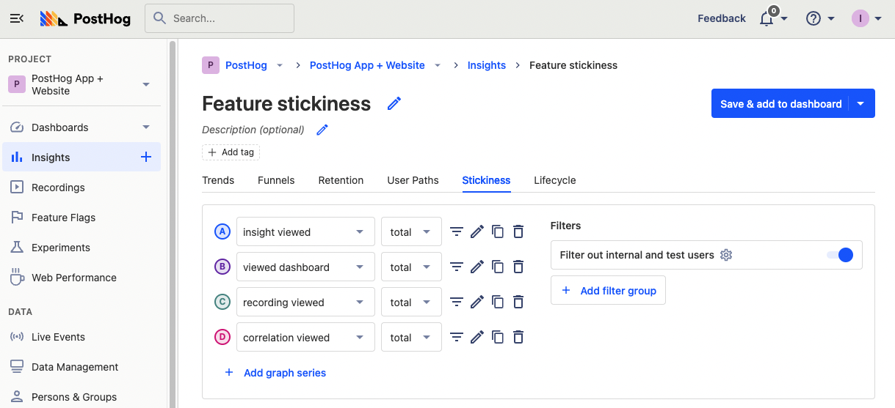

> 
Open this tutorial in PostHog and follow along step-by-step!
 <CallToAction href="https://app.posthog.com/#panel=docs:/tutorials/feature-retention" size="sm" className="mt-auto self-start sm:w-auto !w-full">Launch tutorial</CallToAction>

Every company wants to build a product that keeps users coming back. Returning and reoccurring users are often your best ones. Many teams focus on improving user retention metrics, like weekly active users or customer retention. Retention is also an excellent way to [measure your product-market fit](/blog/measure-product-market-fit).

This tutorial will help you discover the features that drive retention and keep users coming back. Specifically, we’ll build a dashboard to track metrics related to a feature’s retention and compare those metrics across your features.

## Setting up the feature usage tracking

The first step in understanding feature retention is knowing what data you have. You need data from your product’s features to know anything about their retention. There are two ways to do this:

1. Add the [snippet](/docs/integrate) or install the [JavaScript library](/docs/integrate/client/js) to enable [autocapture](/docs/data/autocapture). Find autocaptured events related to the feature (views, button presses, inputs). Create an [action](/manual/actions) (a combination of events) using the toolbar or under “Data Management” in the sidebar to represent that feature’s usage.

2. Add event capture calls manually into the code that encompasses the feature usage. Use functions, methods, hooks, or other structures in your code to represent a feature’s usage.

> **Note:** Be sure to think about the relative effort it takes to use a feature. For example, a long form submission is more difficult than a video view. Users take an action more often when it is easier. An event that takes more work happens less, and this can correlate to lower retention.

See the [event tracking guide](/tutorials/event-tracking-guide) for more details on setting up tracking in PostHog.

## Creating a feature retention dashboard

To discover which features drive retention, we will create insights and add them all to a dashboard. The dashboard gives us an overview of retention stats for features and makes it easy to compare them.

To create a new dashboard, click “Dashboards” in the sidebar, then click the “New dashboard” button, give it a name and description, and finally click “Create and go to dashboard.” 

From the dashboard, we can start by adding a basic active user trend for each of our features. Click “Add insight,” and on the insight screen, stay on the “Trends” tab. Here, we can add a series for each of the feature events we set up. Instead of “Total count,” we’ll want to choose weekly or monthly active users as our count.

Once we click “Save & add to dashboard,” below is how our retention dashboard will look. It is thin right now, but we’re going to change that.

This insight gives us a basic understanding of the features weekly or monthly active users are using. It gives us a first glance at what the most important features for retention might be.

## Adding feature retention charts

Next, we'll add some retention charts. Either from your dashboard or “Insights” on the sidebar, create a new insight. This time we’ll be using the “Retention” insight. 

Choose one of your feature events for both “performed” and “came back to perform” options. If you have a large number of users, you can use “for the first time.” If you have fewer, use “recurringly.” Choose a relevant time scale, likely weekly rather than daily. Once done, you can click save or add to the dashboard and repeat for the rest of your features.

Once completed, go to your dashboard and do some organization. Click the three dots next to share (or press “E”) to resize and rearrange your insights on your dashboard.

This enables you to see how features compare for retention, and at what point users are dropping off. Understanding what features drop off the slowest provides more insight into what features are the best at keeping users coming back.

## Creating a stickiness chart

You can also use feature event data to create a stickiness chart. A stickiness chart enables you to compare the repeated usage of your features.

To create one, follow a similar process to the recurring feature usage active user chart. Create a new insight, and select the stickiness tab. Add a graph series for each of your features, and you can start to compare them. 

Be wary that stickiness might drop off significantly faster than you expect. Also, keep in mind the numbers you start with. If a graph series starts lower on the Y axis, but overlaps other lines, that means it is stickier than other features (a good sign).

Comparing the stickiness of your features gives you more insight into which ones users are using repeatedly and keep them coming back to use.

## Using feature retention insights to improve your product

Once you set up your dashboard with feature trends, retention, and stickiness, you should have an idea of what features drive retention and keep users coming back. You can then use these insights to improve your product. There are two key actions you can take:

1. **Promoting high retention features:** Double down on high retention features by promoting them more and putting them front and center. For example, you can adjust your UI to have clearer paths to those features.

2. **Improving low retention features:** Fix the features with low retention. Run experiments to improve them and track retention improvement with your dashboard. If that doesn’t work, you can stop working on them, or if you think the impact is extremely negative, you can drop the feature entirely.

Now you have a better idea of the features that drive user retention and keep them coming back. You can continue to use the dashboard you created to keep track of this and make changes to your features that help you drive higher retention in your product.

## Further reading

- [How to calculate and lower churn rate](/tutorials/churn-rate)
- [Our complete guide to churn analysis](/blog/customer-churn-analysis-guide)