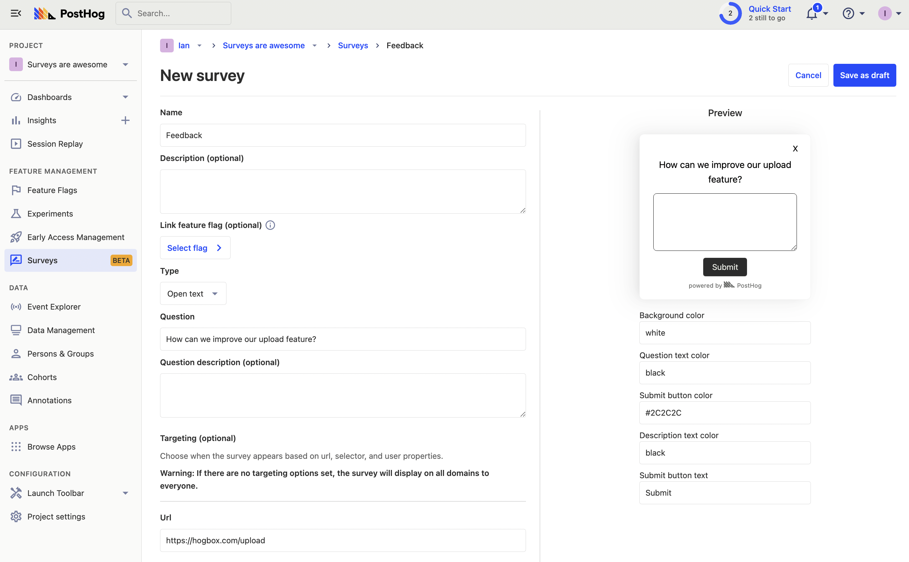
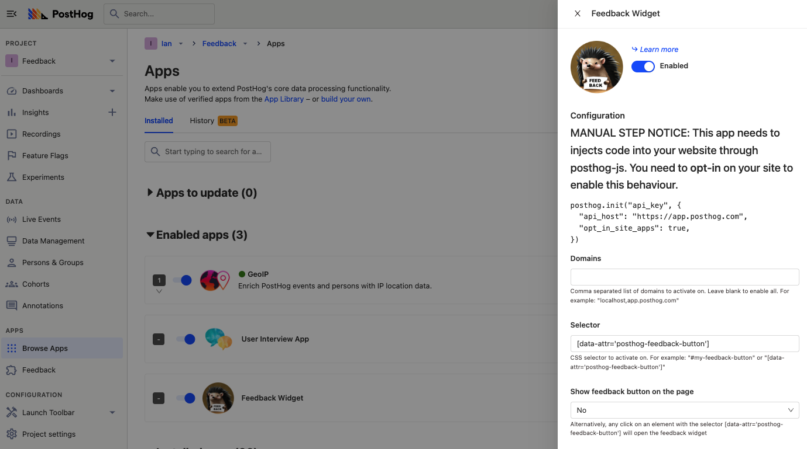
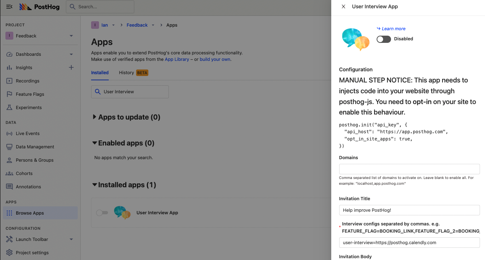

Getting feedback is critical to building a successful product. Metrics and analytics are key pieces of feedback, but at an early stage, written feedback and interviews are even better. To maximize the amount of feedback you get, you need processes, but these are often time-consuming.

PostHog’s site apps help automate the process of getting feedback and booking interviews. In this tutorial, we show how to set and use both of them them.

## Getting your app ready for site apps.

To add PostHog’s site apps, you need either [the snippet or the JavaScript library](/docs/integrate) set up in your app. You also must add `opt_in_site_apps: true` to the initialization of either of these. For the snippet, this looks like this:

```html
<script>
  !function(t,e){var o,n,p,r;e.__SV||(window.posthog=e,e._i=[],e.init=function(i,s,a){function g(t,e){var o=e.split(".");2==o.length&&(t=t[o[0]],e=o[1]),t[e]=function(){t.push([e].concat(Array.prototype.slice.call(arguments,0)))}}(p=t.createElement("script")).type="text/javascript",p.async=!0,p.src=s.api_host+"/static/array.js",(r=t.getElementsByTagName("script")[0]).parentNode.insertBefore(p,r);var u=e;for(void 0!==a?u=e[a]=[]:a="posthog",u.people=u.people||[],u.toString=function(t){var e="posthog";return"posthog"!==a&&(e+="."+a),t||(e+=" (stub)"),e},u.people.toString=function(){return u.toString(1)+".people (stub)"},o="capture identify alias people.set people.set_once set_config register register_once unregister opt_out_capturing has_opted_out_capturing opt_in_capturing reset isFeatureEnabled onFeatureFlags".split(" "),n=0;n<o.length;n++)g(u,o[n]);e._i.push([i,s,a])},e.__SV=1)}(document,window.posthog||[]);
  posthog.init(
    'phc_XW7Vk020Cjb1Itg5CMI1Crxm8hdXeTY69qlwmqdoR8m',
    {
      api_host:'https://app.posthog.com',
      opt_in_site_apps: true
    }
  )
</script>
```

Once added, your app is ready for site apps. PostHog automatically loads site apps into your app through the snippet or library. You don’t need any additional code.

## Setting up the feedback app

The first app we will set up is the feedback widget. To start, search for "Feedback Widget" in your PostHog instance.



Click the blue gear to configure domains, styling, content, and data flow related to the app. Customize any of the fields or style how you like (we are keeping the defaults). Click save, then turn on the widget with the toggle next to the hedgehog photo.

Back in your app, you should see an icon in the bottom right corner that enables user feedback. When you (or users) click the icon, a widget pops up with the option to send feedback.


When a user writes feedback and clicks "Send Feedback," PostHog captures it as an event and these events are shown in the "Feedback" tab below Apps in your instance. 

### Integrating the feedback widget into your page

If you want to remove the default icon and integrate it seamlessly into your site, you can set up the feedback widget to trigger on any button or component. To set this up, add `data-attr` to a button or component in your app. For example:

```html
<button data-attr="posthog-feedback-button">Send feedback</button>
```

In PostHog, add the name of the `data-attr` to your button configuration. If you want to remove the default icon, also make sure to set "Show feedback button on the page" to "No."



Once saved, the icon disappears from your app, and clicking the button you set up now triggers the feedback widget.

## Setting up the user interview app

User interviews are critical to understanding how your users are using your product and how you can improve it. The process for booking these interviews can be time-intensive. They require a lot of back-and-forth, figuring out schedules, and coordination. Automating this process helps you to get the benefits of user interviews with less logistic work.

To do this, we will use the user interview app. It is more complicated to set up, because it uses a feature flag. This enables customization and control of who sees the prompt to book a user interview. Here’s the process:

1. Create a feature flag. Set up the filters you want, but these can only be user properties, group properties, or cohorts. As a start, we recommend filtering to show only for yourself (your email or ID).
    - If you want historical events, create an insight, use it to create a static cohort, then use that static cohort as a filter.
    - You can configure your app to [set user properties](/docs/integrate/client/js#sending-user-information) when users do a specific action, then tie release conditions to those properties.
2. Create a calendar scheduling link with Calendly or your preferred tool. Users go to this link when they get the user interview popup. 
    - You can also set the redirect back to your app and include `?bookedUserInterviewEvent={FEATURE_FLAG_NAME}` in the URL. This enables you to keep track of how many interviews you booked easily.
3. Search for the "User Interview App" in your PostHog instance. Click the blue gear to configure the domains, content, events, and properties. Make sure to include the feature flag key and scheduling link in the "Interview configs" section. Press save when you’re done and toggle the app to enable it.



Once you set all this up, when you go back to your app (identified as your account), you should see a prompt to book an interview.


Once confirmed it works for you, go back to the feature flag for the user interview and adjust the release conditions to match who you want to speak with. Make sure to set the filter `Seen User Interview Invitation - {FEATURE_FLAG_NAME}` to `is not set`. This ensures the prompt isn’t shown to people who already saw the user interview popup.

Once you adjust your release conditions, you should start to get some interviews booked. If this isn’t happening, try to expand the release conditions or provide an incentive for users to book interviews.

## Further reading

- [The 80/20 of early-stage startup analytics](/blog/early-stage-analytics)
- [How to build a site app](/tutorials/build-site-app)
- [How we made something people want](/blog/making-something-people-want)