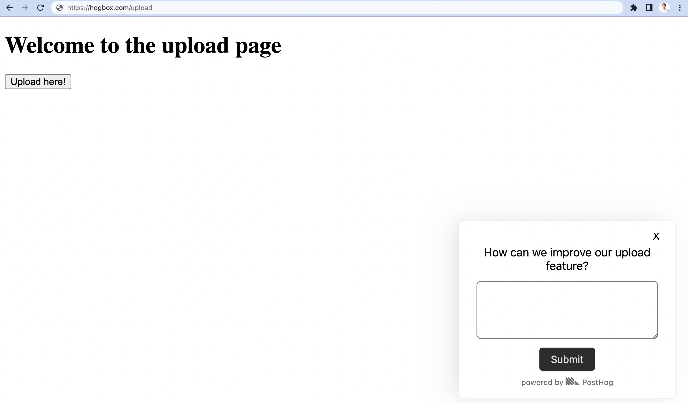
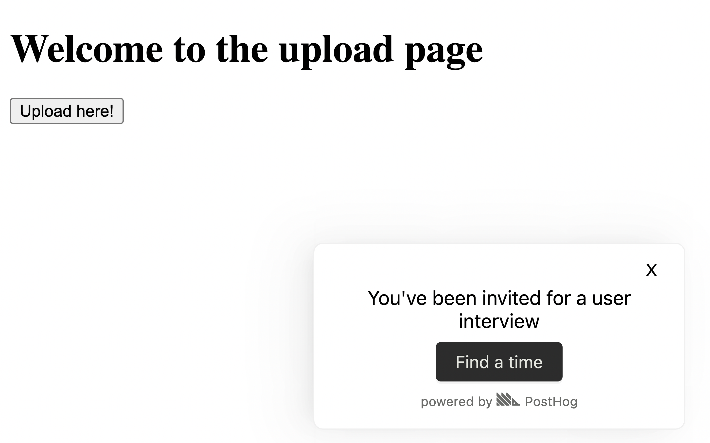

> <p align="center">Open this tutorial in PostHog and follow along step-by-step!</p> <CallToAction href="https://app.posthog.com/#panel=docs:/tutorials/feedback-interviews-site-apps" size="sm" className="mt-auto self-start sm:w-auto !w-full">Launch tutorial</CallToAction>

Getting feedback is critical to building a successful product. Metrics and analytics are key pieces of feedback, but at an early stage, written feedback and interviews are even better. To maximize the amount of feedback you get, you need processes, but these are often time-consuming.

PostHog’s [surveys](/docs/surveys/manual) help automate the process of getting feedback and booking interviews. In this tutorial, we show how to set up surveys to do both.

## Getting your app ready for surveys

To add surveys, you need either [the snippet or the JavaScript library](/docs/integrate) set up in your app. For the snippet, this looks like this:

```html
<script>
  !function(t,e){var o,n,p,r;e.__SV||(window.posthog=e,e._i=[],e.init=function(i,s,a){function g(t,e){var o=e.split(".");2==o.length&&(t=t[o[0]],e=o[1]),t[e]=function(){t.push([e].concat(Array.prototype.slice.call(arguments,0)))}}(p=t.createElement("script")).type="text/javascript",p.async=!0,p.src=s.api_host+"/static/array.js",(r=t.getElementsByTagName("script")[0]).parentNode.insertBefore(p,r);var u=e;for(void 0!==a?u=e[a]=[]:a="posthog",u.people=u.people||[],u.toString=function(t){var e="posthog";return"posthog"!==a&&(e+="."+a),t||(e+=" (stub)"),e},u.people.toString=function(){return u.toString(1)+".people (stub)"},o="capture identify alias people.set people.set_once set_config register register_once unregister opt_out_capturing has_opted_out_capturing opt_in_capturing reset isFeatureEnabled onFeatureFlags getFeatureFlag getFeatureFlagPayload reloadFeatureFlags group updateEarlyAccessFeatureEnrollment getEarlyAccessFeatures getActiveMatchingSurveys getSurveys".split(" "),n=0;n<o.length;n++)g(u,o[n]);e._i.push([i,s,a])},e.__SV=1)}(document,window.posthog||[]);
  posthog.init(
    <ph_project_api_key>,
    {
      api_host:'<ph_instance_address>'
    }
  )
</script>
```

Next, go to the [surveys page](https://app.posthog.com/surveys) and enable survey popups if you haven't already.


## Creating your first feedback survey

Once you’ve set up your app to use surveys, you can create your first one to gather feedback. To do this, go to the [surveys tab](https://app.posthog.com/surveys) in your PostHog instance and click "New survey." On this page, add a name and question. In this example, we ask for feedback on an upload feature, so our question reflects this. We also want to target the `/upload` URL so we include that under "Targeting."


Feel free to add a description or change any of the style options and press "Save as draft" once ready. On the overview page, you can click "Launch" because we already did all the setup. Once launched, you see the prompt in your app and results are captured into PostHog for you to see.



## Using surveys to book user interviews

You can also use the surveys feature to show a prompt to users to book interviews. 

To control who sees the prompt, we can use a feature flag. To create one, go to the [feature flags tab](https://app.posthog.com/feature_flags) and click "New feature flag." Add a key (like `user-interview`), release conditions like 100% of users where the country code is `GB`, and press save.

Next, go to the [surveys tab](https://app.posthog.com/surveys) and click "New survey." Add a name like "User interview," link the `user-interview` feature flag you just created, change the type from "Open text" to "Link," add your question, booking link, and change the "Submit button text." Altogether, this might look like this:


Once you customize it to your liking, click "Save as draft" and then "Launch" to show it to all the users in the flag rollout.



## Further reading

- [The 80/20 of early-stage startup analytics](/blog/early-stage-analytics)
- [How we made something people want](/blog/making-something-people-want)
- [How to write great product survey questions (with examples)](/blog/product-survey-questions)