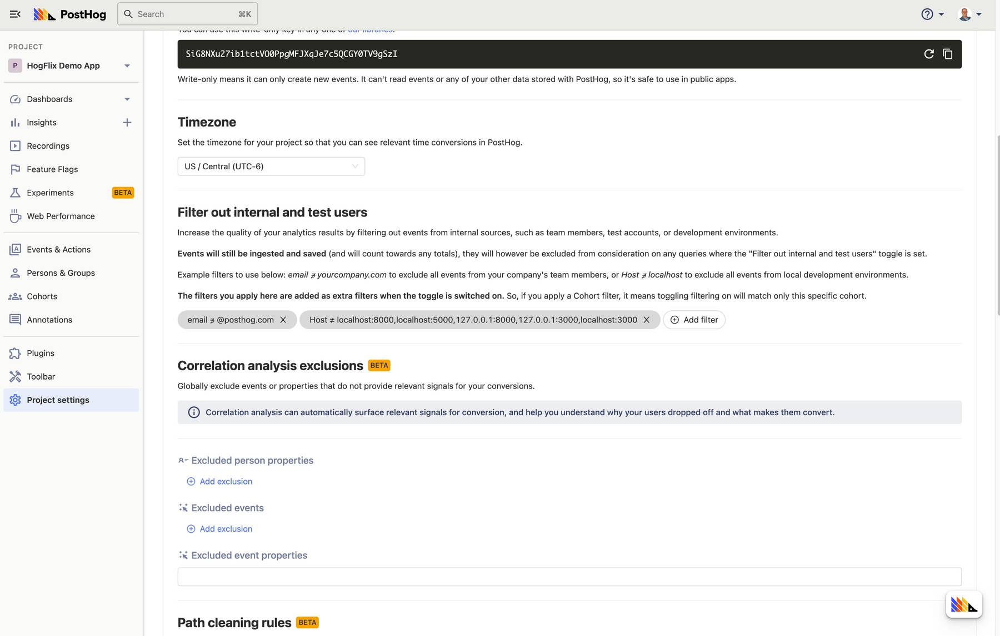
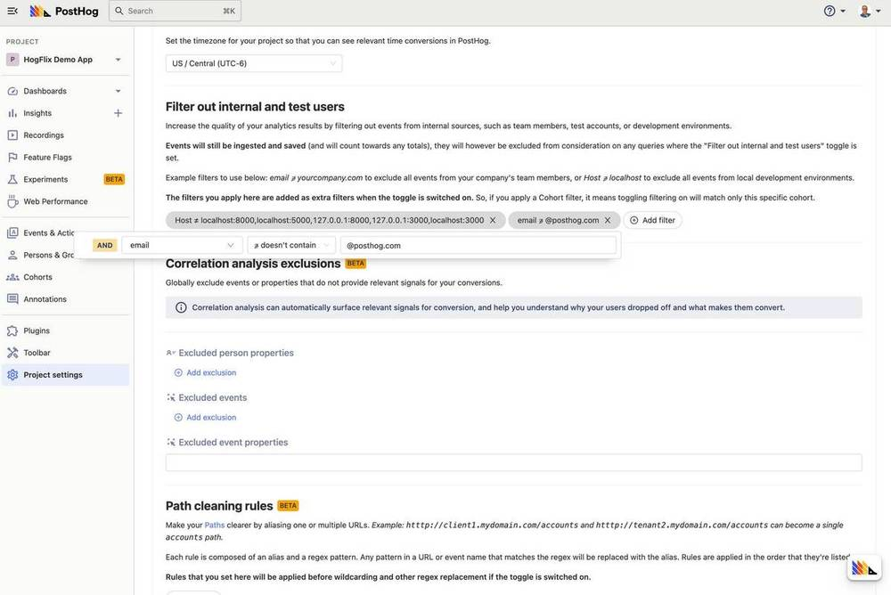
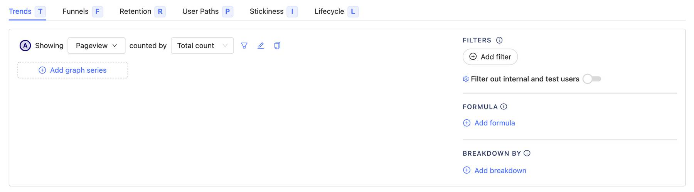

> 
Open this tutorial in PostHog and follow along step-by-step!
 <CallToAction href="https://app.posthog.com/#panel=docs:/tutorials/filter-internal-users" size="sm" className="mt-auto self-start sm:w-auto !w-full">Launch tutorial</CallToAction>

When you’re investigating an insight, it’s important to make sure you’re looking at the best possible data and that your findings aren’t skewed. That means checking you understand the definition of events or actions you’re using and, if need be, filtering out groups such as internal users, beta testers and contractors or agencies. 

Filtering out these sorts of users can be especially important for large organizations where they may be hundreds, or thousands of internal team members using your product. It can also be important for early-stage organizations, where such users may make up a larger proportion of the total users due to the small sample size. 

To make it easier to get accurate insights, PostHog includes tools to filter internal users out — and here’s how to use them. 

## Step 1: Navigate to Project Settings

PostHog identifies internal users on a project-by-project basis, so head to Project Setting in the navigation to get started. If your PostHog instance spans multiple projects then you will have to repeat this tutorial for each project. 

Any internal users you identify for a project will apply for _all_ users on that project. 

## Step 2: Add an internal user filter

In Project Settings, scroll down to the ‘_Filter out internal and test users_’ section and click ‘_+ Add filter_’ to begin. 

Adding a filter here works exactly the same as it does when you add a filter to any other insight, with a list of available events, properties and cohorts to choose from as a base for your filter. You can add several filters at once, to create an inclusive list of ways to identify groups of internal users or beta testers. 

One of the easiest filters to create is to filter out internal users identified by their email address. We do this at PostHog, using the following filter to create insights based only on users who do not have a PostHog email address:

> email ∌ (doesn’t contain) @posthog.com

The filters you apply are added as extra filters when the toggle is switched on. So, if you apply a Cohort filter, it means toggling filtering on will match only this specific cohort.

## Step 3: Add more filters

PostHog supports adding multiple filters at once, as well as complex filters with multiple values within them.

You can create filters which include more than one value by separating values with a comma. We use such a filter to exclude events from local development environments, for example:

> Host ≠ (doesn’t equal) localhost:8000,localhost:5000,127.0.0.1:8000

You can also create filters based on pre-prepared cohorts of users, which is especially useful if you’re using cohorts with [Feature Flags](/docs/user-guides/feature-flags) or to run [Experiments](/docs/user-guides/experimentation). To do this, simply select the cohort you wish to add to your internal and test user list. 

## Step 4: Apply the filter to an insight

The internal and test user filter is controlled with a simple toggle whenever you create a new insight, or edit an existing one. Turn it on and everything in your filter group will be sifted out; turn it off and you’ll see results from all users together. Simple!
