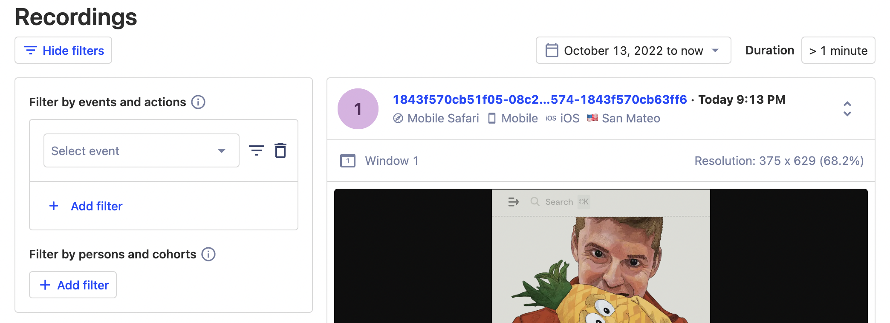
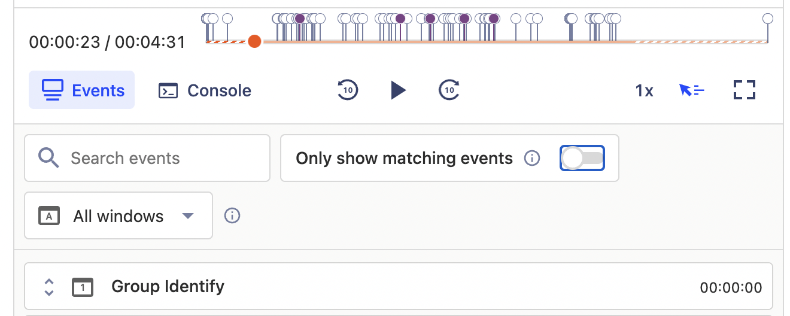
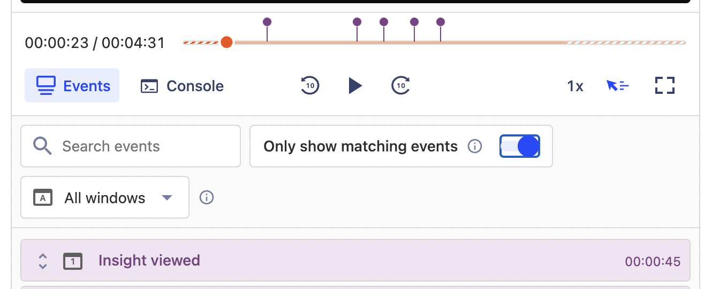
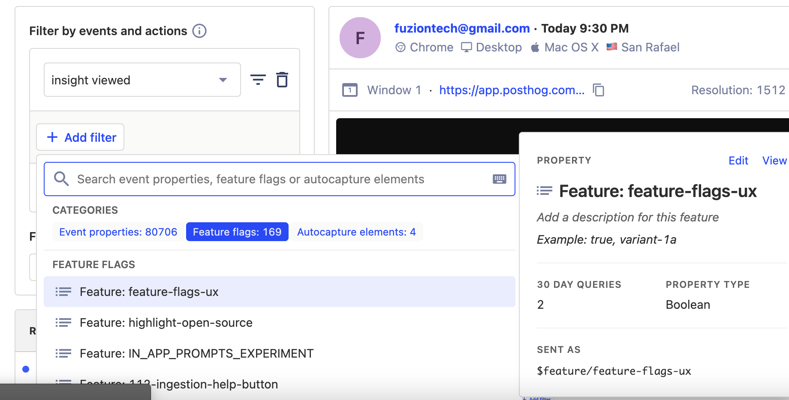
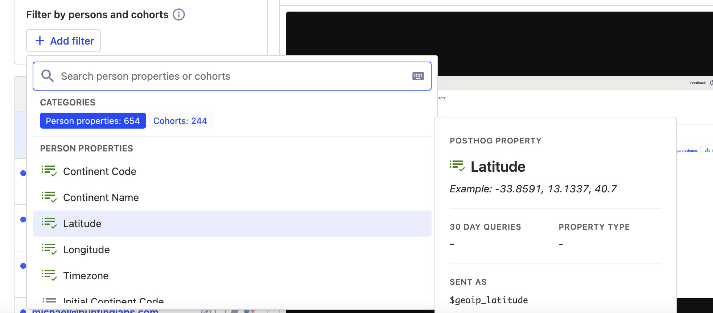
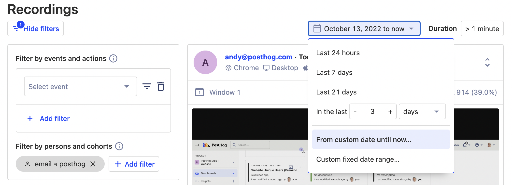

> 
Open this tutorial in PostHog and follow along step-by-step!
 <CallToAction href="https://app.posthog.com/#panel=docs:/tutorials/filter-session-recordings" size="sm" className="mt-auto self-start sm:w-auto !w-full">Launch tutorial</CallToAction>

Funnels may tell you _where_ users are experiencing friction within your product, but only session replays can show you _why_.

In this tutorial, we’ll explain how to use PostHog’s various filters and features to find relevant session replays quickly, and painlessly. 

## 1. Filter recordings by actions or events

A typical use case for session replays is to filter based on an event or action, so you can see how users interact with certain features or areas of your product. 

You'll need an appropriate event or action set up to do this – see [our complete guide to event tracking](/tutorials/event-tracking-guide) for help there. 

To start filtering, simply select ‘Filter recordings’ at the top of the page. 

Searching for actions or events in PostHog is similar to building a query in insights — use the filter builder on the left of the screen to define what sort of actions or events you’re looking for. 

Once you have filtered the recordings to a smaller, more relevant list then you can search within individual recordings to find the specific moment when an event occurs. In fact, there are a few ways to find the specific event you’re looking for!

The easiest way to focus on a particular action is to use the toggle labeled ‘Only show matching events’. This removes all events which don’t match your global filter from both the timeline and the event list, changing the view from the above, to the below. 

Alternatively, you may prefer to search for an event which _doesn’t_ match a global filter — in which case you use the search events field to find other events within the current recording. 

## 2. Filter recordings based by feature flags

If you use feature flags in PostHog, you can also filter recordings by the flag variant shown to a user. This can be helpful if, for example, you want to compare user behavior between flag variants. 

To filter recordings based on an event which happens within a recording where a user has viewed a particular flag. To do this, you must first create a filter based on the event you’re looking for and _then_ create a secondary filter that specifies the flag. 

As before, you can then search within a specific recording to find the event you’re interested in. 

## 3. Filter recordings by persons and cohorts

Another use case for filtering recordings is to see how certain types of users behave so you can, for example, determine if users in different countries or demographics interact with your product differently.

Filtering recordings based on person properties is fundamentally the same as filtering based on actions or events, except that it is done using the ‘Filter by persons or cohorts’ filter instead. 

As before, you can then search within a specific recording to find the event you’re interested in. 

## 4. Filter recordings based on device, location or OS

Often, you’ll want to combine several persons filters with events filters so that you can, for example, find users who completed a specific action on macOS, or called a particular feature flag within the UK. 

In such instances you may want to build filters based on device, OS, location or browser with a single click. That’s why we built the quick filter options which you can see on each entry in the recent recordings column — simply click a matching icon to filter for similar recordings. 

## 5. Filter recordings by date and time

The final way to filter recordings is chronologically, based on the time or date that an recording was captured. This can be especially powerful for products where user behavior is influenced by the time of year, such as a B2C marketplace that runs seasonal sales.

PostHog also enables you to filter recordings based on the overall duration of a session. This is useful if you need to find recordings based where users are highly engaged and interact with your app for extended periods — or where engagements are brief, perhaps due to UX issues. 

In either case, you can filter recordings using the date and time controls at the top right of the recordings page. 

## Further reading

Session recordings in PostHog are powerful tool for users such as support engineers, product designers and product managers who need context on the details of user behavior. 

To find out more about session replays, including how to [prevent PostHog from capturing sensitive user information](/manual/recordings#ignoring-sensitive-elements), check [the session replay docs](/manual/recordings). 
