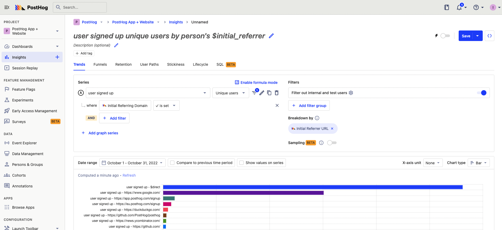
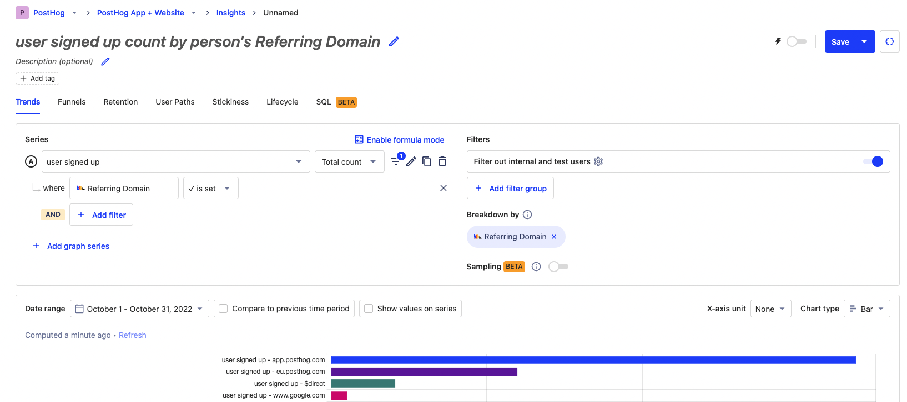

Understanding where users are coming from helps prioritize future development and marketing efforts. To analyze this, companies do "attribution", which is the process of figuring out what caused a conversion. 

Two common ways of doing attribution are:

- **First touch attribution:** attributes a conversion to the source or first action a user took on the site.
- **Last touch attribution:** attributes a conversion to the last source or action a user took on the site before signing up

In this tutorial, we show you how to track first and last touch attribution in PostHog.

## First touch attribution

We can analyze first touch attribution by looking at event source properties and initial pageview events.

### Initial source properties

PostHog automatically captures multiple properties related to the source of a user. These include values like referring domain and UTM source. PostHog also sets the initial value (the first value it sees) as a property on users.

Analyzing these values is relatively easy. Create a [new insight](https://app.posthog.com/insights/new), choose your signup event as your series, breakdown by the person properties "Initial UTM Source" or "Initial Referrer Domain," and select the total value bar chart for your visualization. You can also filter out `None` values by filtering for events where the property you are using `is set`.



### First pageview

We can also calculate the first touch as the first page a user lands on. To do this, we can [create an insight](https://app.posthog.com/insights/new), go to the SQL tab, and use [HogQL](/docs/hogql). Here we query for the first `$pageview` event for a user, then get the `$current_url` of this event. This looks like this:

```sql
SELECT 
    properties.$current_url AS current_url,
    count() AS url_count
FROM events
WHERE event = '$pageview'
    AND (distinct_id, timestamp) IN (
        SELECT distinct_id, min(timestamp)
        FROM events
        WHERE event = '$pageview'
        GROUP BY distinct_id
    )
    AND timestamp > toDateTime('2023-01-01 00:00:00')
GROUP BY current_url
ORDER BY url_count DESC;
```

We can change `properties.$current_url` to whatever property we care about such as UTM source, referring domain, or device to get those values.

## Last touch attribution

We can analyze last touch attribution in three ways. For each of these, we use a signup event as the conversion, but you can use any event you want. 

### Last source properties

Like first touch attribution, we can look at the properties the user had when signing up. Look at the signup event’s properties. 

To do this, we can [create an insight](https://app.posthog.com/insights/new), chose our signup event for our series, breakdown by the person properties `UTM Source` or `Referrer Domain` (**not initial**). 

Again, you can filter out `none` by filtering for events where your property `is set`.



### Last pageview event

We can look at the last pageview event before signing up. Like first touch attribution, we can do this by [creating an insight](https://app.posthog.com/insights/new), going to the SQL tab, and using [HogQL](/docs/hogql). 

This SQL statement uses a window function to select events `$pageview` events coming directly before a "user signed up" events. We then get a count of the different `current_url` values. This statement looks like this:

```sql
SELECT
    current_url,
    count() as url_count
FROM (
    SELECT 
        distinct_id,
        event AS first_event,
        timestamp AS first_timestamp,
        first_value(event) OVER w AS next_event,
        properties.$current_url AS current_url
    FROM events
    WHERE 
        timestamp > toDateTime('2023-01-01 00:00:00') 
        AND (event = '$pageview' OR event = 'user signed up')
    WINDOW w AS (PARTITION BY distinct_id ORDER BY timestamp ASC ROWS BETWEEN 1 FOLLOWING AND 1 FOLLOWING)
    ORDER BY distinct_id, timestamp
) AS subquery
WHERE first_event = '$pageview'
    AND next_event = 'user signed up'
GROUP BY current_url
ORDER BY url_count DESC
```

Again, we could use another type of event by replacing `$pageview` or property by replacing `properties.$current_url`.

### User path

The last insight we can create is a user path ending at the sign up event. This gives us a better visual of the different paths users are taking before signing up.

To create this:

1. [Create an insight](https://app.posthog.com/insights/new) and go to the "User Paths" tab. 
2. Select "Page views" and "Custom event" as "Event Types."
3. Choose your sign up event as the "Ends at" point.
4. If relevant, lower the maximum number of paths and add path cleaning rules.
5. Set the visualization to "2 Steps."
6. For irrelevant event types, click the three dots next to events in your visualization and click "exclude path item."

This creates a path diagram to help you understand where your newly converted users are coming from.


## Further reading

- [How to calculate time on page](/tutorials/time-on-page)
- [Calculating average session duration, time on site, and other session-based metrics](/tutorials/session-metrics)
- [How to do time-based breakdowns (hour, minute, real time)](/tutorials/time-breakdowns)