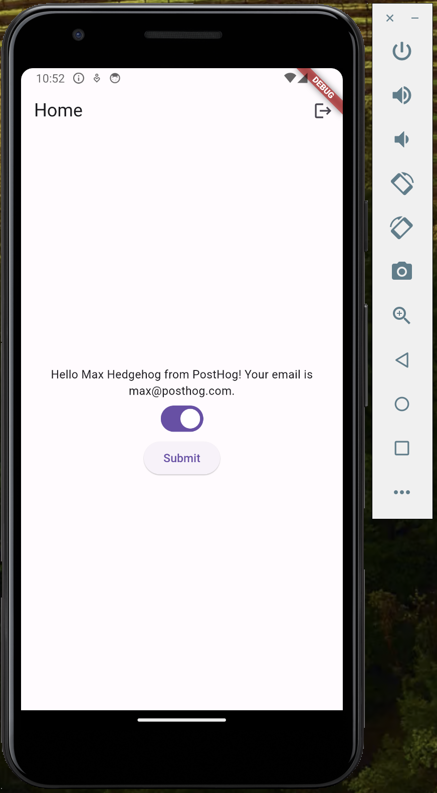

import { ProductScreenshot } from 'components/ProductScreenshot'
import EventsInPostHogLight from '../images/tutorials/flutter-analytics/events-light.png'
import EventsInPostHogDark from '../images/tutorials/flutter-analytics/events-dark.png'
import IdentifyLight from '../images/tutorials/flutter-analytics/identify-light.png'
import IdentifyDark from '../images/tutorials/flutter-analytics/identify-dark.png'
import InsightLight from '../images/tutorials/flutter-analytics/create-insights-light.png'
import InsightsDark from '../images/tutorials/flutter-analytics/create-insights-dark.png'

[Product analytics](/product-analytics) enable you to gather and analyze data about how users interact with your Flutter app. To show you how to set up analytics, in this tutorial we create a basic Flutter app, add PostHog, and use it to [capture events](/docs/product-analytics/capture-events) and [create insights](/docs/product-analytics/insights).

## 1. Create a new Flutter app

Our app will have two screens:

- a `login` screen with a form to enter in your name, email, and company name.
- a `home` screen with submit button, toggle, and logout button.

To set this up, install the [Flutter extension for VS Code](https://marketplace.visualstudio.com/items?itemName=Dart-Code.flutter). Then, create a new app by opening the Command Palette in VS Code (`Ctrl/Cmd + Shift + P`), typing `flutter` and selecting `Flutter: New Project`. 

Select `Empty Application` and name your app `flutter_analytics`. Then, replace your code in `lib/main.dart` with the following:

```dart file=lib/main.dart
import 'package:flutter/material.dart';
import 'package:shared_preferences/shared_preferences.dart';

void main() => runApp(const MyApp());

class MyApp extends StatelessWidget {
  const MyApp({super.key});
  @override
  Widget build(BuildContext context) {
    return MaterialApp(
      title: 'Flutter Analytics',
      theme: ThemeData(
        primarySwatch: Colors.blue,
      ),
      home: FutureBuilder<bool>(
        future: isLoggedIn(),
        builder: (context, snapshot) {
          if (snapshot.connectionState == ConnectionState.waiting) {
            return const CircularProgressIndicator();
          }
          if (snapshot.data ?? false) {
            return const HomePage();
          } else {
            return LoginPage();
          }
        },
      ),
    );
  }

  Future<bool> isLoggedIn() async {
    final prefs = await SharedPreferences.getInstance();
    return prefs.getBool('isLoggedIn') ?? false;
  }
}

class LoginPage extends StatelessWidget {
  LoginPage({super.key});

  final nameController = TextEditingController();
  final emailController = TextEditingController();
  final companyNameController = TextEditingController();

  @override
  Widget build(BuildContext context) {
    return Scaffold(
      appBar: AppBar(
        title: const Text('Login'),
      ),
      body: Padding(
        padding: const EdgeInsets.all(8.0),
        child: Column(
          children: <Widget>[
            TextField(
              controller: nameController,
              decoration: const InputDecoration(labelText: 'Name'),
            ),
            TextField(
              controller: emailController,
              decoration: const InputDecoration(labelText: 'Email'),
            ),
            TextField(
              controller: companyNameController,
              decoration: const InputDecoration(labelText: 'Company Name'),
            ),
            ElevatedButton(
              onPressed: () async {
                final prefs = await SharedPreferences.getInstance();
                await prefs.setBool('isLoggedIn', true);
                await prefs.setString('name', nameController.text);
                await prefs.setString('email', emailController.text); 
                await prefs.setString('companyName', companyNameController.text);
                if (context.mounted) {
                  Navigator.of(context).pushReplacement(MaterialPageRoute(builder: (context) => const HomePage()));
                }
              },
              child: const Text('Login'),
            ),
          ],
        ),
      ),
    );
  }
}

class UserDetails extends StatelessWidget {
  const UserDetails({super.key});

  @override
  Widget build(BuildContext context) {
    return FutureBuilder<Map<String, String>>(
      future: getUserDetails(),
      builder: (context, snapshot) {
        if (snapshot.connectionState == ConnectionState.waiting) {
          return const CircularProgressIndicator();
        }
        final name = snapshot.data?['name'] ?? 'User';
        final email = snapshot.data?['email'] ?? 'Email';
        final companyName = snapshot.data?['companyName'] ?? 'Company';
        return Center(
          child: Text(
            'Hello $name from $companyName! Your email is $email.',
            textAlign: TextAlign.center, 
          ),
        );

      },
    );
  }

  Future<Map<String, String>> getUserDetails() async {
    final prefs = await SharedPreferences.getInstance();
    return {
      'name': prefs.getString('name') ?? '',
      'email': prefs.getString('email') ?? '',
      'companyName': prefs.getString('companyName') ?? '',
    };
  }
}

class HomePage extends StatefulWidget {
  const HomePage({super.key});

  @override
  State<HomePage> createState() => _HomePageState();
}

class _HomePageState extends State<HomePage> {
  bool isSwitchEnabled = false;

  @override
  Widget build(BuildContext context) {
    return Scaffold(
      appBar: AppBar(
        title: const Text('Home'),
        actions: <Widget>[
          IconButton(
            icon: const Icon(Icons.logout),
            onPressed: () async {
              final prefs = await SharedPreferences.getInstance();
              await prefs.setBool('isLoggedIn', false);
              if (context.mounted) {
                Navigator.of(context).pushReplacement(MaterialPageRoute(builder: (context) => LoginPage()));
              }
            },
          ),
        ],
      ),
      body: Center(
        child: Column(
          mainAxisAlignment: MainAxisAlignment.center,
          children: <Widget>[
            const UserDetails(), 
            Switch(
              value: isSwitchEnabled,
              onChanged: (value) {
                setState(() {
                  isSwitchEnabled = value;
                });
              },
            ),
            ElevatedButton(
              onPressed: () {
                // We update this later
              },
              child: const Text('Submit'),
            ),
          ],
        ),
      ),
    );
  }
}
```

Next, we need to add `shared_preferences` as a dependency in our `pubspec.yaml` file (located in the root directory of our project):

```yaml file=pubspec.yaml
dependencies:
  flutter:
    sdk: flutter
  shared_preferences: ^2.2.2
```

Our basic set up is now complete. Build and run your app to see it in action.



## 2. Add PostHog to your app

With our app set up, it’s time to install and set up PostHog. If you don't have a PostHog instance, you can [sign up for free](https://us.posthog.com/signup).

To start, install [PostHog’s Flutter SDK](/libraries/flutter) by adding `posthog_flutter` to your `pubspec.yaml`:

```yaml file=pubspec.yaml
# rest of your code

dependencies:
  flutter:
    sdk: flutter
  shared_preferences: ^2.2.2
  posthog_flutter: ^4.0.1

# rest of your code
```

Next, we configure PostHog using our project API key and instance address. You can find these in [your project settings](https://us.posthog.com/settings/project).

### Android setup

For Android, add your PostHog configuration to your `AndroidManifest.xml` file located in the `android/app/src/main` directory:

```xml file=android/app/src/main/AndroidManifest.xml
<manifest xmlns:android="http://schemas.android.com/apk/res/android" package="your.package.name">
    <application>
        <!-- ... other configuration ... -->
        <meta-data android:name="com.posthog.posthog.API_KEY" android:value="<ph_project_api_key>" />
        <meta-data android:name="com.posthog.posthog.POSTHOG_HOST" android:value="<ph_instance_address>" /> <!-- usually 'https://app.posthog.com' or 'https://eu.posthog.com' -->
        <meta-data android:name="com.posthog.posthog.TRACK_APPLICATION_LIFECYCLE_EVENTS" android:value="true" />
        <meta-data android:name="com.posthog.posthog.DEBUG" android:value="true" />
    </application>
</manifest>
```

You'll also need to update the minimum Android SDK version to `21` in `android/app/build.gradle`:

```gradle_kotlin file=android/app/build.gradle
// rest of your config

    defaultConfig {
      minSdkVersion 21
      // rest of your config
    }

// rest of your config
```

### iOS setup

For iOS, you'll need to have [Cocoapods](https://guides.cocoapods.org/using/getting-started.html) installed. Then add your PostHog configuration with your project API key and instance address to the `Info.plist` file located in the `ios/Runner` directory:

```xml ios/Runner/Info.plist
<?xml version="1.0" encoding="UTF-8"?>
<!DOCTYPE plist PUBLIC "-//Apple//DTD PLIST 1.0//EN" "http://www.apple.com/DTDs/PropertyList-1.0.dtd">
<plist version="1.0">
<dict>
<!-- rest of your configuration -->
  <key>com.posthog.posthog.API_KEY</key>
  <string><ph_project_api_key></string>
  <key>com.posthog.posthog.POSTHOG_HOST</key>
  <string><ph_instance_address></string>  <!--  https://app.posthog.com or https://eu.posthog.com -->
  <key>com.posthog.posthog.CAPTURE_APPLICATION_LIFECYCLE_EVENTS</key>
  <true/>
  <key>com.posthog.posthog.DEBUG</key>
  <true/>
</dict>
</plist>
```

Then you need to set the minimum platform version to iOS 13.0 in your Podfile:

```yaml ios/Podfile
platform :ios, '13.0'

# rest of your config
```

### Web setup

For Web, add your `Web snippet` (which you can find in [your project settings](https://us.posthog.com/settings/project#snippet)) in the `<head>` of your `web/index.html` file:

```html file=web/index.html
<!DOCTYPE html>
<html>

<head>
  <!-- ... other head elements ... -->

  <script>
    !function(t,e){var o,n,p,r;e.__SV||(window.posthog=e,e._i=[],e.init=function(i,s,a){function g(t,e){var o=e.split(".");2==o.length&&(t=t[o[0]],e=o[1]),t[e]=function(){t.push([e].concat(Array.prototype.slice.call(arguments,0)))}}(p=t.createElement("script")).type="text/javascript",p.async=!0,p.src=s.api_host+"/static/array.js",(r=t.getElementsByTagName("script")[0]).parentNode.insertBefore(p,r);var u=e;for(void 0!==a?u=e[a]=[]:a="posthog",u.people=u.people||[],u.toString=function(t){var e="posthog";return"posthog"!==a&&(e+="."+a),t||(e+=" (stub)"),e},u.people.toString=function(){return u.toString(1)+".people (stub)"},o="capture identify alias people.set people.set_once set_config register register_once unregister opt_out_capturing has_opted_out_capturing opt_in_capturing reset isFeatureEnabled onFeatureFlags getFeatureFlag getFeatureFlagPayload reloadFeatureFlags group updateEarlyAccessFeatureEnrollment getEarlyAccessFeatures getActiveMatchingSurveys getSurveys onSessionId".split(" "),n=0;n<o.length;n++)g(u,o[n]);e._i.push([i,s,a])},e.__SV=1)}(document,window.posthog||[]);
    posthog.init(
      '<ph_project_api_key>',
      {
        api_host:'<ph_instance_address>',
      }
    )
  </script>
</head>

<!-- ... other elements ... -->

</html>

```

## 3. Implement the event capture code

To show how to capture events with PostHog, we capture an event when the submit button on the home page is clicked. To do this, we call [Posthog().capture()](/docs/libraries/flutter#capturing-events):

```dart file=main.dart
import 'package:flutter/material.dart';
import 'package:shared_preferences/shared_preferences.dart';
import 'package:posthog_flutter/posthog_flutter.dart';

// ...

class _HomePageState extends State<HomePage> {
            // ...

            ElevatedButton(
              onPressed: () async {
                await Posthog().capture(
                  eventName: 'home_button_clicked',
                );
              },
              child: const Text('Submit'),
            ),

            // ...
```

Refresh your app and click the button on the home page a few times. You should now see the captured event in your [PostHog activity tab](https://us.posthog.com/events).

### Setting event properties

When capturing events, you can optionally include additional information by setting the `properties` argument. This is helpful for breaking down or filtering events when creating [insights](/docs/product-analytics/insights).

As an example, we add the value of the toggle as an event property:

```dart file=main.dart
// ...

class _HomePageState extends State<HomePage> {
            // ...

            ElevatedButton(
              onPressed: () async {
                await Posthog().capture(
                  eventName: 'home_button_clicked',
                  properties: {
                    "is_toggled_enabled": isSwitchEnabled
                  }
                );
              },
              child: const Text('Submit'),
            ),

            // ...
```

### Identifying users

Linking events to specific users enables you to build a full picture of how they're using your product across different sessions, devices, and platforms. To link events from anonymous to specific users, we call [`Posthog().identify`](/docs/libraries/flutter#identify) with a `userId` argument. The `userId` must be a unique identifier for the user – usually their email or database ID.

To show you an example, update the code for the login button to the following:

```dart file=main.dart
class LoginPage extends StatelessWidget {
            // ...

            ElevatedButton(
              onPressed: () async {
                await Posthog().identify(userId: emailController.text);
                // ... rest of your code                
              },
              child: const Text('Login'),
            ),

            // ...
```

Any past or future events captured after calling `identify` will now be associated with the email you provided. 

To test this, press logout, fill the form in and press login. Then, in the home page, press the submit button to capture the `home_button_clicked` event. You should now see the email in the **Person** column in your [activity tab]((https://us.posthog.com/events)).

<ProductScreenshot
  imageLight={IdentifyLight} 
  imageDark={IdentifyDark} 
  alt="Identified events captured in PostHog" 
  classes="rounded"
/>

Lastly, when the user logs out, you should call [`Posthog().reset()`](https://posthog.com/docs/libraries/flutter#reset). This resets the PostHog ID and ensures that events are associated to the correct user.
```dart file=main.dart
class _HomePageState extends State<HomePage> {
    // ...
          IconButton(
            icon: const Icon(Icons.logout),
            onPressed: () async {
              await Posthog().reset();
              // ... rest of your code
```

### Capturing group analytics

[Groups](/docs/product-analytics/group-analytics) are a powerful feature in PostHog that aggregate events based on entities, such as organizations or companies. This is especially helpful for B2B SaaS apps, where often you want to view insights such as `number of active companies` or `company churn rate`.

To enable group analytics, you'll need to [upgrade](https://us.posthog.com/organization/billing) your PostHog account to include them. This requires entering your credit card, but don't worry, we have a [generous free tier](/pricing) of 1 million events per month – so you won't be charged anything yet.

To create groups in PostHog, simply include them in your code by calling [`Posthog().group()`](/docs/libraries/flutter#group-analytics):

```dart file=main.dart
class LoginPage extends StatelessWidget {
            // ...

            ElevatedButton(
              onPressed: () async {
                await Posthog().identify(userId: emailController.text);
                await Posthog().group(groupType: "company", groupKey: companyNameController.text);
                // ... rest of your code                
              },
              child: const Text('Login'),
            ),

            // ...
```

In the above example, we create a group type `company`, and then set the value as the unique identifier for that specific company. Any future events that are captured will now be associated with this company.

## 4. Create an insight in PostHog

Restart your app and capture events using different inputs in the `login` screen. This will capture events for different users and companies and enable us to show the power of PostHog insights.

Next, go to the [Product analytics](https://us.posthog.com/insights) tab in PostHog and click the **+ New insight** button. PostHog supports many different types of insights, such as [trends](/docs/user-guides/trends), [funnels](/docs/user-guides/funnels), [paths](/docs/user-guides/paths) and more.

In this tutorial, we create a simple trend insight:

1. Select the **Trends** tab.
2. Under the **Series** header select the `home_button_clicked` event. 
3. Click the **Total count** dropdown to change how events are aggregated. You can choose options such as `Count per user`, `Unique users`, `Unique company(s)`, and more. You can also add filters or breakdown based on properties. 

For example, in the image below we set our insight to show number of unique users that captured the `home_button_clicked` event where the toggled is enabed:

<ProductScreenshot
  imageLight={InsightLight} 
  imageDark={InsightDark} 
  alt="Insight created in PostHog" 
  classes="rounded"
/>

That's it! Feel free to play around in your dashboard and explore the different kinds of insights you can create in PostHog.

## Further reading

- [How to run A/B tests in Flutter](/tutorials/flutter-ab-tests)
- [How to set up feature flags in Flutter](/tutorials/flutter-feature-flags)
- [How to run A/B tests in Android](/tutorials/android-ab-tests)
