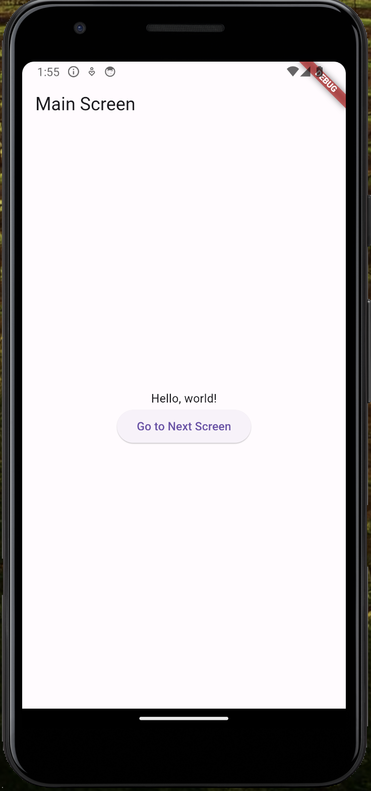

import { ProductScreenshot } from 'components/ProductScreenshot'
import EventsInPostHogLight from '../images/tutorials/flutter-feature-flags/events-light.png'
import EventsInPostHogDark from '../images/tutorials/flutter-feature-flags/events-dark.png'
import CreateFlagLight from '../images/tutorials/flutter-feature-flags/create-flag-light.png'
import CreateFlagDark from '../images/tutorials/flutter-feature-flags/create-flag-dark.png'

[Feature flags](/feature-flags) help you conditionally roll out and release features safely. This tutorial shows you how integrate them into your Flutter app using PostHog. 

We'll create a basic Flutter app, add PostHog, create a feature flag, and then implement the flag to control content in our app.

## 1. Create a new Flutter app

Our app will have two screens:

1. The first screen will have a button which takes you to a second screen.
2. The second screen will either have a `red` or `green` background color, depending on whether our feature flag is enabled or not.

To set this up, first ensure the [Flutter extension for VS Code](https://marketplace.visualstudio.com/items?itemName=Dart-Code.flutter) is installed. Then, create a new app by opening the Command Palette in VS Code (`Ctrl/Cmd + Shift + P`), typing `flutter` and selecting `Flutter: New Project`. 

Select `Empty Application` and name your app `flutter_feature_flags`. Then, replace your code in `lib/main.dart` with the following:

```dart file=lib/main.dart
import 'package:flutter/material.dart';
import 'feature_screen_view.dart';

void main() {
  runApp(const MyApp());
}

class MyApp extends StatelessWidget {
  const MyApp({super.key});
  @override
  Widget build(BuildContext context) {
    return const MaterialApp(
      title: 'Flutter Feature Flags App',
      home: MainScreen(),
    );
  }
}

class MainScreen extends StatelessWidget {
  const MainScreen({super.key});
  @override
  Widget build(BuildContext context) {
    return Scaffold(
      appBar: AppBar(title: const Text('Main Screen')),
      body: Center(
        child: Column(
          mainAxisAlignment: MainAxisAlignment.center,
          children: <Widget>[
            const Text('Hello, world!'),
            ElevatedButton(
              child: const Text('Go to Next Screen'),
              onPressed: () {
                Navigator.push(
                  context,
                  MaterialPageRoute(builder: (context) => const FeatureScreenView(isFlagEnabled: false)), // We update this later
                );
              },
            ),
          ],
        ),
      ),
    );
  }
}
```

Lastly, in the `lib` directory, create a new file for our second screen called `feature_screen_view.dart`. Add the following code to it:

```dart
import 'package:flutter/material.dart';

class FeatureScreenView extends StatelessWidget {
  final bool isFlagEnabled;

  const FeatureScreenView({Key? key, required this.isFlagEnabled}) : super(key: key);

  @override
  Widget build(BuildContext context) {
    return Scaffold(
      backgroundColor: isFlagEnabled ? Colors.green : Colors.red,
    );
  }
}
```

Press **F5** and run the app in any emulator (we chose Android) to see your app in action.



## 2. Add PostHog to your app

With our app set up, it’s time to install and set up PostHog. If you don't have a PostHog instance, you can [sign up for free](https://us.posthog.com/signup).

To start, install [PostHog’s Flutter SDK](/docs/libraries/flutter) by adding `posthog_flutter` to your `pubspec.yaml`:

```yaml file=pubspec.yaml
# rest of your code

dependencies:
  flutter:
    sdk: flutter
  posthog_flutter: ^4.0.1

# rest of your code
```

Next, we configure PostHog in each platform using our project API key and instance address. You can find these in [your project settings](https://us.posthog.com/settings/project).

### Android setup

For Android, add your PostHog configuration to your `AndroidManifest.xml` file located in the `android/app/src/main`:

```xml file=android/app/src/main/AndroidManifest.xml
<manifest xmlns:android="http://schemas.android.com/apk/res/android" package="your.package.name">
    <application>
        <!-- ... other configuration ... -->
        <meta-data android:name="com.posthog.posthog.API_KEY" android:value="<ph_project_api_key>" />
        <meta-data android:name="com.posthog.posthog.POSTHOG_HOST" android:value="<ph_instance_address>" /> <!-- usually 'https://app.posthog.com' or 'https://eu.posthog.com' -->
        <meta-data android:name="com.posthog.posthog.TRACK_APPLICATION_LIFECYCLE_EVENTS" android:value="true" />
        <meta-data android:name="com.posthog.posthog.DEBUG" android:value="true" />
    </application>
</manifest>
```

You'll also need to update the minimum Android SDK version to `21` in `android/app/build.gradle`:

```gradle_kotlin file=android/app/build.gradle
// rest of your config

    defaultConfig {
      minSdkVersion 21
      // rest of your config
    }

// rest of your config
```

### iOS setup

For iOS, you need to have [Cocoapods](https://guides.cocoapods.org/using/getting-started.html) installed. Then add your PostHog configuration to the `Info.plist` file located in the `ios/Runner` directory:

```xml ios/Runner/Info.plist
<?xml version="1.0" encoding="UTF-8"?>
<!DOCTYPE plist PUBLIC "-//Apple//DTD PLIST 1.0//EN" "http://www.apple.com/DTDs/PropertyList-1.0.dtd">
<plist version="1.0">
<dict>
<!-- rest of your configuration -->
  <key>com.posthog.posthog.API_KEY</key>
  <string><ph_project_api_key></string>
  <key>com.posthog.posthog.POSTHOG_HOST</key>
  <string><ph_instance_address></string>  <!--  https://app.posthog.com or https://eu.posthog.com -->
  <key>com.posthog.posthog.CAPTURE_APPLICATION_LIFECYCLE_EVENTS</key>
  <true/>
</dict>
</plist>
```

Then you need to set the minimum platform version to iOS 13.0 in your Podfile:

```yaml ios/Podfile
platform :ios, '13.0'

# rest of your config
```

### Web setup

For Web, add your `Web snippet` (which you can find in [your project settings](https://us.posthog.com/settings/project#snippet)) in the `<head>` of your `web/index.html` file:

```html file=web/index.html
<!DOCTYPE html>
<html>

<head>
  <!-- ... other head elements ... -->

  <script async>
    !function(t,e){var o,n,p,r;e.__SV||(window.posthog=e,e._i=[],e.init=function(i,s,a){function g(t,e){var o=e.split(".");2==o.length&&(t=t[o[0]],e=o[1]),t[e]=function(){t.push([e].concat(Array.prototype.slice.call(arguments,0)))}}(p=t.createElement("script")).type="text/javascript",p.async=!0,p.src=s.api_host+"/static/array.js",(r=t.getElementsByTagName("script")[0]).parentNode.insertBefore(p,r);var u=e;for(void 0!==a?u=e[a]=[]:a="posthog",u.people=u.people||[],u.toString=function(t){var e="posthog";return"posthog"!==a&&(e+="."+a),t||(e+=" (stub)"),e},u.people.toString=function(){return u.toString(1)+".people (stub)"},o="capture identify alias people.set people.set_once set_config register register_once unregister opt_out_capturing has_opted_out_capturing opt_in_capturing reset isFeatureEnabled onFeatureFlags getFeatureFlag getFeatureFlagPayload reloadFeatureFlags group updateEarlyAccessFeatureEnrollment getEarlyAccessFeatures getActiveMatchingSurveys getSurveys onSessionId".split(" "),n=0;n<o.length;n++)g(u,o[n]);e._i.push([i,s,a])},e.__SV=1)}(document,window.posthog||[]);
    posthog.init(
      '<ph_project_api_key>',
      {
        api_host:'<ph_instance_address>',
      }
    )
  </script>
</head>

<!-- ... other elements ... -->

</html>
```

## 3. Create a feature flag in PostHog

With PostHog set up, your app is ready for feature flags. To create one, go to the [feature flags tab](https://us.posthog.com/feature_flags) in PostHog and click **New feature flag**. Enter a flag key (like `my-cool-flag`), set the release condition to roll out to 100% of users, and press "Save."

<ProductScreenshot
  imageLight={CreateFlagLight} 
  imageDark={CreateFlagDark} 
  alt="Feature flag created in PostHog" 
  classes="rounded"
/>

You can customize your [release conditions](/docs/feature-flags/creating-feature-flags#release-conditions) with rollout percentages, and [user](/docs/product-analytics/user-properties) or [group properties](/docs/product-analytics/group-analytics) to fit your needs.

## 4. Implement the flag code

To implement the feature flag, we: 

1. Fetch the `my-cool-flag` flag using [`await Posthog().isFeatureEnabled('my-cool-flag')`](/docs/libraries/flutter#feature-flags).
2. Change the background color of `FeatureScreenView` based on the value of the flag.

To do this, update the code in `main.dart` to the following:

```dart filename=main.dart
import 'package:flutter/material.dart';
import 'feature_screen_view.dart';
import 'package:posthog_flutter/posthog_flutter.dart';

void main() {
  runApp(const MyApp());
}

class MyApp extends StatelessWidget {
  const MyApp({super.key});
  @override
  Widget build(BuildContext context) {
    return const MaterialApp(
      title: 'Flutter Feature Flags App',
      home: MainScreen(),
    );
  }
}

class MainScreen extends StatelessWidget {
  const MainScreen({super.key});

  void _getFeatureFlagAndNavigate(BuildContext context) {
    _fetchFeatureFlagValue((isFlagEnabled) {
      Navigator.push(
        context,
        MaterialPageRoute(builder: (context) => FeatureScreenView(isFlagEnabled: isFlagEnabled)),
      );
    });
  }

 void _fetchFeatureFlagValue(Function(bool) onFlagFetched) async {
    bool isFlagEnabled =  await Posthog().isFeatureEnabled('my-cool-flag'); 
    onFlagFetched(isFlagEnabled);
  }

  @override
  Widget build(BuildContext context) {
    return Scaffold(
      appBar: AppBar(title: const Text('Main Screen')),
      body: Center(
        child: Column(
          mainAxisAlignment: MainAxisAlignment.center,
          children: <Widget>[
            const Text('Hello, world!'),
            ElevatedButton(
              child: const Text('Go to Next Screen'),
              onPressed: () => _getFeatureFlagAndNavigate(context),
            ),
          ],
        ),
      ),
    );
  }
}
```

That's it! When you restart your app and click the button, you should see the green background color on the second screen. 

## Further reading

- [A software engineer's guide to A/B testing](/product-engineers/ab-testing-guide-for-engineers)
- [How to run A/B tests in Flutter](/tutorials/flutter-ab-tests)
- [How to run A/B tests in Android](/tutorials/android-ab-tests)
