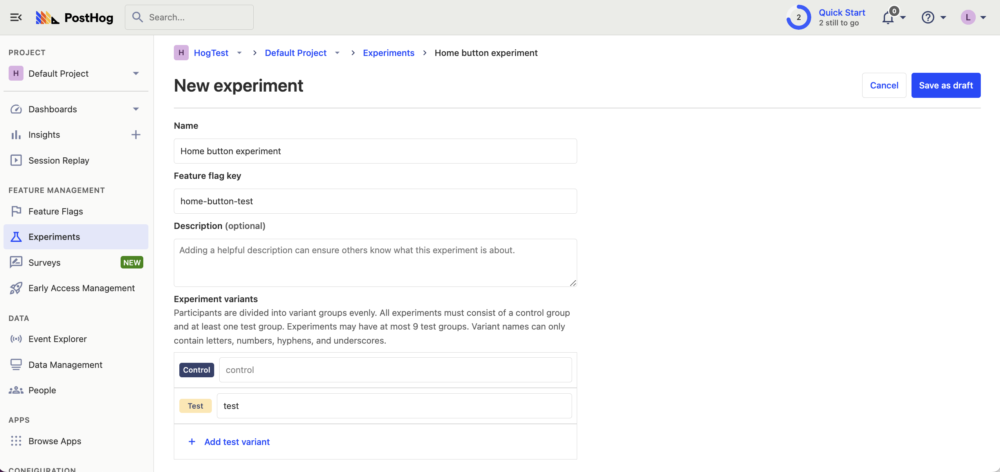

[Framer](https://www.framer.com/) is a great tool for building marketing websites. However, sometimes you may be unsure if a change you're making will actually improve your conversion rate. This is where [A/B testing](/ab-testing) is helpful. It enables you to test and compare your changes.

This tutorial shows you how to set up A/B tests with Framer and PostHog to get the most out of your website.

## Adding PostHog to your Framer site

First, [sign up to PostHog](https://app.posthog.com/signup). Then, go to your [project settings](https://app.posthog.com/settings/project) and copy your web snippet:


With the snippet copied, go to your Framer project settings by clicking the gear in the top right. If you haven’t already, sign up for the "Mini" site plan. This enables you to add custom code.

Go to the "General" tab in site settings and scroll down to the "Custom Code" section. Under "End of `<head>` tag", paste your PostHog snippet there. Make sure to press "Save" next to custom code.


## Adding a custom event

We're going to create an A/B test comparing how the text of a button affects it's click-through rate.

To do this, first we'll create a button using [custom code components](https://www.framer.com/developers/#code-components). Then, we [capture an event](/docs/product-analytics/capture-events) whenever the button is clicked. We'll use this event as our [goal metric](/product-engineers/ab-testing-guide-for-engineers#1-a-clear-measurable-goal) for our A/B test.

Go to the "Assets" tab in the top left of your Framer project. Then, click the plus icon next to the "Code" tab. This will show a pop up to create a new code file. Name the file `CaptureButton`, set it as a "New component" and press "Create."

In the new code file, delete the existing code and replace it with the following:

```js
export default function CaptureButton() {
    const handleClick = () => {
        window.posthog.capture("clicked_homepage_button", {
            $set_once: { clicked_homepage_button: true },
        })
    }

    return (
        <button id="capture-button" onClick={handleClick}>
            Click me
        </button>
    )
}
```

Press `Cmd/Ctrl + s` to save your changes. Then press the "Home" button to go back to the home page. Add your new 
`CaptureButton` to your page by dragging it from the Code tab.


Publish your site and then click your new button to [see the event in PostHog](https://app.posthog.com/events).


## Create an A/B test in PostHog

The next step is to set up an A/B test (We call them experiment in PostHog).

Go to the [Experiments tab](https://app.posthog.com/experiments) in PostHog and click "New experiment". Add the following details to your experiment:

1. Name it "Home button experiment".
2. Set "Feature flag key" to `home-button-test`.
3. Under the experiment goal, select the `clicked_homepage_button` we created in the previous step.
4. Use the default values for all other fields.

Click "Save as draft" and then click "Launch".



## Implement the A/B test in Framer

The final step is to add the experiment code in Framer. Go back to the code file for `CaptureButton`. Here we'll add code that does the following:

1. Fetch the `home-button-test` flag.
2. Change the title of the button based on the value of the flag (`control` or `test`).

To do this, we'll add a script. Go to your Framer settings and under the section `start of <body> tag` add the following code:

```js
<script>
  posthog.onFeatureFlags(() => {
   const button = document.getElementById('capture-button')
   if (button) {
      const flagValue = posthog.getFeatureFlag('home-button-test')
      if (flagValue === 'control') {
        button.text = "This is the title for CONTROL group"
      } else if (flagValue === 'test') {
         button.text = "This is the title for TEST group"
      }
   }
  });
</script>
```

Click "Save" and then publish your site.


That's it! Your A/B test is now live. When you visit your site you should see the updated button text. You can [view your test results](/docs/experiments/testing-and-launching#viewing-experiment-results) on the experiment page.

If you want to view both variants of your experiment to make sure they are working correctly, add the line `posthog.featureFlags.override({'home-button-test': 'test'})` to your code:

```js
<script>
  posthog.onFeatureFlags(() => {
   posthog.featureFlags.override({'home-button-test': 'test'}) // or 'control' 

   const button = document.getElementById('capture-button')
   if (button) {
      const flagValue = posthog.getFeatureFlag('home-button-test')
      if (flagValue === 'control') {
        button.text = "This is the title for CONTROL group"
      } else if (flagValue === 'test') {
         button.text = "This is the title for TEST group"
      }
   }
  });
</script>
```

## Further reading

- [How to set up Framer analytics, session replay, and more](/tutorials/framer-analytics)
- [How to set up Webflow analytics and session recordings with PostHog](/tutorials/webflow)
- [How to run A/B tests in Webflow with PostHog](/tutorials/webflow-ab-tests)
