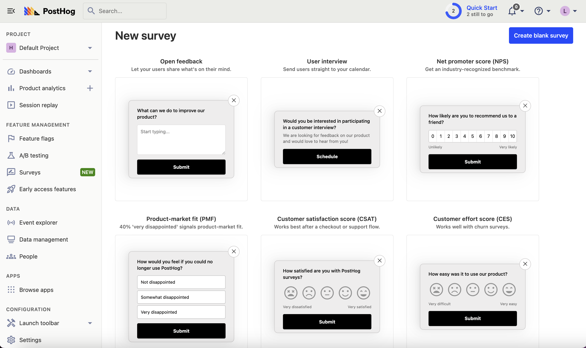

Surveys are a great way to conduct market research and collect qualitative data from your users. This tutorial shows you how to do exactly that by using PostHog on your [Framer](https://framer.com/) website.

We'll show you to add PostHog to your Framer site and then create beautiful surveys in just a few clicks.

## Adding PostHog to your Framer site

First, [sign up to PostHog](https://app.posthog.com/signup). Then, go to your [project settings](https://app.posthog.com/settings/project) and copy your web snippet.  It looks like this:

```js
<script>
    !function(t,e){var o,n,p,r;e.__SV||(window.posthog=e,e._i=[],e.init=function(i,s,a){function g(t,e){var o=e.split(".");2==o.length&&(t=t[o[0]],e=o[1]),t[e]=function(){t.push([e].concat(Array.prototype.slice.call(arguments,0)))}}(p=t.createElement("script")).type="text/javascript",p.async=!0,p.src=s.api_host+"/static/array.js",(r=t.getElementsByTagName("script")[0]).parentNode.insertBefore(p,r);var u=e;for(void 0!==a?u=e[a]=[]:a="posthog",u.people=u.people||[],u.toString=function(t){var e="posthog";return"posthog"!==a&&(e+="."+a),t||(e+=" (stub)"),e},u.people.toString=function(){return u.toString(1)+".people (stub)"},o="capture identify alias people.set people.set_once set_config register register_once unregister opt_out_capturing has_opted_out_capturing opt_in_capturing reset isFeatureEnabled onFeatureFlags getFeatureFlag getFeatureFlagPayload reloadFeatureFlags group updateEarlyAccessFeatureEnrollment getEarlyAccessFeatures getActiveMatchingSurveys getSurveys onSessionId".split(" "),n=0;n<o.length;n++)g(u,o[n]);e._i.push([i,s,a])},e.__SV=1)}(document,window.posthog||[]);
    posthog.init('<ph_api_key>',{api_host:'<ph_client_api_host>'})
</script>
```

With the snippet copied, go to your Framer project settings by clicking the gear in the top right. If you haven’t already, sign up for the "Mini" site plan. This enables you to add custom code.

Go to the "General" tab in site settings and scroll down to the "Custom Code" section. Under "End of `<head>` tag", paste your PostHog snippet. Make sure to press "Save" next to custom code.

Finally, publish your site.


## Create your survey

Create a survey in PostHog by going to the [surveys tab](https://app.posthog.com/surveys) and clicking "New survey." There are a variety of [survey types](/docs/surveys/creating-surveys#question-type) to choose from, or you can create your own by clicking "Create blank survey".



Next, customize your survey as needed. You can customize the questions, branding, and targeting. See our [survey docs](/docs/surveys/creating-surveys) for more details on how to do so.

Then, click "Save as draft" and then "Launch". Your survey is now live and you should see it on your website! 

## Viewing survey results

After interacting with your survey, you can view results by selecting the survey from the [surveys tab](https://app.posthog.com/surveys). You'll see data on:

- How many users have seen the survey.
- How many users have dismissed the survey.
- Responses.

You can also filter these results based on [user properties](/docs/product-analytics/user-properties), [cohorts](/docs/data/cohorts), [feature flags](/docs/feature-flags/creating-feature-flags) and more.


## Further reading

- [How to set up Framer analytics and session recordings](/tutorials/framer-analytics)
- [How to run A/B tests in Framer](/tutorials/framer-ab-tests)
- [How to analyze surveys with ChatGPT](/tutorials/analyze-surveys-with-chatgpt)