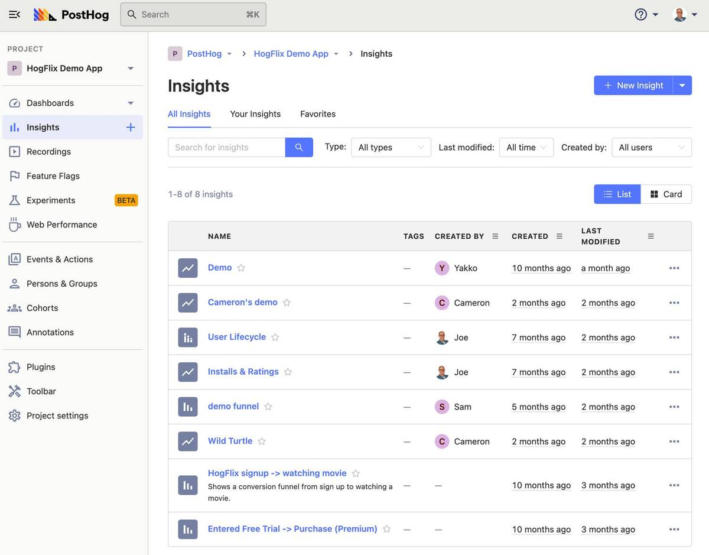
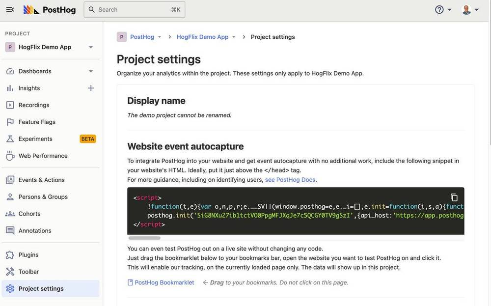
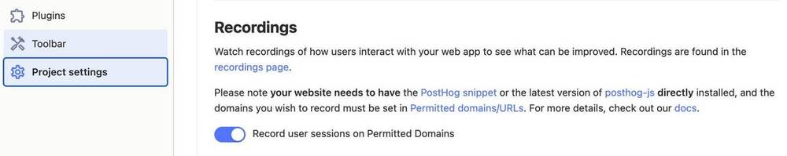
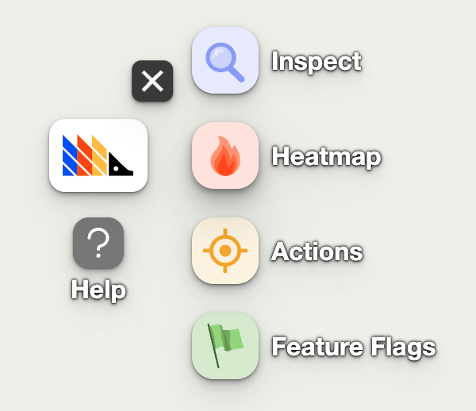
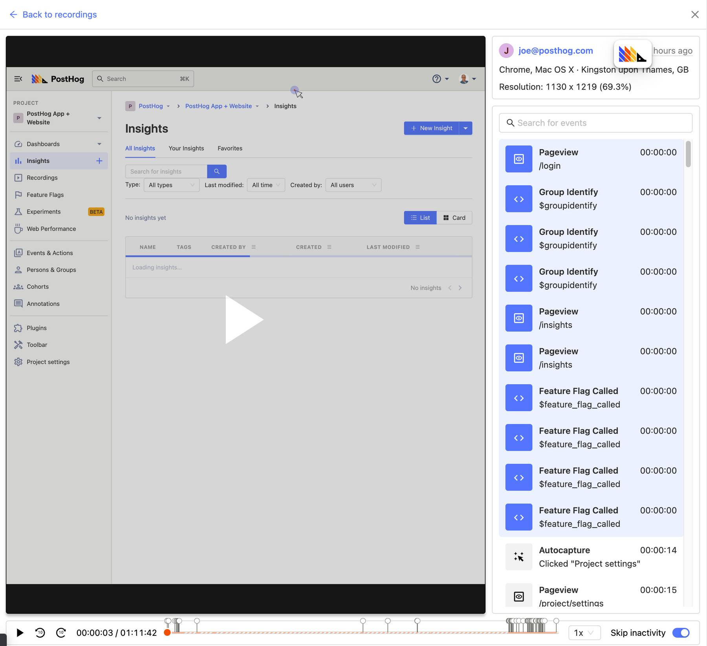

_Estimated reading time: 9 minutes_ ☕☕

Hotjar is one of the most popular tools for understanding some aspects of user behavior, specifically through session recordings and heatmaps. These tools are useful because they enable you to see how users actually interact with your product or website, both at an individual and aggregate level. 

However, one of the limitations of Hotjar is that it offers only a handful of such tools and doesn’t provide the deeper product analytics tools that modern teams rely on. Often this means that Hotjar is deployed alongside other tools, such as Mixpanel, Amplitude or Pendo — meaning integrations are required to share data and teams need to frequently switch between platforms. 

[Hotjar is also costly on its own](https://www.hotjar.com/pricing/), often costing hundreds of pounds per month or limiting free users to only 1,050 monthly session recordings. 

In this tutorial we’ll explore how PostHog can be used as an alternative to Hotjar, offering greater functionality so that teams don’t need to use multiple tools at once.

## Step 1: Get started with PostHog

If you haven’t already started using PostHog, that’s the obvious first step. You can choose between self-hosted or cloud-hosted options depending on your preferences and privacy requirements. Broadly speaking self-hosted deployments require more technical knowledge to get started, but offer greater control over your data — but [check the Pricing page for more information](/pricing).

Whichever option and pricing tier you choose, PostHog offers a generous free allowance of events:

- Users on [PostHog Cloud](/pricing) receive 10,000 free events each month
- Users on [PostHog Scale](/pricing) also receive 1 million free events each month
- Users on [PostHog Open Source](/pricing) have no limit on the number of tracked events

It’s worth noting that some tiers do not have access to premium features, such as [Correlation Analysis](/docs/user-guides/correlation) or [A/B Experimentation](/docs/user-guides/experimentation). However, _all_ tiers have access to core features such as [Session Recording](/docs/user-guides/recordings), [Funnel](/docs/user-guides/funnels) & [Trend Analysis](/docs/user-guides/trends) and [Feature Flags](/docs/user-guides/feature-flags). 

> Session Recordings do not currently count towards your free event limit and there is no limit on the number of recordings you can capture on any pricing tier.

## Step 2: Enable event capture

We strongly recommend enabling PostHog's autocapture feature to make sure you get the most out of Session Recording and that common events, such as pageviews, are automatically ingested. You can then analyse these events and filter Session Recordings for them, combining the capabilities of Hotjar with a product analytics platform. 

To start capturing events you must add the snippet found in your Project Settings page above the `</head>` tag in your website HTML. This snippet also enables you to capture custom events, which you can define in the Events & Actions page. You can then filter any captured session based on these [custom events](/docs/user-guides/events), or even [use Feature Flags to _only_ capture these sessions](/docs/user-guides/recordings#further-controls). 

You can [disable autocapture](https://posthog.com/docs/integrate/client/js#config) separately if you only wish to capture custom events, but doing so will greatly limit your ability to filter Session Recordings or to analyze product usage. You cannot opt out of capturing any events, as while while session recordings do not count towards your allowance of free events, each recording does generate at least one event. 

## Step 3: Enable Session Recording & Heatmaps

Session Recording is not enabled by default, so must be turned on to start capturing sessions.. Currently, recordings can only be used with [PostHog’s JavaScript library](/docs/integrate/client/js) and must be enabled within Project Settings. 

Once Session Recordings are enabled, you must add the sites you want to record sessions from to your list of permitted domains and URLs. This list is also found in your Project Settings.

If you visit any of the permitted domains or URLs while logged in to PostHog then the [toolbar](/docs/user-guides/toolbar) will automatically launch, enabling you to view heatmap data, toggle feature flags and inspect page elements. 

## Step 4: Ignore sensitive user info

If your product captures any sensitive information from users, you can add the CSS class name `ph-no-capture` to elements in order to [block PostHog from capturing sensitive information](https://posthog.com/docs/user-guides/recordings#ignoring-sensitive-elements).  

## Step 5: Watch recordings and close your Hotjar account

By following these steps you’ve successfully replaced Hotjar and begun capturing sessions in PostHog, where you can also conduct detailed product analysis, run A/B experiments, roll out feature flags and more.

You can access any recordings captured by PostHog in the Recordings section, once you’ve logged in. Here, you can use filters to find all recordings which match a set of conditions based on your captured events  — such as recordings where a user completed a purchase.

Final step: ask yourself if you still need Hotjar now.
