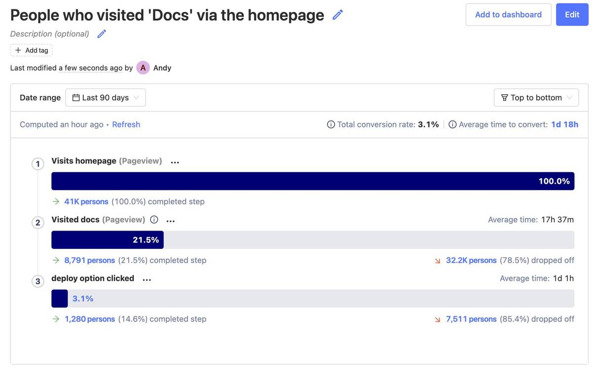

_Estimated reading time: 8 minutes_ ☕☕

A user landing on a page is just the beginning. You want users to sign up, use the product, pay you, or complete a series of steps in your product to make full use of a key feature.

To determine how well you're achieving these goals, you need to look at conversion, and funnels are a great way to measure and visualize conversion.

This tutorial will walk you through creating a funnel step-by-step, while covering some of the use cases and features of PostHog Funnels. 

## Before you start

To follow this tutorial along, you need to:

1. Have [deployed PostHog](/docs/deployment).
1. Have started receiving events via our [snippet](/docs/integrate/client/js), one of our [integrations](/docs/integrate/overview), or our [API](/docs/api/overview)

> **Note:** It can also be useful to have some [actions](/docs/tutorials/toolbar#creating-actions) set up, but not necessary.

## When you should use Funnels

Funnels are great for when your users should perform actions in succession. That is, if you need your user to do something _and then_ do something else, funnels are a great way to gather insights into that process.

Above is a very simple example of a Funnel in PostHog, measuring how often people visits our docs after arriving on the homepage. This users the top to bottom view, but there's also a left to right option, as seen below

Funnels can have as many steps as you like and offer a good look into both what percentage of **unique users** are converting from one step to another, as well as identifying which users convert, and which don't.

A standard, but very useful, funnel is looking at the sign up process from end-to-end. You can set up a funnel starting from the moment the user lands on your page to when they actually complete the process. You are then able to find out where users are dropping off, and work on improving those areas.

## Creating your first funnel

### Step 1: Create a new insight

Funnels are part Insights in PostHog. 

Click on the '+' icon next to 'Insights' in the sidebar to start creating a new insight, or click on 'New insight' on the Insights page.

Then, in the insight builder, click on 'Funnels' to start creating your funnel.

### Step 2: Adding steps to your funnel

The Funnels builder is split into two panes: 'Query Steps' on the left for defining your funnel, and a preview pane on the right. Changes are calculated on-the-fly, so you can see if your funnel is set up correctly as you go.

There's no limit to the number of steps you can add to your funnel, but let's start with a simple example first.

Click on the first step to edit it and search for your desired Event or Action. In this case, we're going to select the 'Pageview' event and then apply a filter for users visiting the PostHog homepage.

FUNNEL STEP 1 VIDEO HERE

You can apply filters to specific steps in the funnel, or apply a general filter to the entire funnel in the 'Filters' section below the 'Query Steps' section. By default we filter out internal and test users - read our [how to filter internal users tutorial](/tutorials/filter-internal-users) for how to set that up.

Next, we're going to add a second step to our funnel. The results are instantly calculated.

FUNNEL STEP 2 VIDEO HERE

By default, PostHog calculates the conversion rate based on a "window" of 14 days. This means a user who performs 'step 1' on day 1 and 'step 2' on day 13 and will count as a conversion. Users who convert outside of the window are considered drop-offs.

You can specify other limits based on minutes, hours, days, weeks, or months using the 'Conversion window limit' box below the funnel builder.

CONVERSION WINDOW CLIP HERE

Note how, in the example above, the conversion rate drops from 10% to 7.8% when we switch from 14 days to 14 minutes.

### Step 3: Evaluate Correlated Events

Once you've built a funnel in PostHog, you can take advantage of one our most powerful features. Correlation Analysis.

[Correlation Analysis](/docs/user-guides/correlation) automatically highlights significant factors that impact the conversion rate of users within the funnel, including events and properties.

It's a powerful way to discover eye-opening insights into what your users are actually doing, allowing you to refine your funnel, and better understand your product.

> **Note:** Correlation Analysis is a paid-only feature available on the [Scale](https://license.posthog.com/) and [Enterprise](/signup/self-host/get-in-touch?plan=enterprise#contact) self-hosted plans, and all paid plans on PostHog Cloud.

Let's take a look at the Correlated Events for our example.

The top result immediately stands out as significant. "Persons who converted were 34x more likely" to perform the "deploy option clicked" event.

In other words: people who visited the our docs from the homepage were 34x more likely to then deploy PostHog.

From this we can reasonably conclude that the quality of our documentation is a contributing factor to whether users choose to deploy PostHog, and we should dedicate reasonable effort to ensuring our docs are written to a high standard, and kept up-to-date.

We can also add the "deploy option clicked" event to our funnel, as per below:

## Filters and advanced options

### How to use filters on funnels

As noted earlier, you can add global events that apply to the entire funnel. This is useful for interrogating a specific subset of users, such as:

- Those who arrived via a Google search
- Those who arrived via a specific UTM parameter (e.g. marketing campaigns)
- Those who use a specific operating system
- Users defined by location (continent, country, city etc.)

To add a filter, simply click on the blue 'Add filter group' under 'Filters' and add your desired filters. You can filter by 'AND' (all filters must be met) or by 'OR' (any filter can be met).

You can also use filters by [Cohorts](/docs/user-guides/cohorts) – a useful way to isolate a funnel based on users who perform a specific action, or even a group of users from the same organization.

Clicking 'Add to dashboard' allows you add you funnels to an existing dashboard or a new one, and building a dashboard showing the same funnel with various filters (e.g. conversion by platform, conversion by age etc.) is a great foundation for an actional dashboard you'll monitor every week.

You also have the option to breakdown your funnel in all the same ways you can filter funnels by clicking 'Add breakdown'.

Here's of our example funnel broken down by continent:

Mousing over each breakdown will show the conversion rate for that specific result. You can also add or remove properties from the breakdown using the tick boxes below the funnel. 

### Advanced options

There are three settings to play with under the 'Advanced options' drop down.

**Step order** controls how strictly the funnel is measured. There are three options:

- **Sequential (default):** Step B must happen after Step A, but any number of events can happen between
- **Strict order:** Step B must happen directly after Step A
- **Any order:** Steps can be completed in any sequence

We default to 'Sequential' because a perfect A to B to C funnel is rare, and using this option will result in much lower conversion numbers in most cases. That said, it is applicable in some cases where the front-end user journey options are stricly controlled.

**Conversion rate calculation** controls how the conversion rate is calculated. By default we measure the overall conversion rate relative to the first step in the funnel, but here you can choose 'Relative to previous step' if you prefer. Note, however, that in the 'Top to bottom' funnel view, the relative conversaion rate appears in brackets beneath each step.

Finally, **Exclusion steps** allow you exclude people who triggered other events between specific steps in your funnel. There are numerous edge cases for why you might want to do this, such as wanting to exclude people who contacted support, or booked a demo, before converting. 

## Putting your funnel to use

### Conversion metrics

The simplest way to use a funnel is to calculate conversion rates for all users on a set of steps. 

This can supply relevant information for your KPIs and business metrics, such as:

* Percentage of users paid for a subscription once the free trial ended
* Conversion rate from your cheaper plan to your more expensive plan
* Percentage of users that actually used the product after signing up
* Number of active users that tried the newest Beta feature

In addition, if you have a complicated process such as a feature that requires extensive setup, or a sign up process that requires a lot of information, setting up a funnel can help you figure out _exactly_ where users drop out of the process, so you can improve that step to make sure that users complete the funnel, even if it is a "long" one. Once you make the necessary adjustments, it is also extremely valuable to monitor how your funnel changes over time.

### Visualize individual users 

PostHog not only provides you with funnels that display aggregate user data, but also allows you to see each individual user going through the funnel. 

You can find this on the bottom-left of the Funnels page by scrolling down:

This way, you are able to take direct action on each user, such as send a follow-up email, or give them a discount. 

This can be especially useful for companies with a focus on outbound Sales, for example. Since you are able to get distinct information about where each user dropped off on a funnel, you can tailor your Sales pitch appropriately to that person. 

### Filtering

Filtering is a functionality present on all of PostHog's features, and it can be particularly useful for funnels. 

You can use filtering to, for instance, compare funnels across [Cohorts](/docs/user-guides/cohorts) or user groups with shared properties. You can then determine what groups have better conversion rates, and investigate why.

For example, if you find that conversion is about the same across all browsers, but extremely low for Internet Explorer, you might wonder if your website is actually working correctly on IE.

Or, in a more advanced case, you can determine if users with the custom property `job_title` set to `Product Manager` convert better or worse than users that have it set to `Software Developer`. This can help you evaluate who your target customer base is, if it matches your expectation, and how you can improve your product's user experience as a result. 
