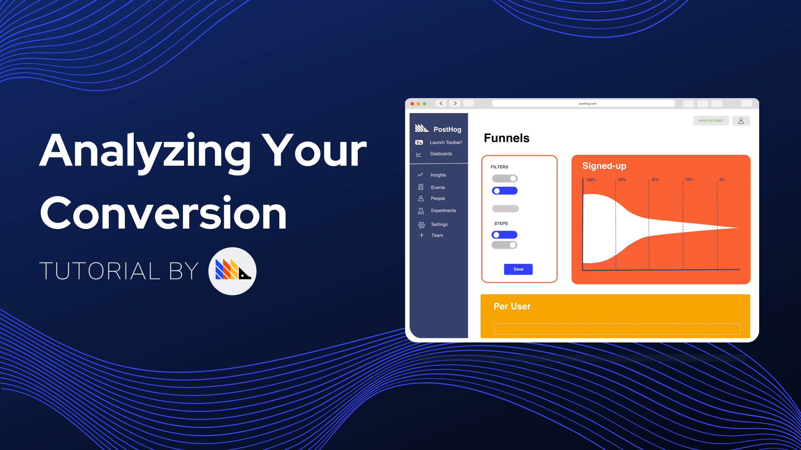
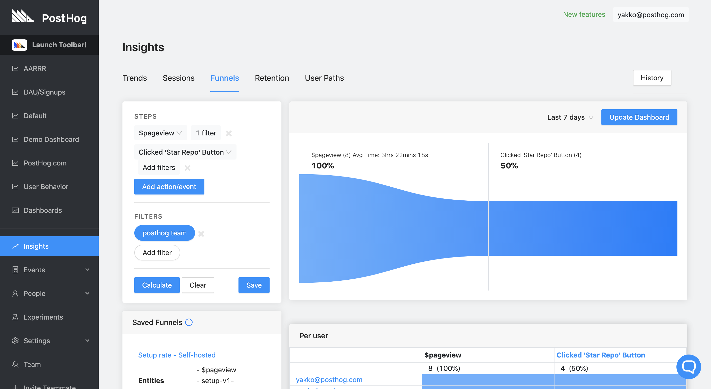
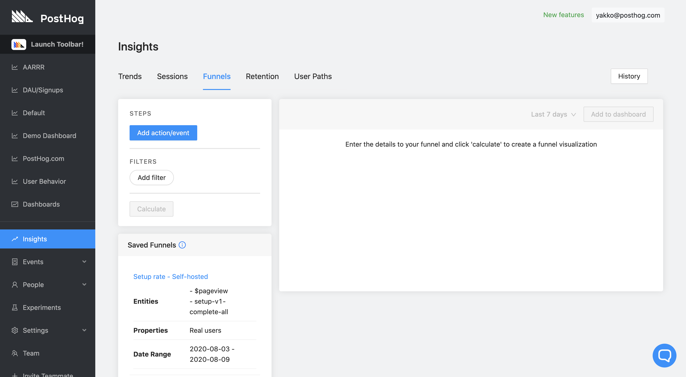
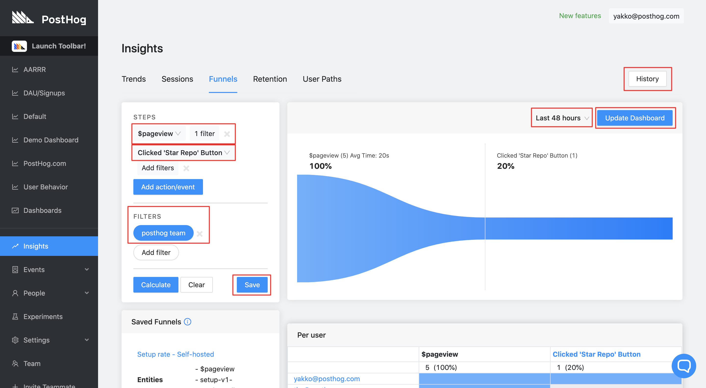
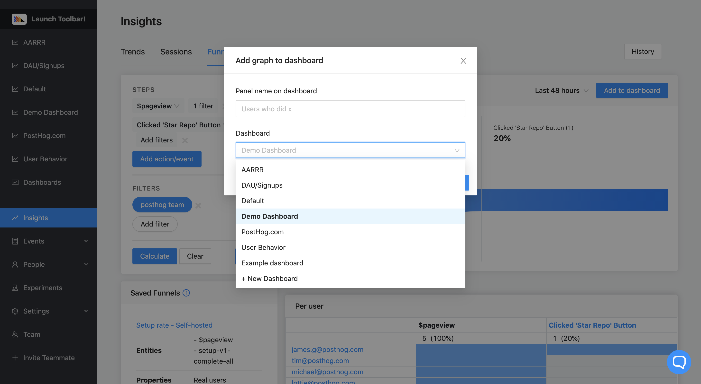
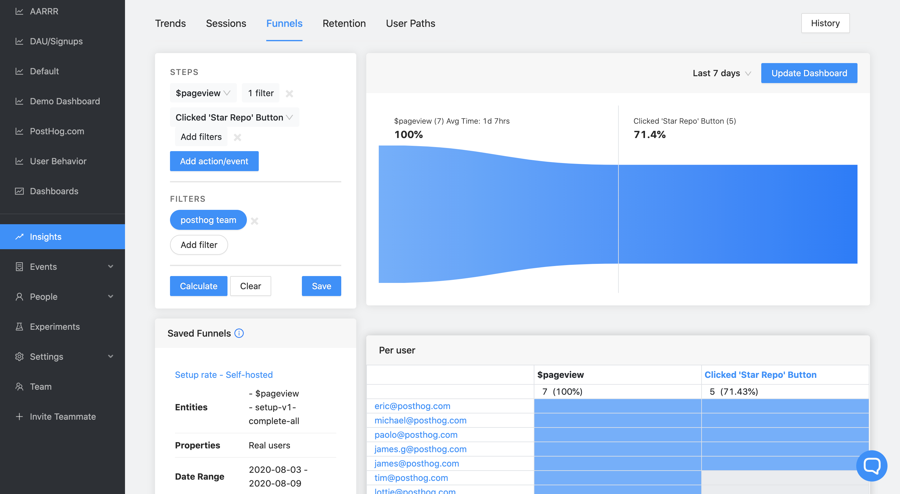

_Estimated reading time: 8 minutes_ ☕☕

For most products, having a user land on your page is just the beginning. 

After all, a pageview isn't worth much if it doesn't lead to anything. 

You want users to sign up, use the product, pay you. 

Or, alternatively, you want them to complete a series of steps in your product to make full use of a key feature.

To determine how well you're achieving these goals, you need to look at **conversion**.

Conversion rates tell you how well (or poorly) you're getting users from one step or action you need them to perform to another. 

For example, after a user visits your landing page, you want them to click a sign up button. Then, you want them to actually complete the signup process.

This process alone raises a lot of important questions for your business metrics, such as:

_"What percentage of users who visit my website actually sign up?"_

To answer those questions, you should really be using funnels.

Above is a simple example of a PostHog funnel. It was made to answer the question:

_"Out of the PostHog team members who visited the website, how many clicked our 'Star Repo' button?"_

Just like us, you probably have a lot of questions that can be answered with funnels. 

Hence, this tutorial will walk you through creating a funnel step-by-step, while covering some of the use cases and features of PostHog funnels. 

...

_Prefer to watch a video? Check out the [Funnels section of our demo video](https://youtu.be/aUILrrrlu50?t=504) for a shorter overview of this functionality._

## Prerequisites

To follow this tutorial along, you need to:

1. Have [deployed PostHog](/docs/deployment).
1. Have started receiving events via our [snippet](/docs/integrate/client/js), one of our [integrations](/docs/integrate/overview), or our [API](/docs/api/overview)

> **Note:** It can also be useful to have some [actions](/docs/tutorials/toolbar#creating-actions) set up, but not necessary.

## When you should use Funnels

Funnels are great for when your users should perform actions in succession. That is, if you need your user to do something _and then_ do something else, funnels are a great way to gather insights into that process.

Funnels can have as many steps as you like and offer a good look into both what percentage of **unique users** are converting from one step to another, as well as identifying which users convert, and which don't.

A standard but very useful funnel is looking at the sign up process from end to end, for example. You can set up a funnel starting from the moment the user lands on your page to when they actually complete the process. You are then able to find out where users are dropping off, and work on improving those areas.

## Creating your first funnel

### Step 1: Navigate to 'Funnels'

Our 'Funnels' feature is located in 'Insights'. After navigating to 'Insights' on the sidebar, click on the 'Funnels' tab to get to this page:

### Step 2: Adding steps to your funnel

Once you're on the 'Funnels' page, you can then start to create your funnel.

Click on the blue 'Add action/event' button and select the action or event you want to use as the starting point for your funnel.

You can then add a filter to that specific action now or a general filter to the entire funnel later on ('Filters' -> 'Add filter'). 

It's also worth noting how the PostHog funnels work in terms of what counts as a conversion to the next step. When your funnel is ready, you will have the ability to specify a time range for your funnel, such as "Last 7 days", "Last 48 hours", or a custom range. 

Then, based on that time range, PostHog will determine conversion based on if the user performed one action after the other _at any point during the time period_. That means that if my time range is set to 2 weeks, a user may perform step 1 on day 2 and step 2 on day 13 and it will still count as a conversion. 

### Step 3: Calculating funnel

Once you're satisfied with all the steps you've added, you can then click 'Calculate' to generate the funnel.

This should yield something like this (without the red rectangles):

Let's go over the highlighted areas on this image:

**$pageview**

First step of the funnel. Created from the `$pageview` _event_. It has a filter added to the event specifically.

**Clicked 'Star Repo' button**

Second step of the funnel. Created from a custom _action_. 

**Save**

The 'Save' button lets you save your funnel once it has been created. It will then appear under 'Saved Funnels' at the bottom left of the page. 

**Last 48 hours**

Clicking here will let you configure the time range for your funnel. 

**Update dashboard**

For you, this button might say 'Add to Dashboard'. This lets you add your funnel to one of your custom dashboards. If you are editing a funnel that is already on a dashboard, this button will then say 'Update Dashboard'.

**History**

The 'History' button is available at every tab on Insights. It lets you go back through the charts and funnels you have created in the past so that you can make sure you never lose your work.

### Step 4: Adding funnel to dashboard

If you click the 'Add to Dashboard' button on the top right, this will open up the following modal:

Here you can set a name for your funnel and add the funnel to one of your dashboards (or create a new one).

Once on the dashboard, you can resize panels as you wish, change colors, or share the dashboard publicly. To learn more about how to use our Dashboards feature you should visit our [dedicated page](/docs/user-guides/dashboards). 

## Putting your funnel to use

### Conversion metrics

The simplest way to use a funnel is to calculate conversion rates for all users on a set of steps. 

This can supply relevant information for your KPIs and business metrics, such as:

* Percentage of users paid for a subscription once the free trial ended
* Conversion rate from your cheaper plan to your more expensive plan
* Percentage of users that actually used the product after signing up
* Number of active users that tried the newest Beta feature

In addition, if you have a complicated process such as a feature that requires extensive setup, or a sign up process that requires a lot of information, setting up a funnel can help you figure out _exactly_ where users drop out of the process, so you can improve that step to make sure that users complete the funnel, even if it is a "long" one. Once you make the necessary adjustments, it is also extremely valuable to monitor how your funnel changes over time.

### Visualize individual users 

PostHog not only provides you with funnels that display aggregate user data, but also allows you to see each individual user going through the funnel. 

You can find this on the bottom-left of the Funnels page by scrolling down:

This way, you are able to take direct action on each user, such as send a follow-up email, or give them a discount. 

This can be especially useful for companies with a focus on outbound Sales, for example. Since you are able to get distinct information about where each user dropped off on a funnel, you can tailor your Sales pitch appropriately to that person. 

### Filtering

Filtering is a functionality present on all of PostHog's features, and it can be particularly useful for funnels. 

You can use filtering to, for instance, compare funnels across [Cohorts](/docs/user-guides/cohorts) or user groups with shared properties. You can then determine what groups have better conversion rates, and investigate why.

For example, if you find that conversion is about the same across all browsers, but extremely low for Internet Explorer, you might wonder if your website is actually working correctly on IE.

Or, in a more advanced case, you can determine if users with the custom property `job_title` set to `Product Manager` convert better or worse than users that have it set to `Software Developer`. This can help you evaluate who your target customer base is, if it matches your expectation, and how you can improve your product's user experience as a result. 
