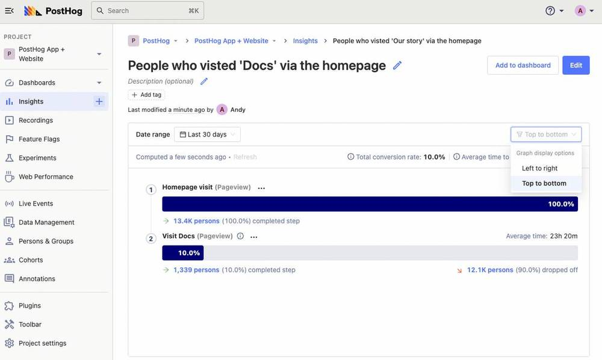
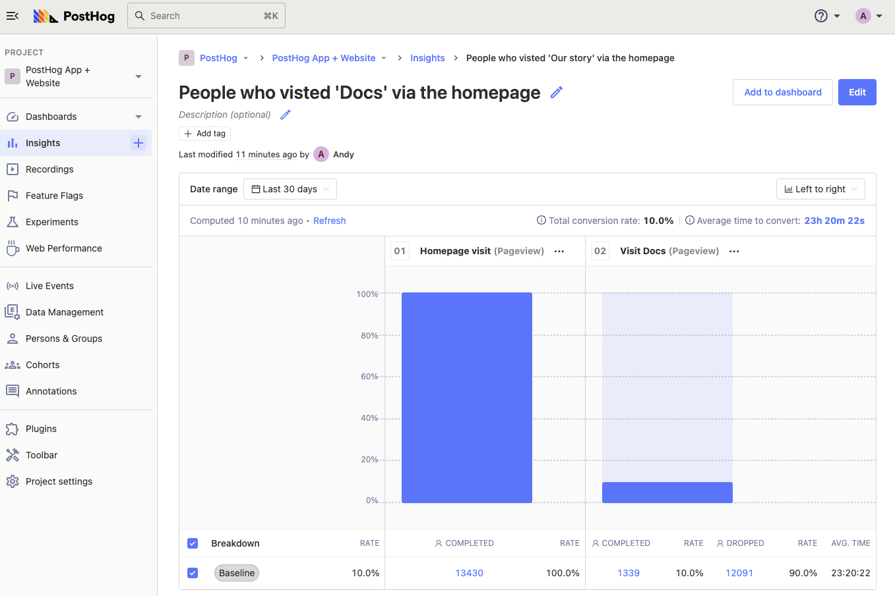
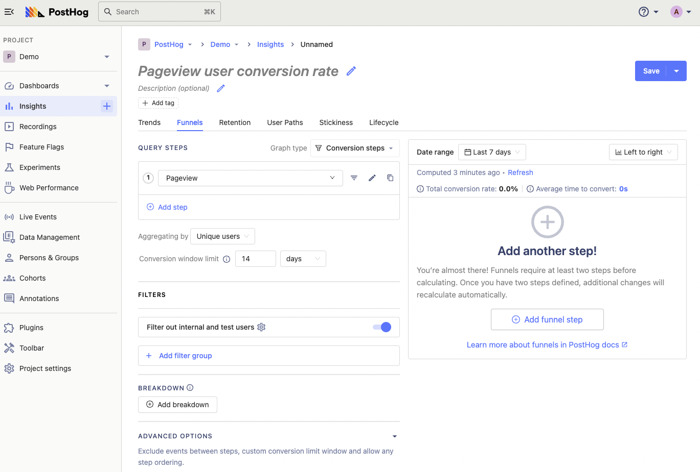
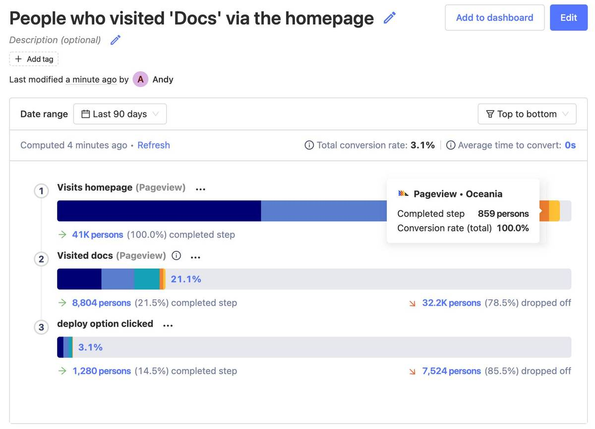
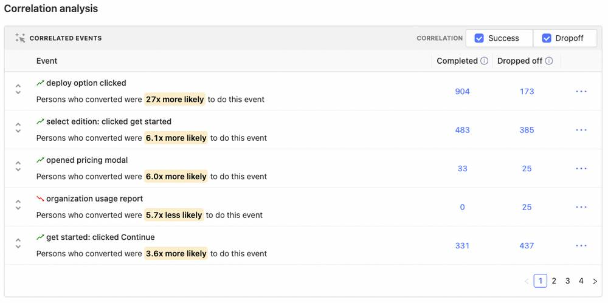
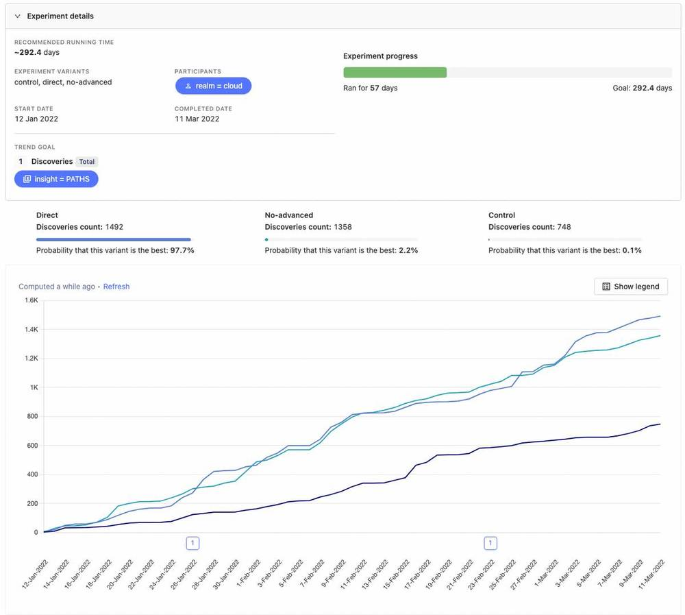

- **Level:** Intermediate 🦔🦔
- **Estimated reading time:** 9 minutes ☕️☕️

A user landing on a page is just the beginning. You want users to sign up, use the product, pay you, or complete a series of steps in your product to make full use of a key feature.

To determine how well you're achieving these goals, you need to look at conversion, and funnels are a great way to measure and visualize conversion.

This tutorial walks you through creating a conversion funnel in PostHog, and the advanced options available for analyzing, iterating on, and ultimately improving conversion.

## Before you start

To follow this tutorial you need to:

1. Have [deployed PostHog](/docs/deployment).
1. Have started receiving events via our [snippet](/docs/integrate/client/js), one of our [integrations](/docs/integrate/overview), or our [API](/docs/api/overview)

> **Note:** It can also be useful to have some [actions](/docs/tutorials/toolbar#creating-actions) set up, but not necessary.

### When to use Funnels

Funnels are great for when your users should perform actions in succession - i.e. if you need your user to do something _and then_ do something else.

Above is a very simple example of a funnel in PostHog, measuring how often people visit our docs after arriving on the homepage. We have two funnel views: top-to-bottom (above) and left-to-right (below).

Funnels can have as many steps as you like, and reveal both what percentage of **unique users** are converting from one step to another, and which users do or don't convert.

Creating an onboarding or sign-up funnel is one of the first things most PostHog users do, but there are plenty of other uses, such as measuring the:

* Percentage of users paid for a subscription once the free trial ended
* Conversion rate from your cheaper plan to your more expensive plan
* Percentage of users that actually used the product after signing up
* Number of active users that tried the newest beta feature

Funnels are also useful for interrogating complicated sign up processes, or a features that require extensive setup. 

Setting up a funnel can help you figure out _exactly_ where users drop out of the process, so you can improve that step to make sure that users complete the funnel, even if it is a "long" one.

## Step 1: Create your funnel

Funnels are part Insights in PostHog. 

Click on the '+' icon next to 'Insights' in the sidebar to start creating a new insight, or click on 'New insight' on the Insights page.

Then, in the insight builder, click on 'Funnels' to start creating your funnel.

The Funnels builder is split into two panes: 'Query Steps' on the left for defining your funnel, and a preview pane on the right. Changes are calculated on-the-fly, so you can see if your funnel is set up correctly as you go.

There's no limit to the number of steps you can add to your funnel, but let's start with a simple example first.

Click on the first step to edit it and search for your desired Event or Action. In this case, we're going to select the 'Pageview' event and then apply a filter for users visiting the PostHog homepage.

<iframe src="https://giphy.com/embed/hqpnX7rw5bUglvJoKt" width="100%" height="100%" style="position:absolute" frameBorder="0" class="giphy-embed" allowFullScreen></iframe>

You can apply filters to specific steps in the funnel, or apply a general filter to the entire funnel in the 'Filters' section below the 'Query Steps' section. We filter out internal and test users by default - read our [how to filter internal users](/tutorials/filter-internal-users) tutorial for how to set that up.

Next, we're going to add a second step to our funnel. The results are instantly calculated.

<iframe src="https://giphy.com/embed/Flrq2JcZxkHZZLRAi9" width="100%" height="100%" style="position:absolute" frameBorder="0" class="giphy-embed" allowFullScreen></iframe>

By default, PostHog calculates the conversion rate based on a "window" of 14 days. This means a user who performs 'step 1' on day 1 and 'step 2' on day 13 and will count as a conversion. Users who convert outside of the window are considered drop-offs.

You can specify other limits based on minutes, hours, days, weeks, or months using the 'Conversion window limit' box below the funnel builder.

### Using filters in Funnels

As noted earlier, you can add global filters that apply to the entire funnel. This is useful for interrogating a specific subset of users, such as:

- Users who arrived via a Google search
- Users who arrived via a specific UTM parameter (e.g. marketing campaigns)
- Users by operating system
- Users by location (continent, country, city etc.)

To add a filter, click on the blue 'Add filter group' under 'Filters' and add your desired filters. You can filter by 'AND' (all filters must be met) or by 'OR' (any filter can be met).

You can also use filters by [cohorts](/docs/user-guides/cohorts) – a useful way to isolate a funnel based on users who perform a specific action, or even a group of users from the same organization.

Clicking 'Add to dashboard' allows you add you funnels to an existing dashboard or a new one.

You also have the option to breakdown your funnel in all the same ways you can filter funnels by clicking 'Add breakdown'.

Here's of our example funnel broken down by continent:

Mousing over each breakdown will show the conversion rate for that specific result. You can also add or remove properties from the breakdown.

### Advanced options in Funnels

**Step order** controls how strictly the funnel is measured. There are three options:

- **Sequential (default):** Step B must happen after Step A, but any number of events can happen between
- **Strict order:** Step B must happen directly after Step A
- **Any order:** Steps can be completed in any sequence

We default to 'Sequential' because a perfect A to B to C funnel is rare, and using 'Strict order' results in much lower conversion numbers in most cases. That said, it is applicable in some cases where the front-end user journey options are strictly controlled.

**Conversion rate calculation** controls how the conversion rate is calculated. By default we measure the overall conversion rate relative to the first step in the funnel, but here you can choose 'Relative to previous step' if you prefer. Note, however, that in the 'Top to bottom' funnel view, the relative conversion rate appears in brackets beneath each step.

Finally, **Exclusion steps** allow you exclude people who triggered other events between specific steps in your funnel. There are numerous edge cases for why you might want to do this, such as wanting to exclude people who contacted support, or booked a demo, before converting for attribution purposes.

## Step 2: Evaluate correlated events

Once you've built a funnel in PostHog, you can take advantage of one our most useful features: Correlation Analysis.

[Correlation Analysis](/docs/user-guides/correlation) automatically highlights significant factors that impact the conversion rate of users within the funnel, including events and properties.

It's a powerful way to discover eye-opening insights into what your users are actually doing, allowing you to refine your funnel, and better understand your product.

> **Note:** Correlation Analysis is a paid-only feature available on the [Scale](https://license.posthog.com/) and [Enterprise](/get-in-touch?plan=enterprise#contact) self-hosted plans, and all paid plans on PostHog Cloud. **Paid plans are free up to 1 million events per month** when you enter card details.

Let's take a look at the Correlated Events for our example.

The top result immediately stands out as significant. "Persons who converted were 27x more likely" to perform the "deploy option clicked" event.

In other words: people who visited our docs are 27x more likely to consider deploying PostHog.

From this we can reasonably hypothesize that the quality of our documentation is a contributing factor to whether users choose to deploy PostHog, and we should dedicate reasonable effort to ensuring our docs are written to a high standard, and kept up-to-date.

Of course, you can also use the information in Correlated Events to refine and tweak your funnel. Funnels can show you both how well your conversion funnel is performing, and the steps people take between your desired actions.

Which brings us neatly to our next step... exploring user paths.

## Step 3: Explore user paths between steps in the funnel

Another way to refine your funnel is to explore the paths people take between steps in your defined funnel.

Click on the '...' next to any step in your funnel and, depending on which step you're selecting, you'll be presented with options to "Show user paths..."

- leading to step
- between previous step and this step
- after step
- after drop off
- before drop off

Selecting any option will instantly create a new User Path insight showing the paths users took.

This is useful for getting a complete picture of the "real funnel" created by user interactions, rather than the imagined "perfect funnel" engineers and designers have in their head. Spoiler: the "real funnel" and the "perfect funnel" are rarely the same!

Any of these options can be useful in understanding what people do when they drop out of your desired funnel. Are they getting distracted by some other option, are you asking for too much information, or is the next step just not clear enough? 

Where users choose to go next can reveal a great deal about issues impacting conversion.  

## Step 4: Watch people navigate your funnel

User paths give you a zoomed out view of user behavior, but session replays are the best way to understand "the why". And because PostHog is an all-in-one platform, you can go directly from your Funnels insight to viewing session replays of people who either converted or dropped off.

To do so, simply click on the total of people who either completed or dropped off on any given step, and you'll be presented with the list of those users. From here you can watch specific recordings from your funnel, view individual user profiles, or even create a cohort of all users for further analysis.

Using funnel analysis and Session Recording together, one PostHog user drove a [10-20% improvement in conversion](/customers/hasura) by simply identifying problematic processes and confusing UI elements.

## Step 5: Make improvements, test and measure

With any luck, following all these steps will help you identify issues, and prototype remedies to improve conversion. You could just roll them out and see if conversion improves, but there's a better way.

[Experimentation](/product/experimentation-suite) makes it easy to test changes, and validate their efficacy, before rolling them out to everyone. We **highly recommend** running an experiment before rolling out any fundamental change to your conversion funnel – not least because you can use the (hopefully positive!) results in your LinkedIn profile. Priorities.

All you need to do is choose a target metric, choose specific people to run this experiment on, and set how long the experiment runs for. Thanks to Feature Flags, you can then easily validate whether each variant looks good, launch your experiment, and wait for data to come in. We run a Bayesian analysis on the data to give a probability for each variant being the best, a graph of how things are looking for each variant, and whether the results are statistically significant or not.

Here's an example of the output of an experiment we ran in PostHog:

In this example, we were testing a two possible changes to our User Paths insight feature against a control to see which, if any, improved the number of Discoveries (our [primary product metric](/handbook/product/metrics)) of PostHog users.

In this case, both variants were a significant improvement on the control, but the experiment showed one variant had a 97.7% probability of being the best – a good example of why it's a good idea to test more than one solution to a problem.

Our [Experimentation documentation](/docs/user-guides/experimentation) provides in-depth guidance on how to setup an experiment.

Once you've setup your experiment and have a winner, you're ready to enjoy the fruits of your labour. 💰 

## Further reading

Following these steps will help you identify problems in your funnel, and verify your solutions. [PostHog customers](/customers) frequently tell us about how they've [used PostHog to improve conversion](/customers/pry), or reduced onboarding drop off, sometimes by [as much as 50%](/customers/vendasta)

For more inspiration, we recommend reading our guide [building an AARRR pirate funnel](/blog/aarrr-pirate-funnel) tutorial, and Neil Kakkar's blog on [what we've learned about running effective A/B tests](/blog/experiments) – Neil is our product leader for Experimentation, so he should know.

Got a question about anything in this tutorial? Leave a [question](/questions) below!
