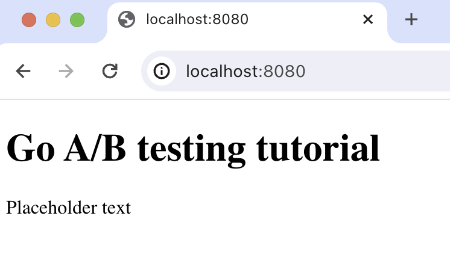

import { ProductScreenshot } from 'components/ProductScreenshot'
import EventsInPostHogLight from '../images/tutorials/go-ab-tests/events-light.png'
import EventsInPostHogDark from '../images/tutorials/go-ab-tests/events-dark.png'
import TestSetupLight from '../images/tutorials/go-ab-tests/experiment-setup-light.png'
import TestSetupDark from '../images/tutorials/go-ab-tests/experiment-setup-dark.png'
import ResultsLight from '../images/tutorials/go-ab-tests/results-light.png'
import ResultsDark from '../images/tutorials/go-ab-tests/results-dark.png'

A/B tests help you improve your Go app by enabling you to compare the impact of changes on key metrics. To show you how to set one up, we create a basic Go app, add PostHog, create an A/B test, and implement the code for it.

## 1. Create a basic Go app

First, ensure [Go is installed](https://go.dev/doc/install). Then, create a folder and a `main.go` file for our app.:

```bash
mkdir go-ab-tests
cd go-ab-tests
touch main.go
```

Next, import `fmt` and `net/http` into `main.go`. We use them to run an HTTP server that returns a basic HTML page on `localhost:8080`:


```go file=main.go
package main

import (
    "fmt"
    "net/http"
)

func main() {
  http.HandleFunc("/", func(w http.ResponseWriter, r *http.Request) {
    paragraphText := "Placeholder text"
    htmlContent := fmt.Sprintf(`
      <!DOCTYPE html>
      <html>
      <body>
        <h1>Node A/B testing tutorial</h1>
        <p>%s</p>
      </body>
      </html>
    `, paragraphText)

    fmt.Fprintf(w, htmlContent)
  })

  http.ListenAndServe(":8080", nil)
}
```

Run `go run main.go` and navigate to `http://localhost:8080` to see your app in action.



## 2. Add PostHog to your app

With our app set up, it’s time to install and set up PostHog. If you don't have a PostHog instance, you can [sign up for free](https://us.posthog.com/signup).

To start, run `go mod init go-ab-tests` to intialize our project and then install [PostHog’s Go library](docs/libraries/go):

```bash
go mod init go-ab-tests
go get github.com/posthog/posthog-go
```

Next, set up the PostHog client in your `main.go` file. To do this, you need your project API key and instance address from [your project settings](https://app.posthog.com/project/settings). You also need to create a personal API key which is done in [your personal settings](https://app.posthog.com/me/settings). Use these values to create a `posthog.Config` to initialize `posthog.NewWithConfig()`.


Next, we set up the PostHog client in `main.go`. To do this, you need your project API key and instance address from [your project settings](https://us.posthog.com/project/settings). You also need to [create a personal API key](https://us.posthog.com/settings/user-api-keys). Use these values to initialize `posthog.NewWithConfig()`. Lastly, we [capture](/docs/product-analytics/capture-events) a `$pageview` event in our HTTP function handler. 

Altogether, the code looks like this:

```go file=main.go
package main

import (
	"fmt"
	"net/http"

	"github.com/posthog/posthog-go"
)

func main() {
  client, _ := posthog.NewWithConfig(
    "<ph_project_api_key",
    posthog.Config{
        PersonalApiKey: "<ph_personal_api_key>",
        Endpoint: "<ph_instance_address>",
    },
  )
  defer client.Close()

  http.HandleFunc("/", func(w http.ResponseWriter, r *http.Request) {
    paragraphText := "Placeholder text"
    userID := "placeholder-user-id"

    htmlContent := fmt.Sprintf(`
      <!DOCTYPE html>
      <html>
      <body>
        <h1>Go A/B testing tutorial</h1>
        <p>%s</p>
      </body>
      </html>
    `, paragraphText)

    client.Enqueue(posthog.Capture{
      DistinctId: userID,
      Event:      "$pageview",
    })
    fmt.Fprintf(w, htmlContent)
  })

  http.ListenAndServe(":8080", nil)
}
```

With this set up, restart your app and then refresh your browser a few times. You should now see the event captured in your [PostHog activity tab](https://us.posthog.com/events).

<ProductScreenshot
  imageLight={EventsInPostHogLight} 
  imageDark={EventsInPostHogDark} 
  alt="Events captured in PostHog" 
  classes="rounded"
/>

## 3. Create an A/B test in PostHog

If you haven't done so already, you'll need to [upgrade](https://us.posthog.com/organization/billing) your PostHog account to include A/B testing. This requires entering your credit card, but don't worry, we have a [generous free tier](/pricing) of 1 million requests per month – so you won't be charged anything yet.

Next, go to the [A/B testing tab](https://us.posthog.com/experiments) and create an A/B test by clicking the **New experiment** button. Add the following details to your experiment:

1. Name it "My cool experiment".
2. Set "Feature flag key" to `my-cool-experiment`.
3. Under the experiment goal, select the `pageview` event we captured in the previous step.
4. Use the default values for all other fields.

Click "Save as draft" and then click "Launch".

<ProductScreenshot
  imageLight={TestSetupLight} 
  imageDark={TestSetupDark} 
  alt="Experiment setup in PostHog" 
  classes="rounded"
/>

## 4. Implement the A/B test code

To implement the A/B test, we: 

1. Fetch the `my-cool-experiment` flag using [`client.GetFeatureFlag()`](/docs/libraries/go#feature-flags). 
2. Update the paragraph text based on whether the user is in the `control` or `test` variant of the experiment.

```js file=server.js
// rest of your code

  http.HandleFunc("/", func(w http.ResponseWriter, r *http.Request) {
    paragraphText := "Placeholder text"
    userID := "placeholadsaasdsadsdder-user-id"

    enabledVariant, err := client.GetFeatureFlag(
      posthog.FeatureFlagPayload{
        Key:        "my-cool-experiment",
        DistinctId: userID,
    })

    if enabledVariant == "control" {
      paragraphText = "Control variant!"
    } else if enabledVariant == "test" {
      paragraphText = "Test variant!"
    } else if err != nil {
      paragraphText = "Error"
    }

    htmlContent := fmt.Sprintf(`
      <!DOCTYPE html>
      <html>
      <body>
        <h1>Go A/B testing tutorial</h1>
        <p>%s</p>
      </body>
      </html>
    `, paragraphText)

    client.Enqueue(posthog.Capture{
      DistinctId: userID,
      Event:      "$pageview",
    })
    fmt.Fprintf(w, htmlContent)
  })

// rest of your code
```

When you restart your app and refresh the page, you should see the text updated to either `Control variant!` or `Test variant!`. 

> **💡 Setting the correct `distinctId`:**
> 
> You may notice that we set `distinctId = 'placeholder-user-id'` in our flag call above. In production apps, to ensure you fetch the correct flag value for your user, `distinctId` should be set to their unique ID. 
> 
> For logged-in users, you typically use their email or user ID as their `distinctId`. For logged-out users, assuming they made their request from a browser, you can use values from their request cookies. See an example of this in our [Go feature flags tutorial](/tutorials/go-feature-flags#setting-up-user-ids).

## 5. Include the feature flag when capturing your event

To ensure our goal metric is correctly calculated for each experiment variant, we need to include our feature flag information when capturing our `$pageview` event.

To do this, we add the [`$feature/my-cool-experiment`](/docs/libraries/node#step-2-include-feature-flag-information-when-capturing-events) key to our event properties:

```go file=main.go
  http.HandleFunc("/", func(w http.ResponseWriter, r *http.Request) {
  // rest of your code

  // update your capture call to include the feature flag information
    client.Enqueue(posthog.Capture{
      DistinctId: userID,
      Event:      "$pageview",
      Properties: posthog.NewProperties().
        Set("$feature/my-cool-experiment", enabledVariant),  
    })

  // rest of your code
});
```

Now PostHog is able to calculate our goal metric for our experiment results.

<ProductScreenshot
  imageLight={ResultsLight} 
  imageDark={ResultsDark} 
  alt="Experiment results in PostHog" 
  classes="rounded"
/>

## Further reading

- [How to set up Go feature flags](/tutorials/go-feature-flags)
- [A software engineer's guide to A/B testing](/product-engineers/ab-testing-guide-for-engineers)