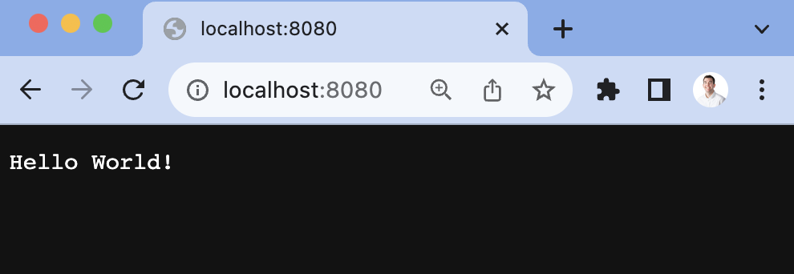
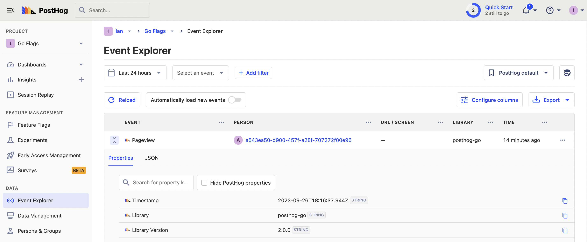
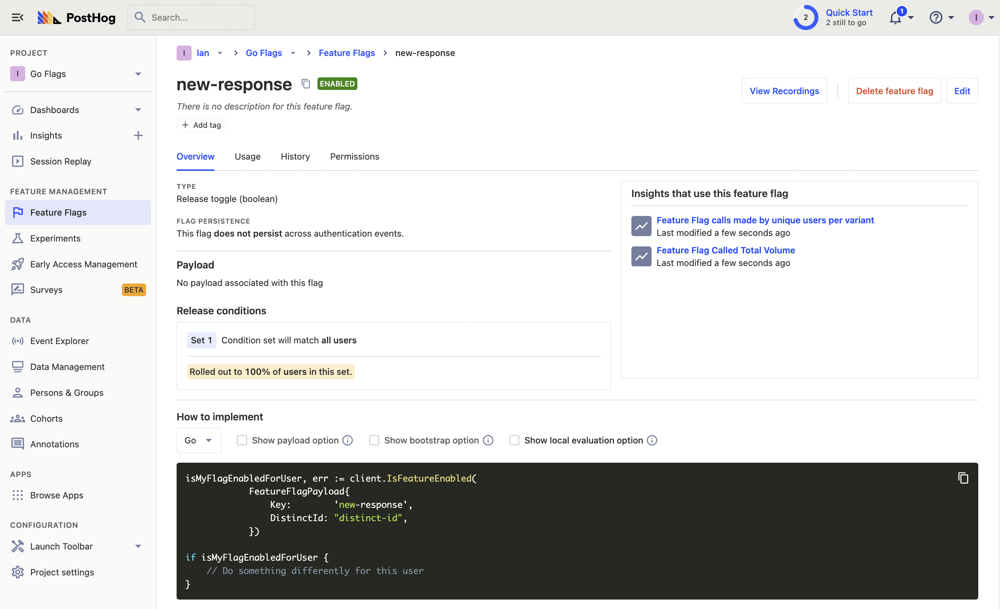
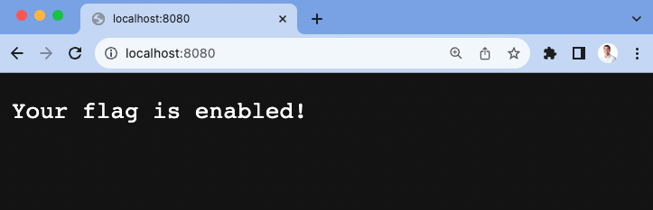

[Feature flags](/docs/feature-flags) are a critical part of delivering code safely. This tutorial shows you how to use them in Go (Golang). We'll create a basic HTTP server, add PostHog, create a feature flag, and implement it in our app to change the response content.

## Creating a Go HTTP server

Once you have [Go installed](https://go.dev/doc/install) and set up, create a folder and a `main.go` file for our app.

```bash
mkdir go-flags
cd go-flags
touch main.go
```

In our newly created `main.go` file, import `fmt` and `net/http`. We use them to run an HTTP server that returns a "Hello World!" string on `localhost:8080`.

```go
// main.go
package main

import (
	"fmt"
	"net/http"
)

func main() {
	http.HandleFunc("/", func(w http.ResponseWriter, r *http.Request) {
		fmt.Fprintf(w, "Hello World!")
	})

	http.ListenAndServe(":8080", nil)
}
```

Once created, run `go run main.go` and go to `localhost:8080` to see the response.



### Setting up user IDs

To evaluate flags consistently, we need a consistent user ID across requests. Because we are making web requests, we can use cookies to store this value. In our HTTP handler, we can set up logic to check for a `user_id` in cookies using the `http` package’s `Cookie` function. If it exists, we set it as a `userID` variable. If it doesn’t, we generate an ID using a UUID generator.

To start with this, install Google’s [UUID generator](https://github.com/google/uuid).

```bash
go get github.com/google/uuid
```

Next, in the `http.HandleFunc` function, write the logic to set a `userID` variable by either getting the `user_id` cookie or creating one using the UUID package we just installed. Our handler function now looks like this:

```go
// main.go
http.HandleFunc("/", func(w http.ResponseWriter, r *http.Request) {
	// Check for user_id value from cookies
	cookie, err := r.Cookie("user_id")
	var userID string

	if err != nil || cookie.Value == "" {
		// Create a new user_id using a UUID function
		userID = uuid.New().String()
		// Set the user_id cookie
		http.SetCookie(w, &http.Cookie{
			Name:  "user_id",
			Value: userID,
		})
	} else {
		// Use the existing user_id
		userID = cookie.Value
	}

	fmt.Fprintf(w, "Hello World!")
})
```

We use this `userID` value later to capture PostHog events and evaluate feature flags.

## Adding PostHog

Next, we add PostHog. PostHog handles our feature flag evaluation and event capture related to their use.

To install it, run the following command:

```bash
go get github.com/posthog/posthog-go
```

Next, set up the PostHog client in your `main.go` file. To do this, you need your project API key and instance address from [your project settings](https://app.posthog.com/project/settings). You also need to create a personal API key which is done in [your personal settings](https://app.posthog.com/me/settings). Use these values to create a `posthog.Config` to initialize `posthog.NewWithConfig()`.

After doing all this, add a `$pageview` event capture in your HTTP function handler. Altogether, this looks like this:

```go
// main.go
package main

import (
	"fmt"
	"net/http"
	"github.com/posthog/posthog-go"
)

func main() {
	client, _ := posthog.NewWithConfig(
		"<ph_project_api_key",
		posthog.Config{
			PersonalApiKey: "<ph_personal_api_key>",
			Endpoint: "<ph_instance_address>",
		},
	)
	defer client.Close()

	http.HandleFunc("/", func(w http.ResponseWriter, r *http.Request) {
		// Check for user_id value from cookies
		cookie, err := r.Cookie("user_id")
		var userID string

		if err != nil || cookie.Value == "" {
			// Create a new user_id using a UUID function
			userID = uuid.New().String()
			// Set the user_id cookie
			http.SetCookie(w, &http.Cookie{
				Name:  "user_id",
				Value: userID,
			})
		} else {
			userID = cookie.Value
			// Use the existing user_id
		}

		client.Enqueue(posthog.Capture{
			DistinctId: userID,
			Event:      "$pageview",
		})

		fmt.Fprintf(w, "Hello World!")
	})

	http.ListenAndServe(":8080", nil)
}
```

Re-run your `go run main.go` command, go to `localhost:8080`, and an event is captured into your PostHog instance.



## Create a feature flag in PostHog

With our Go server and PostHog set up, we can create our feature flag. Go to the [feature flags tab](https://app.posthog.com/feature_flags) in PostHog and click "New feature flag." Set a key (we chose `new-response`), set release conditions to roll out to 100% of users, and press Save.



Now we can add this flag to our app.

## Implementing our feature flag

Back in our Go app, we evaluate the flag using `client.IsFeatureEnabled()` with a `posthog.FeatureFlagPayload`. After handling an error, we check whether the flag is true or false and print a response based on that.

```go
http.HandleFunc("/", func(w http.ResponseWriter, r *http.Request) {
	// ... get or create a user ID from cookies

	client.Enqueue(posthog.Capture{
		DistinctId: userID,
		Event:      "$pageview",
	})

  isFlagEnabled, err := client.IsFeatureEnabled(
		posthog.FeatureFlagPayload{
			Key:        "new-response",
			DistinctId: userID,
		},
	)

  if err != nil {
		// Handle the error, e.g., log it or return an error response.
		fmt.Fprintf(w, "Error checking feature flag: %v", err)
		return
	}

  if isFlagEnabled == true {
    fmt.Fprintf(w, "Your flag is enabled!")
  } else {
    fmt.Fprintf(w, "Hello World!")
  }
})
```

> Because we initialized PostHog with our personal API key, these flags are [locally evaluated](/docs/feature-flags/local-evaluation). This means they are much faster because they don’t have to make a request to PostHog to evaluate.

Now, when we visit our app running locally, we see the flag enabled response. This means our basic Go feature flag is successfully set up.



## Further reading

- [How to set up analytics in Go](/tutorials/go-analytics)
- [How to set up A/B tests in Go](/tutorials/go-ab-tests)
- [How to set up one-time feature flags](/tutorials/one-time-feature-flags)