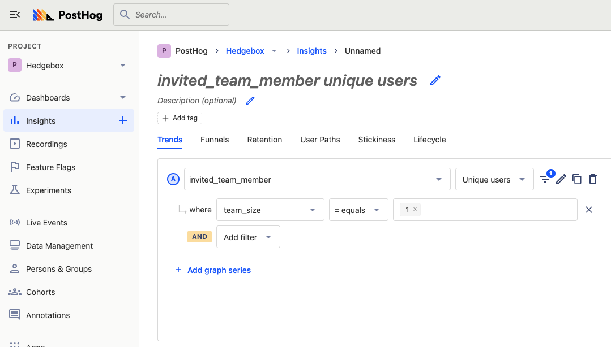
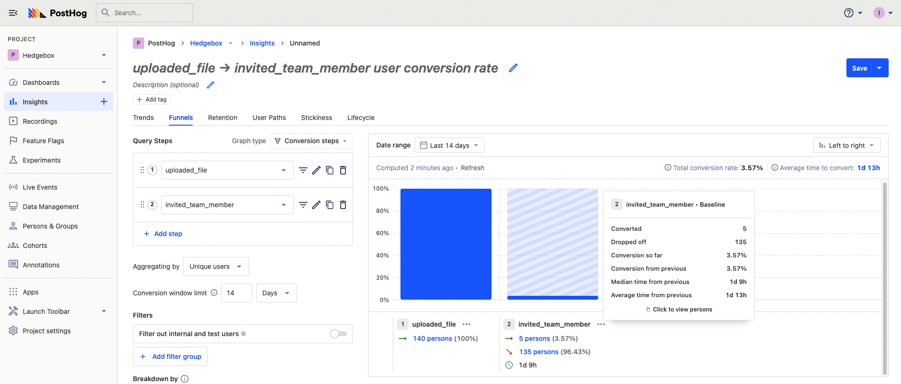
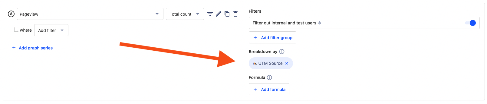
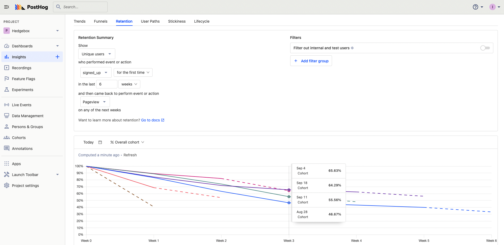
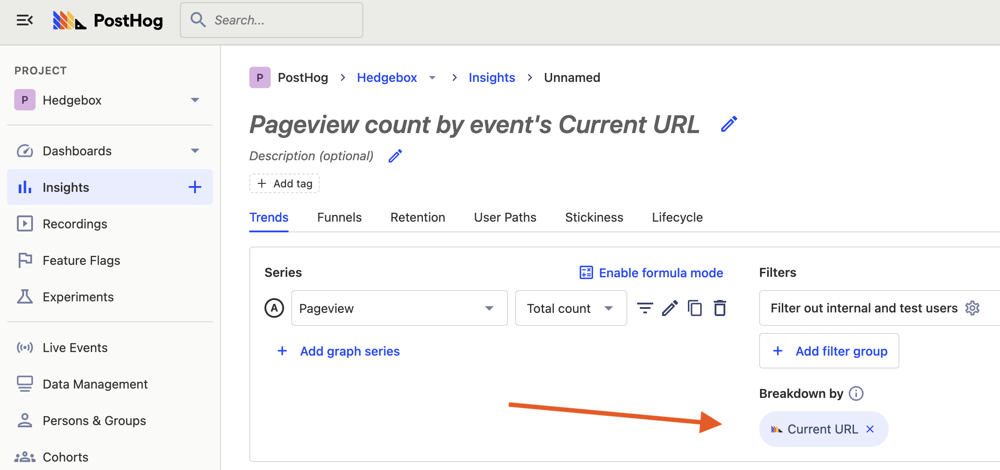
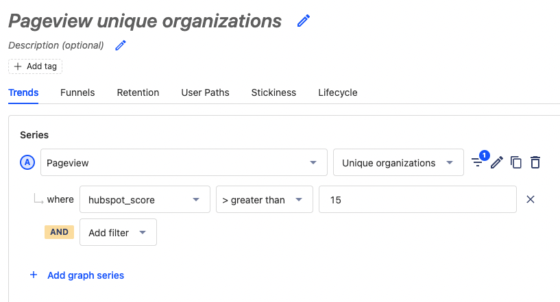
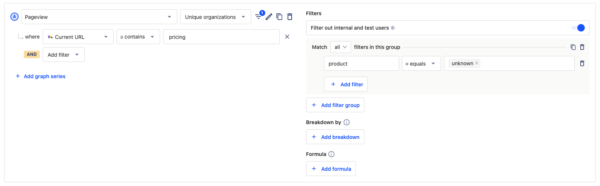

---
title: Measuring and visualizing growth loops
sidebar: Docs
showTitle: true
author: ['ian-vanagas']
date: 2022-10-13
featuredImage: ../images/tutorials/banners/growth-loops.png
topics: ['trends', 'retention', 'lifecycle']
--- 

- **Level:** Easy 🦔
- **Estimated reading time:** 12 minutes ☕️☕️

A growth loop is a series of actions that amplify each other to fuel perpetual growth. New inputs repeatedly power the series to exponentially grow the whole. Companies use growth loops to align their product and distribution to have the greatest impact. 

This tutorial goes over four types of growth loops: virality, performance marketing, content, and sales. For each, we’ll go over example types of products, actions, measurements, and visualizations. By the end of your tutorial, you should have a better idea of what type of growth loop work for your product and how to measure and visualize them.

## 1. Virality

Virality is the growth loop of spreading rapidly through word of mouth. Users gain value from other users being a part of the product or by sharing the product. It is a fit for two types of products:

- Multiplayer or networked products that improve (or only work) when multiple friends or colleagues also use it (e.g. Snapchat, Figma, Zoom)
- Products that are fun to share with others (e.g. TikTok, Instagram, Airbnb listings)

### Examples of viral growth loops

Here's an example of a viral growth loop for a multiplayer product:

1. A user signs up for your product.
2. They recruit their co-workers to become users.
3. They also recommend the product to a friend at another company, who then signs up.

To track this, we’ll need a `signed_up` event (that includes a user’s company as a property), an `activated` event, and an `invited_team_member` event.

Another example of a viral growth loop for a fun-to-share product:

1. A user adds content to your product
2. They share that content on social media
3. A friend of theirs signs up and starts creating content

For this, we’ll need to track `content_created`, `content_shared`, and `referred_from_content`.

### Visualizing viral growth loops

Now that we have an idea of our loops, we can use funnels and trends to visualize them. Some ideas:

- Totals for all the events from `signed_up` to `referred_from_content`
- 99% percentile of users referral, content created, content shared
- Most popular `referred_from_content` sources

As an example, we can set up a trend for `invited_team_member`, where `team_size` is 1. This gives us a count of all the users who invited a team member when they didn’t have any before. An increase in this metric means our viral growth loop is improving.

We can also create funnels to visualize both loops from `content_created` to `referred_from_content` and from `signed_up` to `invited_team_member`. For example, below we have a funnel from `uploaded_file` to `invited_team_member`. Once set up, we can look at their data deeper (check usage correlated to referrals) or check out session recordings (click either of the charts to get a list). 

## 2. Performance marketing

The performance marketing growth loop is using advertising or marketing to acquire users, then using the new revenue to fund more marketing. It is reliant on connecting marketing spend to acquire users (performance) with value (revenue) captured.

For example, with Google Ad Words, companies pay per click on specific keywords related to potential customers’ search. They pay for clicks (performance). With the correct math figured out (cost of acquisition), this can lead to a growth loop of increasing ad spend and revenue growth.

Performance marketing fits products with higher margins and lower organic demand. They have more to spend on marketing but are unsuitable for other types of growth loops. For example, direct-to-consumer goods or SaaS software targeting small-medium businesses.

### Example of a performance marketing growth loop

An example of a performance marketing growth loop:

- Run Instagram ads targeting a specific demographic and acquire users for $10 on average
- A user signs up for a $20-per-month subscription
- The company uses the revenue to expand to more types of Instagram ads and beyond

To track this loop, you’ll want to have `utm` data, `pageview` for landing pages, `signed_up`, and keep an eye on retention. We can rely on [autocapture](/docs/integrate/client/js#autocapture) for these. 

### Visualizing performance marketing

Utilizing our charts, we can get an idea of popular sources and landing pages. We can also set up a dashboard of funnels to understand our conversion rate for various sources. If some sources are converting better than others, they are providing us with better value, and likely an area to double down on. We can look at `pageview` total count and breakdown by `utm_source`, `utm_medium`, or `referring_domain`.

Another key to performance marketing is understanding lifetime customer value (LTV). This is because your customer’s lifetime value has to fuel the growth loop. The margin between LTV and the cost of acquisition is what keeps the company running and growing.

The key to calculating LTV is understanding churn and retention. For example, if your average user only lasts 1 month at $50 per month, they have a lower LTV than someone who spends $30 over 6 months. Changes in the growth loop (product and distribution) impact this.

You can use retention graphs to see how retention changes over time. Filters then help figure out which factors are important for improving retention. For example, we can look at the number of users who `uploaded_file` for the first time in the last 6 weeks and viewed a page in the following weeks.

When you make changes to your product that impact retention, this impacts your lifetime value. Keeping this top of mind with visuals makes sure your performance marketing growth loop works. Setting up these visualizations can help improve your LTV; and therefore, your performance marketing growth loop.

## 3. Content

Content is the growth loop of users creating content that other users find which attracts them to become users (and create content). It is also the ability to generate data used to attract users who then create more data. Two types of products benefit from this:

- Users discover your product through content other users create and share (e.g. StackOverflow, Reddit, Substack)
- Your product generates a large amount of data, which you use to make content (e.g. TripAdvisor, Zillow, Expedia)

### Example of a content growth loop

If we have a user-generated content (UGC) site for publishing blog posts, a content growth loop could look like this:

- A user signs up, writes an article using your platform
- They publish, share the article on their social media, and people search for the article
- Those users sign up and write their own articles

This is similar to the viral loops. To track this, again you want events for `signed_up`, `content_created`, `content_shared`, and article `pageview`.

### Visualizing content growth loops

Key to our example is knowing what is being created and shared. If you know this, you can make changes to your product that improves your content growth loop. To do this, we can create  trends to see pageviews for articles, and the number of trend events for articles. 

For example, we can set up a value graph of popular articles broken down by their URLs.

On top of this, we can use the same charts as we used in [virality](#1-virality). For more inspiration about content growth loop visualization, you can also see more in our blog post on [how we use PostHog for marketing](/blog/posthog-marketing). 

## 4. Sales

Sales is the growth loop of acquiring users through sales. These users grow (both revenue and usage), which allows the company to hire more salespeople as well as improves the product’s value proposition to the companies they are selling to.

Products relying on sales are generally large contracts that need high levels of support, engagement, and customization. Offers often must be tailored to the specific customer and require a large amount of time and effort.

### Example of a sales growth loop

The sales growth loop is less product and distribution driven. They rely on many of their own metrics, but we can still provide them with some. A basic sales process looks like this:

- A salesperson runs a sales process on a lead
- The lead turns into a customer
- The customer expand usage, and pays more, giving the company enough revenue to hire more salespeople

We’ll want to track leads, lead conversion, usage during the sales period, usage after the sales period, and expansion. We’ll care more about unique organizations and group properties if we are running sales on larger organizations.

### Visualizing sales growth loops

We can set up the [Hubspot connector](/docs/apps/hubspot-connector) (or another app) to add more data about the users on our site. We can then track their usage compared to where they are in the sales process. For example, we can create a trend of users with a Hubspot score greater than 15 (and further customize it to see their usage).

We also can visualize group metrics and unique organizations. For example, we can look at the number of unique organizations who’ve looked at the pricing page, but filter for those who haven’t subscribed yet. This is a strong show of interest that we can set up to trigger action by our sales team.

From both of these, we can get lists of users and their usage we can provide to our salespeople to help them do a better job in their process. We can even automate sending actions and reports to somewhere like Slack.

## Choosing your growth loop

This is only a summary of growth loops and the ways they can be measured and visualized. Each company and product customizes growth loops and metrics for their specific scenario. 

No matter what growth loop you have, you can use PostHog to measure and visualize it. Use these metrics and visualizations to create your own charts and dashboards for your growth loops. Doing this helps you understand them, and maximize their impact on your product.

## Further reading

Check out the growth metrics we track in marketing on [our blog](/blog/posthog-marketing).

Read more about B2B product metrics in [this tutorial](/tutorials/metrics-tutorial).

Finally, learn how to get all the events you need to calculate this metrics in our [event tracking guide](/tutorials/event-tracking-guide).