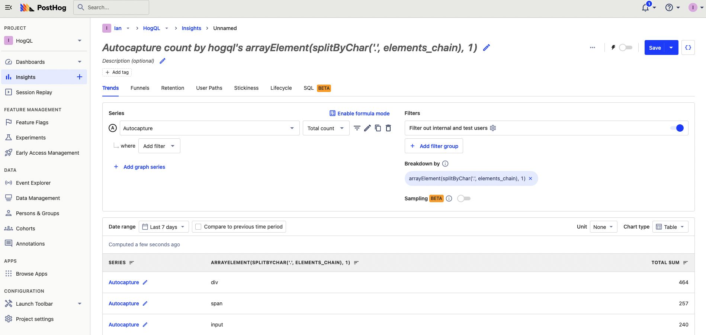
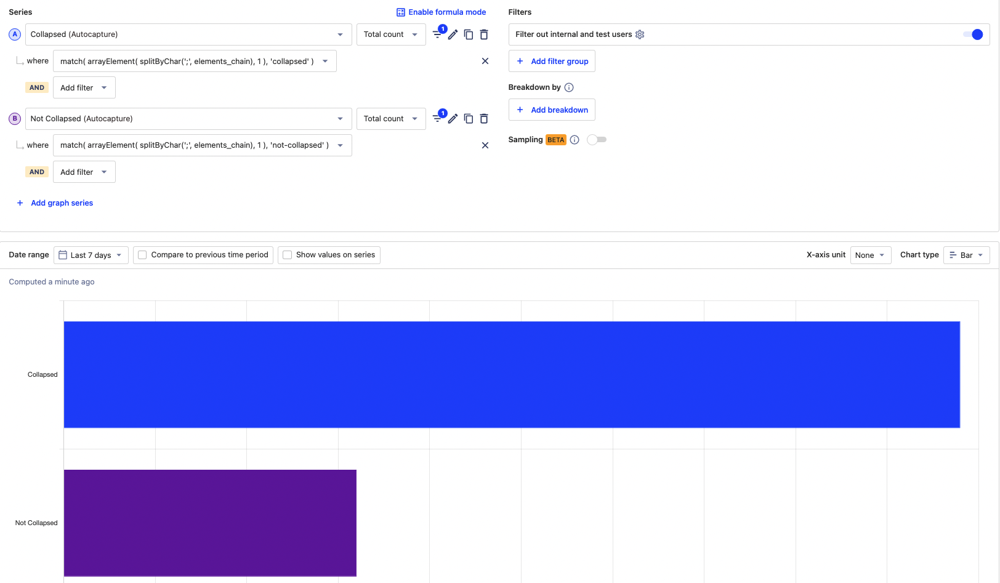

---
title: How to analyze autocapture events with HogQL
date: 2023-06-07
author: ["ian-vanagas"]
showTitle: true
sidebar: Docs
tags: ['hogql', 'trends', 'product analytics']
--- 

> <p align="center">Open this tutorial in PostHog and follow along step-by-step!</p> <CallToAction href="https://app.posthog.com/#panel=docs:/tutorials/hogql-autocapture" size="sm" className="mt-auto self-start sm:w-auto !w-full">Launch tutorial</CallToAction>

[Autocapture](/docs/data/autocapture) is a powerful way to capture usage data without having to implement any tracking yourself. [HogQL](/docs/product-analytics/hogql) unlocks more of that data for analysis. In this tutorial, we go over examples of how you can use HogQL to analyze autocapture events.

## The autocapture element chain

Every autocapture event contains data on the "location" of that event in your code. It does this by creating an element chain from the specific element a user interacted with like `<a>`, `<input>`, or `<button>` to highest-level components like a `<body>` or `<div>` tag.

We can access the element chain by using the autocapture series, then using `elements_chain`  in our [HogQL expression](/docs/hogql/expressions).


In its default form, this data isn’t super useful. When we begin to use HogQL’s functions, it becomes incredibly powerful.

## Breaking down by first and last elements

We can use HogQL to turn the element chain into an array with `splitByChar()`. From this array, we can get the element at any index. To get the element at the first index, use the expression `arrayElement(splitByChar('.', elements_chain), 1)`.



We can also get the full component, where getting the first or last index might be helpful:

- To breakdown by the first component in the chain, use `arrayElement(splitByChar(';', elements_chain), 1)`
- To breakdown by the last component in the chain, use `arrayElement(splitByChar(';', elements_chain), -1)`

You can use this method to other get components or elements at other indexes or run other [array-specific functions](/tutorials/array-filter-breakdown).

## Breaking down by attributes

Next, we extract attributes of an element like ID, href, and class. To do this, we use the `extract()` function which takes the `elements_chain` and regex to return a value. PostHog automatically adds `attr__` to the attributes in the element chain, so we must include that in our regex. 

Examples of attribute breakdowns include:

- For the `id`, use `extract(elements_chain, '[:|"]attr__id="(.*?)"')`
- For the  `class`, use `extract(elements_chain, '[:|"]attr__class="(.*?)"')`
- For the `href`, use `extract(elements_chain, '[:|"]attr__href="(.*?)"')`
- For the `data-attr`, use `extract(elements_chain, '[:|"]attr__data-attr="(.*?)"')`

## Filter for specific components

We can use HogQL to filter for events where the elements or components contain a certain value. We can filter using `match` against the whole element chain, or we can use the same `splitByChar()`  method as before. 

For example, if we want to compare components with `collapsed` vs `not-collapsed` classes, we can create two series. One filtered for `collapsed` with the expression:

```
match(
	arrayElement(
		splitByChar(';', elements_chain), 1
	),
	'collapsed'
)
```

The other filtered for `not-collapsed` with the expression:

```
match(
	arrayElement(
		splitByChar(';', elements_chain), 1
	),
	'not-collapsed'
)
```

We can then compare these two in our visualization.



## Filter for specific attributes

Like the specific components or elements filter, we can also filter for specific attributes. We use the same `match` function to check attributes like `attr__class`, `attr__href`, or `attr__data-attr` for a value we chose.

For example, if we want to filter for element chains that contain the ID `good-input`, we can use the expression `match(elements_chain, '[:|"]attr__id="[^"]*good-input[^"]*"')`. If we only wanted to check the first component, we can add the `splitByChar()` array creation and selection to end up with:

```
match(
	arrayElement(
		splitByChar(';', elements_chain), 1
	),
	'[:|"]attr__id="[^"]*good-input[^"]*"'
)
```

## Further reading

- [Complete guide to event tracking](/tutorials/event-tracking-guide)
- [Using HogQL for advanced time and date filters](/tutorials/hogql-date-time-filters)
- [Using HogQL for advanced breakdowns](/tutorials/hogql-breakdowns)