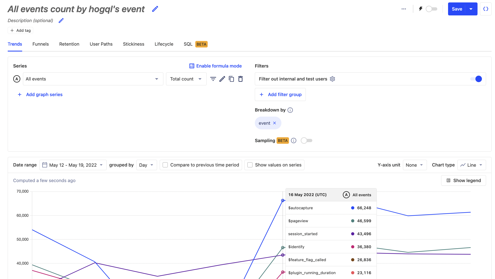
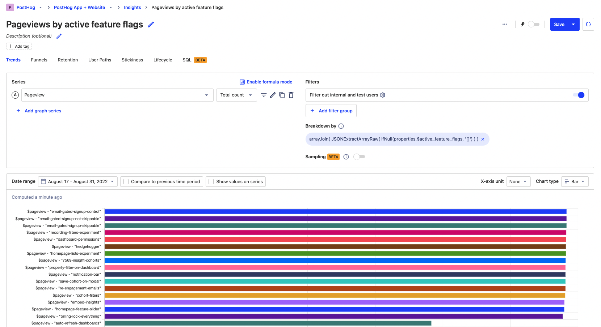

---
title: Using HogQL for advanced breakdowns
date: 2023-05-16
author: ["ian-vanagas"]
showTitle: true
sidebar: Docs
tags: ['hogql', 'trends', 'product analytics']
---    

> <p align="center">Open this tutorial in PostHog and follow along step-by-step!</p> <CallToAction href="https://app.posthog.com/#panel=docs:/tutorials/hogql-breakdowns" size="sm" className="mt-auto self-start sm:w-auto !w-full">Launch tutorial</CallToAction>

HogQL opens limitless possibilities for how you can breakdown your trends, funnels, and more. This tutorial showcases some of the advanced breakdowns you can create using HogQL.

To create a breakdown using [HogQL](/docs/product-analytics/hogql), create an insight then under "Breakdown by," click "Add breakdown," select HogQL from the options, and add your [expression](/docs/hogql/expressions).

> To understand the full possibilities of HogQL, check out the [available functions in our docs](/docs/product-analytics/hogql#supported-clickhouse-functions) as well as the [events](https://app.posthog.com/data-management/events) and [properties](https://app.posthog.com/data-management/properties) lists from your PostHog instance.

## All events

HogQL includes the "All events" series, which can break down in many ways, including by individual events. This enables you to visualize the breakdown of all your events at once. 

To do this, search for the "All events" trend, then breakdown with the HogQL expression `event`.



You could also breakdown all events by `person_id` to find your most active users.

## Replacing repetitive values

Many strings, such as URLs, include repetitive values combined with unique values. It is common to want to replace that unique value with a placeholder value to combine the repetitive values into one for analysis.

For example, if you have a path that uses a specific user’s UUID like `/users/123e4567-e89b-12d3-a456-426655440000` then you can use `replaceRegexpOne` to replace `123e4567-e89b-12d3-a456-426655440000` with `:uuid`. The HogQL expression for this looks like this:

```
replaceRegexpOne(
	properties.$pathname,
	'[0-9a-f]{8}-[0-9a-f]{4}-[0-9a-f]{4}-[0-9a-f]{4}-[0-9a-f]{12}',
	':uuid'
)
```

Another way to replace a repetitive value is to use `replaceOne`. If we wanted to replace every instance of `https://app.posthog.com` with `/`, we can do:

```
replaceOne(properties.$current_url, 'https://app.posthog.com', '/')
```

> **Note:** Make sure you use straight apostrophes (`'`) for string literals and backticks (\`) or quotes (`"`) for database identifiers in your expressions. **Don't use** curly apostrophes (`’`) or curly quotes (`“` or `”`) as they won't be recognized.

## Excluding values

Instead of filtering to remove values, you can exclude them with HogQL. You can use `if` expressions to remove specific values.

For example, if we wanted to remove the path `/insights` from our breakdown, we can use an `if` expression to set the route to `null` like this:

```
if(properties.$pathname == '/insights', null, properties.$pathname)
```

We can combine this with `positionCaseInsensitive` to search for substrings. For example, if we wanted to filter any occurrences of `'/insights'` we can use:

```
if(
	positionCaseInsensitive(properties.$pathname, '/insights') != 0,
	null,
	properties.$pathname
)
```

## Accessing nested properties

Before HogQL, you could only breakdown by properties one layer deep. If you have nested properties beyond the first layer, you can now breakdown by those values as well.

For example, on the submission of a form, you capture a `form submitted` event with the response details stored as a property.

```node
client.capture({
    distinctId: req.query.id,
    event: 'form submitted',
    properties: {
      response: {
        first_name: 'Ian',
        last_name: 'Vanagas',
        company: {
          name: 'PostHog'
        }
      }
    }
  }
```

We can then access the nested properties and concat them together to create the string "Ian Vanagas from PostHog" (and the same for other submissions) like this:

```
concat(
	properties.response.first_name,
	' ',
	properties.response.last_name, 
	' from ',
	properties.response.company.name
)
```

## Bin events

HogQL provides more options for putting events into bins or groups. You can use `if` or `multiIf`expressions to do so.

For example, you can group events into mobile and desktop by checking the `$os` property for Android and iOS:

```
multiIf(
	properties.$os == 'Android', 'mobile',
	properties.$os == 'iOS', 'mobile', 
	'desktop'
)
```

You could also do this by checking screen height and width and using the ternary operator the ternary operator `? :` like this:

```
properties.$screen_width < properties.$screen_height and properties.$screen_width < 500 ? 'mobile' : 'desktop'
```

## Analyzing dates

There are endless ways to analyze dates and times, and HogQL enables more of them. The `timestamp` variable provides easy access to the time events happen. With it, you can breakdown by:

- Value of week with `toDayOfWeek(timestamp)`
- Start date of week events happened with `toStartOfWeek(timestamp)`
- The gap to now in weeks with `dateDiff('week', timestamp, now())`. `today()` or `yesterday()` could also replace `now()`.
- Name of month with `dateName('month', timestamp)`

You can also replace `week` in all of these with `second`, `minute`, `hour`, `day`, `month`, `quarter`, and `year`.

## JSON arrays

HogQL can provides access to JSON properties, which can then be used to [breakdown by arrays](/tutorials/array-filter-breakdown) within that JSON. We can use the [JSONExtractArrayRaw](https://clickhouse.com/docs/en/sql-reference/functions/json-functions#jsonextractarrayrawjson-indices_or_keys) function to extract an array from JSON. For example, we can break down by active feature flags with the following expression:

```
arrayJoin(
	JSONExtractArrayRaw(
		properties.$active_feature_flags ?? '[]'
	)
)
```

With the total value bar chart, this breakdown looks like this:



## Further reading

- [The power of HogQL’s sum() aggregation](/tutorials/hogql-sum-aggregation)
- [Using HogQL for advanced time and date filters](/tutorials/hogql-date-time-filters)
