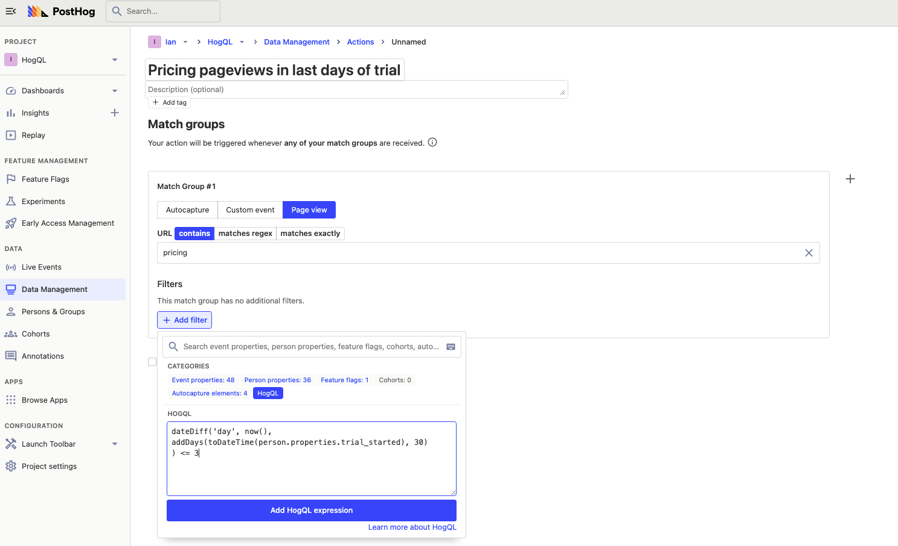

Since there are infinite ways to break down time, there are infinite ways to filter based on time. HogQL unlocks more of these in PostHog, and in this tutorial we'll go through examples of how to use do that.

To add a HogQL filter:
1. Create a [new insight](https://app.posthog.com/insights/new)
2. Open the filter dropdown, and click "Add filter" below your data series
3. Select HogQL from the options
4. Write your [expression](/docs/hogql/expressions), and click "Add HogQL expression" to apply it

HogQL filters are available on every type of insight from trends to funnels to lifecycle.


## Accessing your data’s dates and times

Below is a non-exhaustive list of time properties that are commonly used in HogQL (You can find a full list of events, properties, and types in your [data management tab](https://app.posthog.com/data-management/events)):

- The `timestamp` property indicates what time an event occurred, and is automatically set.
- [Persons](/docs/data/persons) have a `created_at` property, which you can access with `person.created_at`.
- For custom events or person properties, you can access them with `person.properties.{custom_property_name}`.

> **Note:** if the type of your property is a string, rather than a `DateTime`, you can convert it using `toDateTime()`, and vice versa with `toString()`. You can view the type of your properties in your [data management tab](https://app.posthog.com/data-management/properties).

The [ClickHouse SQL statements](https://clickhouse.com/docs/en/sql-reference) we built HogQL on also have useful helper functions that are good to know when working with dates. These include:

- `now()`: the current date and time at the moment of query analysis.
- `today()`: the current date at the moment of query analysis.
- `yesterday()`: yesterday’s date at the moment of query analysis.

## Events from a specific time range

To filter for events in a specific time range, you can use `toDateTime()` to create a date time object to compare with the event `timestamp`. 

For example, if you want to filter for events `after 9:26 AM on September 16th, 2022, and before 2:34 PM on October 1st, 2022`, you can use the expression:

```
toDateTime('2022-09-16 09:26:00') < timestamp 
and timestamp < toDateTime('2022-10-01 14:34:00')
```

> **Note:** by default, PostHog uses `UTC` for timestamps.

## Using the Unix timestamp

If you'd like to filter using a Unix timestamp, you can use [`toUnixTimestamp`](https://clickhouse.com/docs/en/sql-reference/functions/date-time-functions#tounixtimestamp) to convert a date time object into a Unix timestamp, or `fromUnixTimestamp` to do the reverse. 

For example, if you wanted to filter for events after the Unix timestamp `1674259200`, you could use the expression:

```
fromUnixTimestamp(1674259200) < timestamp
```

## Relative time filters

If you'd like to query events relative to today's date (or any other date), you can use the [`dateDiff()`](https://clickhouse.com/docs/en/sql-reference/functions/date-time-functions#date_diff) function. 

For example, to get events older than 5 days, use the expression:

```
dateDiff('day', timestamp, now()) > 5
```

You can also replace `day` with `second`, `minute`, `hour`, `week`, `month`, `quarter`, and `year`.

## Weekly and quarterly reports

Many companies report on a weekly or quarterly basis. A simple filter, such as `events in the last 7 days` or `events in the last 90 days`, likely includes events from the previous week or quarter, making these reports inaccurate. HogQL provides an alternative filter to get events from specific weeks and quarters.

For example, if we wanted events for this quarter, we can use the expression:

```
toStartOfQuarter(timestamp) == toStartOfQuarter(now())
```

We can do the same with the current week with [`toStartOfWeek`](https://clickhouse.com/docs/en/sql-reference/functions/date-time-functions#tostartofweek):

```
toStartOfWeek(timestamp) == toStartOfWeek(now())
```

Alternatively, if you wanted a weekly report for only weekdays, you can use [`toDayOfWeek`](https://clickhouse.com/docs/en/sql-reference/functions/date-time-functions#todayofweek) to filter out Saturday and Sunday with their day’s number:

```
toDayOfWeek(timestamp) != 6 and toDayOfWeek(timestamp) != 7
```

## Analyzing subscribers or trial users

HogQL lets you filter users properties too. A use case of this is filtering for events based on users in trial or recently subscribed.

For example, you may want to filter events from users who are in the last 3 days of their trial period, but you only have a `trial_started` person property. Using [`interval`](https://clickhouse.com/docs/en/sql-reference/data-types/special-data-types/interval) type, you can to add 30 days and use `dateDiff()` to check if that date is less than or equal to 3 days away from `now()` like this: 

```
dateDiff(
	'day', 
	now(), 
	person.properties.trial_started + interval 30 day
) <= 3
```

A use case for this is creating an action for `pricing pageviews` during the last days of the trial, then posting to a [webhook](/docs/webhooks) to notify your team to reach out to the user.



Another similar example is using HogQL to understand usage in the first two weeks after subscribing. To do this, use `dateDiff()` again but with `'week'`, your signed up property, and `now()` like this:

```
dateDiff('week', person.properties.signed_up_at, now()) <= 2
```

This is useful to learn what features are used immediately after sign up and others that might go undiscovered.

## Further reading

- [Using HogQL for advanced breakdowns](/tutorials/hogql-breakdowns)
- [Running experiments on new users](/tutorials/new-user-experiments)
- [The power of HogQL’s sum() aggregation](/tutorials/hogql-sum-aggregation)
