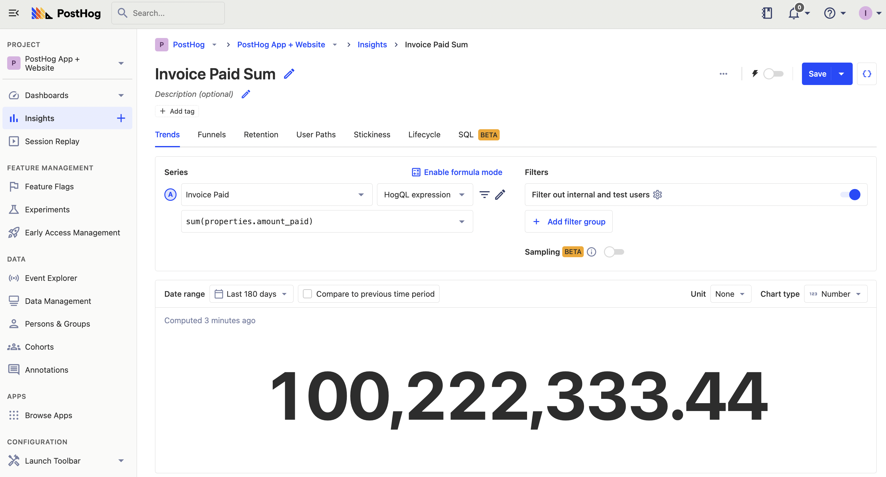
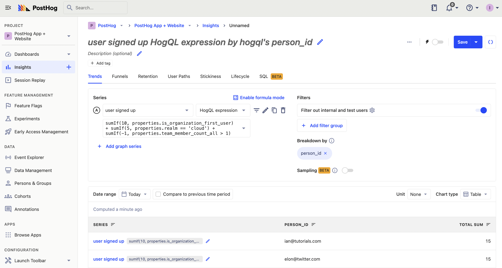

PostHog provides multiple options for aggregating data series including total count, count per user, unique sessions, property values, and more. HogQL unlocks a new level of aggregation customization, enabling you to use [expressions](/docs/hogql/expressions) to aggregate your data however you want. To showcase this, this tutorial goes over one of the most powerful aggregations: `sum()`.

## The basics of sum()

Sum is simple: it calculates the sum of the numbers it is provided. In its simplest form, we can use it to sum event properties (or nested ones). For example, to sum your revenue, chose your payment event, then sum the `amount_paid` property. The HogQL expression for this is `sum(properties.amount_paid)`



> **Note:** Sum only works for numbers. You can use `toInt()` to convert any strings to numbers.

## Conditional sums with `sumIf()`

Sum gets more interesting when we use it with conditions. This lets us sum occurrences of properties, properties that match criteria, and more. 

For example, if we wanted a count of events during the current month, we could do:

```
sumIf(
	1, 
	toStartOfMonth(timestamp) = toStartOfMonth(now())
)
```


## Scoring criteria

A more creative way to use `sumIf()` is to give different weights to different values. 

For example, if you wanted to rank sign up events based on specific criteria, you could use a chain of `sumIf` and different values for different properties. For example, you could sum the `user signed up` event like this:

- 10 points for `is_organization_first_user`
- 5 for `realm = ‘cloud’`
- -1 if `team_member_count_all > 1`

As a HogQL expression, this looks like:

```
sumIf(
	10, 
	properties.is_organization_first_user
) + sumIf(
	5,
	properties.realm = 'cloud'
) + sumIf(
	-1,
	properties.team_member_count_all > 1
)
```

When we breakdown by `person_id`, this gives us a list of users with the highest scores, and we can customize our score this as our definition of "high-potential user" changes.



> **Note:** [Person properties](/docs/getting-started/user-properties) can’t be used with HogQL expression series, only event properties.

## Sum with percentages

Using sum, you can access both the total sum and a subset of the same series. This enables powerful options for working with percentages and creating percentage-based series.

For example, let's say you wanted to compare the percentage of your total pageviews on Chrome vs Safari. To do this, first create a series where your divide the Safari pageviews by the total sum of Safari and Chrome pageviews. 

```
sumIf(
	1,
	properties.$browser = 'Safari'
) / sumIf(
	1,
	properties.$browser = 'Safari' or properties.$browser = 'Chrome'
)
```

Next, do the same from Chrome. Divide your Chrome pageviews by the total sum of Safari and Chrome pageviews.

```
sumIf(
	1,
	properties.$browser = 'Chrome'
) / sumIf(
	1,
	properties.$browser = 'Safari' or properties.$browser = 'Chrome'
)
```

Finally, chose the time series bar, and set the Y-axis to "Percent (0-1)."


## Calculating net promoter score (NPS)

A similar use case for `sumIf()` is calculating your [NPS score](/blog/b2b-saas-product-metrics#net-promoter-score-nps). NPS asks how likely would you recommend a product to a friend or colleague on a scale of 1-10. 9s and 10s are promoters, 7s and 8s are passives, and 6s and below are detractors. To calculate your NPS score, subtract your detractors percentage from your promoters percentage.

To do this in a HogQL expression, use `sumIf` to check your score, add 1 for promoters, 0 for passives, and -1 for detractors. Divide each by the total number of responses (`properties.score is not null`) to get your score.

```
sumIf(
	1,
	properties.score == 10 or
	properties.score == 9
) / sumIf(
	1,
	properties.score is not null
) + sumIf(
	0,
	properties.score == 8 or
	properties.score == 7
) / sumIf(
	1,
	properties.score is not null
) + sumIf(
	-1,
	properties.score <= 6
) / sumIf(
	1,
	properties.score is not null
)
```

This gives us a trend of our NPS score over time, which we can breakdown using different date ranges.

## Further reading

- [Using HogQL for advanced time and date filters](/tutorials/hogql-date-time-filters)
- [Using HogQL for advanced breakdowns](/tutorials/hogql-breakdowns)
- [Calculating average session duration, time on site, and other session-based metrics](/tutorials/session-metrics)