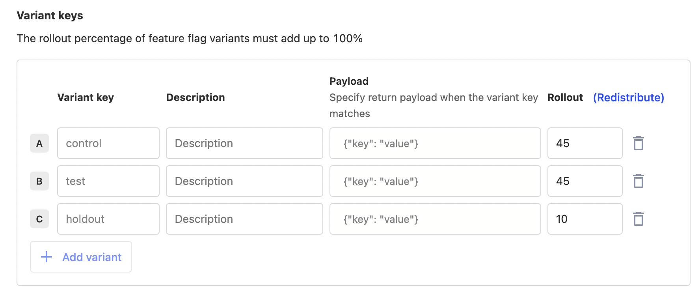
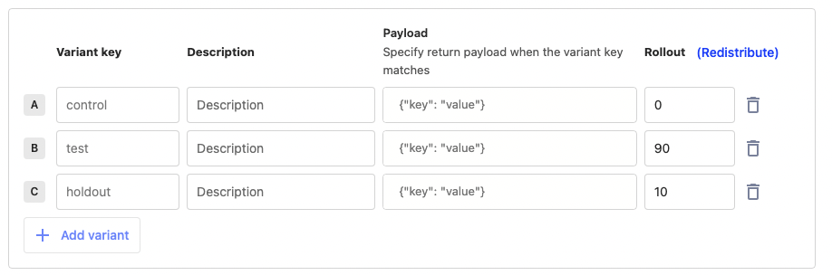
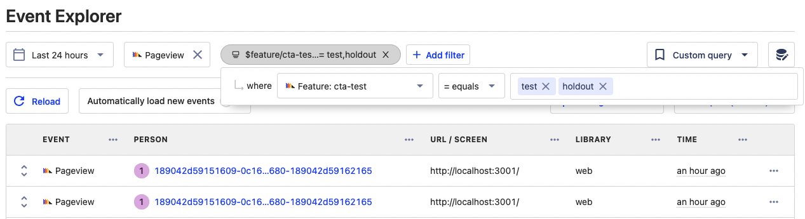

---
title: How to do holdout testing
date: 2023-07-06
author: ["ian-vanagas"]
showTitle: true
sidebar: Docs
tags: ['experimentation', 'feature flags']
---    

Holdout testing is a type of [A/B testing](/docs/experiments) that measures the long term effects of product changes. In holdout testing, a small group of users is not shown your changes for a long period of time, typically weeks or months after your experiment ends.

Holdout testing enables you to ensure that the experiment doesn’t have negative long term effects or interaction with other experiments.

In this tutorial, we show you how to set up a holdout test in PostHog.

## Creating an experiment

To create a holdout test, first, [create an experiment](/docs/experiments/manual#how-to-create-an-experiment-in-posthog):

1. Go to the [experiments tab](https://app.posthog.com/experiments) in PostHog and click "New experiment." 
2. Name your experiment, set a key, and add a description. Your name and description should make it clear this is a holdout test for future reference. 
3. Add another variant named "holdout" to the existing "test" and "control" variants. 
4. Fill out the rest of your experiment with participants, goals, and acceptable. 
5. Save it as a draft.

Once saved, go to [your feature flags](https://app.posthog.com/feature_flags) and edit the flag (you can find it with the key you set in your experiment). Here, set the variant rollout percentages for the "test" and "control" to 45% each, and the rollout for "holdout" to 10%. Once done, press save.



## Implement the experiment

With the experiment and flag setup, you can implement it in your app. Add the flag evaluation logic so that only the "test" variant shows the changed component or code. "Control" and "holdout" continues to show the unchanged bit.

```js
'use client'
import { useFeatureFlagVariantKey } from 'posthog-js/react'

export default function Home() {

  const ctaFlag = useFeatureFlagVariantKey('cta-test') === 'test'

  return (
    <>
      <h1>Welcome to the home page</h1>
      <h2>{ ctaFlag ? 'New CTA' : 'Old CTA'}</h2>
    </>
  )
}
```

Once done and tested to make sure it works, go back to your [experiment](https://app.posthog.com/experiments) and press launch. Once running, PostHog automatically splits your users between the different variants and works to calculate whether the change makes an impact. 

## Reaching significance

The real holdout test begins once your experiment reaches significance.

- If the "control" variant wins, you can edit the feature flag to roll out that variant to 100% because the test "failed" and the holdout is the same as the control. You can stop the experiment, remove the testing code, and archive the experiment.
- If the "test" variant wins, you can edit the feature flag to rollout that variant to 90% of users and keep "holdout" at 10%. Let the experiment continue to run to collect data.



If the "test" variant wins, keep the code unchanged and continue to monitor the metrics. On top of your experiment goals, you can filter for insights, dashboard, or session replay about the two flag variants. In do so, filter for events where the feature flag "cta-test" value is equal to either "test" or "holdout." 



Unlike when rollout percentages are equal, absolute numbers here aren’t super useful or informative. 90% of users are getting the test making total event counts like pageviews or signups a lot higher. Instead, look at metrics like:

- Pages per session, errors per session
- Average session duration
- Conversion rate
- Real usage in session replays

After monitoring the two variants for a few more weeks and not seeing issues like bug reports or degraded usage metrics, you can safely fully roll out the "test" flag and remove the feature flag code. If you do see a problem, the holdout group enables you to use the feature flag to rollback quickly to the former component. From there, you can restart the improvement process again.

## Further reading

- [How to set up Next.js A/B tests](/tutorials/nextjs-ab-tests)
- [How to run experiments without feature flags](/docs/experiments/running-experiments-without-feature-flags)
- [Running experiments on new users](/tutorials/new-user-experiments)