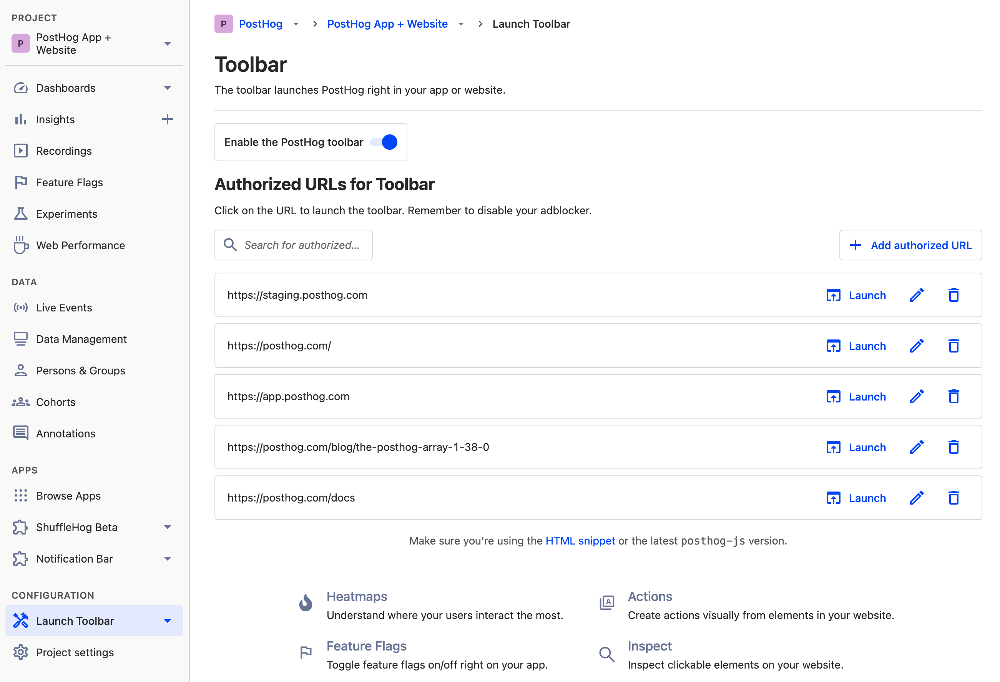
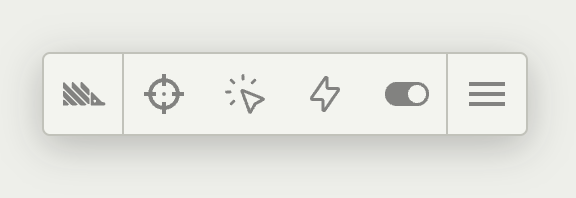
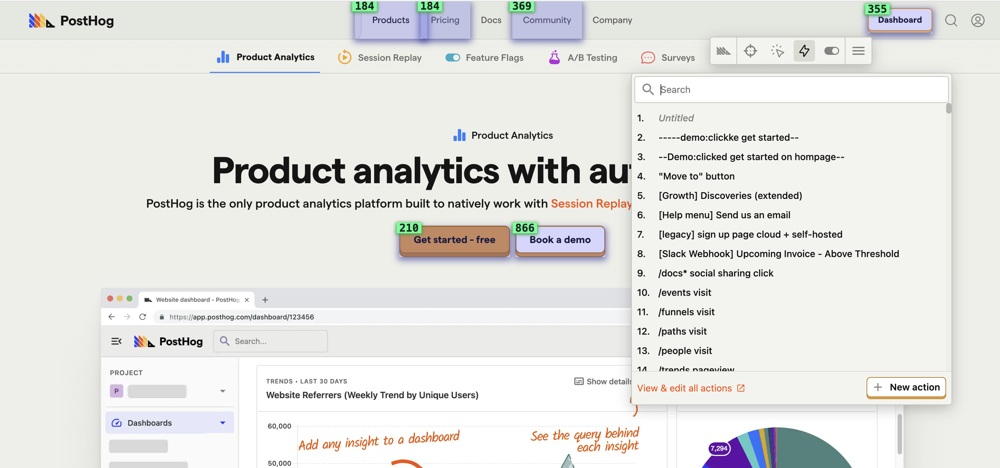
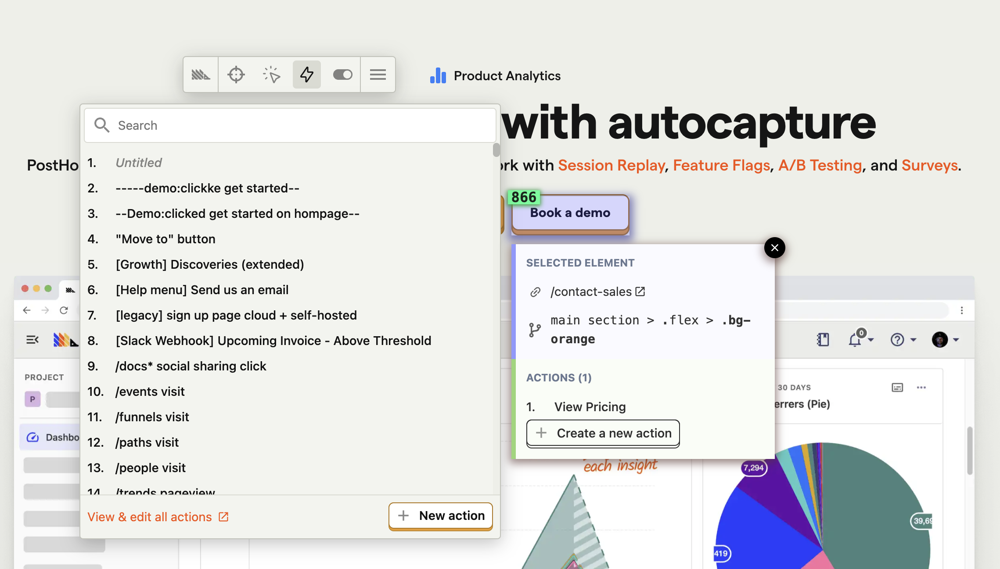
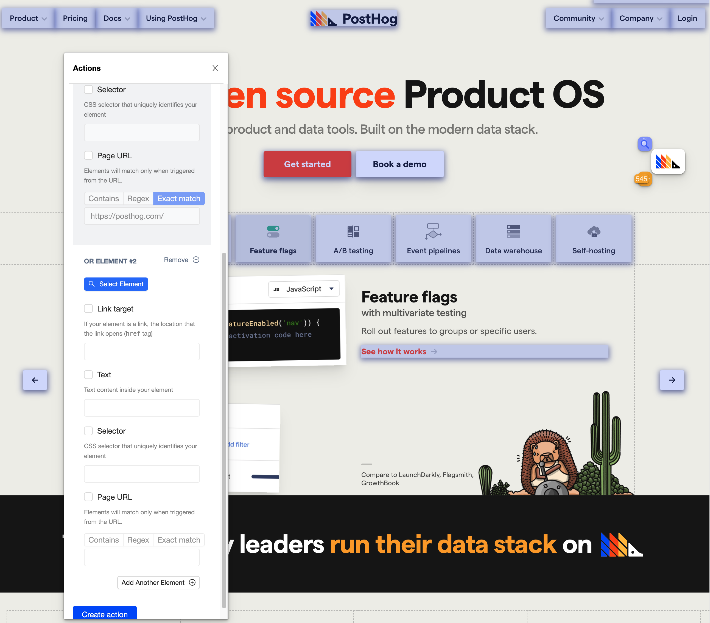

**Estimated reading time:** 6 minutes ☕☕

Events are the bedrock of PostHog and can basically be summed up as ‘anything your users do’. If a user clicks a registration button, that’s an event. If a user loads a webpage, that’s an event. If a user subscribes to a newsletter, that’s an event. And PostHog can capture them all.

When it comes to capturing events, autocapture is a great place to start. However, sooner or later, every team will want to capture events specific to their product and needs. Internally at PostHog, for example, we track _hundreds_ of such events, ranging from specific button presses to instance updates.

There are two main ways to create new events, including creating them from any of [our libraries](/docs/integrate/libraries) or using [the data management suite](/manual/data-management) in your PostHog instance. However, the easiest way for many people is to use [the toolbar](/manual/toolbar). Using the toolbar enables you to create new [_actions_](/manual/actions), which consist of one or more events labelled in a specific way for use in PostHog. 

### Prerequisites
To follow this tutorial you’ll need…

- To have successful deployed PostHog. 
- Have added [the PostHog snippet to your website](/docs/integrate?tab=snippet) or product. 

Note that the toolbar is currently only available using [the JavaScript library](/docs/integrate/client/js). 

## The PostHog Toolbar
The PostHog toolbar is an overlay across your product and website, which you can summon to create new calculated events, visualize a heatmap, and more.

To get started, visit the page of your website or product which features the element you want to track. If the toolbar is available already you’ll see a floating PostHog logo and can skip the next step, but if not then you’ll need to launch it. 

### Launching the toolbar

Before you can launch the toolbar, you need to enable it and authorize it for the URLs you want to launch it on. Luckily, you can do all this from the Toolbar page in your PostHog instance.

Access the toolbar page by logging in to PostHog and clicking ‘_Launch Toolbar_’ in the main menu on the left hand side — it’s at the bottom, under ‘_Configuration_’. 

If the PostHog toolbar isn’t enabled, start by enabling it with the ‘_Enable the PostHog toolbar_’ slider at the top of the page. 

Below the slider, you’ll see a list of all the URLs where you have authorized the toolbar. If the URL you want is already on the list then you can skip the rest of this section and select ‘_Launch_’. 

If the URL you want isn’t listed, select ‘_+ Add authorized URL_’ and enter the URL. Next, select ‘_Launch_’. 

## Using the toolbar to create new events

When the toolbar is launched, you’ll see a floating PostHog logo in your browser. You can drag the logo to reveal obscured elements of the page as needed, and on click it will reveal a pop-out menu, as pictured above.

Click ‘_Actions_’ to start creating a new action. This will create a blue overlay that highlights selectable elements. You can select any of these elements to summon a modal which gives you more information about the element. In this modal, click ‘_+ Create a new action_’ to continue.

Most information in the next modal will be auto-populated with relevant information — that’s why we call this the easy way! However, it’s important to give your new event a descriptive name. Enter this in the ‘_What did your user do?_’ field. A good example of an event name would be '_Clicked Get Started on homepage_' or '_New user signed up_'. 

### Customizing your new event
The remaining fields in the modal enable you to specifically customize how PostHog interprets the new event. Most of this will be automatically populated, but you can override them if they are incorrect. 

- **Link target** describes what the target of any linked elements are.
 
- **Text** describes any text appearing within this element. 

- **Selector** describes the path to this element, enabling you select alternative elements based on their `id` or `data-attr` if preferable.
 
- **Page URL** can be used to specify an exact pattern for pages where this event should be recorded, which is useful if the same element is used in various positions across a page.

### Adding additional elements
Sometimes, you may want to create complex events with multiple elements. PostHog is currently only capable of doing this using an `OR` operator — meaning that the event will be triggered if the first _or_ the second element are selected. 

To select additional elements, select `_Add Another Element +_’ from the bottom of the modal. 

Next, select ‘_Select Element_’ and click the additional element you want to include in your event — you can then customize the action just like you could with the previous element. 

### Further reading
Congratulations, you just made a new calculated event using the PostHog toolbar. You can use this event in insights such as funnels, trends or paths — or you can check these tutorials for further inspiration. 

- [How to correlate errors with product performance using Sentry](https://posthog.com/tutorials/sentry-plugin-tutorial)
- [How to build, analyze and optimize conversion funnels in PostHog](/tutorials/funnels)
- [How and why to build an AARRR pirate funnel in PostHog](https://posthog.com/blog/aarrr-pirate-funnel)
