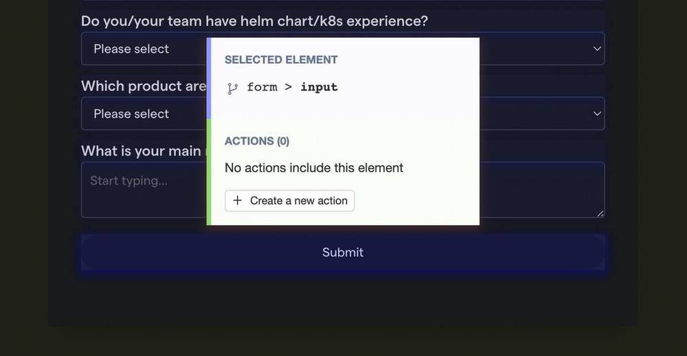
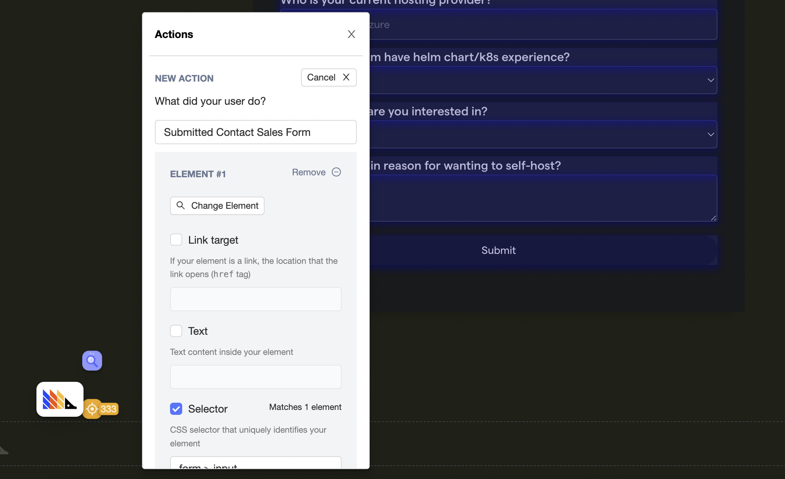

A common use case for wanting to integrate PostHog and Discord is wanting to trigger channel notifications when specific actions are detected within PostHog, so that relevant teams are alerted. 

In this tutorial we’ll explore how to achieve this with PostHog’s Zapier plugin, using the example of triggering a Discord notification when a user submits a form. It’s also possible to use this plugin to trigger notifications in similar services, such as Slack.

## Step 1: Create a PostHog action as a trigger

First, we need to create the action which we want to use as a trigger in PostHog.

In this example we’ll use the [toolbar](/docs/user-guides/toolbar) to create a simple action based on a form submission on [PostHog’s Contact Sales form](https://posthog.com/signup/self-host/get-in-touch#contact), but you can also check [the Actions docs](/docs/user-guides/actions) for information about creating custom actions, or understanding how actions differ from events.

Start by opening the toolbar by clicking the floating PostHog logo, then select ‘Inspect’ to view all actionable elements on the current page via a blue overlay. Find the item you want to use as a trigger for your Slack notification — in this case the ‘Submit Form’ button at the bottom of the page. 

The Inspect view will give you some information about the selected element, including if there is already an action that has been set up for this element.  You can skip the rest of this step if the action is already defined in your PostHog instance. 

If an action doesn’t exist, you can create one by simply selecting ‘Create a new action’, which opens a form where you can provide additional information. In this example, all we need to do is give the action a descriptive name — ‘_Submitted Contact Sales Form_’.

## Step 2: Connect Zapier to Discord and PostHog

Next, head to the [‘My Apps’ section of your Zapier account](https://zapier.com/app/connections) and click ‘Add Connection’. Search for ‘PostHog’ and follow the instructions to connect your PostHog instance to Zapier. 

Return to the [‘My Apps’ section of your Zapier account](https://zapier.com/app/connections) and repeat the steps above for Discord to connect your Zapier account to Discord. 

> Don’t use Discord? You can use PostHog’s Zapier integration to connect to over 4,000 other tools, including other communication platforms such as Slack, Microsoft Teams and Yammer. 

 ## Step 3: Create your workflow

PostHog’s integration with Zapier enables you to create Zapier workflows, or Zaps, from a variety of triggers — including when an action is performed, defined or when an annotation is created. Discord’s integration with Zapier also enables a wide variety of behaviors, including removing or adding users to a channel or sending channel notifications.

Using Zapier’s workflow builder it’s very easy to create the workflow you want and you can get started directly from [the Zapier dashboard](https://zapier.com/app/dashboard). In this case we want to use ‘Action Performed’ as the Zapier trigger, specifying the ‘_Submitted Contact Sales Form_’ action we created earlier. 

As an output, we want to use Discord’s ‘Send Channel Message’ behavior as a result and specify the channel where we want to send a message — in this case a ‘Sales-Contacts’ channel.

Once the workflow is created, we’re done. Now, whenever a user submits the form on PostHog’s Contact Sales page it will trigger the ‘_Submitted Contact Sales Form_’  action and send a notification to the ‘Sales-Contacts’ channel in our Discord chat. We can also track the action in PostHog using product analytics tools such as [funnels](/docs/user-guides/funnels), [trends](/docs/user-guides/trends) and [paths](/docs/user-guides/paths) to understand more about user behavior!
