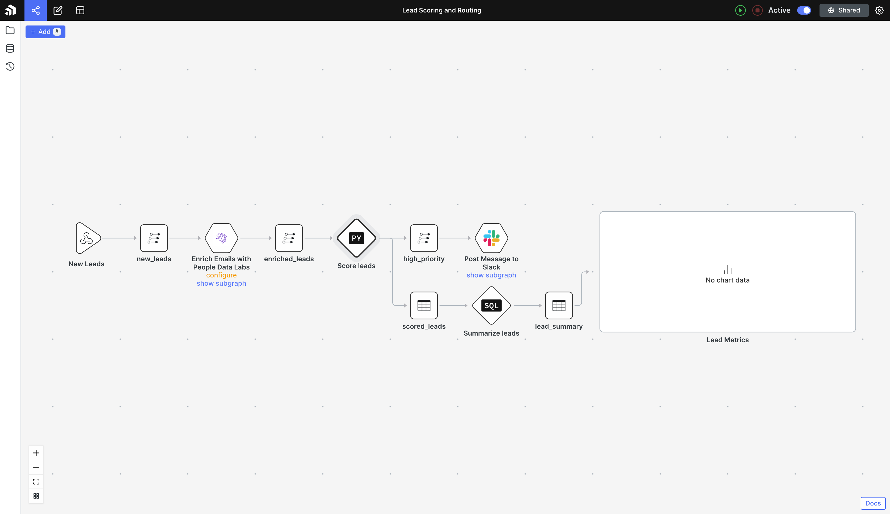
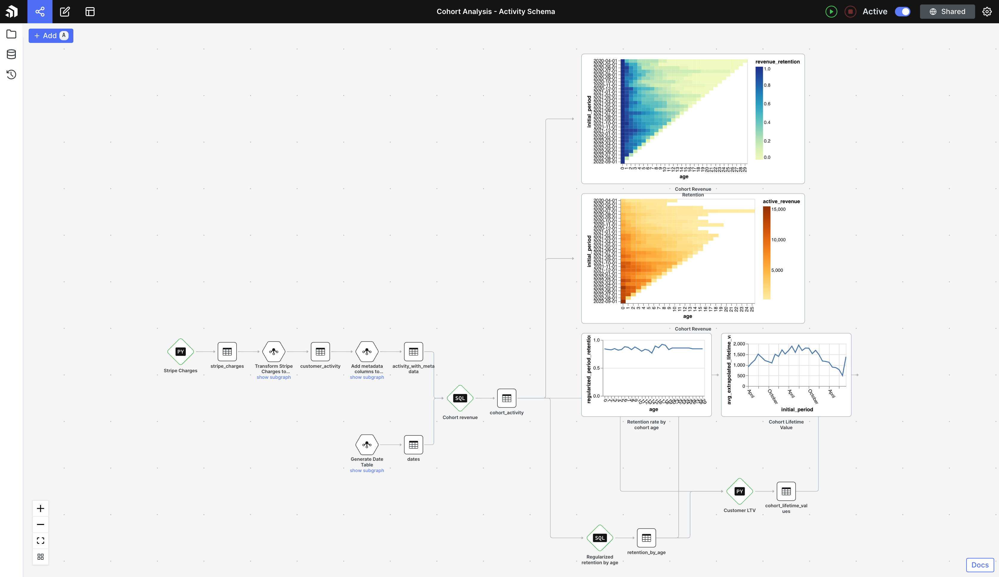

_Estimated reading time: 8 minutes_ ☕☕

Patterns is a data science platform for building and deploying data pipelines, machine learning models, and complex automations. It’s built for data engineers, scientists, and analysts to abstract away the overhead associated with setting up data infrastructure and having to configure many different tools. At the core is the Patterns protocol, a functional reactive declarative data pipelining framework that makes it easy to chain together Python and SQL scripts.

There are two ways to connect PostHog and Patterns, so that you can calculate metrics such as cohort churn and LTV, or integrate PostHog data with other sources, such as marketing data or billing systems. The first is to use the Patterns Connector app, which sends event data to a webhook in Patterns on ingestion. The second is to use the PostHog data extractor in Patterns. 

### Using the Patterns Connector app

The [Patterns Connector app](/apps/patterns-connector) is available from the PostHog app library and requires PostHog 1.30.0 or above, or PostHog Cloud. You'll also need a Patterns account. 

The Patterns Connector app streams event data from PostHog into Patterns in real-time. This makes it especially useful for building real-time notifications, syncing data with external systems to send emails, or enriching event data and sending it to your CRM.

To install and setup the Patterns Connector, follow the steps below...

1. Log in to your Patterns account and create an App
2. Add a webhook node to your graph
3. Copy the webhook URL from the sidebar
4. Log in to your PostHog instance
5. Click 'Apps' on the left-hand tool bar
6. Search for 'Patterns'
7. Select the app, press 'Install', then select the blue gear icon to begin configuration
8. Paste the URL in "Patterns Webhook URL" during app configuration.

Alternatively, you can install the connector via [the GitHub repo](https://github.com/PostHog/posthog-patterns-app). 

> Here is [an example Patterns app you can clone](https://studio.patterns.app/graph/o9mtaek8n33qasl1oa3a/nffx8k2ox23r0h5i6f6o/3evx4hiottnqeb0229ig?view=graph) that can be used to enrich, score, and prioritize new leads to your website —- this is common for optimizing a customer conversion funnel. 

### Using the PostHog data extractor in Patterns

The PostHog data extractor is an API integration configured in Patterns. You will need a [PostHog Personal API key](https://posthog.com/docs/api), and to have configured the Import PostHog Events component in Patterns. 

Extracted data from PostHog can be used in Patterns for further analytics and in data pipelines via pre-built apps and activity schema. An activity schema is a single time series data structure, modeled as a table in your data warehouse, that describes events occurring within your business.

To export PostHog data to Patterns using the data extractor, follow the steps below:

1. Create an account and login to Patterns 
2. Create a new app. Configure your data warehouse, or your Patterns Managed Postgres database will be used by default. 
3. Find the Import PostHog Events component in the Patterns marketplace and add it to your app
4. Configure by adding:
    1. `api_key`: Follow this [page](https://posthog.com/docs/api#how-to-obtain-a-personal-api-key) to get your key/token.
    2. `project_id`: ID of the project to fetch data from. To find it, from your PostHog dashboard > Project Settings on the sidebar, under Project Variables.
    3. `base_url`: (optional) Specify the URL of your PostHog instance, required only if using a self-hosted instance. This importer points to PostHog Cloud by default.
    4. `start_at`: (optional) Specify this parameter to limit events after this datetime, in UTC. Sample format: "2022-08-05T12:00:00". If not specified, all events are fetched.
5. Press run and your events will begin to backfill. 
6. Set a schedule for every time you wish to pull updated data.

> There are hundreds of  questions which Patterns' activity schema can answer, such as conversion funnel analysis, modeling revenue, and calculating customer lifetime value (LTV).  Clone [this Patterns App](https://studio.patterns.app/graph/o9mtaek8n33qasl1oa3a/y3h6varjgt80sqq907gt/3evx4hiottnqeb0229ig?view=graph&dashboardId=1hx9fc) to get access to these analytics out of the box. 
