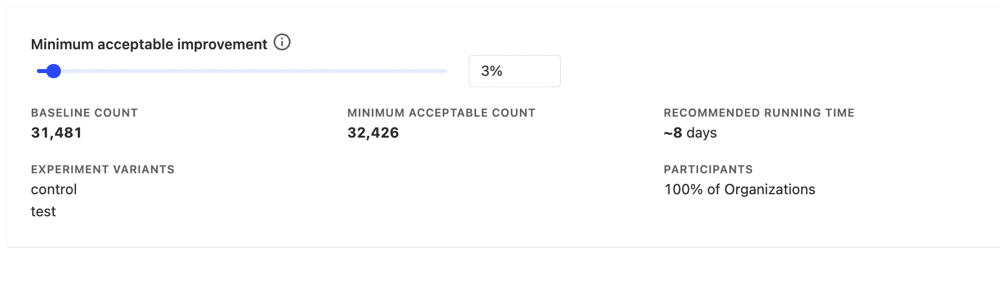

A/B tests are a powerful tool for measuring how product changes impact user behavior. However, sometimes changing how one person uses your product will affect how others interact with it too. For example, a change in the Uber App for Drivers will likely affect the experience of riders too. In these scenarios, group-level experiments allow us to measure the impact of changes beyond an individual and across a group of users.

// TODO: Add image showing difference between group-level and user-level experiment

## When to run group-level experiments

When the change in how an individual uses your product will greatly affect the behavior of other users, or when you want to measure the impact of a change on an entire group of users. This is usually seen in the following types of products:

1. B2B SaaS apps

   - For example, suppose Asana wants to test a new AI feature that automatically assigns tasks based on their urgency and importance. By conducting a group-level experiment, they can measure the impact on project completion rates across the entire company. 

2. Products with network effects.

     - For example, suppose Slack wants to improve the usage of a new video calling feature. Improving the discoverability of the feature for a single person will increase their own usage with it, but since they use it with their coworkers, it improves the discoverability for them too.

3. Marketplace products
   
   - For example, the Uber example mentioned previously.

## How does running a group-level experiment differ from a user-level one?

There are three key differences to take into account when running a group-level experiment versus a user-level one:

### 1. Less statiscal power

Since in group-level experiments, you treat a group of users as a single data point, you have less statistical power. For example, Slack has 20 million users, but only 600,000 companies use it.

In practice, this means that you'll usually have to run group-level experiments longer than you would user-level experiments.

### 2. Higher randomization risk

Randomization risk can occur when companies or groups are not properly randomized, which can distort results.

For example, consider a B2B SaaS company that wants to test the impact of a new pricing plan on customer acquisition and retention. They decide to run a group-level experiment, randomly assigning companies to either the new pricing plan (test group) or the existing pricing plan (control group). However, suppose the randomization process inadvertently assigns a disproportionate number of small companies to the test group and large companies to the control group. This may affect the outcome of the experiment since company size may be a factor affecting acquisition and retention rather than the new pricing plan itself.

### 3. Few individual-level insights

Since group-level experiments provide insights on an aggregate level, they may not show insights on an individual level.

For example, consider a B2B SaaS collaboration tool that wants to encourage users to invite their coworkers to use the app. They decide to add a large "Invite Coworker" button and run a company-level experiment to measure its impact. The results show that adding this button does indeed increase the total number of invites sent and the number of new users who successfully join. However, it may not be possible to gain insights into how individual team members interacted with the button. For example, what are the roles or skill sets of team members who are most likely to interact with the button and send invites?

## Combining user-level and group-level experiments to reduce risk

To improve the quality of insights from group-level changes and address the risks mentioned above, you may want to consider running an experiment with your change at a user-level before running it at a group-level. This can help you in the following ways:

  ### 1. Save time for changes that don't have an impact. 
  
  As mentioned, lower statistical power in group-level experiments means you usually need to run your experiments for longer. However, a change that does not impact behavior at a user-level at all will not translate into impact at a group-level. So you may waste time waiting for results for a group-level test that has no impact.
  
  In this case, it may be worth running a user-level experiment first in order to see if there is any impact on individual user behavior (which should be quicker to gain insights from because of higher statistical power), before running a group-level test.

 ### 2. Gain individual-level insights and identify randomization risks
By running a user-level experiment first, you'll gain insight as to how users interact with your change and what characteristics they may possess. This will then give you an understanding as to what sort of results you can expect from a group-level test.

This can also help you identify randomization risks. For example, let's say a B2B Saas app runs a user-level experiment and notices that users in large companies are most likely to interact with their new feature. In this case, when they run a group-level experiment, they can ensure to filter out small and medium-sized companies in their experiment in order to see more accurate results.

## How to setup group-level tests on PostHog

First, ensure you have [setup a group](https://posthog.com/docs/product-analytics/group-analytics#getting-started) in PostHog. Next, go to your Posthog dashboard and create a [new experiment](https://posthog.com/docs/experiments/manual#creating-an-experiment).

In the New Experiment screen, you'll be able to select the Participant type. By default, it will show `Persons` (i.e. a user-level experiment). Click on the drop-down and select your new group.

Then set your experiment goal and secondary metrics as usual. A handy feature that is especially useful for group-level experiments is the Minimum Acceptable Improvement calculator at the bottom of the page. Since group-level experiments have lower statistical power, this will recommend a time for you for how long you should run your experiment in order to see results.

## Further reading

- [Running experiments on new users](/tutorials/new-user-experiments)
- [How to build, analyze and optimize conversion funnels in PostHog](/tutorials/frontend-vs-backend-group-analytics)
- [How to run Experiments without feature flags](https://posthog.com/tutorials/experiments)