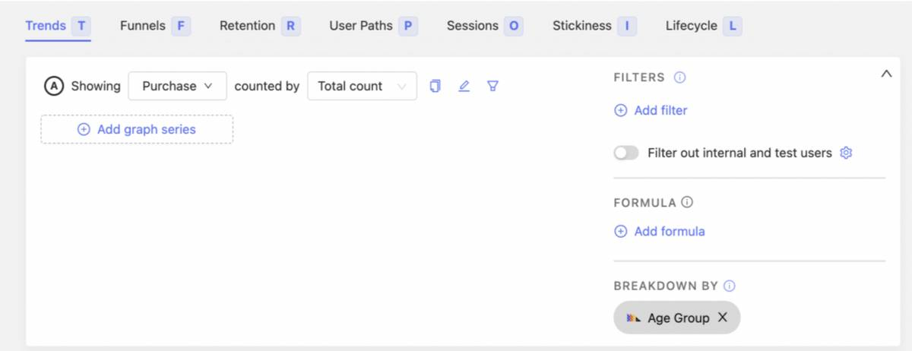
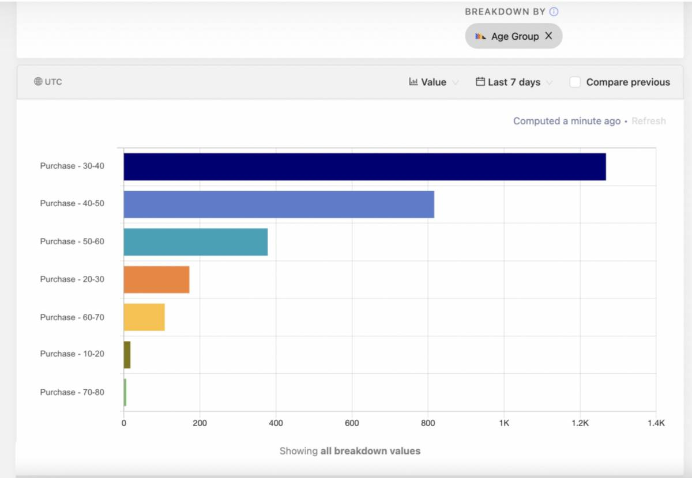
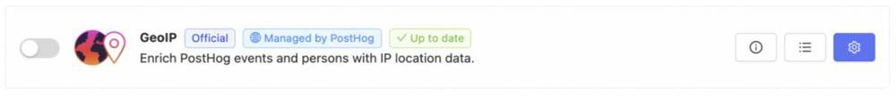
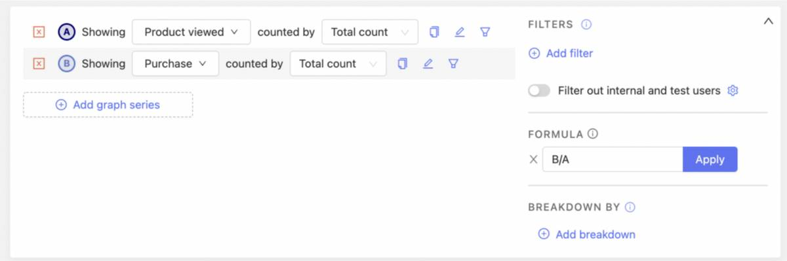
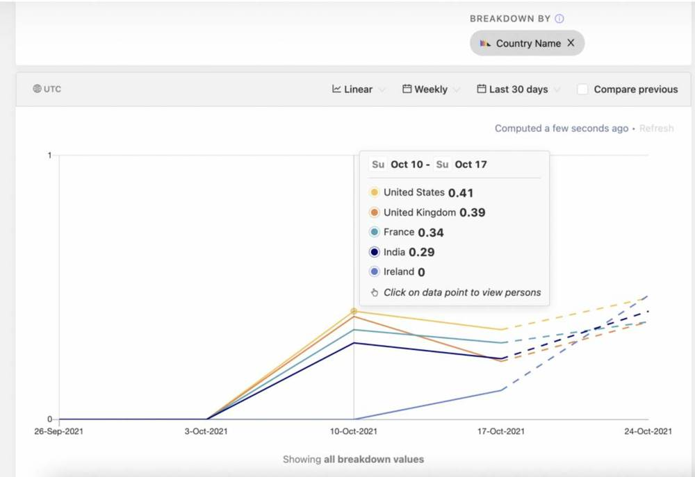
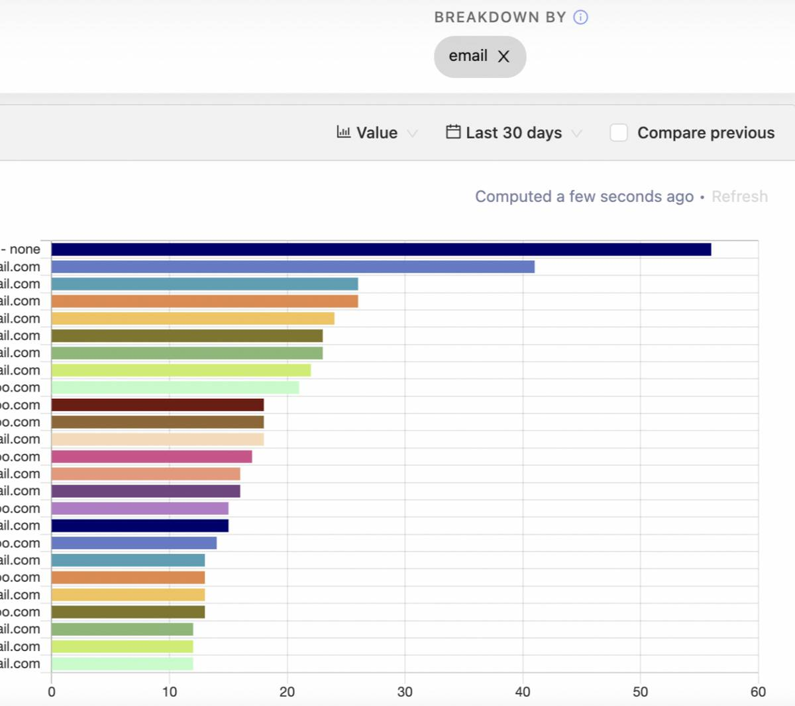
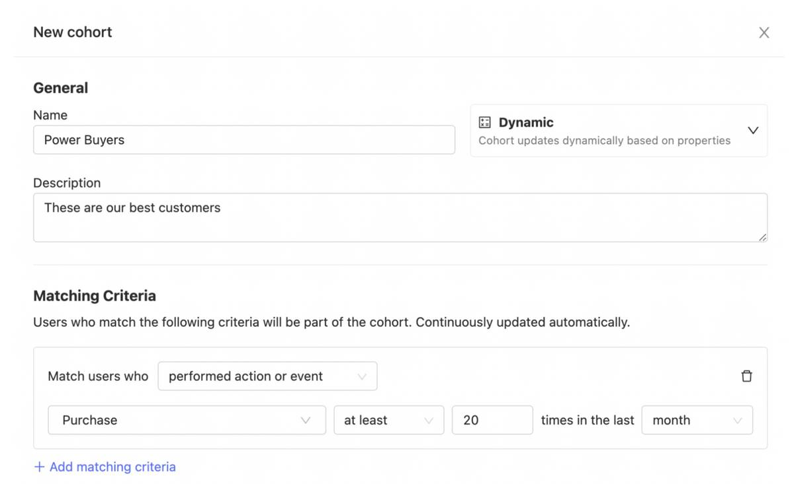
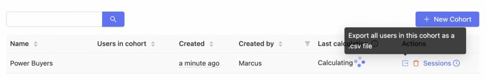
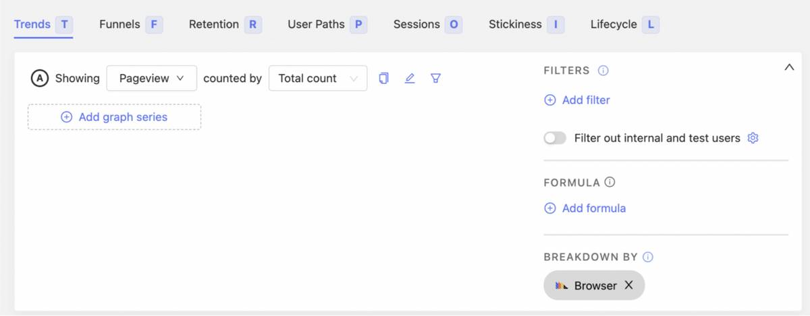
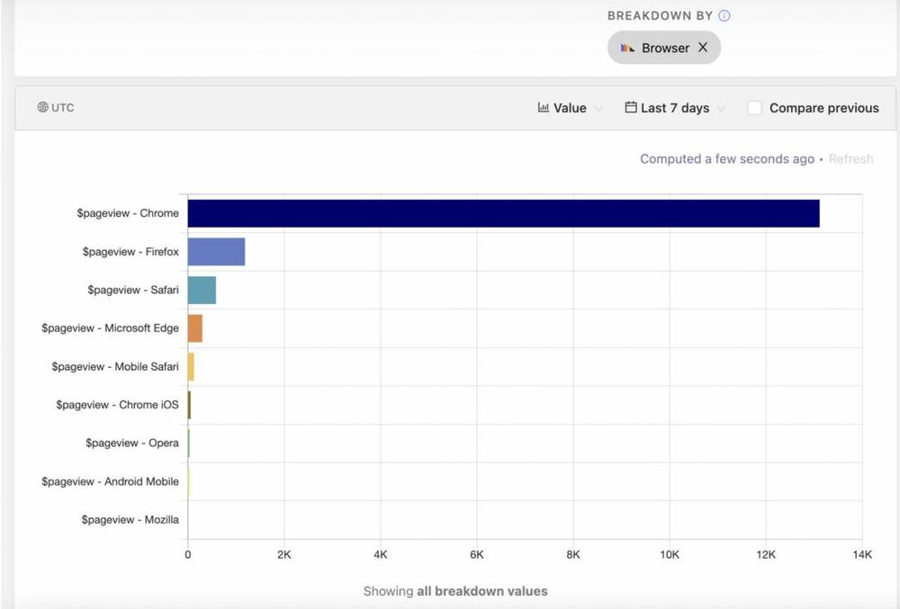

_Estimated reading time: 10 minutes_ ☕☕☕

In PostHog you can easily segment users into any of the four main segmentation categories. This is helpful for exploring user behaviour in greater detail and can be essential for activities such as product personalization or roadmap prioritization.

The four main ways to segment your userbase are: 

- Demographic, e.g. age, gender, income. 
- Geographic, e.g. country or city of residence.
- Behavioural, e.g. frequency of use, average order value.
- Technographic , e.g. mobile or desktop usage. 

In this example we will explore how an ecommerce company might segment users into these four categories using PostHog. 

## Demographic segmentation

What if we want to see if older users make more purchases than younger users, so that we can decide which segment to prioritize? To do this, we would need to segment users demographically by their age.

### Step 1: Pass through demographic information about users in your events

In order to breakdown demographic information you first need to pass that data through when identifying your users.

All you need to do is set the demographic properties you wish to analyze in your ```posthog.identify``` call: 


```
posthog.identify('Alice', {'$set': {'age-group': '20 - 30'}})
```

### Step 2: Open the Trends tool and analyze purchases

Next, go to 'New Insight' and select 'Trends' within PostHog, then select the event which represents purchases (or the event you wish to focus on):



### Step 3: Breakdown by user age

Go to the 'Breakdown by' configuration and select 'Age Group' (or the name of your property) from the person properties list. Set the visualization to 'Value' to get a clear ranking of the purchases by age group.



In this example you can instantly see that most purchases are coming from users in the 30-40 demographic user segment. You can click on each bar to inspect individual users in this segment more closely. 

## Geographic segmentation

What if we want to see if there are countries around the world where users look at products, but don't buy them? This could help our hypothetical ecommerce company to decide which currencies to launch support for next. To do this, we need to segment users geographically by their country of residence.

### Step 1: Enable the GeoIP plugin

If you haven’t done so already, click 'Plugins' and enable [the GeoIP plugin](/plugins/geoip) within your PostHog instance. This will automatically enrich events and persons with geographic data.



### Step 2: Open the Trends tool and analyze purchases and views

Click 'New Insight' and select 'Trends'. We want to know the conversion rate between viewing and purchasing a product, so we need to add two events to this graph: one for when a product is viewed and one for when it is purchased. 



Next, we calculate the conversion rate. We can use the 'Formula' tool to do this by simplying dividing purchases (B) by views (A). 

### Step 3: Breakdown by user countries

Using 'Breakdown by', select 'Country Name' from the user propertie list. Now we can see the average conversion rate per country.



In this example it seems there is a solid conversion rate in the US, but no conversions at all in Ireland. We may want to invest in supporting the local currency (Euros) in Ireland to get more purchases in this user segment. 

## Behavioral segmentation

What if we want to understand who our power users are so we can create a marketing campaign to target them? To do that, we need to segment users by their buying behaviour.

### Step 1: Use the Trends tool and identify power users 

First, we want to identify users individually and see what should qualify as a power user. 

As before, select 'New Insight' and, using the Trends tool, select your purchase event. 

We can use the 'Breakdown by' tool to identify individual users by selecting a user property which is unique to each user, such as 'email'. 

Switch the visualization to 'Value'. Now we can see which users have made a purchase and how many purchases each user has made. This helps us define exactly what we should consider a power user to be compared to other users.



### Step 2: Create a cohort for power buyers

We have a group of really active users who make more than 20 purchases per month. These are our power users. 

It would be valuable to automatically segment any users who fit this definition of a power user, which we can do using the 'Cohorts' tool. Simply create a matching criteria which fits the definition; in this case anyone who purchases more than 20 times per month. 



### Step 3: Download the cohort 

Now that we have our segment identified and created as a cohort, we want to download the details so that we can use them in a marketing campaign. 

Click the export button to download the details of this cohort. You can then import this into your marketing tool of choice to send emails and keep the these power users engaged with your product.



## Technographic segmentation

What if we have a website that we designed for desktop and we want to understand if it's worth optimizing for mobile? To do this, we could use a technographic segmentation to  see what device users access the website on.

### Step 1: Open the Trends tool and look at page views

As before, open up 'New Insight'. We can then use the default view in the 'Trends' tool, which examines the pageview event.



### Step 2: Break down by browser

Next, we can use the 'Breakdown by' tool to breakdown using the 'Browser' property. Using the value visualization will, again, give the clearest view.

We can see the different browsers that are used. Some for iOS and Android represent mobile browsers, while others are desktop browsers like Chrome and Microsoft Edge.



Nearly all usage is coming from people on desktop devices so in our example it doesn’t seem worthwhile investing in a mobile optimized site for this segment right now.