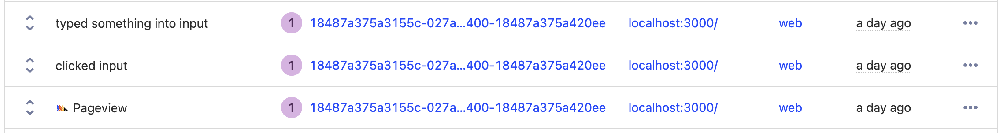

To understand your product’s usage, you must know **who** did **what.** Many of the most valuable insights require an accurate understanding of the user using your product. To make sure user data and events are as accurate as possible, it is critical to identify users properly.

PostHog relies on your implementation of identification to connect event data to specific users. We require events to have a related user ID (even if it is anonymous). It is users who create events after all.

This tutorial goes over the different ways to identify users and recommendations on how to do it better.

## Automatic anonymous IDs

If you haven’t set up any identification and are using the PostHog snippet or `posthog-js` library, events are captured with an anonymous user ID. We create the anonymous ID using the  user’s device ID, and it is automatically tied to all the events a user sends in that session (and future sessions if the cookie is set). In the “Live events” tab of PostHog, anonymous ID user events look like this:

Anonymous IDs are a basic way to understand the user behind events. They lack preciseness because there is no way of ensuring consistency between sessions (it depends on cookies, which users often block) and lack the depth of custom user properties or groups. Explicitly identifying users using the other methods detailed below creates more accurate user data.

## JavaScript identify

If you installed `posthog-js`, you can use it to better identify users. Calling `posthog.identify()` with a distinct user ID connects all events from that user with that ID. You can choose what distinct user ID you want to identify users with. Email is the most popular (it’s what we use), but it could be anything from a username to a random string you generate.

This JavaScript `identify` call links the anonymous user ID PostHog generates with the new ID you choose. This means all of the events a user generates when they weren’t identified connect to their new ID (if they happen with the “buffer,” which we explain in [our Identify docs](/docs/integrate/identifying-users#signup-flow-with-frontend-and-backend)).

For example, if a user browses your marketing site, then signs up and you call `posthog.identify()` on signup, their events from browsing the marketing site can connect with the new user ID.

> Be sure to call `posthog.reset()` on logout (or when users change) to ensure events captures disconnect from the old user and can connect to a new (right) one.

You can also use `posthog.identify()` to add properties to the user, such as their signup source, plan, or website link. You can see more details on the JavaScript `posthog.identify()` call [in the docs](/docs/integrate/client/js#identifying-users).

## Identifying and setting user IDs for every other library

Every library that isn’t JavaScript (such as [Python](/docs/integrate/server/python), [Go](/docs/integrate/server/go), [PHP](/docs/integrate/server/php), and more) requires you to pass the distinct user ID on every `posthog.capture()` call.

Ideally, the user is authorized to make requests to the backend, and you can use a unique ID used in the authorization. Like the JavaScript library, email is the preferred choice for many, but a username or another type of ID also work.

If you don’t have a unique ID like an email, you can always generate a UUID or use some other piece of information (like a device or request ID). Ideally, try to find a way to connect these IDs across sessions. Some ideas:

- Linking whatever ID you choose to an API Key or authorization method if they are using an API
- Storing the ID on the frontend and passing the values to the backend when they make a request
- Use an ID based on the resources they are accessing on the backend

> **Note:** `posthog.identify()` works differently in non-JavaScript libraries. It only updates the user’s properties, and won’t connect the user you identify with future events captured. Check out [your library’s docs](/docs/integrate#server-libraries) for more details (here’s [Python](/docs/integrate/server/python#identify) for example).

## The importance of setting accurate distinct user IDs

The goal of setting distinct user IDs is accurately representing unique users and their behavior. Having multiple IDs for the same user will cause insights such as unique users, active users (daily, weekly), funnels, and more to be inaccurate.

Here’s a ranking of user identification options (you want to aim for #1):

1. same ID across **every session**, such as well-configured Javascript `identify` or other library’s event `capture` call
2. same ID across **many sessions**, such as automatic anonymous IDs (ideally)
3. same ID for **single sessions**, such as automatic anonymous IDs (with cookies blocked)
4. new ID for **every request**, such as poorly configured event `capture` calls

You want to work **up** this list because it creates more accurate user stats. For example, even if you want your users to be anonymous, better identifying them across a single session (rather than every request) provides more accurate stats. This creates better insights to build a better product, which we want to enable you to do.

## Further reading

- See our [docs on identifying users](/docs/integrate/identifying-users) for more details
- [Understanding group analytics: frontend vs backend implementations](/tutorials/frontend-vs-backend-group-analytics)
